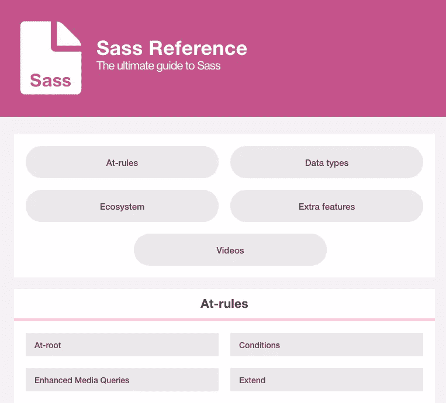
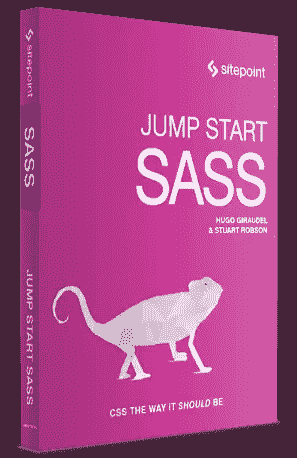

# SitePoint Sass 参考简介

> 原文：<https://www.sitepoint.com/introducing-the-sitepoint-sass-reference/>

我喜欢顶嘴。如果使用得当，这是一种很好的语言。官方文档是一个很好的起点，但是我认为还有改进的空间。这是一份只有一页的文件，浏览起来可能很麻烦，但据我所知，它忽略了很多细节。这是一个良好的开端，但我们肯定可以做得更好。所以我想，为什么不试试呢？

今天我要介绍的是 [SitePoint Sass 参考](https://www.sitepoint.com/sass-reference)。这份文档，或者我应该说“指南”是一份手写的 Sass 文档，除了 SitePoint 自己的 Sass 编辑器 [Stuart Robson](https://twitter.com/sturobson) 之外，还有谁提供了帮助。目标是浏览所有与 Sass 相关的流行语，并尽可能清楚地解释它们，以便任何人都可以快速入门。

不确定 mixin 是什么？对于那个有一个[页面。想知道`@extend`是如何工作的吗？对于那个](https://www.sitepoint.com/introducing-the-sitepoint-sass-reference/)有一个[页面。想了解变量的一切？那个](https://www.sitepoint.com/introducing-the-sitepoint-sass-reference/)也有一个[页面！](https://www.sitepoint.com/introducing-the-sitepoint-sass-reference/)

当然，这是一项正在进行的工作。不仅条目可能会被更新以添加额外丢失的信息，而且我们还计划添加更多的条目；特别是在“生态系统”部分，我们将介绍更多著名的 Sass 工具，如 [Susy](http://susy.oddbird.net/) 、 [True](https://github.com/ericam/true) 或 [Sass 指南](http://sass-guidelin.es/)。

如果你想做点贡献，或者想让我写一篇关于某件具体事情的文章，一定要在 Twitter 上或者这篇文章的评论中告诉我。任何关于改进条目的东西都是好的；也许我们可以找到更好的或额外的例子，或者可能有一些遗漏的信息(我希望不是！).

按照这个项目的思路，我想在十月份宣布 [Jump Start Sass](https://learnable.com/books/jump-start-sass) book(希望如此！)，我和斯图尔特写的。你已经可以在 [Learnable](https://learnable.com/books/jump-start-sass) 上预购了。有些章节已经写好了，我觉得对于任何愿意开始使用 Sass 的人来说，这都是一部伟大的作品。说真的，点吧。:P

就是这样！我希望你喜欢它。一定要把话传出去！:)

## 分享这篇文章