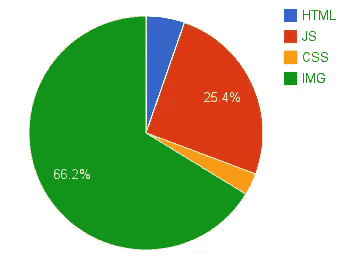
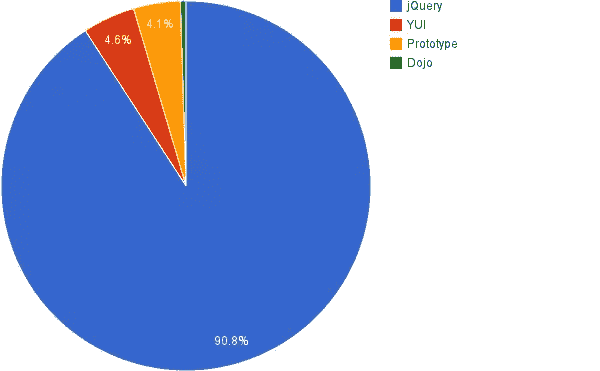

# 避免损害网站性能的诱惑

> 原文：<https://www.sitepoint.com/avoiding-temptations-harm-website-performance/>

最近，SitePoint 出版了 Barbara Bermes 所著的《T2 精益网站》一书，介绍了提高网页性能的最新技术。在本文中，Barbara 详细介绍了一些经常让我们措手不及的性能陷阱。

* * *

网络性能至关重要。[研究表明](http://www.fastcompany.com/1825005/how-one-second-could-cost-amazon-16-billion-sales)网站性能的改善——如页面加载时间——可以显著提高用户参与度和利润。

然而，生命短暂，时间就是金钱。作为网站开发人员，我们是被付钱来完成工作的——客户、老板和同事，他们可能不了解网站性能的重要性。因此，诱惑是抄近路完成工作——找到最快的解决方案，而不考虑性能。在这个移动使用和搜索引擎偏好精益网站的时代，[平均页面权重继续飙升](https://www.sitepoint.com/2mb-web-pages-whos-blame/)。这不是一个好情况。

> 诱惑:[屈服于简单或即时快乐欲望的压力](http://www.merriam-webster.com/thesaurus/temptation)

屈服于诱惑的后果往往直到事后才感觉到。

本文描述了您在 web 开发过程中可能遇到的一些诱惑，以及为什么最好不要屈服于它们。

## 使用现成的脚本

这是一个典型的场景:你需要在网页上添加一些东西——比如幻灯片。所以你用谷歌搜索“网络幻灯片”,会得到数百个结果。有这么多可以选择的，都准备好了，而且是免费的。为什么不直接用一个，既节省时间，又能得到报酬？其他人不都是吗？

我们经常忘记考虑我们选择的脚本的性能。代码写得好吗？优化了吗？我们需要它包含的所有功能吗？

在第四章 <cite>[精益网站](https://learnable.com/books/lean-websites)</cite> 中，我研究了如何区分*复制粘贴*和*复制浪费*。

## 漂亮的图像和设计

一幅画胜过千言万语；就网页性能而言，就页面权重而言，一张图片可能比一千行代码更有价值！到目前为止，优化不佳的图片是网站臃肿的最大原因。

有一些图像方面的考虑会对网页性能产生巨大的影响。

### 不是每个设备都需要高分辨率

如果不需要，没有必要给每个人看高分辨率版本的图像。对环境敏感，体贴和尊重。不要仅仅因为你不知道在你的页面上放些什么，就用不必要的图片来填充你的页面。相信我，在移动设备上漫游的用户没有一个愿意下载 2MB 的 retina 图像。

### 图像消耗带宽

图像仍然是最大的性能问题。它们目前占据了互联网上大部分的文件大小和使用量，如下图所示:

 *各种内容类型的带宽使用情况*

web 开发人员面临的诱惑，尤其是在时间压力很大的情况下，是仅仅插入大图像，而不考虑是否将它们转换成更有效的图像尺寸或格式。

在我的书 <cite>[精益网站](https://learnable.com/books/lean-websites)</cite> 中，我深入研究了优化你的图片和其他网站资产的方法，以确保你的网站尽可能地高性能——尤其是在连接到移动网络的设备上。

## 作为开发一部分的性能优化

当时间就是金钱时，总是有走捷径的诱惑。抄近路的一个方法是把事情推迟，永远不要结束做这些事情。性能测试和优化是至关重要的，但是很容易将它们推迟到以后，然后完全忘记它们。

性能优化通常根本不作为通用软件开发生命周期的一部分。但正如伊利亚·格里戈利克所说，“性能是一种特性，不应该被放到事后才考虑。

<cite>[精益网站](https://learnable.com/books/lean-websites)</cite> 讨论了如何通过一些易于使用的免费工具来自动化优化，并使其成为您部署过程的一部分。

## 库和框架

微软的网络布道者 Christian Heilmann 称之为“被一千个插件杀死”。试图通过包含另一个插件或库来利用现代 web 开发趋势是如此容易。我们有时会忘记，当涉及到性能时，你放在页面上的任何东西都会让你和你的访问者付出代价。不要让太多的插件膨胀你的网站。Heilmann 还鼓励我们记住“不是你能增加什么，而是我们不能拿走什么”。下次当你想粘贴另一个插件到你的站点时，要记住这一点。

像 jQuery、Dojo 和 YUI 这样的库是帮助开发人员启动 JavaScript 项目的流行工具，使得访问 JavaScript 对象和方法更快更容易。它们简化了编码体验——但代价是什么？

 *最受欢迎图书馆*

这些库的文件大小可能变化很大，尤其是如果它们没有被缩小、压缩和压缩的话。jQuery 压缩后的大小几乎是未经优化通过网络发送的八分之一(252 KB 未压缩，32 KB 压缩和 gzipped)。

在项目早期决定使用什么样的框架或库是很重要的。在一个项目中使用一个以上的库或者一个以上的 MVC JavaScript 框架通常是没有意义的，因为不同的库倾向于实现相同的目标。当然，一个库应该只加载一次，尽管在一个页面上看到多个 jQuery 实例并不少见:

| 网站(全球资讯网的主机站) | 数数 | 加载了不同的 jQuery 版本 |
| --- | --- | --- |
| www.reddit.com | Two | 1.7.2,1.7.1 |
| www.washingtontimes.com | Two | 1.4.2,1.4.4 |
| www.tudoseo.com | Ten | 1.6.2，1.7.2，1.7.1，1.6.4，1.8.2，1.4.2，1.10.1，1.4.4，1.9.0，1.8.3 |

*重复加载 jQuery，来源:示例 2014 年 7 月 HTTP 存档上的 Google Big 查询*

为什么要加载多个版本的 jQuery？这难道不是在大声疾呼要好好清理一下吗？肯定有一些遗留代码可能需要旧版本的 jQuery。因此，除了在 jQuery 中使用更新的功能之外，添加新版本的诱惑是相当大的。这似乎是一个很大的维护和遗留问题。取而代之的是，花一些时间，浏览你的网站的功能，并决定转换到哪个版本。

虽然有时包含几个 JavaScript 框架可能有很好的理由，但也可能有其他应该验证的理由。插件的重叠和重复可能源于不同的原因:

*   构建该网站的团队没有就要使用的通用框架或库达成一致。
*   开发人员必须处理的复杂代码。有时它们只被提供了独立的包含文件，对父代码的可见性很小。如果需要，他们可能会尝试插入他们喜欢的库和版本，以继续他们的工作。
*   缺失的执行技术。
*   开发者的粗心或懒惰。
*   使用其他 web 组件，包括相同的框架。

<cite>[精益网站](https://learnable.com/books/lean-websites)</cite> 详细介绍了使用库和框架的后果，以及如何在不对网站性能产生负面影响的情况下充分利用它们。

## 社交媒体、广告和跟踪

如果你为一家拥有商业智能、分析或营销部门的公司工作，你很有可能被要求提供任何有助于衡量公司成功的信息。

社交媒体、广告和跟踪脚本对营销人员和公司来说是很大的诱惑，可以更好地了解他们的客户，增加或找到其他收入来源，如销售广告。但是你在自己的内容上添加的任何外来内容——尤其是基于 JavaScript 的内容——都会增加页面的权重和加载时间。

没有一种社交媒体或追踪工具是市场营销不想尝试的。 <cite>[精益网站](https://learnable.com/books/lean-websites)</cite> 详细介绍了如何正确安全地包含第三方脚本和插件。

一个方便的经验法则是，使用第三方脚本获得的价值必须大于其性能损失。

## 结论

性能优化通常是一种折衷的做法，并且总是要考虑相互竞争的利益。

这篇文章仅仅提出了几个与站点优化相关的问题——这个话题终于在很大程度上成熟了。

<cite>[精益网站](https://learnable.com/books/lean-websites)</cite> 详细、深入地概述了创建高效、高性能网站所涉及的诸多因素——从了解用户体验和期望到监控性能、自动化任务，以及优化服务器请求、网站资产和网站运行的网络。

希望这篇简短的介绍已经激起了你了解更多的欲望！我很乐意回答你的任何问题或评论。

## 分享这篇文章