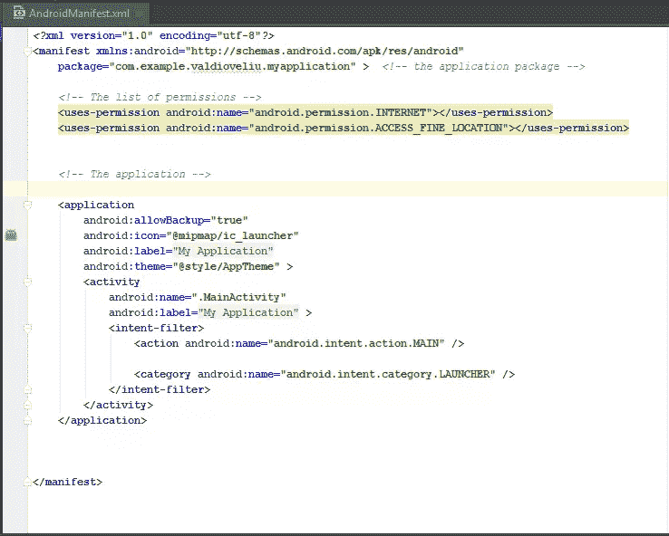
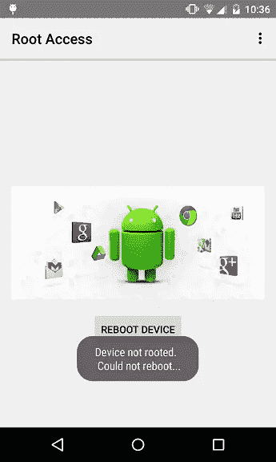
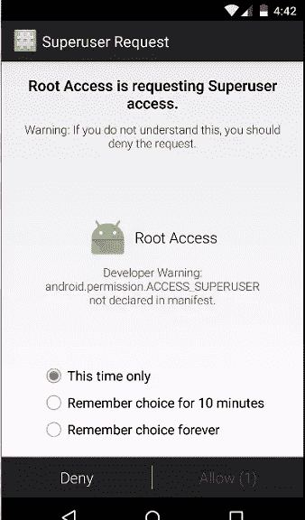
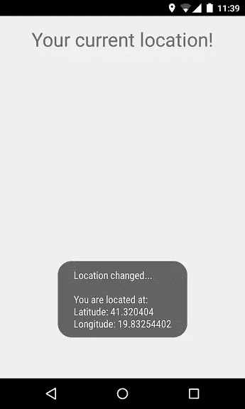

# 危险 Android 应用程序权限开发者指南

> 原文：<https://www.sitepoint.com/developers-guide-risky-android-app-permissions/>

Android 操作系统是一个基于 Linux 的开放平台，集成到移动设备、智能手表、平板电脑甚至电视和汽车中。在各种设备上创建应用程序的机会引发了安全性问题，我认为这是 Android 面临的最大挑战。

Android 通过使用基于完全权限的安全机制来维护应用程序级别的安全性，该机制允许用户限制对应用程序组件的访问。权限可以防止恶意应用程序破坏数据、获得对敏感信息的访问，或者过度或未经授权地使用硬件资源或外部通信通道。

默认情况下，任何 Android 应用程序都无权执行任何会影响操作系统、用户隐私数据或其他应用程序的操作。但是没有使用任何东西的许可，一个 Android 应用就不是一个有用的应用。

## 安全问题

Android 使用权限来过滤应用程序的功能，由用户决定是否在安装时接受应用程序的权限。问题是用户倾向于不读权限，不加思考地接受它们。这可能会导致一系列安全问题，从私人信息流向 Android 操作系统，更糟糕的是，内核变更。

在这篇文章中，我将讨论 Android 清单和权限。清单文件包含关于应用程序包的信息，包括权限、内容提供商、服务、活动和广播接收器。

下面是清单文件的一般结构，显示了权限在清单中的位置。



## 最危险的应用程序权限

要判断接受什么样的权限，每个用户都必须牢记已安装应用程序的功能。例如“为什么一个游戏需要我的联系人的许可或请求发送短信的许可？”。你不需要在游戏里发短信。这种权限往往是危险的，会泄露私人用户信息。

## 您可能需要重新考虑的权限

### 1.根权限

根用户是系统管理员，拥有整个系统的控制权，没有任何限制。默认情况下，android 用户没有访问根属性的权限，因为没有经验的用户可能会对他们的操作系统造成严重损害。Root 权限是通过一个叫做“Android 设备 root”的过程获得的。当恶意应用程序从根用户处获得该权限时，它们可以做的事情没有限制。

下面是一个应用程序运行 shell 脚本的小例子，该脚本具有重启 android 设备的超级用户权限。

```
try {

    String[] reboot = new String[] { "su", "-c", "reboot" };
    //-c will cause the next argument to be treated as a command

    Process process = Runtime.getRuntime().exec(reboot);

    process.waitFor();  //wait for the native process to finish executing.

      } catch (Exception e) {

    Toast.makeText(getApplicationContext()," Device not rooted.\n Could not reboot...",Toast.LENGTH_SHORT).show();

    }
```

通过使用“su”命令，应用程序将以超级用户的权限运行，如果设备是根用户，它将重新启动。



当代码在非根设备上运行时，会出现一条 toast 消息。



如果您想将此权限添加到应用程序中，请将下面一行添加到您的清单文件中。

```
<uses-permission android:name="android.permission.ACCESS_SUPERUSER"></permission>
```

### 2.读/写个人数据权限

有些权限允许应用程序使用用户的个人数据。如果您希望信息是私有的，请尽量避免在 Android 清单文件中使用这些权限。

```
<uses-permission android:name="android.permission.READ_CALENDAR"></uses-permission>
  <uses-permission android:name="android.permission.WRITE_CALENDAR"></uses-permission>
  <uses-permission android:name="android.permission.READ_CALL_LOG"></uses-permission>
  <uses-permission android:name="android.permission.WRITE_CALL_LOG"></uses-permission>
  <uses-permission android:name="android.permission.READ_CONTACTS"></uses-permission>
  <uses-permission android:name="android.permission.WRITE_CONTACTS"></uses-permission>
```

### 3.财务权限

如果用户无意中被授予了某些权限，那么这些权限会让用户付出代价。与手机 app 最相关的是短信/彩信权限和通话权限。这些可以在后台发送短信和拨打电话号码，甚至不需要通过拨号应用程序。这些权限可以允许应用程序在用户看不见的背景中读取 SMSs 和 MMSs。

短信、彩信和通话操作所需的权限包括:

```
<uses-permission android:name="android.permission.SEND_SMS"></uses-permission>
```

用于发送短信和彩信的权限。

```
<uses-permission android:name="android.permission.CALL_PHONE"></uses-permission>
```

用于发起电话呼叫的权限。

下面是一个简单的例子，说明如何向指定的号码发送短信。

```
String message = "Hello Android fans! ";
  String number = "xxxxxxxxxxxx";
  //it is preferable to use a complete international number

  SmsManager.getDefault().sendTextMessage(number, null, message, null, null);
```

请记住，只有在清单文件中包含此权限时，此代码才会起作用。

```
<uses-permission android:name="android.permission.SEND_SMS"></uses-permission>
```

### 4.位置许可

位置权限允许应用程序在任何时候访问用户的位置:
–**访问粗略位置**:应用程序可以访问从手机信号塔和 Wi-Fi 得出的大概位置。
–**访问精确位置**:应用程序可以从 GPS、手机信号发射塔和 Wi-Fi 等位置源访问精确位置。

使用位置所需的权限包括:

```
<uses-permission android:name="android.permission.ACCESS_COARSE_LOCATION"></uses-permission>
```

接近大概位置。

```
<uses-permission android:name="android.permission.ACCESS_FINE_LOCATION"></uses-permission>
```

以获取精确的位置。

以下是如何获得 Android 设备的精确位置:

```
public class MainActivity extends Activity implements LocationListener {

     private LocationManager locationManager;

     @Override
     protected void onCreate(Bundle savedInstanceState) {

         super.onCreate(savedInstanceState);
         setContentView(R.layout.activity_main);

         locationManager = (LocationManager) getSystemService(Context.LOCATION_SERVICE);

         locationManager.requestLocationUpdates(LocationManager.GPS_PROVIDER,
                 3000, 10, this);

     }

  @Override
     public void onLocationChanged(Location location) {

         String myLocation ="Location changed...\n\nYou are located at: " + "\nLatitude: " + location.getLatitude()
                 + "\nLongitude: " + location.getLongitude();

         Toast.makeText(getApplicationContext(), myLocation, Toast.LENGTH_LONG).show();
     }

     @Override
     public void onProviderDisabled(String provider) {

         Intent intent = new Intent(Settings.ACTION_LOCATION_SOURCE_SETTINGS);
         startActivity(intent);
         Toast.makeText(getApplicationContext(), "Gps is turned off... ",
                 Toast.LENGTH_SHORT).show();
     }

     @Override
     public void onProviderEnabled(String provider) {

         Toast.makeText(getApplicationContext(), "Gps is turned on... ",
                 Toast.LENGTH_SHORT).show();
     }

     @Override
     public void onStatusChanged(String provider, int status, Bundle extras) {

     }

  }
```

要运行此代码，您必须包括此权限才能访问准确的位置:

```
<uses-permission android:name="android.permission.ACCESS_FINE_LOCATION"></uses-permission>
```

java `MainActivity`类实现`LocationListener`从设备获取位置信息。

在`onCreate()`方法中，调用`requestLocationUpdates()`来获取设备的当前位置，每次它改变时，调用`onLocationChanged()`并显示新位置。

如果设备 GPS 被禁用，则调用`onProviderDisabled()`方法，将应用程序重定向到设备的位置设置。



### 5.音频和视频权限

这意味着有人可以监听对话或使用手机摄像头来监视用户。例如:

清单文件中需要的权限有:

```
<uses-permission android:name="android.permission.CAMERA"></uses-permission>
  <uses-permission android:name="android.permission.CAPTURE_VIDEO_OUTPUT"></uses-permission>
  <uses-permission android:name="android.permission.CAPTURE_AUDIO_OUTPUT"></uses-permission>
  <uses-permission android:name="android.permission.RECORD_AUDIO"></uses-permission>
```

### 6.软件包安装

这些软件可以在用户不知情的情况下在手机上安装额外的软件包。用户不需要接受它们，因为应用程序有权限这样做。

```
<permission android:name="android.permission.INSTALL_PACKAGES"></permission>
```

### 7.取消后台进程

这些允许一个应用程序调用`killBackgroundProcesses(String)`，这给了一个应用程序杀死其他在后台运行的程序的能力。

```
<uses-permission android:name="android.permission.KILL_BACKGROUND_PROCESSES"></uses-permission>
```

## 谷歌的下一步计划是什么？

上个月，谷歌在[2015 年谷歌 I/O](https://events.google.com/io2015/)期间宣布了 [Android M](https://www.androidpit.com/android-m-release-date-news-features-name) 。Android M 有许多创新，包括一个新的应用程序权限机制。用户第一次尝试使用某项功能时会请求权限，而不是在安装时。让开发者和用户体验更好。

## 分享这篇文章