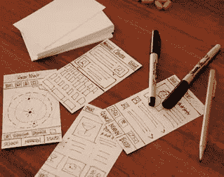
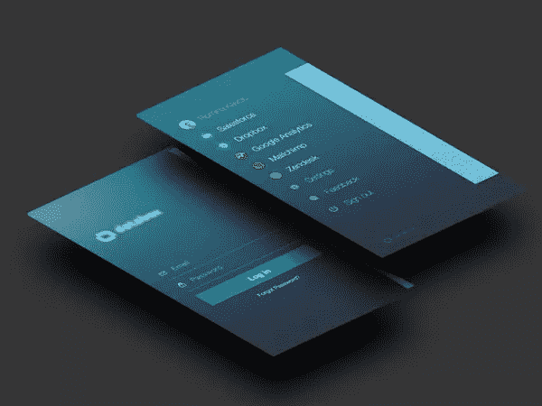
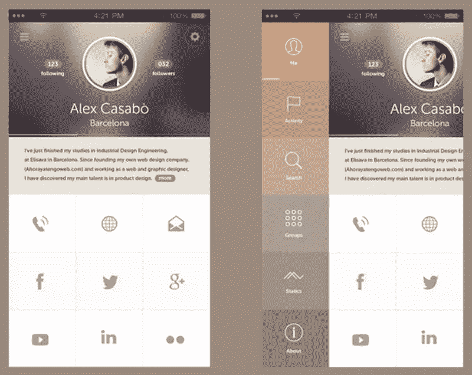
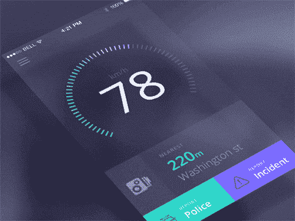
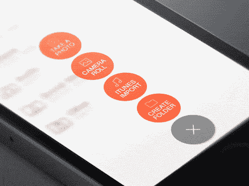
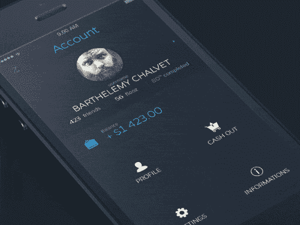
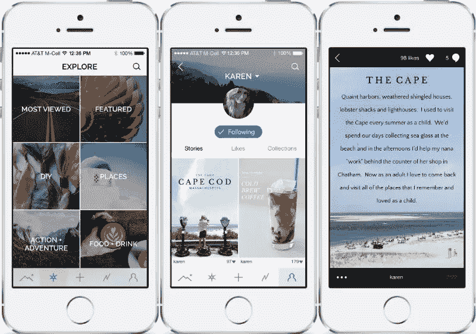
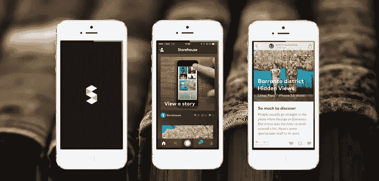
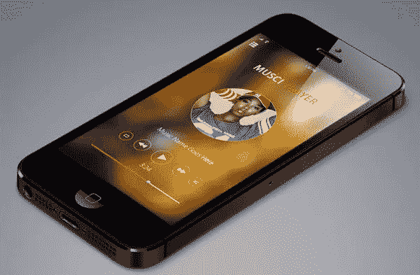

# 2015 年五大手机设计趋势

> 原文：<https://www.sitepoint.com/5-big-mobile-design-trends-of-2015/>

> 移动互联网比桌面互联网发展得更快，我们相信在五年内，通过移动设备连接到互联网的用户可能会超过桌面电脑。 [摩根士丹利–2009 年 12 月](http://www.morganstanley.com/about-us-articles/4659e2f5-ea51-11de-aec2-33992aa82cc2.html)

照片:罗森菲尔德媒体

我记得早在 2000 年代末就有这样的预测。当时听起来有点古怪，但现在是 2015 年，预测是正确的，孩子们！

事实上，去年初，康姆斯克让我们越过了“临界点”。毫无疑问，每个网站都有所不同，但一般来说，我们可以将桌面用户视为少数——某种意义上的“边缘群体”。

因此，如果移动设备现在是主要的观看设备，那么“为移动设备设计”现在就是简单的*“设计”*。

考虑到这一点，今天我们列出了 2015 年手机设计的五大趋势。如果你想重新设计你的应用或者开发一个新的，我建议你看看这个列表。

## 微妙的调色板

虽然你很可能会看到网页设计中使用更大更大胆的颜色，但就移动应用而言，情况恰恰相反。由于手机设计似乎朝着极简设计的方向迈进了一步，所以设计师们会减少颜色也就不足为奇了。

简单微妙的配色方案将取代大胆浮华的调色板。从心理学的角度来看，这是设计中的一个明智之举，因为虽然明亮的色调可以吸引注意力，但也可能分散注意力。微妙的颜色可以帮助吸引用户，并允许集中注意力。

不要让微妙的调色板欺骗你，将有大量的对比。唯一的区别是，代替典型的消防栓红色和霓虹绿色的颜色将更“温暖”而不是“热”。这将使平面设计更加优化，元素更具交互性，因为微妙的颜色在移动界面中得到了实现。

## 动画元素

随着移动应用的不断发展，促进更多的互动似乎成为了新的计划。似乎没有什么比动画更能引起人们的反应了，所以当你看到越来越多的动画被引入移动领域时，不要感到惊讶。

不仅仅是用来使一个应用程序从竞争者中脱颖而出，你应该期待看到动画被用于一个更具功能性和激励性的角色，而不是纯粹的视觉。动画将被用来引导用户获得更加愉快和有效的体验。如果实施得当，用户还会更容易理解什么是互动的，什么是纯粹的作秀。

有了动画，移动设计将能够采取更现实的方法来符合典型的人类行为，而不是机械和“干燥”的体验。使用动画不仅有望为应用程序本身提供更多的娱乐，也有望为应用程序本身提供更多的个性，这反过来将有助于应用程序与其目标用户保持相关性。

## 更多滚动

现在，我们已经看到滚动在网页设计中被带到了另一个高度，但在 2015 年，我们期待看到它在移动设计中得到最充分的应用。在移动应用程序中滚动已经是一件事情，因此将日常功能再向前推进一步是有意义的。我说的是引入 web 最大的趋势之一，视差滚动。

视差滚动将有助于将移动设计中的动画和更多交互式故事讲述提升到一个新的水平。随着传统设计变得更加扁平和一维，视差实现将为移动设计增加深度，这是我们以前从未体验过的。

除了视差滚动，你应该还会看到一些使用模块化和无限滚动的移动应用。当然，我们需要一个响应式的设计来确保我们可以完全欣赏模块化滚动的某些效果。尽管如此，我们将毫无疑问地看到垂直和水平滚动被用来创造一些惊人的效果来愉悦用户体验。滚动肯定会成为新的点击。

## 讲故事

随着手机设计中一些新效果的加入，讲故事本身将呈现出一种新的形式。移动设计将不再那么依赖文字本身来传达它的故事。相反，故事将扮演一个更具互动性的角色。

如前所述，移动设计关注 UX 和用户界面，希望变得更具互动性和刺激性。这意味着你应该期待看到一些元素被用来让用户成为这些“故事”的“角色”。我说的是视觉上大胆的图像，高质量和巧妙制作的视频，以及基于收集数据的更个性化的体验。

精心设计的互动故事不仅可以用来创造刺激的体验，而且比标准的行动号召更能起到转化工具的作用。你将会看到动画与讲故事的元素结合在一起，将这些故事带入生活。

## 模糊的背景

当然，这种趋势已经出现在网页设计中，但它正在越来越多地被移动应用程序开发所采用。模糊效果将用于手机设计中，不仅能创造视觉上令人愉悦的设计，还能突出重要元素。这种美学技巧主要用于保持文本的可读性。这也将使行动号召按钮更加突出。

在界面中使用模糊的图像可以让用户知道什么是可交互的，什么是不可交互的。预计在背景模糊的情况下，行动号召按钮将被赋予更大胆的设计，使它们比以往更加突出。

请注意，模糊背景不仅用于确保您按下这些按钮进行转换，还将用于交互式讲故事。除了模糊的背景，我们还将看到更多半透明的元素被融入到移动界面中，以获得更干净和简约的感觉。

## 结论

就移动开发而言，这些顶级移动设计趋势只是我们将要看到的一小部分变化。有很多趋势没有上榜，包括对移动手势、材料设计、简化界面、可穿戴设备等的关注。不管是哪种方式，很明显，移动设计正在为用户提供更好的交互体验。

在所有的潮流中，哪一个是你最喜欢的，并且看起来有一些后劲？你期待看到哪些趋势？

## 分享这篇文章