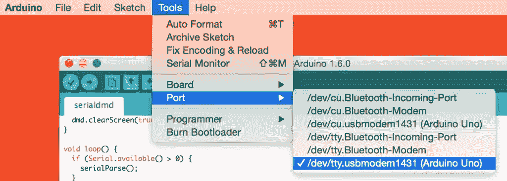
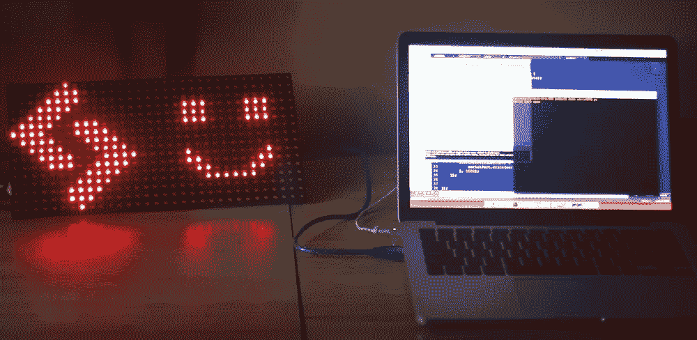

# 用 Node.js 在点阵 LED 显示器上显示图像

> 原文：<https://www.sitepoint.com/displaying-images-on-a-dot-matrix-led-display-with-node-js/>

点阵 LED 显示屏很有趣。哪个开发人员不喜欢用空白的灯光画布来玩呢？我最近将 Freetronics 的 [32 x 16 点阵显示器与 Node.js 配对，并让它显示黑白 PNG 图像。在这篇文章中，我将解释它是如何工作的。](http://www.freetronics.com/dmd)

点阵 LED 显示器(也称为点阵显示器或 DMD)是一种带有 LED 灯网格的显示器，您可以打开和关闭它来显示文本和形状。其中一些有多种颜色，而另一些只有一种颜色。我们将在这个演示中使用的只有一种颜色，所以我们仅限于黑白图像。值得注意的是，LED 显示屏与 **LCD** 显示屏截然不同。液晶显示器使用奇特的发光晶体，用于录像机、时钟、计算器等的显示。几周前，我写了一篇关于[使用 Node.js](https://www.sitepoint.com/web-apis-on-arduino-lcd/) 在 Arduino LCD 上显示 Web APIs 的文章。如果你想比较这两者，看看这个。

这个特殊的演示需要一个 Freetronics 32×16 点阵显示器，因为它依赖于 Freetronics DMD 库。

## 演示代码

如果你渴望获得代码并亲自尝试一下，你可以在这里的 [GitHub](https://github.com/sitepoint-editors/NodeDMD) 上找到。

## 自由电子 DMD 图书馆

通过 [Freetronics DMD 库](https://github.com/freetronics/DMD)在我们的 LED 点阵显示屏上绘制线条、形状和文本。要使用它，请完成以下步骤:

1.  从他们的 GitHub 库下载 DMD 库。
2.  将这些文件以它们自己的文件夹名复制到您的`/Arduino/libraries/`文件夹中。在我的 Mac 上，我把它放在了一个文件夹里。
3.  下载[timer one 库](http://code.google.com/p/arduino-timerone/downloads/list)并将其放入您的`/Arduino/libraries/`文件夹中。例如对于 Mac 用户，`/Users/username/Documents/Arduino/libraries/TimerOne-r11`。

## 我们的 Arduino 草图

在我们的 DMD 上显示元素的大部分功能将发生在我们的 Arduino 草图代码中。草图代码将关注串行端口上的消息，并根据这些消息更改显示。

草图从我们的包含和常量开始。我们包含了`SoftwareSerial.h`以允许我们访问串行端口并定义我们的 DMD 的宽度和高度(在我们的例子中是 32×16)。`BUFLENGTH`存储我们拥有的灯的数量，因为这是我们想要发送给 Arduino 的最大消息大小。在我们的例子中，它是 32 乘以 16 等于 512。

```
#include <SoftwareSerial.h>
  #define SCREEN_WIDTH 32
  #define SCREEN_HEIGHT 16
  #define BUFLENGTH 512
```

接下来，我们有针对 Freetronics DMD 的产品。这些应该都可以从我们之前复制到 Arduino libraries 文件夹的文件中获得。

```
#include <SPI.h>
  #include <DMD.h>
  #include <TimerOne.h>
```

然后，我们有两个常数`DISPLAYS_ACROSS`和`DISPLAYS_DOWN`，它们用于定义我们已经连接在一起的 LED 显示器的数量。我假设你的情况和我一样，只有一个显示器，因此这两个都等于一个。然后我们将它传递到我们的 DMD 库中，使用`DMD dmd()`让它运行。

```
#define DISPLAYS_ACROSS 1
  #define DISPLAYS_DOWN 1
  DMD dmd(DISPLAYS_ACROSS, DISPLAYS_DOWN);
```

下一位代码包含在 DMD 样本中。我们调用这个函数来让 DMD 库按照设定的时间间隔刷新显示。我们把这个区间定义得更低一点。

```
void ScanDMD() { 
    dmd.scanDisplayBySPI();
  }
```

然后我们定义最后两个变量。这两个与通过串行端口接收消息有关。首先，`buf[BUFLENGTH]`存储串行端口消息的缓冲区，在该缓冲区上 led 应该打开和关闭。其次，`bufCount`将用于存储该缓冲区中还有多少字节要读出。

```
char buf[BUFLENGTH];
  int bufCount;
```

我们的`setup()`函数使用我们的常量和定义的库开始整个过程。它首先在端口 57600 上监听串行端口消息。

```
void setup() {
    Serial.begin(57600);
```

然后，我们使用前面包含的 TimerOne 库初始化一个定时器。我们告诉它从 4 毫秒开始倒计时。在 Freetronics 的例子中，他们建议不要将这个时间设置为 5 毫秒以上，以避免显示屏闪烁。

```
Timer1.initialize(4000);
```

然后，我们将它设置为在定时器到期时运行`ScanDMD()`功能，这又会刷新显示。

```
Timer1.attachInterrupt(ScanDMD);
```

最后，在我们的`setup()`函数中，我们通过将`true`传递给`dmd.clearScreen()`函数来清除显示屏上的所有像素。如果给这个函数传入 false，每个像素都会打开！

```
dmd.clearScreen(true);
```

在我们的 Arduino 的`loop()`函数中，我们留意串口上的任何消息。我们观察有多少字节可从串行端口读取。如果有字节可用，那么我们有一个消息流通过，我们运行`serialParse()`函数。

```
void loop() {
    if (Serial.available() > 0) {
      serialParse();
    }
  }
```

在`serialParse()`内部，我们将`bufCount`设置为`-1`来重置计数值。然后，我们使用`Serial.readBytesUntil()`从那个数组(我们的`BUFLENGTH`)中读入 512 个元素。如果有一个`\n`字符，也会停止读取数组。这里的主要目的是将串行消息保持在我们的 LED 光网格的长度内。

```
void serialParse(void) {
    bufCount = -1;
    bufCount = Serial.readBytesUntil('\n', buf, BUFLENGTH);
```

如果我们的缓冲区中确实有消息，那么我们将它发送给`parseBuffer()`,它将解析并显示在我们的屏幕上。

```
if (bufCount > 0) {
      String message = String(buf);

      parseBuffer(message);
    }
  }
```

在`parseBuffer()`功能中，我们首先清空屏幕，为我们准备好用新的图形照亮它。然后我们创建一个整数`i`来跟踪我们正在读取数组中的哪个位置。

然后我们遍历缓冲区中的每个字符，从左到右通过`x`循环到`SCREEN_WIDTH`，从上到下通过`y`循环到`SCREEN_HEIGHT`。这将我们的一维数组读取到 DMD 的二维显示中。对于每个字符，我们检查它是否是一个`'1'`。如果是，那么我们在`x`和`y`绘制显示器上 LED。这将用于我们的黑色图像部分。如果不是`'1'`，那么我们继续下一个位置，以此类推。最终，画出我们的整个图像。

```
void parseBuffer(char* buf) {
    dmd.clearScreen(true);

    int i = 0;

    for (byte y = 0; y < SCREEN_HEIGHT; y++) {
      for (byte x = 0; x < SCREEN_WIDTH; x++) {
        if ((char)buf[i] == '1') {
          dmd.drawFilledBox(x, y, x, y, GRAPHICS_NORMAL);
        }
        i++;
      }
    }
  }
```

这就是我们的 Arduino 的工作原理——如果我们现在在连接了 LED 的 Arduino 上运行该代码，它什么也不显示。要在点阵显示器上显示任何内容，我们需要节点代码通过串行端口向它发送消息。

## 我们的节点代码

我们的 JavaScript 首先需要两个重要的 npm 模块。`serialport`将允许我们通过串行端口向 Arduino 发送消息，而`png-js`将读取我们的 PNG 图像。

```
var SerialPort = require('serialport').SerialPort,
      PNG = require('png-js'),
```

然后，我们设置我们的串行端口消息。我们在变量`serialPort`中设置了一个`SerialPort`对象，设置我们的 Arduino 连接到哪个端口，以及我们将在哪个波特率上监听串行端口消息。

```
serialPort = new SerialPort('/dev/tty.usbmodem1431', {
    baudrate: 57600
  }),
```

如果你不确定你的 Arduino 连接到哪个端口(比如我有`'/dev/tty.usbmodem1431'`)，把它连接到你的 PC，打开 Arduino IDE，进入工具>端口，看看哪个被选中。



波特率可以是个人的喜好，如果你不是真的关心它使用的波特率，请放心坚持使用我们在例子中已经得到的波特率。

然后我们初始化一个名为`serialMessage`的字符串变量，它将存储我们将通过串口发送的完整的 1 和 0 字符串。

```
serialMessage = '';
```

我们的`serialPort`对象有一个`'open'`的事件监听器，当定义的串行端口打开并准备好从我们的 JavaScript 访问时，它会响应这个事件监听器。在这种情况下，我们运行`console.log`,这样我们就可以确定我们的串行端口消息传递一切正常。

```
serialPort.on('open', function() {
    console.log('Serial port open');
```

一旦我们知道我们的串行端口准备好接收消息，我们就运行`PNG.decode()`函数来读取我们的 PNG 图像文件。在我们的演示中，我们在与名为`sitepointlogo-withsmile.png`的节点文件相同的文件夹中有一个 PNG 图像，所以我们传入那个文件名。然后我们有回调函数，它通过一个`data`变量为我们提供 PNG 文件的数据。

```
PNG.decode('sitepointlogo-withsmile.png', function(data) {
    // We'll read in data here
```

从我们的`PNG.decode()`函数返回的`data`将是一个从 0 到 255 的数组。它们遍历每个像素，每个像素有一系列四个项目——红色、绿色、蓝色和 alpha 值。我们不会在我们的演示中使用 alpha 值，因为我们只处理黑白图像，但理论上你可以，如果你想的话。示例数组如下所示:

```
[255,255,255,255,0,0,0,255]
```

上面的数组用`255,255,255,255`表示一个白色像素，用`0,0,0,255`表示一个黑色像素。对每个像素重复这一过程，直到我们表现出整个图像。

在我们的回调函数中，我们将`serialMessage`重置为空字符串，然后开始以四个一组的方式遍历`data`数组。我们设置一个本地变量`red`、`green`和`blue`来匹配每个像素各自的值。

```
serialMessage = '';

  for (i = 0; i < data.length; i+=4) {
    var red = data[i],
        green = data[i+1],
        blue = data[i+2],
```

为了能够处理不完全黑或白的灰度值，我们还进行了亮度检查。下面的函数决定像素颜色的深浅:

```
luminance = ((red * 299) + (green * 587) + (blue * 114)) / 1000;
```

如果该值大于 150，那么我们假设它是一种非常亮的颜色，并将其设置为`0`(白色)。否则，我们将其设置为`1`并使其变黑。我们将任一值附加到`serialMessage`字符串中。

```
if (luminance > 150) {
      serialMessage += '0';
    } else {
      serialMessage += '1';
    }
  }
```

一旦我们遍历了每个像素并分配了 0 或 1 来表示它，我们就使用`serialPort.write()`通过串行端口发送该消息。读入图像并进行迭代的整个过程实际上似乎比显示器准备好接收图像所需的时间更快，所以我将它放在一个`setTimeout`中，让它在运行前等待两秒钟。

```
setTimeout(function() {
    serialPort.write(serialMessage);
  }, 2000);
```

## 运行我们的演示

如果你上传草图，将显示器连接到你的 Arduino 并通过`node serialDMD.js`运行节点服务器代码(记住先`npm install`一切)，你应该看到它与你的 PNG 文件一起点亮，如下所示:



## 结论

有很多方法可以扩展这一点。它是一个节点服务器，所以您可以将它连接到一个 API，并显示通过它的图像。你可以让它根据一天中的时间、家中联网设备的状态、天气或任何其他因素显示不同的图像！

如果你把这个想法扩展成一些非常棒的东西，请在评论中告诉我，或者在 Twitter ( [@thatpatrickguy](http://www.twitter.com/thatpatrickguy) )上联系我，我想看看！

## 分享这篇文章