# 使用 Deploybot 将 PHP 应用程序部署到数字海洋

> 原文：<https://www.sitepoint.com/deploying-php-apps-digitalocean-dploy-io/>

在本教程中，我们将了解如何使用~~[Dploy](https://dploy.io)~~[deploy bot](https://deploybot.com)部署 PHP 应用程序，这是一个针对单个应用程序的免费(且功能齐全)工具，这是一个关于是否值得付费的完美测试案例。在继续之前，请注册一个免费帐户。

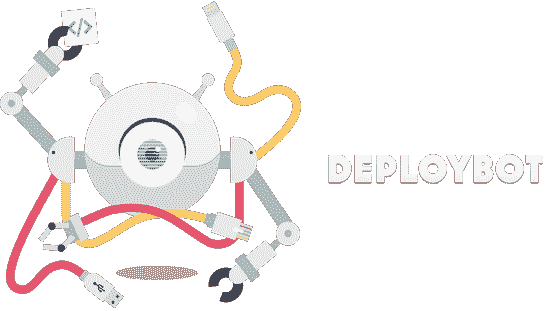

具体来说，我们将在[数字海洋](https://bit.ly/do-ref)上部署一个我制作的简单应用[。](https://github.com/Swader/diffbot-sp-search)

## 配置 Droplet

在继续之前，我们应该确保我们已经创建并配置了一个 DigitalOcean droplet(这是我的 [DigitalOcean referral link](https://bit.ly/do-ref) ，如果你想要一些学分的话)。你还应该准备好 API 密匙(可以在[这里](https://cloud.digitalocean.com/api_access)获得)。

为了与正在讨论的应用程序兼容，我们需要在 Droplet 上安装 Nginx 和 PHP，并且虚拟主机指向一个文件夹，该文件夹将保存各种版本的子文件夹，如`current`等。根据 Deploybot 文档:

| **描述** | **路径** | **外壳有** |
| --- | --- | --- |
| 活动版本链接 | **/数据/myapp/当前** | — |
| 正在部署的版本 | /数据/myapp/发布/1434307860 | $发布 |
| 应用基础 | /数据/myapp | 美元基数 |
| 共享文件 | /数据/myapp/共享 | $共享 |
| 所有版本 | /数据/myapp/发布 | $发布 |

所以，首要任务是:在你附近创建一个 Ubuntu 14.04 x64 Droplet。出于安全考虑，建议您对其进行调整。好的教程是[这里](https://www.digitalocean.com/community/tutorials/initial-server-setup-with-ubuntu-14-04)。

接下来，我们连接 Droplet，安装 Nginx。通过 Droplet GUI 中“Access”下的 HTML5 控制台连接，或者通过您自己机器的终端连接，然后(部分按照本教程中的[)执行:](https://www.digitalocean.com/community/tutorials/how-to-install-linux-nginx-mysql-php-lemp-stack-on-ubuntu-14-04)

```
sudo add-apt-repository ppa:ondrej/php5-5.6
sudo apt-get update
sudo apt-get install nginx php5-fpm
curl -sS https://getcomposer.org/installer | php
mv composer.phar /usr/local/bin/composer
```

请注意，我跳过了 MySQL 这一步，因为这个特定的应用程序不需要它。我还导入了 PHP 5.6 库，因为 Ubuntu 默认安装了一个旧版本的 PHP。最后，我安装了 Composer，这样它就可以在 Droplet 上全球使用了。

[我们正在部署的应用](https://github.com/Swader/diffbot-sp-search)有一个典型的设置，有一个`public`子文件夹，里面有一个名为`index.php`的条目文件。一个默认的 Nginx 设置会在`/usr/share/nginx/html`中寻找文件。让我们为我们的应用程序创建一个新文件夹:

```
sudo mkdir /usr/share/nginx/spsearch
```

然后，让我们设置虚拟主机。编辑文件`/etc/nginx/sites-available/default`

```
server {
    listen 80 default_server;
    listen [::]:80 default_server ipv6only=on;

    root /usr/share/nginx/spsearch;
    index index.php;

    server_name search.sitepoint.tools;

    location / {
        try_files $uri $uri/ =404;
    }

    error_page 404 /404.html;
    error_page 500 502 503 504 /50x.html;

    location ~ \.php$ {
        try_files $uri =404;
        fastcgi_split_path_info ^(.+\.php)(/.+)$;
        fastcgi_pass unix:/var/run/php5-fpm.sock;
        fastcgi_index index.php;
        fastcgi_param SCRIPT_FILENAME $document_root$fastcgi_script_name;
        include fastcgi_params;
    }
}
```

用`sudo service nginx restart`重启 Nginx 后，服务器应该配置成功。如果你试图将一个`phpinfo`文件放入`usr/share/nginx/spsearch/current`，如果你在浏览器中访问这个小程序的 IP 地址，你应该会看到 PHP 信息打印在屏幕上。

## 基本部署机器人设置

我假设你在 Github 上有一个仓库，里面有一个可以部署的应用程序，比如 [mine](https://github.com/Swader/diffbot-sp-search) 。如果没有，只要做一个并放一个`phpinfo`文件在那里，如果你想跟随并测试的话。您可以随时更改应用程序的内容，然后部署合适的应用程序。

接下来，连接一个回购。

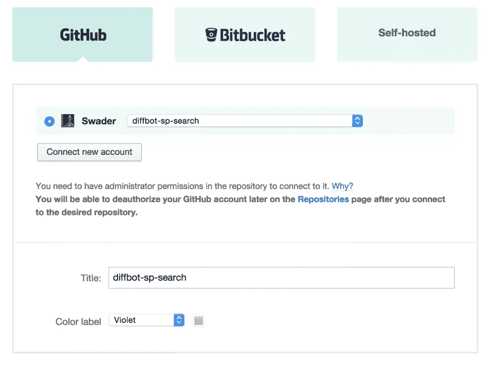

然后，我们添加一个环境。由于我们正在创建一个生产环境，因此我们将保留默认值—手动部署。

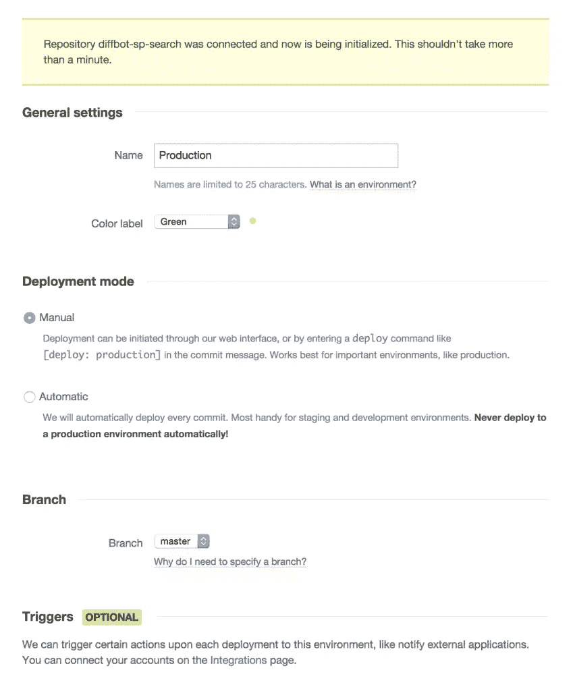

在部署下，我们选择 Web 应用程序下的数字海洋。如果你对什么是什么感兴趣的话，读一读这些问号。

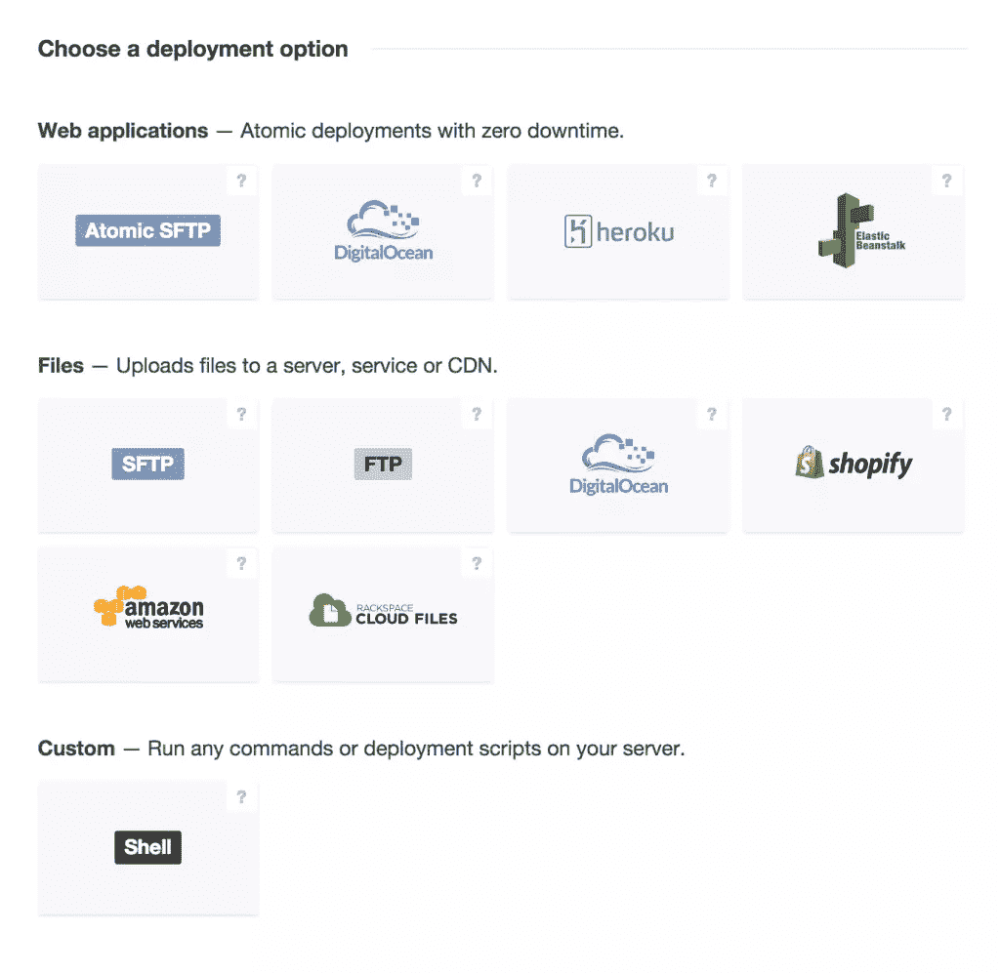

在下一个设置屏幕上，我们需要填写一些附加字段。最重要的是:

*   我们需要将应用程序路径设置为`/usr/share/nginx/spsearch`。
    
*   我们需要提供一个静态文件，因为正在讨论的应用程序使用一个`token.php`文件来提供一个 Diffbot 令牌，但是这个文件不受版本控制，以防止泄漏和窃取。
    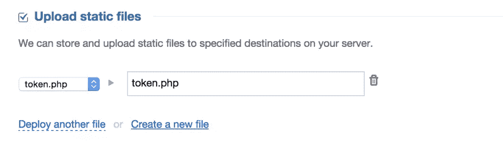
*   一旦部署完成，我们需要告诉 DeployBot 启动`composer install`。我们使用预启动脚本这样做，是因为我们希望在新版本与当前版本进行符号链接时，应用程序已准备就绪，而不是在 Composer 完成安装时遭受启动后停机。这可以通过将`composer install`放入`pre-launch`窗口来完成:
    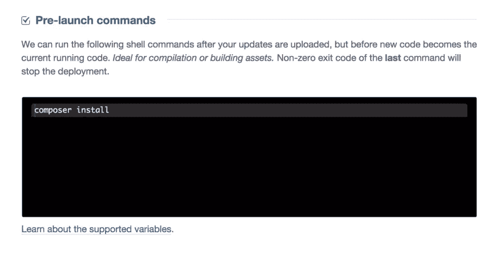

## 许可

我们还需要将部署用户从 root(如果您遵循了我上面链接的安全说明，这将不再被允许)更改为我们新创建的用户(在我的例子中是`swader`)，但是我们知道`swader`无权写入`/usr/share/nginx`。我们需要先解决这个问题。

在 droplet 中运行`su - root`以 root 身份登录，然后:

```
usermod -a -G www-data swader
chown -R root:www-data /usr/share/nginx
chmod -R g+rwX /usr/share/nginx
exit
```

这将用户添加到 www-data 组，然后使该组拥有正在讨论的文件夹，然后允许该组对所述文件夹执行必要的操作。最后，我们退出 root，回到普通用户。如果你想测试这一点，你需要用`exit`注销，然后重新登录，群组成员资格才能生效。

我们现在准备部署。

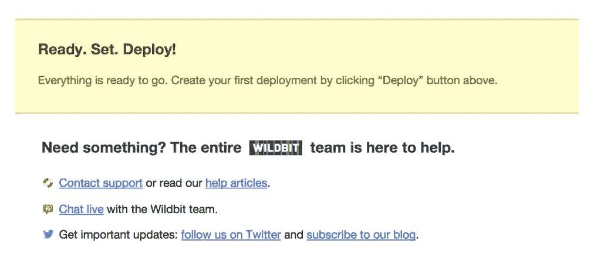

## 部署

要进行部署，请单击 DeployBot GUI 周围许多建议的部署按钮之一。

在下一个屏幕上，您有机会写一份部署说明，以防万一您想让您的团队知道一些事情，或者想在未来给自己写一个提醒。

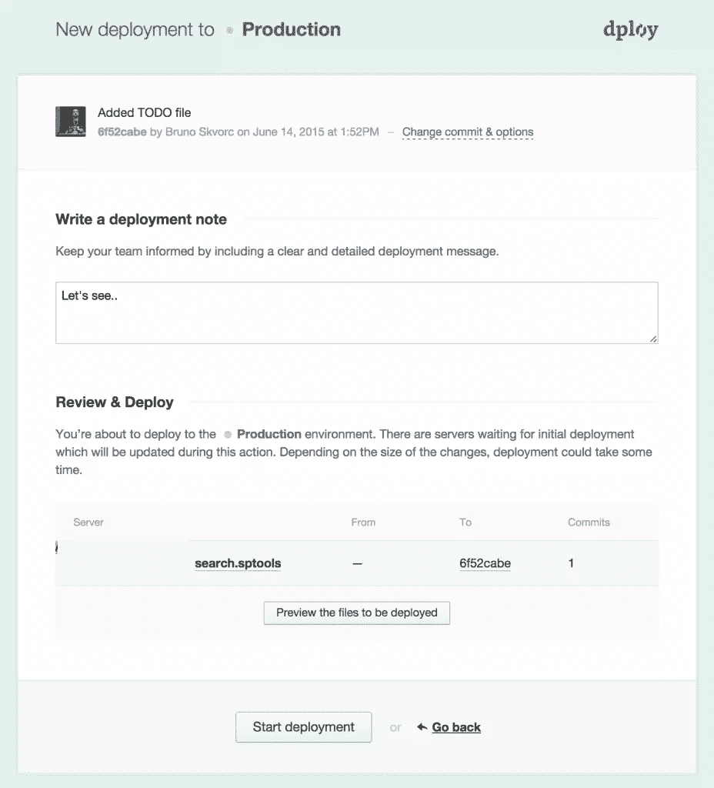

一旦点击“开始部署”，DeployBot 就会进入正题。

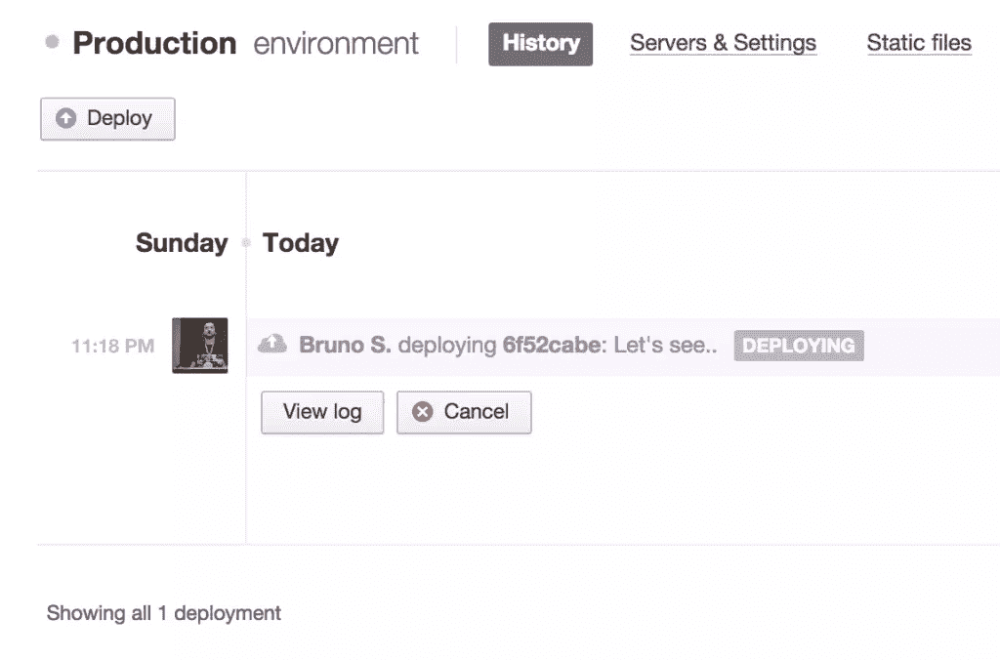

根据应用程序的大小和它可能包含的二进制文件，此过程可能需要一段时间，但一旦完成，您应该能够注意到文件都在您想要的位置:

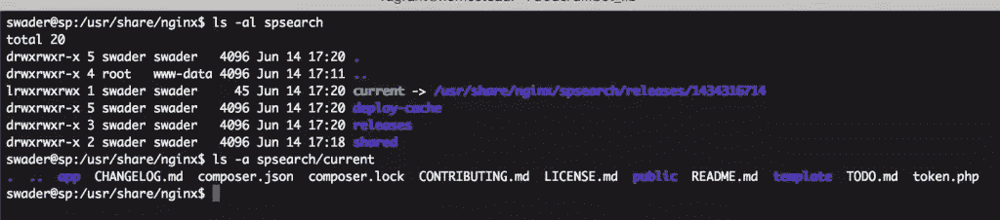

让我们看看它在浏览器中是否有效。

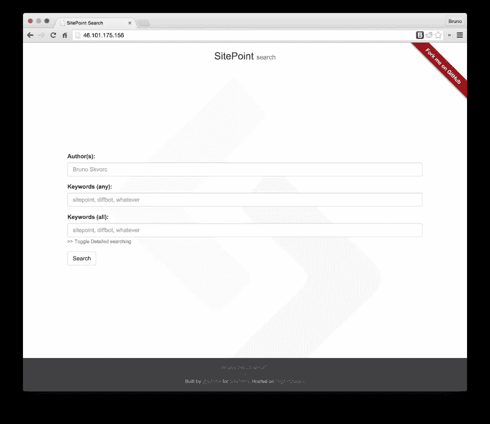

果不其然，它就像一个魔咒！

## 更新/重新部署

如果我们每次想要对站点进行更新时都必须进入 GUI 并手动触发部署过程，那么这就不是一个高效的部署过程。这就是提交消息中有触发短语的原因。如果我们进行一个新的提交，其消息包含`[deploy: production]`，这将迫使 DeployBot 部署到名为“生产”的环境中。让我们试一试。

我正在更改我的应用程序的“关于”页面，并提交。

```
git add -A
git commit -m "Made some changes to the about page. [deploy: production]"
git push origin master
```

在我重新加载这个实时站点之前，DeployBot 仪表板已经声称它已经完成了。由于两个版本之间的微小差异，部署速度令人印象深刻。

## 结论

在本教程中，我们看到了一个简单的工具 [Deploybot](https://deploybot.com) 。虽然它可能没有最热门的部署工具受欢迎，但它可能是值得考虑的失败者。再加上预启动脚本中来自诸如细看器和特拉维斯等工具的报告，它可以变成一个真正强大和安全的工作流。

你试过吗？你会吗？您在部署链中使用什么工具？请在评论中告诉我们！

## 分享这篇文章