# 14 个精选的免费社交图标包

> 原文：<https://www.sitepoint.com/14-hand-picked-free-social-icon-packs/>

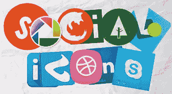

在你能在网上找到的成千上万个图标中，社交网络图标肯定是数量最多的。

考虑到人们在社交网站上投入的时间以及当你的用户在这些网络上分享你的内容时他们提供的回报，这并不奇怪。因此，如果你在你的网站或者你为客户设计的网站上添加社交图标，你只会从中受益。

在本系列的前一篇文章中，我完全专注于平面图标。然而，我发现这么多有吸引力的“非平面”社会图标，我决定用这篇文章来拓宽我的标准。

毫无疑问，矢量图标更有用，因为它们提供了所有的灵活性——以及 SVG 应用的兴起——我开始避免使用光栅图标。再说一次，我觉得这是不公平的，因为它排除了这个类别中一些最好的例子。光栅图标仍在广泛使用，这在不久的将来也不会改变。

现在，这里是我精心挑选的免费社交图标名单:

## 1.免费社交 PNG 按钮

我觉得用光栅图标集开始这个列表有点内疚，但是这些免费的社交 PNG 按钮太漂亮了，它们应该得到第一名。这套包括 20 个 png 图标的流行社交(和其他一些)网站，如脸书，谷歌，谷歌加，Gowalla，Vimeo，YouTube 等。这些按钮可以在个人和商业项目中自由使用，并且不需要归属。

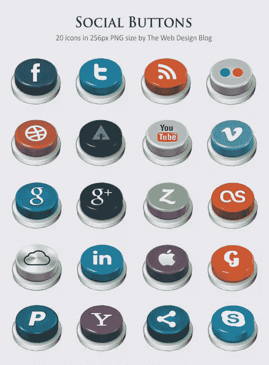

## 2.圈出社交图标

这是另一个免费的社交图标栅格包。让他们与众不同的是他们是[圈子里的社交偶像](http://martz90.deviantart.com/art/Circle-Icons-Pack-371172325)并且有 270 多个偶像。图标有多种尺寸，如 512×512、256×256、128×128、64×64 和 48×48。只需 5 美元，你就可以下载 PSD 文件，这给了你更多的选项来修改你需要的图标。

除了真正受欢迎的社交网站的图标，如脸书、Pinterest、Google Plus 等。，在这里你会发现许多你可能从未听说过的社交网站的图标。

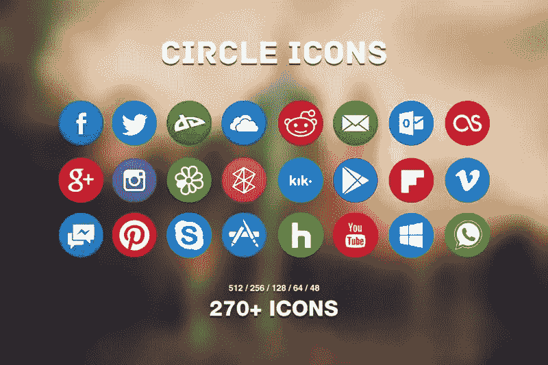

## 3.85 平面极简矢量社交图标

最后，我们得到了一个高质量的社交图标矢量包，供你欣赏。

[这个包](https://dribbble.com/shots/1427054-Flat-Minimalistic-Social-Icons)包含 85 个矢量和 png 格式的平面极简图标。准确地说，有 340 个图标，因为 85 个原始图标中的每一个都有 4 种风格——正方形、挖空正方形、圆形和挖空圆形。这个包最近更新了，所以它包含了所有现在流行的社交网站的图标。

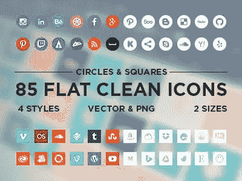

## 4.3D 矢量社交图标

这里还有一个矢量图标包，但这次是一个 3D 矢量包。图标真的很好，但不像其他一些有数百个图标的包，这个包只有 10 个图标-只有真正重要的社交网站。除了给你自由调整图标的 AI 文件，这个包还包含一个 256×256 PNG 版本，你可以马上使用。

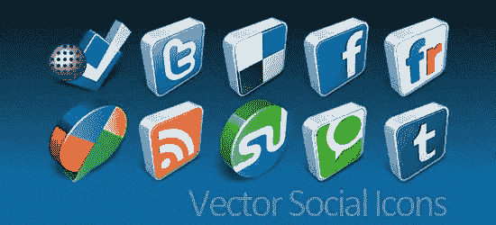

## 5.黑白平面社交图标

到目前为止，大多数包都是彩色的，但如果你不需要所有这些颜色，这里有一个黑色和白色的平面社交图标包。图标非常简单，没有装饰，但是有 700 多个。每个流行的社交网站都有多个图标变体。此外，由于它是一个矢量包(SVG 和 EPS 格式)，您不仅可以为图标添加颜色、渐变或任何其他效果，还可以在必要时添加更多细节。

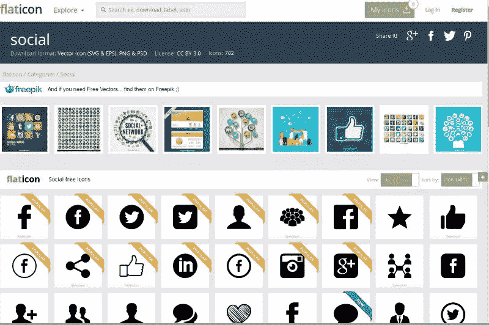

## 6.15 个彩色平面矢量社交图标

让我们继续使用一些更扁平的图标。这个包只包含 15 个图标，但是它们有一些很酷的效果，比如你在别处找不到的长阴影(对于平面设计来说非常典型)。图标可能不多，但它们涵盖了基本的社交网站。此外，在同一页面上还有 35 个平面社交图标。图标是免费下载和使用，但为了获得下载链接订阅的要求。

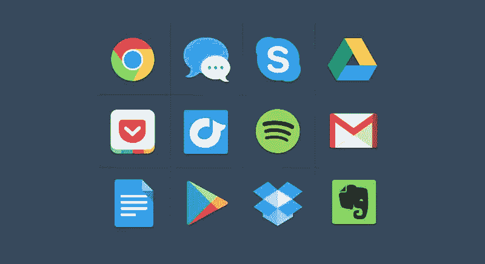

## 7.圆形矢量社交图标

如果你需要更多的圈子社交矢量图标，你可能想检查[这个包](http://designdeck.co.uk/a/1245/IC-Circle-Social-Icon-Set)。这个包比其他的稍微过时一些，它包含了一些现在不流行的图标(比如 Digg ),并且缺少像 Pinterest 这样的新人的图标。

无论如何，我认为这些图标是如此清晰和通用，值得创建任何你可能需要的额外图标。这个包里只有 12 个图标，但是它们很漂亮，很干净。有免费和付费版本，所以你最好在开始下载和使用之前检查一下每一个都包括什么。

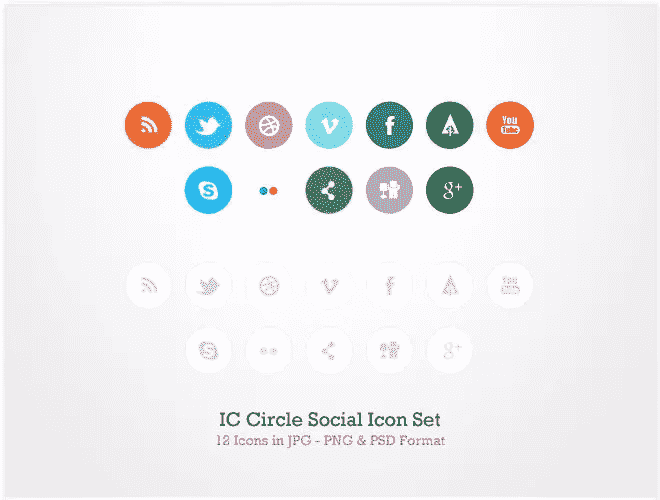

## 8.平面老式社交媒体图标

社交媒体可能是一个较新的概念，但如果你正在寻找一种更复古的审美，那么你可能会喜欢这组[扁平的复古社交媒体图标](http://limav.deviantart.com/art/Flat-Vintage-Social-Media-Icons-436146071)。最受欢迎的社交网站有 32 个图标，如 Behance、Blogger、Pinterest、Instagram、脸书、WordPress 等。多种尺寸的 ICO、ICNS 和 PNG 格式。

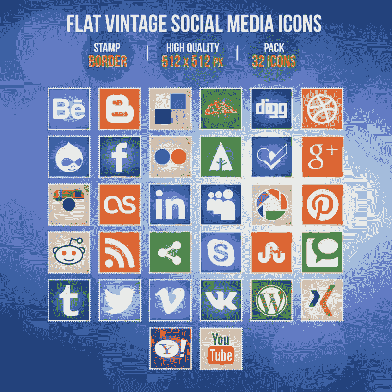

## 9.光滑的社交媒体矢量图标

这里有更多的矢量图标供你欣赏。这组光鲜亮丽的社交图标只包含基本的服务图标，如脸书、推特、谷歌、YouTube 或 Pinterest，但每个图标都有很多细节。至于形状，它们是圆形的正方形。

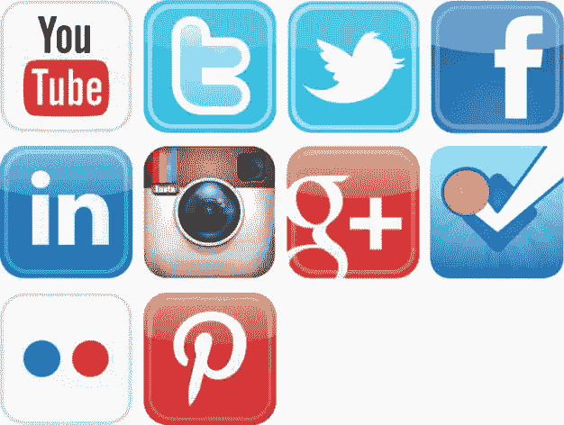

## 10.时尚的社交图标

这组[时尚的社交图标](http://designinstruct.com/free-resources/icons/social-media-sleek-icons-icon-pack/)真的很美，但不幸的是它不是矢量格式的。有 25 个 32×32 和 16×16 大小的图标，这在许多情况下可能有效，但是如果你想放大和/或修改图标，没有源文件你将不能做很多事情。然而，如果你对这些限制感到满意，这个图标集是一个非常漂亮的图标集，你可能会发现如何很好地使用它。

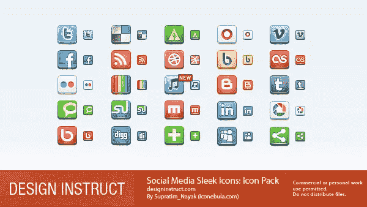

## 11.现代社交媒体图标——圆角、方形、圆形

这个现代社交媒体图标包包含 28 个图标，其中大部分也可以在其他包中找到，但也有一些网站的图标在其他地方不太容易找到。图标有 ICO 和 PNG 两种格式。这款包的特别之处在于，除了圆角版本，同样的图标还有[方形](http://www.iconarchive.com/show/modern-social-media-squares-icons-by-lunartemplates.html)和[圆形](http://www.iconarchive.com/show/modern-social-media-circles-icons-by-lunartemplates.html)两种。

注意:这些图标是免费的，仅用于非商业用途。

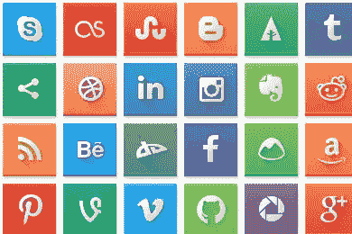

## 12.110 个矢量图标

虽然我很欣赏一个好的栅格包，但矢量就是矢量，它们有很多优点。这就是为什么我更欣赏一个好的矢量包，特别是当它有 100 多个图标可以在个人和商业项目中免费使用时，就像这个矢量包的情况一样。它有 110 个图标，即使它不是一个主要的社交网站，你也有机会找到你需要的东西。图标干净明亮，因为它们是矢量，你可以根据需要编辑它们。

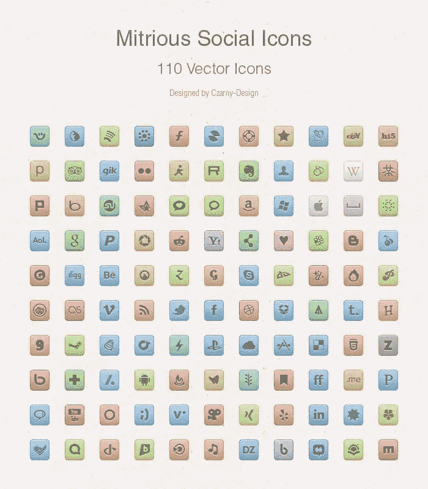

## 13.80 个免费矢量多边形社交媒体图标

以前的一些图标集包括圆形、方形、圆角方形和其他形状，但这个带有多边形图标。准确地说，同样的图标也有圆形的正方形，但是既然我们已经有了，我想强调一下多边形。

正如你所料，一包 80 个图标，几乎任何流行和不太流行的社交网站都可以在里面找到。

## 14.谷歌产品图标

这个列表的最后一项有点不同，因为这并不代表一系列的社交网站。更确切地说，这是一个由各种谷歌产品图标组成的[包](http://www.carlosjeurissen.com/google-icons/#)，其中一些是社交产品，但大多数不是。

老实说，我甚至没有听说过这里列出的十几个谷歌产品，但这并不一定意味着这些服务在数百万用户中不受欢迎。无论如何，如果你需要一个谷歌产品图标，你可以在这里找到。

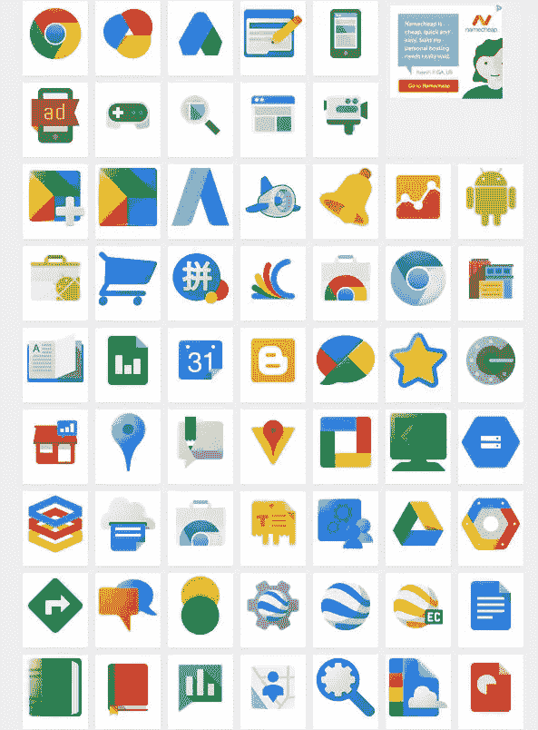

图标非常漂亮，如果它们是向量，那将是一个扣篮。尽管如此，选择 128×128 像素的 PNG 或 GIF 对我们大多数人来说应该足够有用了。

虽然我不敢说这是社交图标的权威列表，但我确实认为它包含了几乎所有品味和需求的资源。

如果你幸运的话，这些图标对你来说可能是完美的，但是即使你必须对它们做一些小的修改来满足你的需求，这仍然比从头开始设计它们要快得多。

## 分享这篇文章