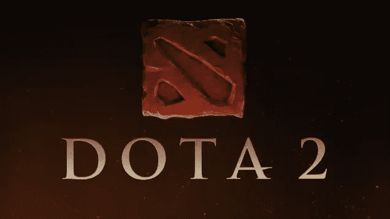

# DOTA 2 on Rails:深入挖掘

> 原文：<https://www.sitepoint.com/dota-2-rails-digging-deeper/>



本文是我的“Dota 2 on Rails”系列的第二篇。在第一部分中，我们讨论了 Dota 是什么，如何连接到 Steam API，它提供什么数据。第 1 部分中的应用程序展示了经过身份验证的用户的基本统计数据。这篇帖子引起了一些兴趣，因为一些读者甚至受到启发，创建了他们自己的 Dota 2 统计网站——这真的很棒。

在本文中，我们将继续使用演示应用程序，因此如果您希望继续，可以在[这个分支](https://github.com/bodrovis/Sitepoint-source/tree/dota_on_rails)中找到起始代码。我将向您展示 dota gem 可以获取哪些其他数据，如何处理现场比赛和预定比赛，gem 如何运行，以及如何组织测试。

代码的最终版本可以在 [GitHub](https://github.com/bodrovis/Sitepoint-source/tree/dota_on_rails) 上找到。

工作演示可通过相同的链接 sitepoint-dota.herokuapp.com。

## 获取玩家的能力升级

我们将在整篇文章中使用的 [dota](https://github.com/vinnicc/dota) gem 正在逐步发展——今天我们很自豪地宣布几个新特性。第一个是对获取能力升级数据的支持。

什么是能力升级？正如你所记得的，Dota 2 中的每个玩家控制他们自己的英雄，英雄有一套独特的能力(技能)。随着英雄等级的提升，他们可以学习新的能力或者提高现有的能力——这就是能力升级。最酷的是，Steam API 为每个玩家提供了一个数组，其中包含技能 id、时间和技能学习时的等级。在我们的应用程序中使用这些数据怎么样？

首先，创建并应用新的迁移:

```
$ rails g migration add_ability_upgrades_to_players ability_upgrades:text
$ rake db:migrate
```

这个属性必须被序列化，因为我们想要存储一个散列数组:

*models/player.rb*

```
[...]
serialize :ability_upgrades
[...]
```

现在，修改加载播放器的方法:

*models/match.rb*

```
[...]
def load_players!(radiant, dire)
  [...]
  self.players.create({
    ability_upgrades: player.ability_upgrades.map {
      |ability_upgrade| {id: ability_upgrade.ability.id,
                         name: ability_upgrade.ability.name,
                         image: ability_upgrade.ability.image_url(:hp1),
                         level: ability_upgrade.level,
                         time: parse_duration(ability_upgrade.time)}
    }.sort_by {|ability_upgrade| ability_upgrade[:level]},
    [...]
  })
end
[...]
```

[在](https://github.com/vinnicc/dota/blob/master/lib/dota/api/match/player.rb#L44)下面，返回一个包含`AbilityUpgrade`类实例的数组。`ability_upgrade.ability`是`Ability`类的一个实例，它具有[属性](https://github.com/vinnicc/dota/blob/master/lib/dota/api/ability.rb#L8)，如`id`、`name`、`full_name`和`image_url`。`full_name`返回带有英雄名字的能力名称(比如“反魔法力破除”)，而`name`只返回能力名称。

`ability.image_url(:hp1)`表示我们想要获取该能力的小图像的 URL(90×90)–[其他参数](https://github.com/vinnicc/dota/blob/master/lib/dota/api/ability.rb#L16)也可以被传递。

顺便说一下，你可以使用`Dota.api.abilities(id)` [方法](https://github.com/vinnicc/dota/blob/master/lib/dota/api/client.rb#L23)很容易地找到一个技能的 id。所有能力都缓存在 [ability.yml](https://github.com/vinnicc/dota/blob/master/data/ability.yml) 文件中。这里的缺点是这个文件必须不断更新，因为，随着新 Dota 版本的发布，能力可能会被添加或修改。

`sort_by`按级别对数组进行排序(升序)。

`ability_upgrade.time`返回游戏开始后学习该技能的秒数。我使用`parse_duration`来格式化它，就像`00:00:00`。这个方法已经在 *models/user.rb* 文件中使用过，所以让我们把它提取到一个单独的文件中:

*lib/utils.rb*

```
module Utils
  def parse_duration(d)
    hr = (d / 3600).floor
    min = ((d - (hr * 3600)) / 60).floor
    sec = (d - (hr * 3600) - (min * 60)).floor

    hr = '0' + hr.to_s if hr.to_i < 10
    min = '0' + min.to_s if min.to_i < 10
    sec = '0' + sec.to_s if sec.to_i < 10

    hr.to_s + ':' + min.to_s + ':' + sec.to_s
  end
end
```

并包含它:

*型号/用户. rb*

```
require './lib/utils'

class User < ActiveRecord::Base
  include Utils
  [...]
end
```

*models/match.rb*

```
require './lib/utils'

class Match < ActiveRecord::Base
  include Utils
  [...]
end
```

别忘了从 *user.rb* 中移除这个方法。

好了，最后，让我们在`show`页面上显示这个新信息:

*views/matches/show . html . erb*

```
<% page_header "Match #{@match.uid} <small>#{@match.started_at}</small>" %>

<h2 class="<%= @match.winner.downcase %>"><%= @match.winner %> won</h2>

<ul>
  <li><strong>Mode:</strong> <%= @match.mode %></li>
  <li><strong>Type:</strong> <%= @match.match_type %></li>
  <li><strong>Duration:</strong> <%= @match.duration %></li>
  <li><strong>First blood:</strong> <%= @match.first_blood %></li>
</ul>

<%= render 'details_table', players: @players[true], team: 'radiant' %>

<%= render 'details_table', players: @players[false], team: 'dire' %>
```

这里我将 *_players_table.html.erb* 部分重命名为 *_details_table.html.erb* ，减少了代码重复。该部分包含以下代码:

*views/matches/_ details _ table . html . erb*

```
<h3 class="<%= team %>">Team <%= team.titleize %></h3>

<table class="table table-hover table-striped info-table">
  <tr>
    <th>Player ID</th>
    <th>Hero</th>
    <th>Level</th>
    <th>Items</th>
    <th>Kills</th>
    <th>Deaths</th>
    <th>Assists</th>
    <th><abbr title="Last hits">LH</abbr></th>
    <th><abbr title="Denies">DN</abbr></th>
    <th>Gold (spent)</th>
    <th><abbr title="Gold per minute">GPM</abbr></th>
    <th><abbr title="Experience per minute">XPM</abbr></th>
    <th><abbr title="Hero damage">HD</abbr></th>
    <th><abbr title="Tower damage">TD</abbr></th>
    <th><abbr title="Hero healing">HH</abbr></th>
  </tr>
  <% players.each do |player| %>
    <tr>
      <td>
        <% if player.abandoned_or_not_connected? %>
          <abbr class="text-muted" title="<%= player.status.to_s.titleize %>"><%= player.uid %></abbr>
        <% else %>
          <%= player.uid %>
        <% end %>
      </td>
      <td><%= render 'player_hero', hero: player.hero %></td>
      <td><%= player.level %></td>
      <td><%= render 'items', items: player.items %></td>
      <td><%= player.kills %></td>
      <td><%= player.deaths %></td>
      <td><%= player.assists %></td>
      <td><%= player.last_hits %></td>
      <td><%= player.denies %></td>
      <td><%= player.gold %> (<%= player.gold_spent %>)</td>
      <td><%= player.gpm %></td>
      <td><%= player.xpm %></td>
      <td><%= player.hero_damage %></td>
      <td><%= player.tower_damage %></td>
      <td><%= player.hero_healing %></td>
    </tr>
  <% end %>
</table>

<h4 class="<%= team %>">Builds</h4>

<table class="table table-hover table-striped info-table">
  <tr>
    <th>Hero</th>
    <% (1..25).each do |level| %>
      <th><%= level %></th>
    <% end %>
  </tr>
  <% @players[true].each do |player| %>
    <tr>
      <td><%= render 'player_hero', hero: player.hero %></td>
      <% player.ability_upgrades.each do |ability| %>
        <td class="text-center">
          <%= image_tag ability[:image], alt: ability[:name], title: ability[:name] %><br/>
          <small class="text-muted"><%= ability[:time] %></small>
        </td>
      <% end %>
    </tr>
  <% end %>
</table>
```

第一个表保持不变，第二个表显示英雄建造(在 Dota 2 中最大等级是 25)。

你可能想在这里玩布局和样式，但是，总而言之，这个功能现在工作了——去试试吧！如果有一天你注意到这不再工作，这可能意味着一些新的能力已经增加了 dota 宝石还不知道。在这种情况下，可以随时更新 *ability.yml* 文件，发送你的 PR:)。

## 附加单元

dota gem 中的另一个新功能是获取玩家控制下的额外单位的信息。一般来说，一个玩家只能控制一个英雄，然而，在某些情况下，他可以召唤或征服其他单位(经典的例子是[孤独德鲁伊的](https://www.dota2.com/hero/Lone_Druid/)灵熊)。

Steam API 提供了在游戏结束时玩家控制了哪些额外单位的信息。这些信息非常简单(只有单位的名称和物品，如果有的话)，但是仍然有用。继续并应用新的迁移:

```
$ rails g migration add_additional_units_to_players additional_units:text 
$ rake db:migrate
```

序列化属性:

*models/player.rb*

```
[...]
serialize :additional_units
[...]
```

再次修改`load_players!`方法:

*models/match.rb*

```
[...]
def load_players!(radiant, dire)
  [...]
  self.players.create({
    additional_units: player.additional_units.map {
      |unit| {name: unit.name,
              items: parse_items(unit.items)}
    },
    [...]
  })
end
[...]
```

`additional_units`是一个简单的[方法](https://github.com/vinnicc/dota/blob/master/lib/dota/api/match/player.rb#L38)，它返回一个包含`Unit` [类](https://github.com/vinnicc/dota/blob/master/lib/dota/api/match/unit.rb)实例的数组。

是一个帮助器方法，删除空槽(每个英雄和一些单位有 6 个存货槽)并产生一个物品信息散列:

*models/match.rb*

```
[...]
private

def parse_items(items)
  items.delete_if {
    |item| item.name == "Empty"
  }.map  {
    |item| {id: item.id, name: item.name, image: item.image_url}
  }
end
```

不要忘记简化下面几行:

*models/match.rb*

```
items: player.items.delete_if {
    |item| item.name == "Empty"
}.map  {
    |item| {id: item.id, name: item.name, image: item.image_url}
},
```

到

*models/match.rb*

```
items: parse_items(player.items),
```

现在显示新信息:

*views/matches/_ details _ table . html . erb*

```
<h3 class="<%= team %>">Team <%= team.titleize %></h3>

<table class="table table-hover table-striped info-table">
  <tr>
    <th>Player ID</th>
    <th>Hero</th>
    <th>Level</th>
    <th>Items</th>
    <th>Kills</th>
    <th>Deaths</th>
    <th>Assists</th>
    <th><abbr title="Last hits">LH</abbr></th>
    <th><abbr title="Denies">DN</abbr></th>
    <th>Gold (spent)</th>
    <th><abbr title="Gold per minute">GPM</abbr></th>
    <th><abbr title="Experience per minute">XPM</abbr></th>
    <th><abbr title="Hero damage">HD</abbr></th>
    <th><abbr title="Tower damage">TD</abbr></th>
    <th><abbr title="Hero healing">HH</abbr></th>
  </tr>
  <% players.each do |player| %>
    <tr>
      <td>
        <% if player.abandoned_or_not_connected? %>
          <abbr class="text-muted" title="<%= player.status.to_s.titleize %>"><%= player.uid %></abbr>
        <% else %>
          <%= player.uid %>
        <% end %>
      </td>
      <td><%= render 'player_hero', hero: player.hero %></td>
      <td><%= player.level %></td>
      <td><%= render 'items', items: player.items %></td>
      <td><%= player.kills %></td>
      <td><%= player.deaths %></td>
      <td><%= player.assists %></td>
      <td><%= player.last_hits %></td>
      <td><%= player.denies %></td>
      <td><%= player.gold %> (<%= player.gold_spent %>)</td>
      <td><%= player.gpm %></td>
      <td><%= player.xpm %></td>
      <td><%= player.hero_damage %></td>
      <td><%= player.tower_damage %></td>
      <td><%= player.hero_healing %></td>
    </tr>
    <% if player.additional_units.any? %>
      <% player.additional_units.each do |unit| %>
        <tr class="text-muted small">
          <td></td>
          <td><%= unit[:name] %></td>
          <td></td>
          <td><%= render 'items', items: unit[:items] %></td>
        </tr>
      <% end %>
    <% end %>
  <% end %>
</table>
[...]
```

我们只是为玩家控制的每个额外单位增加一行。 *_items.html.erb* 是上一篇文章介绍过的分部。

如果这个功能停止工作，这可能意味着一个新的项目被引入，dota 宝石需要更新。您可以通过访问`http://api.steampowered.com/IEconItems_570/GetSchemaURL/v0001/?key=` URL 轻松获取所有商品的最新列表。然而，有时这些信息也可能不是 100%准确的(从[开发论坛](http://dev.dota2.com/forumdisplay.php?f=411)上的讨论来看)。

## 塔楼和兵营状态

你可能还记得，每个队都有自己的基地要保卫。然而，在敌人进入你的基地之前，他们必须摧毁其中一条路上的三座塔。这些塔被称为第一层、第二层和第三层。第三层位于基地入口附近；两个兵营(远程和近战单位)也位于那里。除了这些塔之外，主楼还有两个守卫必须被摧毁才能赢得游戏。

Steam API 提供了塔和兵营的状态，我们也将使用这些信息。状态过去以二进制格式表示，其中每个数字对应一个特定的建筑物；0 表示建筑被摧毁，1 表示建筑在游戏结束时屹立不倒。然而，现在 Steam API 只是返回一个十进制的状态数。那么，我们在 dota 宝石中是如何处理的呢？

首先，有[两个阵](https://github.com/vinnicc/dota/blob/master/lib/dota/api/basic_side.rb#L4)包含塔和兵营。然后有一个[的特殊方法](https://github.com/vinnicc/dota/blob/master/lib/dota/api/basic_side.rb#L33)将十进制数转换成更用户友好的格式。它获取数字，并使用`to_s(2)`将其转换为二进制。通过将一个数字作为参数传递给`to_s`方法，可以设置基数，这真是一个巧妙的技巧。

在某些情况下，Steam API 可能会返回类似于`5`的状态，即二进制格式的`101`，这意味着去掉了前导零。然而，这对我们来说还不够，所以使用`rjust`添加缺失的零。

因此，这个方法返回一个[散列](https://github.com/vinnicc/dota/blob/master/spec/dota/api/match/side_spec.rb#L32)，其中塔和兵营的名称作为键，`true`或`false`作为值。

有了这些知识，我们现在可以应用新的迁移:

```
$ rails g migration add_towers_status_and_barracks_status_to_matches towers_status:text barracks_status:text
$ rake db:migrate
```

序列化这些属性:

*models/match.rb*

```
[...]
serialize :towers_status
serialize :barracks_status
[...]
```

并修改`load_matches!`方法:

*型号/用户. rb*

```
[...]
def load_matches!(count)
  [...]
  new_match = self.matches.create({
    [...]
    towers_status: {
      radiant: parse_buildings(match_info.radiant.tower_status),
      dire: parse_buildings(match_info.dire.tower_status)
    },
    barracks_status: {
      radiant: parse_buildings(match_info.radiant.barracks_status),
      dire: parse_buildings(match_info.dire.barracks_status)
    }
    [...]
end
[...]
```

下面是`parse_buildings`方法:

*型号/用户. rb*

```
[...]
def parse_buildings(arr)
  arr.keep_if {|k, v| v }.keys
end
[...]
```

基本上，我们只保留那些在游戏结束时仍然屹立不倒的建筑的名字。我并不是说这是存储这些数据的最佳格式，所以你可能会选择其他格式，特别是如果你想在一个小 Dota 地图上可视化(就像在 Dotabuff 中那样)。

在视图上:

*views/matches/_ details _ table . html . erb*

```
[...]
<h4 class="<%= team %>">Remaining buildings</h4>

<h5>Towers</h5>

<ul>
  <% @match.towers_status[team.to_sym].each do |b| %>
    <li><%= b.to_s.titleize %></li>
  <% end %>
</ul>

<h5>Barracks</h5>

<ul>
  <% @match.barracks_status[team.to_sym].each do |b| %>
    <li><%= b.to_s.titleize %></li>
  <% end %>
</ul>
```

`titleize`用于将建筑物的系统名称转换为用户友好的格式。请随意进一步重构。

## 好恶

我们要显示的最后一条信息是比赛的好恶计数。这真的很容易做到。应用迁移:

```
$ rails g migration add_likes_and_dislikes_to_matches likes:integer dislikes:integer
$ rake db:migrate
```

修改`load_matches!`方法:

*型号/用户. rb*

```
[...]
def load_matches!(count)
  [...]
  new_match = self.matches.create({
    [...]
    likes: match_info.positive_votes,
    dislikes: match_info.negative_votes,
    [...]
end
[...]
```

并调整视图:

*views/matches/show . html . erb*

```
<% page_header "Match #{@match.uid} <small>#{@match.started_at}</small>" %>

<h2 class="<%= @match.winner.downcase %>"><%= @match.winner %> won</h2>

<p>
  <i class="glyphicon glyphicon-thumbs-up"></i> <%= @match.likes %>
  <i class="glyphicon glyphicon-thumbs-down"></i> <%= @match.dislikes %>
</p>

[...]
```

披萨蛋糕！

## 直播和预定比赛

您可以像处理完成的比赛一样处理现场比赛，只有一些事情会发生变化。

使用`live_matches`方法获取所有实时匹配，传递`league_id`或`match_id`来缩小范围。

`LiveMatch`是`BasicMatch`类的子吗，因此它的实例响应一堆相同的方法。然而，Steam API 提供的原始信息有一些奇怪的不一致。例如，要获得一场已结束比赛的联赛 ID[，你需要访问](https://github.com/vinnicc/dota/blob/master/lib/dota/api/match.rb#L9)`leagueid`键。但是，对于直播比赛来说，[关键](https://github.com/vinnicc/dota/blob/master/lib/dota/api/live_match.rb#L9)是`league_id`。真的很奇怪。

现场比赛[有一套](https://github.com/vinnicc/dota#live-matches)自己有用的方法，比如`roshan_timer`或者`spectators_count`。

关于参与团队的信息以同样的方式获取:通过调用`radiant`或`dire`。然而，你[也可以](https://github.com/vinnicc/dota#sides---radiantdire)调用每个团队对象上的`score`和`series_wins`方法。如果你想知道`complete?`方法是做什么的，它只是告诉一方的所有玩家是否属于同一个电子竞技队。

使用`radiant.players`或`dire.players`获得一组玩家。然而，这些对象是[的实例，一个独立的](https://github.com/vinnicc/dota/blob/master/lib/dota/api/live_match/player.rb) `LiveMatch::Player`类，除了[的公共方法](https://github.com/vinnicc/dota/blob/master/lib/dota/api/basic_player.rb)之外，还有一些额外的方法。例如，使用`player.position_x`和`player.position_y`来追踪当前玩家的位置，或者`player.respawn_timer`来追踪死去的英雄多快会复活。

在客户端，您可以实现某种脚本来不断地轮询更改并更新这些值(顺便说一下，我已经写了几篇关于轮询的帖子，比如[这篇](https://www.sitepoint.com/mini-chat-rails-server-sent-events/)。)

另一方面，像`hero_damage`或`additional_units`这样的方法对于现场比赛是不可用的。在这里阅读更多。

预定的匹配通过`scheduled_matches`获取，它接受`to`和`from`参数(时间戳必须作为一个值传递)。返回的对象是`ScheduledMatch` [类](https://github.com/vinnicc/dota/blob/master/lib/dota/api/scheduled_match.rb)的实例，它不是`BasicMatch`的子类，因此有自己的方法。您只能获取联赛和比赛 id、参赛队伍的信息(`Team` [类](https://github.com/vinnicc/dota/blob/master/lib/dota/api/team.rb)的实例)、开始时间、描述以及这是否是比赛的最后一场比赛。在这里阅读更多。

## 测试

最后，我想说几句关于 dota gem 中的测试是如何实现的。它使用 [RSpec](http://rspec.info/) 和 [VCR](https://github.com/vcr/vcr) 来回放与 Steam API 的交互。

VCR 背后的想法非常简单:在第一次运行时，您的自动化测试访问 API 并执行所有需要的交互。VCR 将这些请求和 API 响应记录在特殊的 YAML 文件中(看起来像[这个](https://github.com/vinnicc/dota/blob/master/spec/fixtures/vcr_cassettes/GetLeagueListing.yml))，这些文件被称为*卡带*。这些盒子包含所有关于请求和响应的信息，如状态、标题和正文。然后在下一轮测试中使用包埋盒。

[这里的](https://github.com/vinnicc/dota/blob/master/spec/dota/api/live_match_spec.rb)是使用 VCR 卡带的例子。在`let`方法中，`VCR.use_cassette` [被称为](https://github.com/vinnicc/dota/blob/master/spec/dota/api/live_match_spec.rb#L3)，卡带的名称作为参数(对应于 YAML 文件名)。模拟 API 交互，然后获取响应的所需部分(在本例中为`live_matches.first`)。`test_client`是返回 dota 客户端的[简单方法](https://github.com/vinnicc/dota/blob/master/spec/spec_helper.rb#L12)。

如果你从未听说过 VCR，我真的鼓励你[阅读更多的](https://relishapp.com/vcr/vcr/docs)，因为它在测试与各种服务交互的 gem 时非常方便。

## 结论

欢迎到文末！我们查看了 Steam API 提供的各种数据，讨论了 dota gem 如何工作，以及如何实现其测试。我希望你喜欢这个系列:)。

如果你已经基于这个演示创建了自己的应用，请在评论中分享。谢谢你和我呆在一起，再见！

## 分享这篇文章