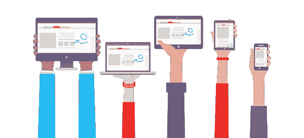
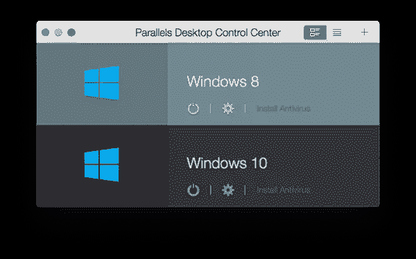
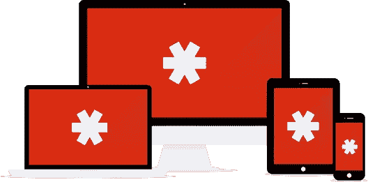

# 为什么跨平台读写能力很重要

> 原文：<https://www.sitepoint.com/cross-platform-literacy-matters/>

用户越来越期待能够充分利用所选平台的应用体验。这意味着开发者和设计者必须像他们的用户一样熟悉他们的目标设备。

*这篇文章解释了为什么跨平台读写能力很重要，并描述了几种使平台间切换尽可能简单的技术。*

## 利用平台功能

当应用程序是由不熟悉其目标平台的设计人员和开发人员创建时，这一点很容易表现出来。我职业生涯的大部分时间都在与跨平台技术打交道，我学到的最重要的事情之一就是细节很重要。

最终用户可能会根据社会趋势、财务考虑和生态系统投资等因素来选择他们的平台，但他们通常会喜欢构成该平台整体体验的小捷径、便利性和特质。

一个应用程序不需要充分利用每个平台的能力——尤其是在早期；但是，既然可以有把握地假设你的竞争对手最终会提供最好的、最有本土感觉的用户体验，你的标准也应该同样高。

## 跨平台流畅很重要

为多个平台设计和开发是棘手的。这在逻辑上很困难，因为它通常需要不同的技能组合，而且它很昂贵，因为它有时需要投资多套硬件。

此外，设计人员和开发人员对他们选择的平台和他们的最终用户一样充满热情，甚至更多，这可能会给他们的工作带来偏见和盲点。但我相信，最好的用户体验来自于那些完全熟悉他们所构建的平台的设计师和开发人员，而熟悉一个平台意味着不仅仅是测试:它意味着花时间使用那个平台来完成现实世界的任务，并真正学会欣赏它，而不管个人偏好如何。

本文描述了几种方法，通过这些方法，您可以更轻松、更高效地定期使用多个桌面和移动平台。虽然熟悉所有相关平台是一项重大投资，但你越容易做到这一点，你就越有可能长期保持这种体验，最重要的是，你越能学会像用户一样思考。

## 首先是坏消息

在数字上保持双手并用并不容易(或者便宜)，事实上这几年来对我来说是一场持续的斗争。这是坏消息。但好消息是，几个因素使得在设备和操作系统之间来回移动比以往任何时候都更容易:

*   仿真技术的进步。
*   极其实惠的云服务。
*   日益强大和流行的基于 web 的应用程序。
*   最后，iOS 和 Android 的持续流行——以及 MAC 的复兴——要求许多软件供应商支持多种平台，以便覆盖所有客户。

Even Microsoft is embracing multiple platforms with tools like OneNote. ([Microsoft OneNote](http://www.onenote.com/))

为了保持技术的流畅性，有必要花时间使用各种设备和操作系统。您不仅应该使用它们进行测试，而且熟悉最终用户可能的应用程序、任务和工作流也很重要。

本文的其余部分描述了几种你可以组织和配置你的数字生活的方法。目标是将尽可能多的不同平台、工作流和设计语言整合到您的应用程序中。如果你成功了，你所有的客户都会得到很好的服务，不管他们的平台如何。

## 五金器具

使用多平台的第一个要求是运行它们的硬件，或者提供有效仿真的软件解决方案。下一节描述了在您的预算允许的情况下，使移动平台和桌面平台都具有可访问性的几种方法。

### 电脑

让我们从一开始就搞清楚这一点:你首先需要的是一台 Mac。访问 Windows 有很多选择(我将在下面更详细地介绍)，但除非你想建立一个 [Hackintosh](http://www.hackintosh.com/) ，否则真的没有办法购买 iMac、Mac mini 或 MacBook。幸运的是，作为一名开发人员或设计师，你很有可能已经拥有至少一台 Mac 电脑，如果没有，苹果有很多价格实惠的低端(但仍然非常强大)Mac 电脑。

幸运的是，访问 Windows 环境要便宜得多，也容易得多。最简单的解决方案是使用云服务，如[亚马逊工作区](http://aws.amazon.com/workspaces/)、[微软 Azure RemoteApp](https://www.remoteapp.windowsazure.com/) 或 [VMware Horizon Air](http://www.vmware.com/cloud-services/desktop/) 。但是由于性能是平台整体体验的一个关键组成部分，我从来不喜欢远程桌面环境中常见的延迟。因此，我建议尽可能原生地运行 Windows。

自从史蒂夫·乔布斯宣布苹果计划从 PowerPC 处理器迁移到英特尔的 x86 架构以来，已经过去了大约十年，不仅 MAC 变得明显更快，而且运行 OS X 和 Windows 也变得更容易了。使用这两种操作系统最简单的方法就是在 Mac 上安装 Windows，使用类似于 [Parallels](http://www.parallels.com/) 、VMWare 的 [Fusion](http://www.vmware.com/au/products/fusion/features.html) 或者免费的 [VirtualBox](https://www.virtualbox.org/) 这样的工具。总的来说，这些年来，我发现这些工具变得更容易使用，更快，更强大。

Running Windows on a Mac with Parallels.

为了获得更自然的体验，总会有 [Boot Camp](https://www.apple.com/support/bootcamp/) ，它可以让你直接在 Mac 硬盘的一个单独分区上安装 Windows——以及一套适用于苹果硬件的 Windows 驱动程序。Boot Camp 的优势是你通常可以获得出色的性能，因为 Windows 可以访问 Mac 的所有资源(事实上，MacBooks 曾被许多人认为是最好的 Windows 笔记本电脑)。然而，缺点是您必须重启进入 Windows，这使得跨环境的快速测试或试验更加耗时。

我个人的偏好是使用两台独立的电脑。在我看来，苹果制造最好的笔记本电脑，我认为最好的 Windows 体验是在台式机配置上。因此，我在 OS X 用的是 MacBook Pro，在 Windows 上用的是定制的 PC。

### 移动设备

移动是事情真正开始变得棘手的地方。我从惨痛的教训中认识到，制造商、零售商、运营商和服务提供商的既定体系并不适合那些希望同时拥有和操作多种设备的客户。但是只要做一点工作(和一些好的建议),这是可能的。

我个人的原则是永远一次性买手机，从不签合同或接受补贴。尽管预付现金很诱人，但拥有随时更换手机或升级的灵活性(出售旧手机以抵消成本)对于获得最新和最受欢迎的 iOS 和 Android 体验至关重要。

但是有两部手机的问题是让它们同时工作。最简单的办法是制定一个单一的手机计划，只在有 Wi-Fi(现在几乎无处不在)时使用第二部手机。如果你想做一个更永久的切换，你所要做的就是转移 SIM 卡。虽然有点不方便，但这比支付两个不同的电话计划并试图管理多个电话号码要好。

如果你想让两部手机同时活跃在移动网络上，我会推荐某种类型的共享家庭计划。例如，我有一个美国电话电报公司计划，允许我在任意多的设备上共享语音(我很少使用)和数据(我经常使用)。虽然我每个月要为每部手机多付 15 美元，但这比拥有完全独立的手机套餐要便宜得多。

多部手机同时激活的最大问题是拥有多个电话号码。我发现的解决这个问题的最好方法是使用谷歌语音(这项技术似乎是 T2 项目 Fi T3 的基础之一)。谷歌语音可以让你有一个单一的电话号码，转发到许多不同的电话号码，因为你想要的。此外，您可以在 iOS 和 Android 上(以及在浏览器中)使用 Hangouts 来发送短信和即时消息。然而，如果你想使用像苹果的 Messages 应用程序这样的原生信息服务，那么你可能最好只是偶尔交换一下 SIM 卡。

[https://www.youtube.com/embed/1KSoxdtyc58](https://www.youtube.com/embed/1KSoxdtyc58)

Google Voice allows you to have one phone number associated with multiple phones.

## 软件

拥有支持多种平台的硬件仅仅是个开始；下一步是对其进行配置，以用于现实世界的用例及工作流。为了体验尽可能像你的客户一样的平台，我发现最好使用真实数据。在多种设备上处理真实数据的最简单方法是选择能够无缝同步您的数字生活的应用程序和服务。

本节介绍一些基本的软件解决方案，这些解决方案不仅简化了将真实世界的数据放到多个平台上的过程，还简化了在整个设备群中保持数据同步的过程。

### 电子邮件

在我看来，邮箱才是最初的杀手级 app。每个电子邮件客户端都是为每个设备的独特功能定制设计的；所有用户的数据都保存在远程服务器上(现在称为“云”)；大多数与数据交互的协议都是开放的、易于理解的、相当健壮的。电子邮件是现代多设备计算的典范，我们理所当然地认为我们可以在任何连接到互联网的东西上轻松阅读和发送邮件。

无论你使用基于网络的电子邮件解决方案，如 Gmail，还是企业解决方案，如 Exchange，从任何现代设备访问你的电子邮件可能是变得更加跨平台的最简单和最好的支持部分。因此，让我们看看多设备采用的其他方面，这些方面可能不那么简单。

### 浏览器

过去，浏览器是使用多种设备的障碍，因为设置、书签、扩展和历史记录等数据不容易共享。然而，现在大多数主流浏览器都无缝地处理同步，这使得在平台之间切换并访问您的配置变得很容易。

我个人更喜欢谷歌 Chrome，因为它可以同步如此多的信息，还因为它可以在我使用的所有设备上很好地运行。你甚至可以看到你在其他 Chrome 实例上打开了哪些标签——不管是什么设备或操作系统——这真的有助于减少从一个设备跳到另一个设备的摩擦。无论我是在安装新的 Mac、Windows PC、iPhone 还是 Android 设备，我下载和/或配置的第一件事几乎总是 Chrome。

Google Chrome’s advanced sync settings. ()

### 文件同步

像浏览器同步一样，这些年来，跨设备共享文件变得越来越容易和便宜。我最喜欢的服务仍然是 Dropbox，因为我发现它是最可靠和最通用的，但 Google Drive 和微软的 OneDrive 是很好的替代品。(事实上，没有什么可以阻止您运行多个，并免费获得大量的组合存储空间。)

无论你选择哪种服务，都要了解它的能力和局限性。例如，我发现当我连接到我的企业 VPN 时，Google Drive 无法工作，这在某些情况下对我来说是一个严重的限制，尽管它可以无缝同步我的 Android 设备上的所有照片，这非常方便。同样，安装最新版本的 Dropbox 桌面客户端给 Mac 和 Windows 都提供了增强的截图分享功能，我经常发现这在跨平台测试和试验时很有用。

在大量使用文件同步时，您要小心的一件事是冲突。虽然 Dropbox 拥有一些我用过的最好的同步技术，但当相同的文件在不同的设备上打开和修改时，仍然有可能产生冲突。幸运的是，Dropbox 在识别这些冲突方面做得很好，这意味着你不太可能会丢失工作(我从来没有丢失过)，但你仍然可能会发现自己有同一个文件的多个版本，然后你必须手动合并它们。避免冲突的诀窍是在切换到另一个设备之前，总是关闭一个设备上的文档。

### 个人信息管理

如果你的年龄足够大，可以拥有一台 PDA，那么你可能对 PIM(个人信息管理)这个术语很熟悉。现在已经不常使用它了，但是我决定在这里重新使用它，以便引用包含日历、联系人、笔记和密码的数据超集。

对于日历和联系人，我使用谷歌工具的组合，如果是在企业环境中，则使用 Exchange。我会避免的一项服务是苹果的 iCloud。虽然我真的很喜欢苹果的原生界面，可以从谷歌和 Exchange 访问我的日历和联系人，但我通常会避免依赖苹果的服务，因为它们在竞争平台上往往不太容易访问。

这些年来，我使用了无数的解决方案来记录和同步笔记，包括 Microsoft ActiveSync(很久以前)；文本文件结合了版本控制系统，如 CVS、SVN 和最近的 GitDropbox 和 TextMate、Notepad++和 Sublime Text 等编辑器的组合；最后，各种各样的在线笔记本应用程序，如现已倒闭的谷歌笔记本、谷歌文档和谷歌 Keep。幸运的是，由于有了 Evernote、T2、OneNote 和 T4 的 Simplenote 等应用和服务，基于云的笔记变得简单多了。虽然每一种都有自己的功能和局限性，但大多数现代笔记解决方案都非常强大，要么免费，要么价格合理，并且可以在所有相关平台上可靠地工作。

PIM 数据的最后一部分是密码。虽然我喜欢浏览器同步，但我已经有一段时间没有依赖浏览器进行密码管理了。相反，我使用专用的密码管理器。我最常听说的三个是 [LastPass](https://lastpass.com/) 、 [1Password](https://agilebits.com/onepassword) 和[dash lane](https://www.dashlane.com/)——所有这些都允许你从几乎任何现代设备上安全地访问敏感数据，如密码、支付信息和加密笔记。如果你还在使用文本文件、电子表格、浏览器密码管理、便利贴，或者到处都是相同的密码，我强烈建议尽快切换到专用的密码管理器。它们不仅更安全，而且还有一个额外的好处，那就是无论你使用哪种操作系统或设备，你都可以得到你的密码。

Password managers like LastPass allow you to synchronize your passwords across just about all modern devices. ([LastPass.com](https://lastpass.com/))

## 结论:不要让完美成为好的敌人

几年来，我一直沉浸在不同的生态系统中，在使平台和操作系统之间的切换相对无痛的技术方面，我获得了很多经验。但这也意味着我发现了很多问题。

使用多种设备的主要目的是确保我们能够通过用户的眼睛看世界，并鼓励我们与品味和期望与我们不同的客户建立共鸣。但是，正如科学研究中的[观察者效应](http://en.wikipedia.org/wiki/Observer_effect_(physics))所说，观察的行为改变了结果，在某些情况下，尽可能容易地在操作系统和设备之间切换的过程可能意味着错过我们想要的特定于平台的体验。

例如，使用谷歌语音和 Hangouts 来更容易地在 iOS 和 Android 手机之间切换意味着完全避免苹果的消息生态系统——这可能是苹果用户体验到的最常见的功能和工作流程之一。或者只使用 Chrome，因为它在同步几乎所有现代设备的设置方面做得非常好，我们可能不会在许多 Mac 用户选择的浏览器 Safari 上花足够的时间。

描述平台包容性更强的数字生活方式的危险的一个好方法是，以牺牲深度为代价走得更宽。然而，我开始相信，只要我们充分意识到这一点，这样的风险不仅是可管理的，而且比不够了解平台要好。

作为开发人员和设计人员，总是有一种倾向于我们最喜欢的或者对我们最方便的体验、模式和工作流的诱惑。但是，通过广泛了解他人的品味和期望，我们可以更加关注什么对我们的客户最好。毕竟，如果我们不这样做，竞争对手会这样做只是时间问题。

## 分享这篇文章