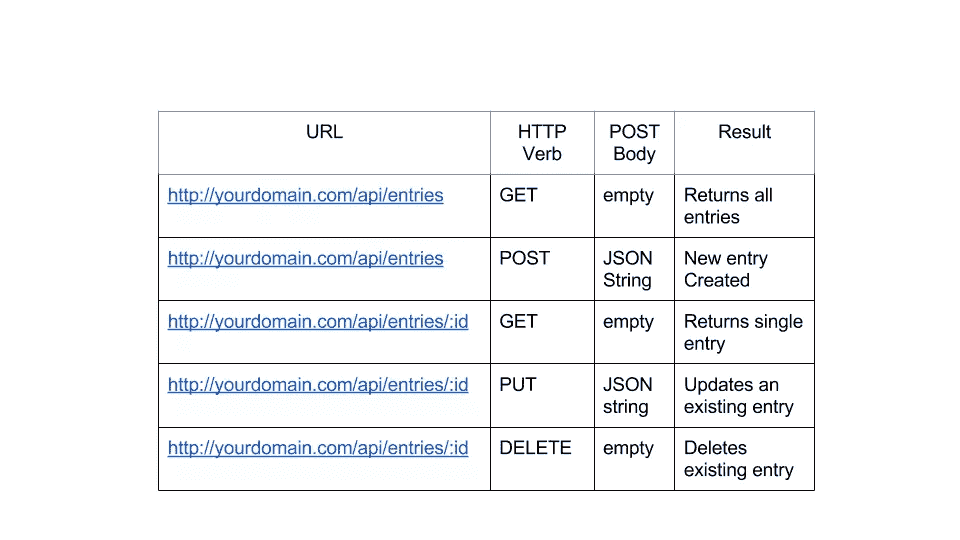

# 用 Angular 的$resource 在几分钟内创建一个 CRUD 应用程序

> 原文：<https://www.sitepoint.com/creating-crud-app-minutes-angulars-resource/>

大多数单页应用程序涉及 [CRUD 操作](https://www.sitepoint.com/premium/books/jump-start-sinatra/)。如果您正在使用 AngularJS 构建 CRUD 操作，那么您可以利用`$resource`服务的力量。Angular 的`$resource`建立在`$http`服务之上，是一个让你可以轻松与 RESTful 后端交互的工厂。所以，我们来探索一下`$resource`，用它来实现 Angular 中的 CRUD 操作。

## 先决条件

服务没有和主要的 Angular 脚本捆绑在一起。您需要下载一个名为`angular-resource.js`的单独文件，并将其包含在您的 HTML 页面中。脚本可以从[http://cdnjs . cloud flare . com/Ajax/libs/angular . js/1 . 2 . 16/angular-resource . min . js](http://cdnjs.cloudflare.com/ajax/libs/angular.js/1.2.16/angular-resource.min.js)下载。

此外，您的主应用程序模块应该声明对`ngResource`模块的依赖，以便使用`$resource`。下面的示例演示了如何做到这一点:

```
angular.module('mainApp',['ngResource']); //mainApp is our main module
```

## 入门指南

期望一个经典的 RESTful 后端。这意味着您应该具有以下格式的 REST 端点:



您可以使用自己选择的服务器端语言创建端点。但是，我已经使用 Node + Express + MongoDB 为演示应用程序设计了 RESTful API。一旦你准备好了 URL，你就可以利用`$resource`的帮助来与这些 URL 交互。所以，让我们来看看`$resource`到底是怎么工作的。

## $resource 是如何工作的？

要在您的控制器/服务中使用`$resource`，您需要声明对`$resource`的依赖。下一步是用 REST 端点调用`$resource()`函数，如下例所示。这个函数调用返回一个`$resource`类表示，可以用来与 REST 后端交互。

```
angular.module('myApp.services').factory('Entry', function($resource) {
  return $resource('/api/entries/:id'); // Note the full endpoint address
});
```

函数调用的结果是一个资源类对象，默认情况下有以下五种方法:

1.  `get()`
2.  `query()`
3.  `save()`
4.  `remove()`
5.  `delete()`

现在，让我们看看如何在控制器中使用`get()`、`query()`和`save()`方法:

```
angular.module('myApp.controllers',[]);

angular.module('myApp.controllers').controller('ResourceController',function($scope, Entry) {
  var entry = Entry.get({ id: $scope.id }, function() {
    console.log(entry);
  }); // get() returns a single entry

  var entries = Entry.query(function() {
    console.log(entries);
  }); //query() returns all the entries

  $scope.entry = new Entry(); //You can instantiate resource class

  $scope.entry.data = 'some data';

  Entry.save($scope.entry, function() {
    //data saved. do something here.
  }); //saves an entry. Assuming $scope.entry is the Entry object  
});
```

上面代码片段中的`get()`函数向`/api/entries/:id`发出一个 GET 请求。URL 中的参数`:id`被替换为`$scope.id`。您还应该注意到，函数`get()`返回一个空对象，当实际数据来自服务器时，该对象会自动填充。`get()`的第二个参数是一个回调，当数据从服务器到达时执行。这是一个有用的技巧，因为您可以将由`get()`返回的空对象设置为`$scope`并在视图中引用它。当实际数据到达并填充了对象时，数据绑定开始生效，您的视图也随之更新。

函数`query()`向`/api/entries`发出 GET 请求(注意没有:id)并返回一个空数组。当数据从服务器到达时，该数组被填充。同样，您可以将这个数组设置为一个`$scope`模型，并使用`ng-repeat`在视图中引用它。您还可以向`query()`传递一个回调函数，一旦数据来自服务器，就会调用这个函数。

`save()`函数向`/api/entries`发出一个 post 请求，第一个参数作为 POST 主体。第二个参数是在保存数据时调用的回调。您可能还记得`$resource()`函数的返回值是一个资源类。因此，在我们的例子中，我们可以调用`new Entry()`从这个类中实例化一个实际的对象，在其上设置各种属性，最后将对象保存到后端。

理想情况下，您将只在资源类上使用`get()`和`query()`(在我们的例子中是`Entry`)。所有像`save()`和`delete()`这样的非 GET 方法在通过调用`new Entry()`获得的实例中也是可用的(称之为`$resource`实例)。但不同的是，这些方法都有一个`$`前缀。因此，`$resource`实例中可用的方法(相对于`$resource`类)有:

1.  `$save()`
2.  `$delete()`
3.  `$remove()`

例如，方法`$save()`的用法如下:

```
$scope.entry = new Entry(); //this object now has a $save() method
$scope.entry.$save(function() {
  //data saved. $scope.entry is sent as the post body.
});
```

我们已经探索了 CRUD 的创建、读取和删除部分。唯一剩下的就是更新了。为了支持更新操作，我们需要修改我们的定制工厂`Entity`，如下所示。

```
angular.module('myApp.services').factory('Entry', function($resource) {
  return $resource('/api/entries/:id', { id: '@_id' }, {
    update: {
      method: 'PUT' // this method issues a PUT request
    }
  });
});
```

`$resource()`的第二个参数是一个散列，表示 URL 中参数`:id`的值。将它设置为`@_id`意味着每当我们在资源实例上调用类似`$update()`和`$delete()`的方法时，`:id`的值将被设置为实例的`_id`属性。这对于上传和删除请求很有用。还要注意第三个参数。这是一个散列，允许我们向资源类添加任何自定义方法。如果该方法发出一个非 GET 请求，那么它就可以被带有前缀`$`的`$resource`实例使用。那么，让我们来看看如何使用我们的`$update`方法。假设我们在一个控制器中:

```
$scope.entry = Movie.get({ id: $scope.id }, function() {
  // $scope.entry is fetched from server and is an instance of Entry
  $scope.entry.data = 'something else';
  $scope.entry.$update(function() {
    //updated in the backend
  });
});
```

当调用`$update()`函数时，它执行以下操作:

1.  AngularJS 知道`$update()`函数将触发对 URL `/api/entries/:id`的 PUT 请求。
2.  它读取`$scope.entry._id`的值，将该值赋给`:id`并生成 URL。
3.  向 URL 发送一个 PUT 请求，以`$scope.entry`作为 post 主体。

同样，如果您想要删除一个条目，可以按如下方式完成:

```
$scope.entry = Movie.get({ id: $scope.id }, function() {
  // $scope.entry is fetched from server and is an instance of Entry
  $scope.entry.data = 'something else';
  $scope.entry.$delete(function() {
    //gone forever!
  });
});
```

它遵循与上面相同的步骤，除了请求类型是 DELETE 而不是 PUT。

我们已经在 CRUD 中涵盖了所有的操作，但是留下了一个小东西。`$resource`函数还有一个可选的第四个参数。这是带有自定义设置的哈希。目前，只有一个设置可用，即`stripTrailingSlashes`。默认情况下，这被设置为`true`，这意味着尾随斜线将从您传递给`$resource()`的 URL 中删除。如果你想关闭它，你可以这样做:

```
angular.module('myApp.services').factory('Entry', function($resource) {
  return $resource('/api/entries/:id', { id: '@_id' }, {
    update: {
      method: 'PUT' // this method issues a PUT request
    }
  }, {
    stripTrailingSlashes: false
  });
});
```

顺便说一句，我没有涉及到关于`$resource`的每一件事。我们在这里介绍的是帮助你轻松使用 CRUD 应用的基础知识。如果你想详细探索`$resource`，你可以通过[文档](https://docs.angularjs.org/api/ngResource/service/%24resource)。

## 构建电影应用程序

为了强化`$resource`的概念，让我们为电影爱好者开发一个应用程序。这将是一个温泉，用户可以添加一个新的电影到我们的数据库，更新现有的电影，并最终删除一个。我们将使用`$resource`与 REST API 进行交互。你可以在这里查看我们将要建造的[的现场演示。](http://movieapp-sitepointdemos.rhcloud.com/)

请注意，我构建的 API 支持 CORS，因此您可以单独创建一个 Angular 应用程序，并使用 URL `http://movieapp-sitepointdemos.rhcloud.com/`作为 API。您可以开发 Angular 应用程序并使用它，而不用担心后端。

## 我们的 API

我已经使用 Node 和 Express 创建了一个 RESTful 后端。看一下下面的截图，了解一下 API。


### 目录结构

让我们从 AngularJS 应用程序的以下目录结构开始:

```
movieApp
  /css
    bootstrap.css
    app.css
  /js
    app.js
    controllers.js
    services.js
  /lib
    angular.min.js
    angular-resource.min.js
    angular-ui-router.min.js
  /partials
    _form.html
    movie-add.html
    movie-edit.html
    movie-view.html
    movies.html
  index.html
```

请注意，我们将使用 [Angular UI 路由器](https://github.com/angular-ui/ui-router)进行路由。

## 创建我们的服务来与 REST 端点交互

如前所述，我们将创建一个定制服务，在内部使用`$resource`与 REST API 交互。服务在`js/services.js`中定义。

`services.js:`

```
angular.module('movieApp.services', []).factory('Movie', function($resource) {
  return $resource('http://movieapp-sitepointdemos.rhcloud.com/api/movies/:id', { id: '@_id' }, {
    update: {
      method: 'PUT'
    }
  });
});
```

我们工厂的名字是`Movie`。当我们使用 MongoDB 时，每个电影实例都有一个名为`_id`的属性。剩下的简单明了。

现在我们已经准备好了服务，让我们构建视图和控制器。

### `index.html`:建立 App 入口页面

`index.html`是我们的应用入口。首先，我们需要在这个页面中包含所有需要的脚本和样式表。我们将使用 Bootstrap 快速创建布局。下面是`index.html`的内容。

```
<!DOCTYPE html>
  <html data-ng-app="movieApp">
  <head lang="en">
    <meta charset="utf-8">
    <meta http-equiv="X-UA-Compatible" content="IE=edge">
    <meta name="viewport" content="width=device-width, initial-scale=1">
    <base href="/"/>
    <title>The Movie App</title>
    <link rel="stylesheet" type="text/css" href="css/bootstrap.min.css"/>
    <link rel="stylesheet" type="text/css" href="css/app.css"/>
  </head>
  <body>
    <nav class="navbar navbar-default" role="navigation">
      <div class="container-fluid">
        <div class="navbar-header">
          <a class="navbar-brand" ui-sref="movies">The Movie App</a>
        </div>
        <div class="collapse navbar-collapse">
          <ul class="nav navbar-nav">
            <li class="active"><a ui-sref="movies">Home</a></li>
          </ul>
        </div>
      </div>
    </nav>
    <div class="container">
      <div class="row top-buffer">
        <div class="col-xs-8 col-xs-offset-2">
          <div ui-view></div> <!-- This is where our views will load -->
        </div>
      </div>
    </div>
    <script type="text/javascript" src="lib/angular.min.js"></script>
    <script type="text/javascript" src="js/app.js"></script>
    <script type="text/javascript" src="js/controllers.js"></script>
    <script type="text/javascript" src="js/services.js"></script>
    <script type="text/javascript" src="lib/angular-ui-router.min.js"></script>
    <script type="text/javascript" src="lib/angular-resource.min.js"></script>
  </body>
</html>
```

这种标记很容易理解。只要特别注意`<div ui-view></div>`。`ui-view`指令来自 UI 路由器模块，充当视图的容器。

### 创建主模块和状态

我们的主模块和状态在`js/app.js`中定义:

`app.js:`

```
angular.module('movieApp', ['ui.router', 'ngResource', 'movieApp.controllers', 'movieApp.services']);

angular.module('movieApp').config(function($stateProvider) {
  $stateProvider.state('movies', { // state for showing all movies
    url: '/movies',
    templateUrl: 'partials/movies.html',
    controller: 'MovieListController'
  }).state('viewMovie', { //state for showing single movie
    url: '/movies/:id/view',
    templateUrl: 'partials/movie-view.html',
    controller: 'MovieViewController'
  }).state('newMovie', { //state for adding a new movie
    url: '/movies/new',
    templateUrl: 'partials/movie-add.html',
    controller: 'MovieCreateController'
  }).state('editMovie', { //state for updating a movie
    url: '/movies/:id/edit',
    templateUrl: 'partials/movie-edit.html',
    controller: 'MovieEditController'
  });
}).run(function($state) {
  $state.go('movies'); //make a transition to movies state when app starts
});
```

因此，我们的应用程序有以下四种状态:

1.  `movies`
2.  `viewMovie`
3.  `newMovie`
4.  `editMovie`

每个状态由一个`url`、`templateUrl`和`controller`组成。还要注意，当我们的主模块被加载时，我们转换到状态`movies`,显示系统中的所有电影。看看下面的截图就知道哪个状态对应什么 URL 了。


### 创建模板

我们所有的模板都在`partials`里面。让我们看看他们每个人都做了什么！

#### `_form.html:`

包含一个允许用户输入数据的简单表单。注意这个表单将被`movie-add.html`和`movie-edit.html`包含，因为他们都接受用户的输入。

下面是`_form.html`的内容:

```
<div class="form-group">
  <label for="title" class="col-sm-2 control-label">Title</label>
  <div class="col-sm-10">
    <input type="text" ng-model="movie.title" class="form-control" id="title" placeholder="Movie Title Here"/>
  </div>
</div>
<div class="form-group">
  <label for="year" class="col-sm-2 control-label">Release Year</label>
  <div class="col-sm-10">
    <input type="text" ng-model="movie.releaseYear" class="form-control" id="year" placeholder="When was the movie released?"/>
  </div>
</div>
<div class="form-group">
  <label for="director" class="col-sm-2 control-label">Director</label>
  <div class="col-sm-10">
    <input type="text" ng-model="movie.director" class="form-control" id="director" placeholder="Who directed the movie?"/>
  </div>
</div>
<div class="form-group">
  <label for="plot" class="col-sm-2 control-label">Movie Genre</label>
  <div class="col-sm-10">
    <input type="text" ng-model="movie.genre" class="form-control" id="plot" placeholder="Movie genre here"/>
  </div>
</div>
<div class="form-group">
  <div class="col-sm-offset-2 col-sm-10">
    <input type="submit" class="btn btn-primary" value="Save"/>
  </div>
</div>
```

模板使用`ng-model`将各种电影细节绑定到`scope`模型`movie`的不同属性。

#### `movie-add.html`

该模板用于接受用户输入并向我们的系统添加新电影。以下是内容:

```
<form class="form-horizontal" role="form" ng-submit="addMovie()">
  <div ng-include="'partials/_form.html'"></div>
</form>
```

当表单被提交时，作用域的函数`addMovie()`被调用，然后向服务器发送一个 POST 请求来创建一个新的电影。

#### `movie-edit.html:`

该模板用于接受用户输入并更新系统中现有的电影。

```
<form class="form-horizontal" role="form" ng-submit="updateMovie()">
  <div ng-include="'partials/_form.html'"></div>
</form>
```

一旦表单被提交，函数`scope`被调用，它向服务器发出一个更新电影的上传请求。

### `movie-view.html:`

此模板用于显示单部电影的详细信息。内容如下所示:

```
<table class="table movietable">
  <tr>
    <td><h3>Details for {{movie.title}}</h3></td>
    <td></td>
  </tr>
  <tr>
    <td>Movie Title</td>
    <td>{{movie.title}}</td>
  </tr>
  <tr>
    <td>Director</td>
    <td>{{movie.director}}</td>
  </tr>
  <tr>
    <td>Release Year</td>
    <td>{{movie.releaseYear}}</td>
  </tr>
  <tr>
    <td>Movie Genre</td>
    <td>{{movie.genre}}</td>
  </tr>
</table>
<div>
  <a class="btn btn-primary" ui-sref="editMovie({id:movie._id})">Edit</a>
</div>
```

最后有一个编辑按钮。点击后，它会将状态更改为`editMovie`，并在`$stateParams`中显示电影`id`。

#### `movies.html`

该模板显示系统中的所有电影。

```
<a ui-sref="newMovie" class="btn-primary btn-lg nodecoration">Add New Movie</a>

<table class="table movietable">
  <tr>
    <td><h3>All Movies</h3></td>
    <td></td>
  </tr>
  <tr ng-repeat="movie in movies">
    <td>{{movie.title}}</td>
    <td>
      <a class="btn btn-primary" ui-sref="viewMovie({id:movie._id})">View</a>
      <a class="btn btn-danger"  ng-click="deleteMovie(movie)">Delete</a>
    </td>
  </tr>
</table>
```

它遍历从 API 获得的所有`movie`对象并显示细节。还有一个按钮`Add New Movie`，将状态改变为`newMovie`。因此，加载了一个新的路由，我们可以创建一个新的电影条目。

每部电影都有两个按钮，`View`和`Delete`。`View`触发状态转换，以便显示电影的细节。`Delete`按钮永久删除电影。

### 创建控制器

每个状态都有一个控制器。因此，我们总共有四个控制器用于四种状态。所有控制器进入`js/controllers.js`。控制器只是利用我们的定制服务`Movie`并按照我们上面讨论的方式工作。这是我们的控制器的样子。

`controllers.js:`

```
angular.module('movieApp.controllers', []).controller('MovieListController', function($scope, $state, popupService, $window, Movie) {
  $scope.movies = Movie.query(); //fetch all movies. Issues a GET to /api/movies

  $scope.deleteMovie = function(movie) { // Delete a movie. Issues a DELETE to /api/movies/:id
    if (popupService.showPopup('Really delete this?')) {
      movie.$delete(function() {
        $window.location.href = ''; //redirect to home
      });
    }
  };
}).controller('MovieViewController', function($scope, $stateParams, Movie) {
  $scope.movie = Movie.get({ id: $stateParams.id }); //Get a single movie.Issues a GET to /api/movies/:id
}).controller('MovieCreateController', function($scope, $state, $stateParams, Movie) {
  $scope.movie = new Movie();  //create new movie instance. Properties will be set via ng-model on UI

  $scope.addMovie = function() { //create a new movie. Issues a POST to /api/movies
    $scope.movie.$save(function() {
      $state.go('movies'); // on success go back to home i.e. movies state.
    });
  };
}).controller('MovieEditController', function($scope, $state, $stateParams, Movie) {
  $scope.updateMovie = function() { //Update the edited movie. Issues a PUT to /api/movies/:id
    $scope.movie.$update(function() {
      $state.go('movies'); // on success go back to home i.e. movies state.
    });
  };

  $scope.loadMovie = function() { //Issues a GET request to /api/movies/:id to get a movie to update
    $scope.movie = Movie.get({ id: $stateParams.id });
  };

  $scope.loadMovie(); // Load a movie which can be edited on UI
});
```

## 结论

假设 app 部署在`localhost/movieApp`下，可以在`http://localhost/movieApp/index.html`访问。如果你是一个电影爱好者，你也可以开始添加你喜欢的电影！本文中开发的应用程序的源代码可以从 [GitHub](https://github.com/jsprodotcom/source/blob/master/movieApp.zip) 下载。

我希望你喜欢这个教程！如果你想补充什么，请随意评论。

## 分享这篇文章