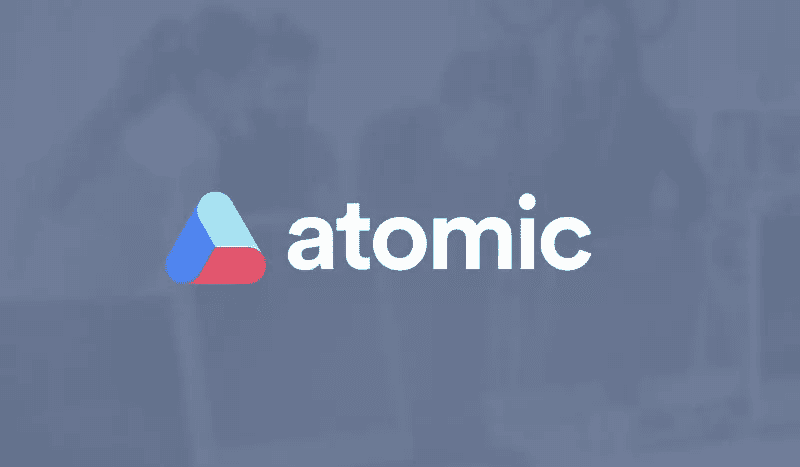
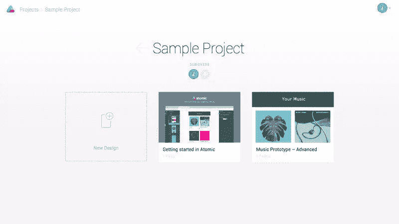
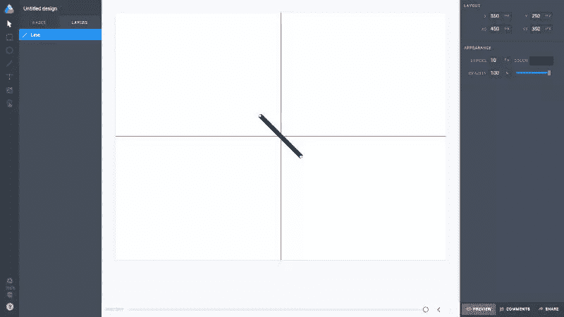
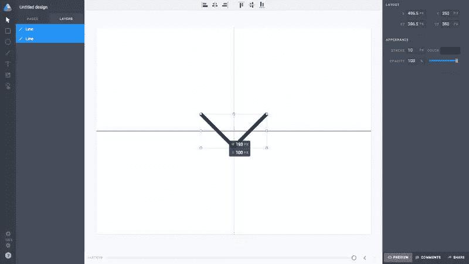
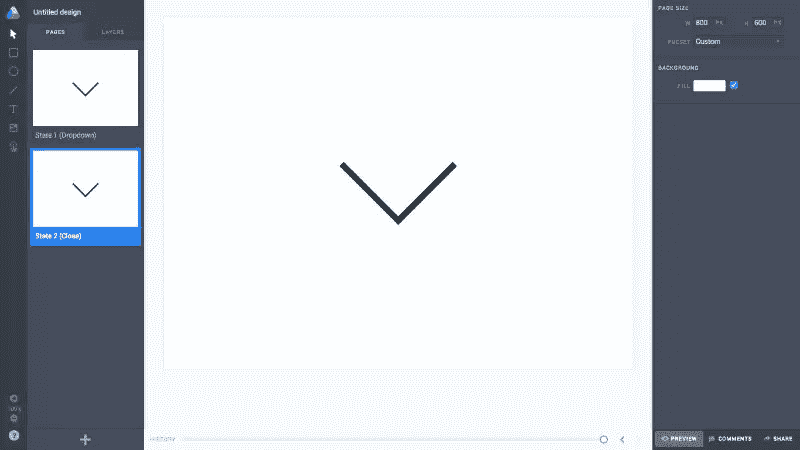
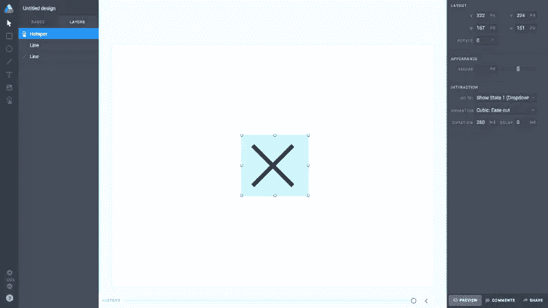
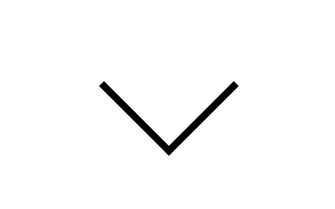

# 原子:设计漂亮交互的更快方法？

> 原文：<https://www.sitepoint.com/atomic-fastest-way-design-beautiful-interactions/>

交互设计是对用户在网络上的行为做出逻辑反应的艺术。无论你是交互专家，用户体验顾问，还是技术全面的网页设计师，你都有责任决定网页元素如何对交互做出反应，并与开发团队沟通，即使你并不十分了解他们将使用的技术。

但是最快的方法是什么，而不是走到你的开发人员桌前，做疯狂的手势？

另外，如果你远程工作呢？

Atomic 终于在上周发布了测试版，这是收集互动想法并将其发送出去的最快方式。

## 原子之前

FramerJS 、 [Origami](https://origami.design/) 和 [Pixate](http://www.pixate.com/) 已经是我们可以使用的一些工具了，但是我们并不总是想要编码我们的交互或者在本地设备上测试它们，不是吗？

Atomic 快得惊人，如果你来自一个素描应用背景，那就更好了。它模仿相同的键盘快捷键，具有相同的直观捕捉功能，老实说，我感觉就像是在使用 Sketch，只是具有原型交互的能力。

## 入门指南

准备好开始了吗？这只需要你几分钟的时间。前往 atomic 网站，注册测试版，并在*项目*屏幕选择“新设计”。在这个小教程中，我们将在点击交互时将下拉箭头转换为关闭图标。

## 创建第一个状态

按“L”启动一条简单的*线*。

*其他快捷键是“S”代表选择，“R”代表矩形，“O”代表椭圆形，“T”代表文本，“I”代表图像，“H”代表热点。*

拖动时可以按住“Shift”来创建完全精确的 45 度角；要向前跳几步，X、Y、X2 和 Y2 应分别为 350、250、450、350，还要确保“行程”为 *10px* 。

按“D”复制*复制*并输入一组新的坐标:453、250、443 和 350。我们现在有了下拉图标，但我们需要它居中对齐。看到左边的层了吗？按住 *Shift* 的同时单击两条线，并将两条线一起拖动到画板的中心。当红色自动对齐线出现时，您就知道您已经找到了。

我们创造了第一个国家。

## 创建第二个状态

点按“层”边栏中的“页面”；点击卡片上的“第 1 页”，将其重命名为更相关的名称，如*状态 1(下拉菜单)*。点击同样在卡片上的汉堡菜单图标，复制我们的第一个状态——然后将副本重命名为*状态 2(关闭)*。

切换回“层”并选择最右边一行；向左拖动它，直到下拉图标类似关闭图标。重复多层选择步骤(按住 *Shift* ，同时选择两个层，以防您忘记)，并再次拖动到画板的中心。

## 创建互动热点

这就是奇迹发生的地方。按“H”创建一个*热点*。因为我们只对单个交互进行采样，热点可以是你想要的任何大小，只要它完全覆盖我们图标的尺寸。

创建热点后，会出现一组新的选项。在“交互”标题下，选择第一个状态作为“转到”选项。选择“立方体:渐出”作为动画类型。Atomic 能够处理复杂得多的交互，但是为了本教程的缘故，我们将保持它的简单，并对其他选项使用默认值。

## 预览交互

现在切换回另一个状态，重复这一步。准备好之后，单击窗口右下角的“预览”按钮，然后单击离开。你应该看到的是你的下拉图标变成一个关闭图标。

## 分享您的互动

两个国家互动——[https://beta.atomic.io/d/1rwK6IQhwha#](https://beta.atomic.io/d/1rwK6IQhwha#%22)

如果你实际上没有遵循这个教程，那也没关系…我会给你发一个链接！在右下角“预览”按钮旁边，单击“共享”。

复制链接，然后简单地发送给你喜欢的任何人，无论你喜欢什么方式。这是我们刚刚制作的动画。在你发出互动的链接后，用户可以对其进行评论并提供反馈。

真的就这么简单！

## 结论

无需下载应用程序或编写一行代码，我就能模拟出下拉图标如何变成关闭图标。这个用例是一个下拉菜单，只有当图标被点击时才会出现，而不是在悬停状态时意外触发。

但是当然下拉菜单需要一个关闭图标，因此是我交互想法的用例。我说过你可以复制我的互动并编辑它吗？我要求你设计下拉菜单，并向*演示*它到底是如何下拉的。

## 分享这篇文章