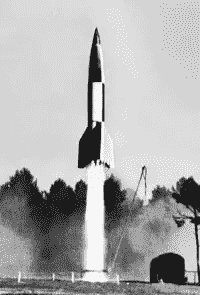
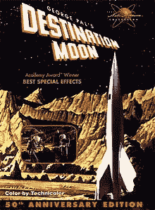

# 复古火箭和知识产权律师

> 原文：<https://www.sitepoint.com/retro-rockets-ip-lawyers/>

照片:peelandstick 2007

我为 SitePoint 设计了很多书的封面——大部分都没有发生意外——但在 2008 年，我们确实有过一个不舒服的时刻。

我的任务是设计一本新的 PHP 书籍的封面，我认为一组闪亮的彩色火箭——红色、绿色和蓝色——可能会是一个不错的外观。有趣，闪亮，有点复古的想法。

我搜罗了一些大的、有声望的图片网站，最终购买了一个红色方格火箭的 3D 渲染图(类似于上面的那个)。经过一点 Photoshop 的劝说，我在构图中加入了绿色和蓝色的火箭，没多久，瞧！我们有一本书，封面很漂亮。

故事结束了——至少我们是这样认为的。

大约 10 个月后，我们收到了一封来自一家代表丁丁授权帝国的法律公司的信，要求赔偿因产品侵权造成的经济损失。

这让我们有些震惊，因为:

a)。在对丁丁知之甚少的情况下长大，这个火箭对我们来说只是一个“普通的火箭”。事实上，在最初的 24 本《丁丁历险记》中，只有两本以火箭为主题，所以你可以很容易地读到一些《丁丁历险记》,而不必碰到火箭。

b)。我们从地球上最大的股票网站之一购买了这张图片(没有名字，但是你知道他们)。

检查股票网站，火箭图像和任何类似的图像已经消失了——大概是在类似的信件之后。

当时，我们寻求法律建议，并最终达成协议，从后续书籍中删除了该图像。

#### 满足 moulinsart sa

经过一点调查后发现，总部位于比利时的 Moulinsart SA 公司控制着丁丁的版权，该公司以对任何他们认为侵犯了丁丁知识产权的人穷追不舍而闻名。

这些年来，这包括许多丁丁粉丝俱乐部、网站和杂志，这使得该公司在许多丁丁最大的粉丝中特别不受欢迎。

但正如他们所说，谨慎是勇气的一部分，而穆林萨特是一个数百万美元的企业，习惯于为所欲为。

#### 火箭科学的艺术

我认为尝试了解红色火箭设计诞生的世界可能会很有趣。根据丁丁的传记作者，丁丁的作者，Georges Prosper Remi (Hergé) 的说法，丁丁最初是受到最近战争中德国 V2 火箭计划的启发。

事实上，[目的地月球](http://en.wikipedia.org/wiki/Destination_Moon_%28comics%29)开始于微积分教授测试一个更像导弹的火箭原型。

V2 的“飞行炸弹”是 20 世纪 40 年代的尖端技术，因此原型被涂上了黑白方格图案，以使高速电影分析更容易。埃尔热在他的作品中延续了方格图案。

)

目的地月球——1950 年

20 世纪 40 年代末，太空探索在大众的想象中真正火了起来——尤其是在电影和漫画中。1948 年，乔治·帕尔开始制作一部早期的经典科幻电影，名为《对了，目的地月球》。

这部电影获得了奥斯卡最佳特效奖，编剧是科幻巨匠罗伯特·A·海因莱因(Starship Troopers)，他将自己早期的[火箭飞船伽利略(T3)的部分内容改编成了电影。如果你愿意，你可以在 Dailymotion](http://en.wikipedia.org/wiki/Rocket_Ship_Galileo "Rocket_Ship_Galileo") 上观看《T4》。

虽然今天看起来可能有点天真，但在《目的地月球》的布景、服装和特效的制作上，是不惜花费的。当时，这无疑是电影中对太空旅行最科学准确的描述。这部电影在当时非常轰动。它甚至有一个木质啄木鸟序列来解释太空旅行的科学。

事实上，Youtube 上有一个迷人的 KTLA 电视直播，来自目的地月球的场景，两名主持人在参观摄影棚时采访了演员和工作人员。有一次，乔治·帕尔不得不纠正一位主持人，因为他随口说了一句登月任务是“幻想”。

后来，鲍勃·海因莱茵就事论事地告诉这位仍心存疑虑的主持人，除了投资，没有什么能阻止登月工作。这段录像确实让你了解了 1949 年公众对太空旅行的看法。

尽管《丁丁历险记》的第一部(1950 年 3 月)在电影正式发行(1950 年 6 月)前三个月出版，但故事片的筹备时间更长，埃尔热的传记作者菲利普·戈丁说埃尔热对这部电影非常感兴趣，并获得了发行前的剧照。

每个人都有影响和灵感。这没什么不好。

### 但是等等。有一个转折…

本周，法院裁定埃尔热事实上早在 1942 年就已经将丁丁的版权转让给了他最初的出版公司。

法院的判决意味着 Moulinsart ***从未拥有*** 他们一直极力主张的任何权利。

根据海牙法院的裁决:

> 从一份 1942 年的文件来看，埃尔热似乎将《丁丁历险记》的出版权给了出版商卡斯特曼，所以穆林萨特无权决定谁可以使用书中的内容。

### 你为什么要告诉我们？

知识产权是一个以某种方式影响我们所有人的领域。我们都在消费知识产权——音乐、电影、印刷品、软件和时尚——我们大多数人也以某种方式生产知识产权，因此它永远不会停止发挥作用。我们所有人都有责任寻找公平和闹剧之间的界限。

当然，不管我是做了一个小而有力的握拳动作，还是发出嘶嘶声“是啊！…‘当我读到关于穆林萨特的决定时，人们总是会猜测。

但我肯定有人在某个地方做了。

## 分享这篇文章