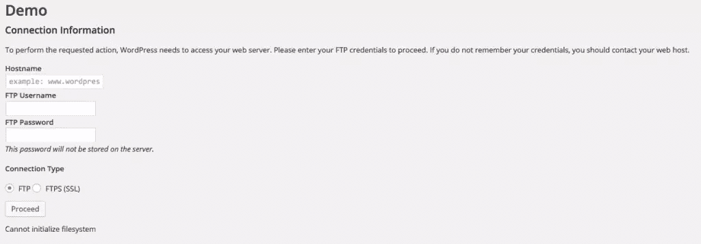
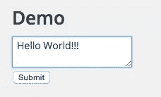
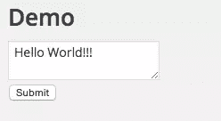

# WordPress 文件系统 API 简介

> 原文：<https://www.sitepoint.com/introduction-to-the-wordpress-filesystem-api/>

写入本地文件是许多插件和主题出于各种目的需要的功能之一。安全性是插件和主题在写入本地文件系统时必须考虑的最重要的问题。WordPress 运行在各种主机服务和配置上，因此开发者很难创建访问本地文件系统的插件和主题，以便在不损害安全性的情况下在各种不同的环境中工作。

在本教程中，我们将学习如何使用 **WordPress 文件系统 API** 来访问本地文件系统，它负责正确的文件权限。在这个过程中，我们将创建一个插件，它在管理页面中显示一个带有文本区的表单，并将文本区的内容保存到一个文件中。

## 为什么使用 WordPress 文件系统 API？

您可能想知道为什么我们不仅仅使用 PHP 的文件系统函数来读写本地文件，而是学习和使用一整套新的 API？

使用 PHP 文件系统 API 的问题是它不会自动处理文件权限。假设你正在使用一个共享主机服务来托管你的 WordPress 站点，并且你的主机服务器作为“管理员”操作系统账户运行。每当您使用 PHP 创建文件时，它们都属于“admin”用户。因此，在同一共享主机中托管的任何其他网站也可以访问您的网站文件，因为他们也作为“管理员”用户运行，对您的网站构成了安全问题。为了避免这个问题，您需要使用 PHP 手动更改文件所有者和权限。

但是，当您使用 SSH 或 FTP/SFTP 登录来创建文件时，这些文件属于您登录时使用的操作系统用户帐户。如果 FTP 服务器以“admin”用户身份运行，而您以“narayanprosty”用户身份登录，那么新创建的文件的所有者将是“narayanprosty”，而不是“admin”。

WordPress 引入了**文件系统 API** ，它可以自动处理文件权限。文件系统 API 在 WordPress 2.6 中发布。WordPress 实际上发布它是为了支持它的插件、主题和核心更新系统，但是后来插件和主题开始使用它来达到他们自己的目的。

## 文件系统 API 是如何工作的？

文件系统 API 可以使用系统调用(即直接、ftp、ftp 套接字或 ssh2)写入文件系统。它根据哪种方法创建的文件具有适当的文件权限以及哪种 PHP 扩展可用来选择其中一种方法。文件系统 API 首先检查`direct`方法，然后是`ftp`，最后是`ssh2`。

使用 FTP 或 SSH 时，您需要从您的用户那里获取凭证。文件系统 API 提供的函数使得显示一个获取凭证并存储它们的表单变得更加容易。

## 创建我们的插件文件和目录

现在让我们创建一个插件，它在页面中显示一个文本区，提交表单会将文本区的内容保存到一个本地文件中。

下面是我们插件的目录结构:

```
--filesystem
	--filesystem.php
	--filesystem-demo
		--demo.txt
```

在 WordPress 安装的`wp-content/plugins`目录下创建这些文件和目录。

要使插件可安装，将这段代码放在`filesystem.php`文件中:

```
<?php

/*
Plugin Name: Filesystem API
Plugin URI: http://www.sitepoint.com
Description: A sample plugin to demonstrate Filesystem API
Version: 1.0
Author: Narayan Prusty
*/
```

现在访问你的管理面板并安装插件。

## 创建管理页面

接下来，我们需要在我们的管理页面，我们的例子将居住。下面是创建这个页面并显示文本区域的代码。只需将这段代码放在`filesystem.php`文件中:

```
function menu_item()
{
  add_submenu_page("options-general.php", "Demo", "Demo", "manage_options", "demo", "demo_page"); 
}

add_action("admin_menu", "menu_item");

function demo_page()
{
  ?>
      <div class="wrap">
         <h1>Demo</h1>
         <form method="post">
          <?php
            $output = "";

            if(isset($_POST["file-data"]))
            {
              $output = write_file_demo($_POST["file-data"]);
            }
            else
            {
              $output = read_file_demo();
            }

            if(!is_wp_error($output))
            {
            	?>
            		<textarea name="file-data"><?php echo $output; ?></textarea>
		          	<?php wp_nonce_field("filesystem-nonce"); ?>
		          	<br>
		          	<input type="submit">
            	<?php
            }
            else
            {
              echo $output->get_error_message();
            }
          ?>
         </form>
      </div>
   <?php
}
```

代码是这样工作的:

*   首先，我们在“设置”菜单中添加了一个页面。`demo_page`是显示页面内容的回调。
*   在页面内部，我们显示了一个带有文本区域和 nonce 字段的 HTML 表单。还有一个提交按钮来提交表单。文本区名称为`file-data`。添加随机数是为了防止 CSRF 攻击 T2。
*   当页面打开时，我们使用`read_file_demo`函数检索存储的文件数据。当提交表单时，我们使用`write_file_demo`函数将文本区的内容存储到一个文件中。
*   如果`read_file_demo`或`write_file_demo`返回一个`WP_Error`对象的实例，那么我们将显示一条错误消息。

注意，上面的代码会破坏你的 WordPress 站点，因为我们还没有创建`read_file_demo`和`write_file_demo`函数。让我们现在就创建它们吧！

## 写入文件

下面是我们的`write_file_demo`函数的实现:

```
function connect_fs($url, $method, $context, $fields = null)
{
  global $wp_filesystem;
  if(false === ($credentials = request_filesystem_credentials($url, $method, false, $context, $fields))) 
  {
    return false;
  }

  //check if credentials are correct or not.
  if(!WP_Filesystem($credentials)) 
  {
    request_filesystem_credentials($url, $method, true, $context);
    return false;
  }

  return true;
}

function write_file_demo($text)
{
  global $wp_filesystem;

  $url = wp_nonce_url("options-general.php?page=demo", "filesystem-nonce");
  $form_fields = array("file-data");

  if(connect_fs($url, "", WP_PLUGIN_DIR . "/filesystem/filesystem-demo", $form_fields))
  {
    $dir = $wp_filesystem->find_folder(WP_PLUGIN_DIR . "/filesystem/filesystem-demo");
    $file = trailingslashit($dir) . "demo.txt";
    $wp_filesystem->put_contents($file, $text, FS_CHMOD_FILE);

    return $text;
  }
  else
  {
    return new WP_Error("filesystem_error", "Cannot initialize filesystem");
  }
}
```

代码是这样工作的:

*   首先，我们在函数中引用了全局`$wp_filesystem`对象。这个对象是`WP_Filesystem`类的一个实例。它负责公开读取、创建、写入和删除文件的各种方法。
*   接下来，我们将创建表单页面的一个 nonce URL 和一个包含表单字段名的数组。
*   最后，我们使用`connect_fs`函数连接到文件系统。
*   `connect_fs`使用 WordPress 提供的[request _ file system _ credentials](https://codex.wordpress.org/Function_Reference/request_filesystem_credentials)函数找到一个合适的方法来连接文件系统(直接、FTP 或 SSH)。在 FTP 或 SSH 的情况下，它将回显一个表单，要求用户提供凭证。在直接方法的情况下，它只是返回 true。
*   当 textarea 表单被提交并且`request_filesystem_credentials`选择 FTP 或 SSH 方法时，我们显示凭证表单并隐藏凭证表单中的`file-data`字段。
*   函数的第一个参数是一个 URL，一旦它获得了正确的凭证，就重定向到这个 URL。重定向属于 POST 请求类型。`request_filesystem_credentials`最后一个参数是要发送到重定向 URL 的域名数组。
*   提交凭证表单后，它会重定向回原始表单提交 URL，其中包含正确的字段名称和用户输入的值。
*   同样，整个过程开始，我们执行`write_file_demo`。这次`request_filesystem_credentials`有凭证，因此它将简单地返回 true。
*   然后我们用`$wp_filesystem->find_folder`来引用这个文件夹。然后我们构建`demo.txt`文件的完整路径。
*   我们使用`$wp_filesystem->put_contents`将数据写入文件。

注意:如果您试图使用`$wp_filesystem`对象的方法而不请求和验证凭证，那么它们将不起作用。

## 读取文件

下面是`read_file_demo`函数的实现。

```
function read_file_demo()
{
  global $wp_filesystem;

  $url = wp_nonce_url("options-general.php?page=demo", "filesystem-nonce");

  if(connect_fs($url, "", WP_PLUGIN_DIR . "/filesystem/filesystem-demo"))
  {
    $dir = $wp_filesystem->find_folder(WP_PLUGIN_DIR . "/filesystem/filesystem-demo");
    $file = trailingslashit($dir) . "demo.txt";

    if($wp_filesystem->exists($file))
    {
      $text = $wp_filesystem->get_contents($file);
      if(!$text)
      {
        return "";
      }
      else
      {
        return $text;
      }
    } 
    else
    {
      return new WP_Error("filesystem_error", "File doesn't exist");      
    } 
  }
  else
  {
    return new WP_Error("filesystem_error", "Cannot initialize filesystem");
  }
}
```

下面是代码的工作原理:

*   在读取`demo.txt`文件时，我们首先使用`request_filesystem_credentials`函数连接到文件系统。
*   这次我们没有在最后一个参数中传递任何表单字段，因为表单没有被提交。我们只是传递重定向 URL，以便一旦检索到凭据，它就会被重定向。
*   然后我们使用`$wp_filesystem->exists`函数检查文件是否存在。如果文件不存在，我们会显示一个错误。否则，我们将使用`$wp_filesystem->get_contents`函数读取文件并返回内容。

假设 WordPress 选择了 FTP 作为创建文件的合适方法，下面是整个过程的截图:

首先，当我们打开演示页面时，我们会看到以下表单:



在这里，我们需要输入 FTP 或 FTPS 凭证并提交它。提交后，我们会看到以下表单:



显示了一个空的文本区域。输入文本“Hello World！！!"提交表单。您将再次看到凭据表单。


你必须再次填写，因为 WordPress 默认情况下不存储 FTP 密码(你可以在 wp-config.php 这样做，稍后会详细介绍)。所以每次你的插件需要与文件系统一起工作时，它必须询问凭证。现在提交它将重定向回带有之前提交的字段名和值的重定向 URL。下面是文本区的显示方式:



在这里，我们读取文件的内容并显示它。

## `$wp_filesystem`对象的其他方法

`$wp_filesystem`对象提供了许多其他方法来对文件和目录执行各种其他操作。我们刚刚看到读写 n 文件。你可以在 [WP_Filesystem_Base()文档](https://developer.wordpress.org/reference/classes/wp_filesystem_base/)页面找到你能做的事情的完整列表。

让我们来看看一些重要的例子:

*   **$wp_filesystem- >删除** : `delete`用于删除一个文件或目录。您需要传递一个表示路径的字符串。
*   **$ WP _ file system->mkdir**:`mkdir`用于创建目录。它接受一个表示父目录的字符串。
*   **$ WP _ file system->move**:`move`用于移动文件，它有两个参数，第一个是文件的路径，第二个是文件移动到的目录。
*   **$ WP _ file system->size**:`size`返回文件的大小，以字节为单位。您需要传递文件的路径。
*   **$ WP _ file system->chmod**:`chmod`用于改变文件的权限。它有三个参数，即文件路径、许可八进制数和表示递归的布尔。

你可以使用`$wp_filesystem->method`公共属性找到 WordPress 使用哪种连接方法来访问文件系统。

## 永久存储凭据

我们看到 WordPress 不会永久保存 FTP 或 SSH 凭证。一遍又一遍的问细节，不太用户友好。有一种方法可以使用`wp-config.php`文件永久存储凭证。

使用这些选项存储 FTP 和 SSH 凭据:

*   **FTP_HOST** :服务器的主机名。
*   **FTP_USER** :连接时使用的用户名。
*   **FTP_PASS** :连接时使用的密码
*   **FTP_PUBKEY** :使用 SSH2 连接时将使用的公钥的路径。
*   **FTP_PRIKEY** :使用 SSH2 连接时将使用的私钥的路径。

## 结论

在本文中，我们看到了使用 WordPress 文件系统 API 设计访问我们的文件系统的管理页面的过程。如果您试图在后台进程中访问一个文件系统(比如使用 cron 作业)，那么就不可能在需要时显示凭证表单，在这种情况下，您需要确保通知您的用户将凭证常量放在`wp-config.php`文件中。您可以继续使用这个 API 进行进一步的实验，并在下面与我们分享您的经验。

## 分享这篇文章