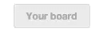
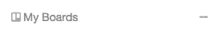
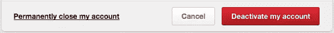
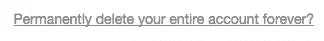
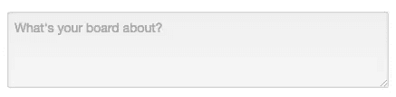
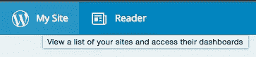

# 通过询问“房间里还有谁？”来编写更好的用户界面

> 原文：<https://www.sitepoint.com/better-user-interfaces-copy/>

图片来源:贝弗利·古德温

在用户体验社区中有一个争论，关于用户界面是否应该说“**你的账户**或者“**我的账户**来指代用户的账户。行动号召应该是“**创建您的帐户**”还是**创建我的帐户**？

Pinterest 和 Trello 都是使用“公告板”的社交网络应用，看看它们有什么不同吧！

*   

    Pinterest: **你的**板按钮

*   

    Terreiro: **My** button

然而，当需要删除你的账户时，他们会交换条件:

Pinterest:停用我的账户

特雷罗:永久删除你的整个账户？

有趣的是，他们同意提示:

*   

    Pinterest: What is your section about?

*   Terreiro: What are you planning?

那么你该如何决定呢？一个技巧是考虑谁在房间里，谁在说话。

## 除了用户，房间里没有其他人

如果房间里没有其他人，完全跳过资格赛。一点都不含糊。也就是说，如果你的用户没有理由认可你的品牌或其他任何人，想象他们在一个空房间里。如果在这个空房间的桌子上有一个包装好的礼物，他们知道这是给他们的，不需要礼物标签和他们的名字。

当您避免使用限定词时，您将受益于使用区别性词语而不是“您的”或“我的”来前置加载界面副本。例如，“隐私设置”在“帐户”中比“我的帐户”中的“我的隐私设置”更突出。这使得你的用户界面更容易浏览。它也减少了用户理解他们所看到的并采取下一步行动(也许，购买你的产品)的时间。

## 两个人的公司——网站和用户

仅当您需要区分用户和网站说话时，才使用“您的”或“我的”:

*   网站在说话的时候，用“你的”。
*   用户在说话的时候，用“我的”。

在第一种情况下，网站可能会与以下人员“对话”:

*   通过页面标题和标签引导用户
*   提供内容
*   告诉用户他们的内容
*   告诉用户出现了一个错误，以及这个错误对他们的影响
*   提供帮助和说明
*   报价文件

(这通常通过某种标签来表示——页面标签、表单标签、按钮标签——所以为了简单起见，我们将这种类型的对话框称为标签。)

在第二种情况下，用户在执行动作时“说话”。也就是说，用户通过以下方式让网站知道他们想要什么:

*   按下按钮
*   单击菜单项
*   输入数据
*   选择过滤器
*   否则做出选择并命令网站

(为简单起见，我们将重点讨论按钮。)

因此，“我的”在*动作*中是合适的。

当有多个声音时，使用“你的”或“我的”可以消除关于谁在说话和他们在称呼谁的模糊性，但是，你仍然不需要在任何时候都使用这两个词。假设总是有一个人在说话，那么当你需要区分网站和用户时，可以加上限定语“你的”或“我的”。

如果默认是用户在说话，您需要指定网站何时插话:

*   网站:“您想购买免费礼品包装吗？”(标签)
*   用户:“添加礼品包装”(按钮)——而不是“包装我的礼物”

*   网站:“您的客户”(标签)
*   用户:“联系客户”(按钮)—而不是“联系我的客户”

如果默认是网站在说话，您需要指定用户何时大声说话:

*   网站:“礼品包装”:(标签)——而不是“包装你的礼物:”
*   用户:“包装我的礼物”(按钮)

*   网站:“客户:“(标签)”—而不是“您的客户:”
*   用户:“联系我的客户”(按钮)

你强调网站的声音还是用户的声音，可能取决于你的产品或者服务。一个健谈的、吸引人的品牌会大量使用“你的”。或者，在个人环境中，品牌可能希望隐藏他们的存在。例如，考虑这些按钮:

*   “检查我的银行余额”
*   “更新我的医疗记录”
*   "创建我的帐户"

不要说“让我们看一下你的医疗记录”来引起房间里其他人的注意很尴尬。

如果你决定强调两种声音来突出交互和创造社交体验，我想强调一个特殊的复杂因素:结合标签和按钮，混合声音。让我们看两个例子。

首先，导航链接有时被视为表明用户意图的按钮，例如，在主导航菜单中单击“我的东西”以“转到我的东西”。接下来的一页被标为“你的东西”。在此页面上，您可以看到“我的资料”导航按钮和“您的资料”页面标签。总之，这似乎是不一致的:

WordPress 可以说“你的网站”或者用有问题的网站的名称(当你点击按钮时，这是后续页面的页面标签)来标记，而不是提供一个标有“我的网站”的按钮。

将导航链接视为一个向用户显示其位置的标签，并在用户点击导航时视为一个按钮，将网站的声音和用户的声音结合到一个按钮中。

其次，社交媒体按钮，如“在 Twitter 上关注我”，通常表达了用户执行某个操作的意图，尽管是以网站的声音说话。然而，这种措辞比用户点击“我想在 Twitter 上关注你”或“在 Twitter 上关注他们”更有意义。“在 Twitter 上关注我”中使用的约定类似于网站询问“你愿意在 Twitter 上关注我吗？”而用户回答“是”，这里的问题和答案被浓缩成一个按钮。

要处理这些情况，请使用网站的声音编写按钮的文本。这避免了页面和导航标签之间的明显不一致，也符合社交媒体按钮的惯例。或者，将标签和动作从一个按钮中分离出来。

与此同时，你只需要在网站可以有效地说话时区分声音。当网站没有自己的“会员”时，没有必要给用户提供“更新我的会员”按钮。同样，显示“你的购物车:”通常是不必要的，因为网站没有自己的购物车，用户不知道其他用户的购物车里有什么。“手推车”就可以了。

## 三个人太多了——很多用户

当你的用户通过你的网站与其他用户互动时，坚持上面的指导方针——标签用“你的”，按钮用“我的”——并扩展这个概念来表达其他用户的声音。

*   标签:“您的照片:”和“您朋友的照片:”
*   按钮:“标记照片”(让您标记任何照片；请注意它是如何故意含糊不清)、“标记我的照片”和“标记我朋友的照片”

假设你是一个业务系统的管理员。你负责:系统功能，使用系统的管理者或员工，系统的最终用户，以及你如何使用系统。您可能会看到:

*   "系统设置:"
*   "人员设置:"
*   "用户设置:"
*   "您的设置:"

在“五线谱设置:”中，您可能会看到一个“更新五线谱设置”按钮。在“您的设置:”中，您可能会看到“更新我的设置”。

过了一点，如果你的用户可以控制别人的东西，你就需要开始使用名字了。例如，如果您有一个共享帐户，“我的”可以指帐户中的任何人:

> 网飞的首席 UI 工程师 Bill Scott(他自己也是一个著名的模式专家)告诉我，在网飞，他们避免使用“你的”，而更喜欢“比尔的推荐”他们的理由是，它传达了个性化(就像“你的”和“我的”应该传达的一样)，它还澄清了“这是你而不是你的孩子(当在一个家庭中使用多个配置文件时)。”但话说回来，对大多数人来说，网飞可能更多的是个人效用，而不是社会环境。—设计社交界面:你的与我的

同样，礼品卡可能是“你的礼品卡”，因为你买它是为了送给别人；也可能是“你的礼品卡”，因为它是给你花的。使用名字可以消除歧义。

作为众多系统管理员中的一员，你可能会看到“谢尔顿的设置”并点击“更新谢尔顿的设置”按钮。

## 结论

综上所述，如果不是绝对需要使用“你的账户”或者“我的账户”，那两个都不要用，用:“账户”。如果你一定要用“你的”或“我的”来表示谁在说话，那就用“你的”来表示标签，尽量少用“我的”来表示按钮。如果界面是私有的或个人的，使用“我的”作为按钮，少用“你的”作为标签。如果有很多用户，称呼他们的名字。

如果所有这些都失败了，坚持下去！

## 分享这篇文章