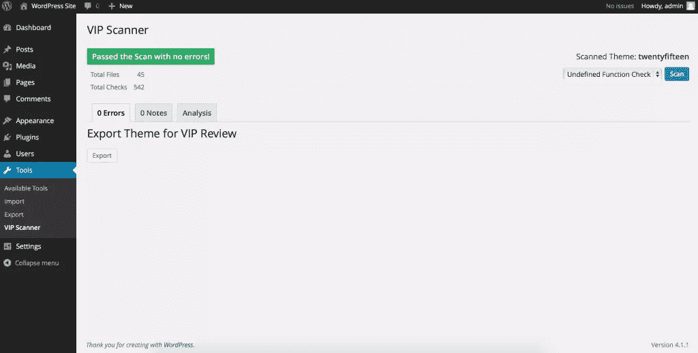
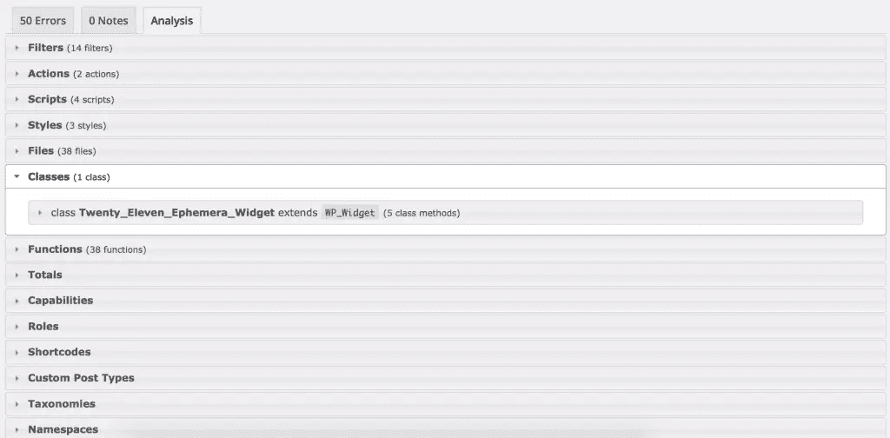

# 用 VIP 扫描仪提高你的 WordPress 主题质量

> 原文：<https://www.sitepoint.com/improve-wordpress-theme-quality-vip-scanner/>

安全是一个重要的话题。

安全是每个人的问题。特别是，如果你是一名开发人员，你应该对你创造的东西负责。即使你刚开始是 WordPress 用户或开发者，你也应该确保你为客户建立的网站尽可能的安全。

绝对安全是不存在的。

引用 Bruce Schneier 在《应用密码学》一书中的话:

> 世界上唯一安全的计算机系统被拔掉了插头，锁在海底的一个地下室里，只有一个人知道那个地下室的位置和密码。他已经死了。

你可能听说过，甚至像脸书、微软、Adobe 和谷歌这样的大公司也有股票安全问题。这些公司有许多只处理安全问题的开发人员和专门团队，但事情仍然会出错。

希望大家没有忘记索尼用明文密码的事件。如果您正在开发任何东西，请不要以纯文本形式存储密码，不要这样做。

## 安全和 WordPress

有许多工具可以帮助您更好地强化应用程序。有些很笼统，有些很具体。WordPress 也有这样的工具。对于 WordPress 网站来说，主题质量是网站整体安全性的重要组成部分。在这方面有一个插件可以帮助你，那就是 VIP 扫描仪。VIP 扫描仪插件是 VIP 扫描仪库的用户界面。你可以在`vip-scanner`下的 plugins 文件夹中找到这个库。

我当前的本地设置使用带有机箱的 vagger，如果你也想使用它，可以看看机箱上的[这篇文章。](https://www.sitepoint.com/using-chassis-for-wordpress-development/)

安装 VIP 扫描仪有两种方法。从插件页面并通过 g it 手动安装在插件文件夹中。首选的方法是通过 git 安装它。这是因为 [VIP 扫描仪插件页面](https://wordpress.org/plugins/vip-scanner/)只有旧版本(v0.7)可用，而 [GitHub repo](https://github.com/Automattic/vip-scanner) 是 v0.8 版本。这个插件的开发者也更喜欢 git 的方式。要安装插件，请在插件文件夹中导航并执行:

```
git clone https://github.com/Automattic/vip-scanner.git vipscanner
cd vipscanner
git submodule update --init --recursive
```

第一个命令将下载插件。第二个将导航到我们新克隆的目录。第三个将克隆所有的子模块(PHP-Parser)。

现在，导航到你的 WordPress 仪表盘并激活插件。要查看这个插件的运行，导航到工具> VIP 扫描仪。

在那里，您会发现 3 种不同类型的扫描选项:

*   未定义的函数检查
*   wp.com 主题评论
*   VIP 主题回顾

当您第一次使用该工具运行扫描时，它将使用当前活动的主题-值得一提的是，该工具仅处理主题。每种类型的扫描都是不同的，当你开发 WordPress 主题并关心代码质量时(每个人都应该这样)，这很方便。

你也可以将这个工具与 [WP-CLI](http://wp-cli.org) 配合使用，你可以查看[VIP 扫描仪文档](https://github.com/Automattic/vip-scanner#wp-cli)了解更多信息。

当你扫描一个主题(活动主题)时，你会发现各种各样的问题。第一种扫描类型(未定义的功能检查)顾名思义。它扫描整个主题目录寻找未定义的函数。这是基本的扫描，你应该在你开发的每个主题上使用它。另外两个更具体。第二种扫描类型(wp.com 主题评论)在您为社区开发主题时使用。第三次扫描仅用于 [WordPress VIP](https://vip.wordpress.com) 。

现在我们对 VIP 扫描仪有了一点了解，让我们来玩一玩吧！让我们浏览一下 WordPress 预装的官方主题(最新的主题)。第一次扫描(未定义的函数)不会抛出任何错误。第二个将显示一些错误(主要是警告)。有 3 个部分用于扫描、错误、注释和分析。第一个是显示错误的部分，第二个是警告，第三个是一个很好的方式，我们可以在那里找到关于主题结构的更多信息。像类的数量、函数和作者细节这样的信息。





即使是官方的 WordPress 主题，我们也发现了一些错误。其中大多数是:

> 主题使用@package WordPress。这是为 WordPress 核心文件保留的。

这是因为你不应该在你的任何主题中使用@package WordPress(尽管是官方的 WordPress 主题)。

现在用这个工具扫描更多的主题。当你为客户开发你自己的主题(甚至是评论)时，这个工具是非常强大的。如果你正在写你自己的主题，采取小步骤，然后浏览。这样你就不太可能把事情搞砸。此外，您可以在开发的早期阶段发现 bug，这样可以节省时间。

## 不好的部分

总的来说，我发现 WordPress 最令人沮丧的一点是缺乏高质量的代码。VIP Scanner 做得很好，从提交、拉请求和[问题](https://github.com/Automattic/vip-scanner/issues)来看，它告诉我们它正在积极开发中，这很好。我希望看到的是使用 git 子模块进行依赖管理的项目。包装家和作曲家就是为此而存在的。PHP 缺乏依赖管理工具，但它们终于出现了。另外，我在代码嗅探器上遇到了一些问题。当用“VIP 主题评论”扫描主题时，我总是得到一个错误，告诉我我没有在本地安装代码嗅探器。我试图解决这个问题并安装那个工具，但是我不能让它工作。如果你发现了这一点，请留下评论。

这个工具确实缺少一些东西，主要是代码标准。但是，它是一个很好的工具，并且做得很好，所以你绝对应该在你开发的每个主题上使用它。

## 结论

在这篇文章中，我们看到了什么是 VIP 扫描仪插件，以及如何使用它来更好地强化我们的网站。这是一个很好的插件，不仅可以帮助你现有的 WordPress 网站，还可以帮助你开发你自己的主题。使用这个插件，你可以加速你的主题的开发，因为你知道你正在安心地构建它们。这是一种针对 WordPress 主题的单元测试，所以你肯定会知道事情正在以正确的方式进行。安全性来自良好的实践，这将帮助您成长为一名开发人员。

你觉得这个插件怎么样？你会考虑在你的工作流程中使用它吗？在创建主题以提高质量时，你还使用了哪些插件？

## 分享这篇文章