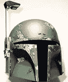
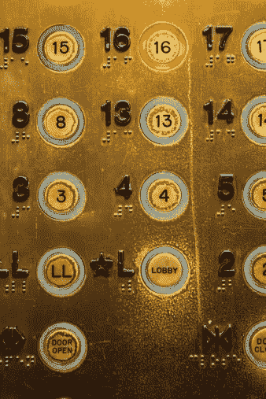
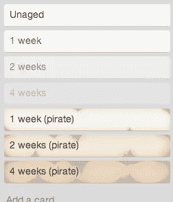

# 关于 UI 设计，波巴·费特和海盗能教会我们什么？

> 原文：<https://www.sitepoint.com/can-boba-fett-pirates-teach-us-ui-design/>

波巴·费特喜欢这种痛苦的表情

虽然最初的《星球大战》电影三部曲在许多方面都是革命性的，但描绘一个展现磨损的科幻宇宙的简单决定在当时却是一件令人惊讶的大事。

在那之前，电影中的“太空”一直都是闪亮的铬合金飞碟和轻快的库布里克风格的飞船内部。乔治·卢卡斯的世界里有太多的粘液和黏糊糊的东西，还有划痕、凹痕和叮当声。这种感觉比它应该有的更熟悉。

在我们的现实世界中，我们经常使用那些相同的磨损模式来指导我们。

例如，第一次到达一个大城市的火车站、机场或教堂，很有可能，你只需沿着地板上磨损了数百万英尺的闪亮路径，就能找到出去的路。

谁需要标牌？

或者看看旧的电梯面板，看看人们最常去的地方。

即使在咖啡馆或候诊室，你也可以简单地根据报纸的脆度从一堆报纸中挑出今天的报纸。在看到印刷日期之前，我们本能地很清楚。

相比之下，网络是一个非常干净的地方。每小时可能会有数百万人通过谷歌，而不会留下任何痕迹。它非常干净，非常实用，但即使我们可能已经去过那里数千次，也没有明显的证据证明我们过去的旅程。

有没有可能在不给我们的设计增加额外的文本混乱的情况下，给用户关于系统状态的有用提示？

### 特雷罗和海盗时代

如果你还没用过，Trello 是一个基于卡片的项目管理系统，他们最近为他们的 UI 引入了一个很好的替代方法。这是他们设置中的一个选项，他们称之为“卡老化”。

可以预见的是，所有新印制的 Trello 卡片都有干净的白色背景和清晰的深色文字。你几乎可以闻到墨水变干的味道。

但是久而久之，事情开始改变了。曾经清爽的墨水开始失去一些对比，背景变得有点暗淡。随着时间的推移，这种影响变得更加明显。

这种效应的结果是显而易见的:你的大脑不必记忆和比较日期来了解它们的年龄。就像桌子上的一碗水果，任何人一眼就能看出哪些卡是新鲜的，哪些需要你的关注。你不会*寻找*这些数据——你只是情不自禁地注意到它。

Trello 提供了一个更有趣的海盗版本，其中你的卡积累了棕褐色调和水损害，但简单的对比度调整以令人震惊的可消化和方便的格式传达了很多信息。

不幸的是，如果你想看到这个漂亮的功能，目前只有 Trello gold 用户可以使用，需要在你的设置中激活。

然而，如果你曾经不小心买了过期的面包或者读了过期的博客文章，你会发现这种类型的环境 UI 信息可以非常方便地添加到我们的前端想法中。

*最初发表于 SitePoint 设计简讯*

## 分享这篇文章