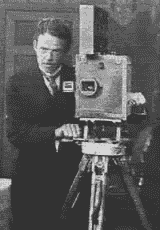
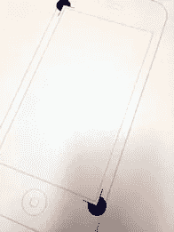
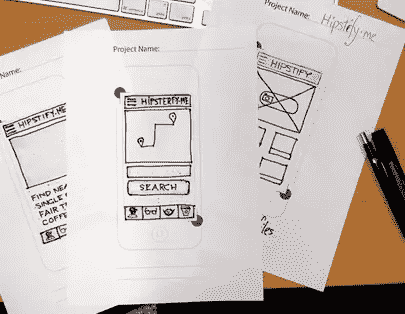
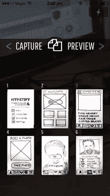
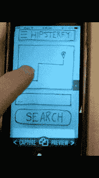
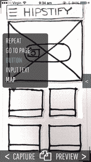
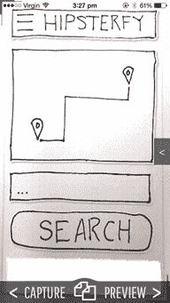

# Appseed 评论:如何使用 iPhone 制作原型

> 原文：<https://www.sitepoint.com/prototyping-appseed/>

*本文由 [Appseed](https://itunes.apple.com/us/app/appseed/id955210514?mt=8) 赞助。感谢您对使 SitePoint 成为可能的赞助商的支持。*

托马斯·爱迪生发明电影摄影机的那一天，没有人真正知道如何制作一部好电影。

在那之前，所有的摄影技术和工具都是专门为静态摄影设计的，对动态图像没有帮助。

那些第一批电影制作人需要发明全新的工具和技术，这些工具和技术更适合制作电影——比如故事板、剪辑和后来的录音。

我认为网页设计也经历了类似的转变。

前 15 年，我们在固定尺寸的页面上构建静态设计。

过去五年移动设备的爆炸式增长改变了一切，向我们的客户和同事展示静态的、固定大小的模型的想法越来越没有意义。我们不能用海报来推销电影，我们需要新的工具。

### 原型的崛起

过去两年可以被看作是原型工具的兴起。虽然从 2000 年中期开始就有了原型软件，但是这个领域随着移动设备的发展而繁荣。

今天，我将带您了解这些工具中的一种，它采用了一种略有不同的方法，即“Appseed”。

## Appseed 是什么？

Appseed 是一个原型开发工具，主要面向为移动设备设计的人。关于 Appseed，你需要知道的第一件事可能是，你不能把它安装在你的电脑上。你甚至不能通过浏览器访问它。Appseed 完全可以在你的 IOS 手机或平板电脑上运行。

这个想法是你直接在你的目标设备上设计界面和计划交互。

### 笔和纸

Appseed 模板

所有 Appseed 原型都是从专门的纸模板上的纸和笔开始的。您可以:

*   购买一本预印模板或；
*   从 PDF 打印您自己的

模板显示了一个空白的手机布局，但你也会注意到角落里的图像注册标记。这些将由应用程序使用，但我们稍后会回来。

正如你所料，你使用这些纸模板来勾画你的基本用户界面设计——这个阶段完全集中在流程和定位上，而不是颜色和细节。

为 Appseed 准备的 UI 草图

当你有了一套工作草图，事情就变得有趣了。

## Appseed 捕获

将 UI 模型加载到 Appseed 很容易。启动该应用程序会给你一个标准的实时摄像头界面，有一个明显的不同。当你将相机对准你的草图时，你会看到 Appseed 追踪我们之前提到的那两个注册标记。这给了应用程序两个“地标”来帮助自己定位。

拍摄完草图后，您可以在页面列表视图中找到它们，该视图允许您命名、预览、删除和编辑页面。

## 编辑页面

现在是有趣的部分。

在捕捉到你的草图后，Appseed 会处理每张图片，并将你的用户界面分解成独立的可操作单元。这意味着当你按住一个 UI 元素时，它会弹出来，你可以把它拖到任何你想放的地方。您甚至可以制作重复元素的多个副本。

值得一提的是，Appseed 在分离不同对象方面做得很好，但它肯定有助于在你的草图中保持它们的清晰分离。

点击任何 UI 元素都会弹出一个菜单，允许你定义它做什么。简单来说，这是一个按钮，允许你链接到页面列表中的另一个页面。然而，目前有 12 种其他 UI 元素类型涵盖了大多数常见的 UI 模式。

它们包括:

*   输入文本
*   地图
*   重复
*   按钮
*   tableview
*   登录组
*   视频组
*   音频组
*   图像传送带
*   段落
*   选项卡组
*   nav bar

这些 UI 预设可以通过提供可信的填充内容来加快速度。例如，地图组件将预设地图加载到其中。随着界面的开发，你可以通过切换到预览模式在手机上不断测试你的交互。

当你链接好网页，理顺了互动，你有几个选择。

1.  首先，你可以通过 URL 与他人分享你的原型
2.  将用户界面布局导出到 Photoshop(通过 Adobe Creative Cloud)

## 总结

我们都喜欢电影预告片，因为它们让我们在花钱买票之前真实地体验了一部电影。原型工具为我们的应用程序做同样的事情，Appseed 可能是从想法到移动屏幕的最快方式。

典型原型工具的一个潜在问题是它们产生的干净、无菌的原型。即使当你向客户解释“设计之爱”将会到来，他们也会发现很难超越那些赤裸裸的线框。

有趣的是，当你手工绘制完全相同的线框时，他们脑海中的某些东西会发出咔嚓声，他们会含蓄地理解这不是“设计”。

因此，或许 Appseed 的杀手锏是生成交互式原型的能力，这些原型可以完美地工作，同时保留一种温暖、松散的魅力，让每个人都专注于 UX 的重要决策。

它始于两年前 Kickstarter 的一个想法，并在继续发展。如果你是 iOS 用户，去看看吧。

#### Appseed 仅适用于 iOS

*   [app seed–下载(7.99 美元)](https://itunes.apple.com/us/app/appseed/id955210514?mt=8)

## 分享这篇文章