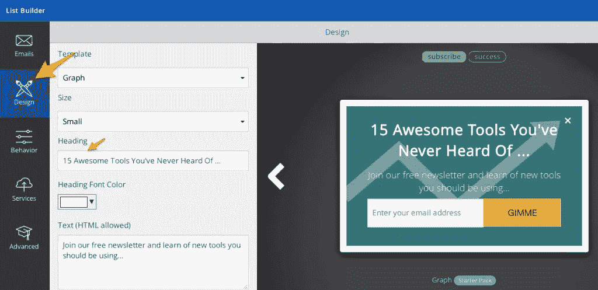
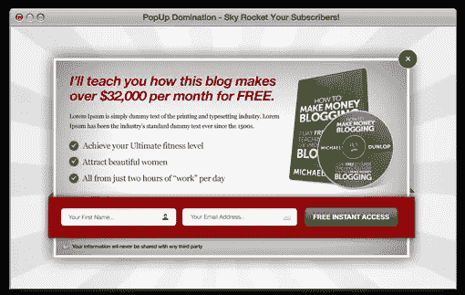
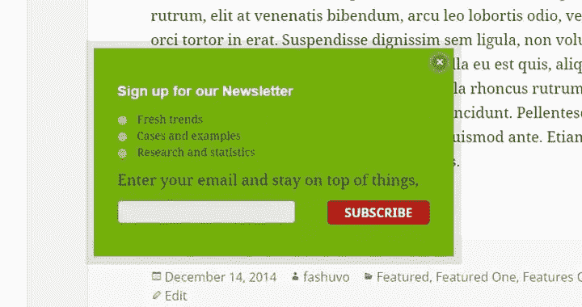
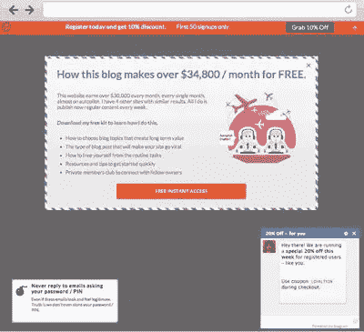
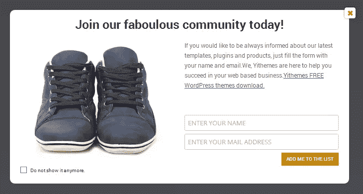

# 8 大 WordPress 弹出式插件以及为什么你应该尝试它们

> 原文：<https://www.sitepoint.com/wordpress-popup-plugins/>

通过我们的教程学习保护你的 WordPress 站点[手动轻松备份你的 WordPress 站点](https://www.sitepoint.com/premium/screencasts/backup-your-wordpress-sites-manually-and-easily)。

正如亨特·博伊尔所说，[弹出窗口就像比伯](http://www.conversionconference.com/blog/why-you-need-to-test-lightboxes-the-justin-bieber-of-email-marketing/):“你要么喜欢它们，要么讨厌它们，但最近你到处都能看到它们——因为它们仍然吸引大量人群”。

弹出窗口很好用……[真的](http://docs.aweber-static.com/pdfs/interview-social-media-examiner.pdf)，[真的](http://www.christopherspenn.com/2012/07/the-popup-is-back-again/)，[真的](http://www.problogger.net/archives/2008/10/23/how-to-drastically-increase-subscriber-numbers-to-your-email-newsletter/)很好。我还没有看到选择弹出窗口降低网站转换率的案例研究，我也见过无数弹出窗口使 CRO 高达 300%的案例研究。

如果你不相信，不要相信我的话。只需使用 WordPress 的一个弹出插件。它们又快又简单，有几个是完全免费的。

## **1 .** [**【相扑选手名单生成器】**](https://sumome.com/app/list-builder)

我开始使用 SumoMe 的 List Builder 应用程序是因为它简单易用的免费版本。这是我安装过的最简单的插件。不到 5 分钟，你的网站上就有了一个基本的 lightbox 选择弹出窗口。

它可以收集电子邮件，你可以调整它在你的网站上显示的位置，以及它显示的频率。升级到高级，弹出窗口变得完全可定制，可以访问许多模板和数据收集选项。

最重要的是，List Builder 应用程序是一整套必备营销应用程序中的一个，这些应用程序都包含在同一个 [SumoMe 插件](https://sumome.com/)中。

## **2。** [**忍者弹出窗口**](http://codecanyon.net/item/ninja-popups-for-wordpress/3476479)

忍者弹出窗口是 CodeCanyon 有史以来最畅销的插件之一…这是有充分理由的。这个插件允许你定制不同目标的弹出窗口，从电子邮件注册到视频显示到社交分享。就纯粹的可定制性而言，这是你只需 20 美元就能找到的最具创造性的自由。

## **3。**[**optin monster**](http://optinmonster.com/)

OptinMonster 是出于营销目的推广使用高级 optin 弹出窗口的首批公司之一。他们引领市场数年，他们的弹出插件至今仍是最好的插件之一。

OptinMonster 的主要卖点是它的 Exit-Intent 技术，该功能可以识别用户何时要离开您的页面，并允许您在优化的时刻发送一个选择弹出窗口。

## **4。** [**弹出支配**](http://www.popupdomination.com/)

弹出控制是一个伟大的，中等价位的选择，包括所有的功能，你在一个选择弹出寻找。它包括 A/B 测试和各种各样的目标选项，虽然许多模板看起来有点过时，但功能却坚如磐石。

## **5。** [**Dreamgrow 卷轴触发框**](https://wordpress.org/plugins/dreamgrow-scroll-triggered-box/)

这个有用的插件是一个伟大的，免费的方式来获得一个简单的弹出到您的网站。它提供了一个带有多种颜色选项的单一模板。Dreamgrow 滚动触发框是一个很好的例子，它是一个插件，只做一件事，但是做得很好。

## **6。** [**冰雕**](https://wordpress.org/plugins/icegram/)

Icegram 是一个免费的弹出插件，它还提供了许多其他以营销为中心的功能。这是功能更丰富的免费选项之一，如果它对用户更友好一点的话，它在列表中的位置会高得多。对于那些对网页设计一窍不通的人来说，Icegram 是一个很好的选择，可以免费加入一些高级功能。

## **7。**

 **对于那些不寻求像 Ninja 弹出窗口这样的高级定制能力，但想要比一个只会一招的小马更多选择的人来说，Pippity 是一个值得考虑的好选择。这个插件以其简单易用而自豪，虽然它的价格/功能比在我们的列表中有所下降，但对于那些优先考虑易用性的人来说，它是一个有用的选择。

## **8。** [**毅迅弹出**](https://wordpress.org/plugins/yith-newsletter-popup/)

如果你正在寻找一个占据整个屏幕的弹出窗口，这个插件是另一个免费的，一招就能做到的。间距和样式只有在你有很多话要说的情况下才起作用，但是对于那些想要一个大的、大胆的、醒目的弹出模板的人来说，不用再看了。

## 结论

你网站的许多访问者可能再也不会登陆你的页面了。你有一次机会将他们转化为潜在客户，或者将他们吸引为你的固定受众。

弹出窗口允许你把一个 CTA 贴在前面和中间，要求一个动作。如果读者喜欢你的内容，他们更有可能在被要求时给你他们的电子邮件，然后在你的网站上搜索侧边栏订阅框。

这 8 个弹出插件使得在你的网站上利用弹出窗口变得非常简单。

但是不要相信我的话。测试一下，自己看看。

结果可能会让你吃惊。

通过我们的教程学习保护你的 WordPress 站点[手动轻松备份你的 WordPress 站点](https://www.sitepoint.com/premium/screencasts/backup-your-wordpress-sites-manually-and-easily)。

## 分享这篇文章**