# 终极写作工具包:22 个令人敬畏的写作工具

> 原文：<https://www.sitepoint.com/writing-tools/>

“我不是作家。”

我几乎每天都听到这种说法的一些版本，我的回答总是，“你必须这样。”

无论你是设计师、开发人员还是其他什么人，你都需要能够在一个通过电子邮件、短信和闲散小组进行大量交流的世界里写好文章。

因为我们知道写作可能是一种拖累，所以我们编制了终极写作工具包——一份包含 22 种神奇工具和文章的列表，它们将改变你的写作。

## 22 个惊人的写作资源

### 1.最优秀的作家会做哪些其他作家不会做的事？

#### 文章| 4 分钟。阅读

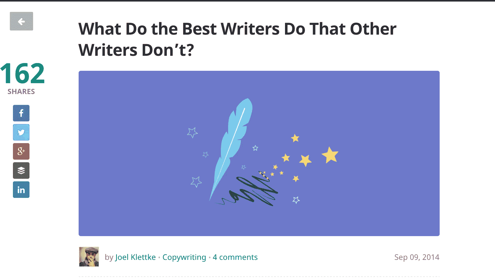

这篇文章非常有用，我已经把它收藏在我的[口袋](http://getpocket.com)里了。在他的文章中，Joel Klettke 解释了最好的作家会做而糟糕的作家不会做的事情。剧透:最好的作家都有一个过程，他在文章中详细阐述了这个过程。

### 2.所有优秀的内容有什么共同点？

#### 文章| 4 分钟。阅读

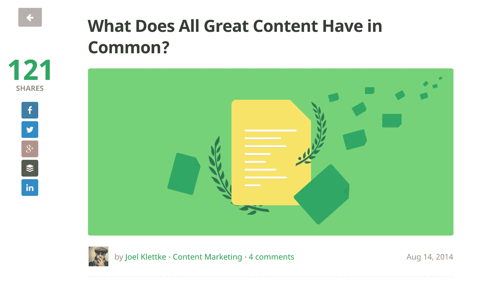

Klettke 在他的文章中再次详述了所有优秀内容的共同点。我也收藏了这篇文章。你的内容必须要么是新的，要么是第一个报道的，最新的，最完整的，有新的包装或新鲜的声音/观点。

### 3.[这个写作 GPS 帮助你创造好得离谱的内容](http://www.marketingprofs.com/articles/2014/25986/writing-gps-for-ridiculously-good-content#ixzz3blGrp81Q)

#### 文章| 6 分钟。阅读

本文节选自安·汉德利的[大家都写](http://www.amazon.com/gp/product/1118905555/)。也许你还没有一个写作的过程。也许你不喜欢 Klettke 在上面的写作过程。在这种情况下，请阅读这篇详述另一个写作过程的文章。

### 4. [10 个精彩的例子，告诉你如何轰轰烈烈地写下一篇博文](http://www.michaeldpollock.com/open-your-blog-post/)

#### 文章| 5 分钟。阅读

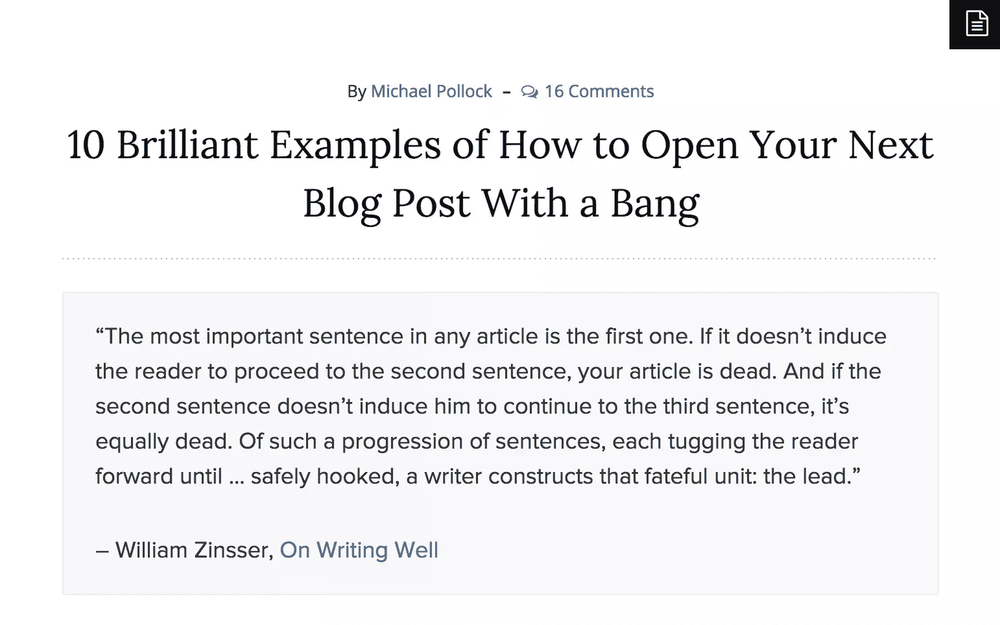

这是一个必须的书签。在我开始写任何文章之前，在我完成提纲之后，我会看两个帖子，这是其中之一。你的第一句和第一段需要做到最好，因为这是让读者继续阅读的原因。在这篇文章中，你会得到 11 个奇妙的，lede 的想法。

### 5.[如何写好故事导语](http://cubreporters.org/leads.html)

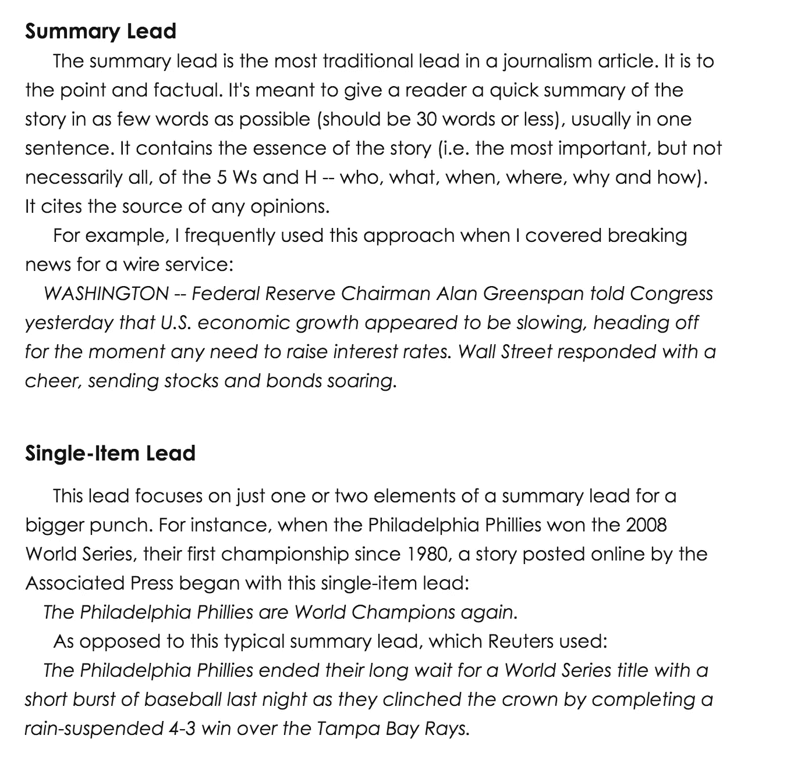

#### 文章| 6 分钟。阅读

这是我写博文之前回顾的另一篇帖子。与第四条相似，“如何写出好的故事导语”列举了一系列打开你下一篇文章的最佳方式。书签吧！

### 6. [HubSpot 的 5 个免费博文模板](http://offers.hubspot.com/blog-post-templates)

#### 模板|免费，需要电子邮件

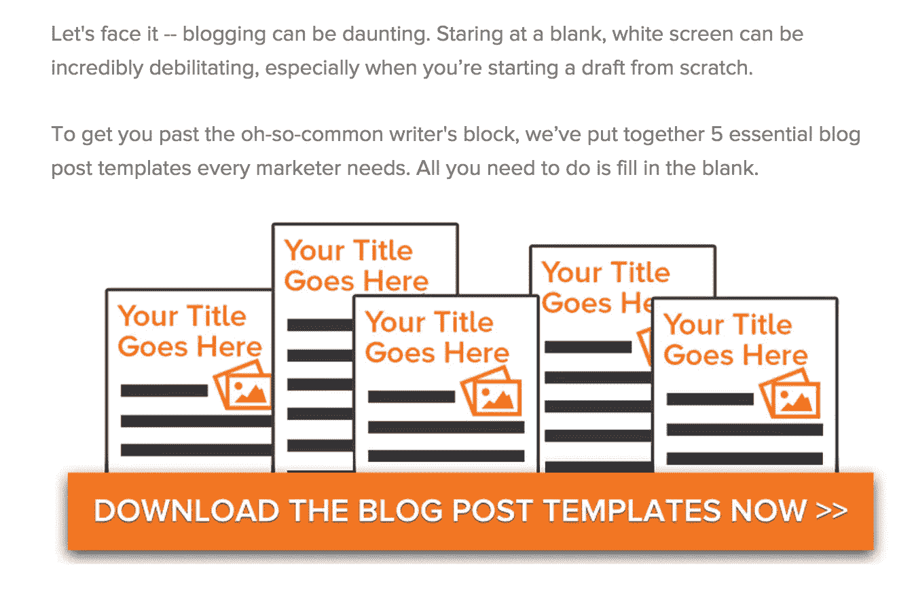

经历作家的瓶颈？你不是唯一的一个，这就是为什么 HubSpot 创建了五个免费的博客帖子模板来帮助你开始。通过下载，您将收到以下类型帖子的模板:

*   操作方法
*   列表条目
*   策划收藏
*   幻灯片共享演示
*   蹭热度

### 7. [HubSpot 的博客话题生成器](http://www.hubspot.com/blog-topic-generator)

#### 工具/模板|免费，需要电子邮件

输入三个关键词，HubSpot 会将 365 个博客标题创意输出到一个可下载的 Excel 电子表格中，你可以反复使用。

### 8.[预兆的标题制作者](http://portent.com/tools/title-maker)

#### 工具|免费

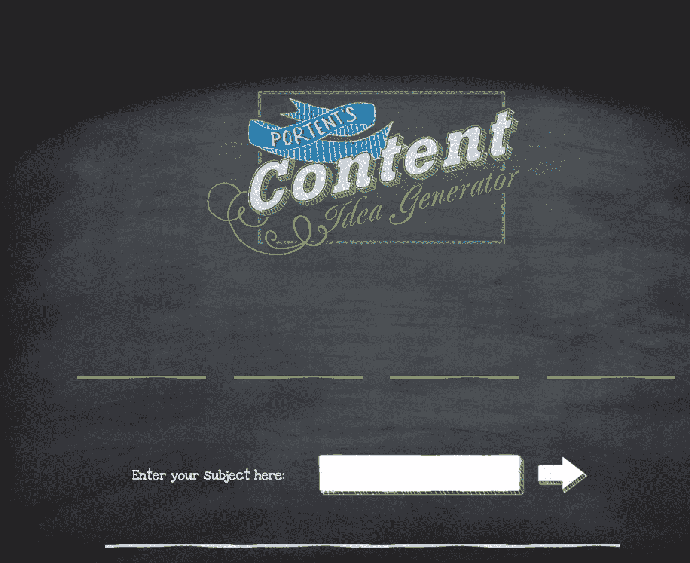

类似 HubSpot 的博客话题生成器是 Portent 的标题生成器。该工具根据您输入的关键字生成标题。玩着玩着，直到找到自己喜欢的标题。

### 9. [52 个标题技巧:写博客文章的秘籍](http://www.cormacmoore.com/wp-content/uploads/2013/12/Headline-Hacks-08-18-2012.pdf)

#### 电子书|免费

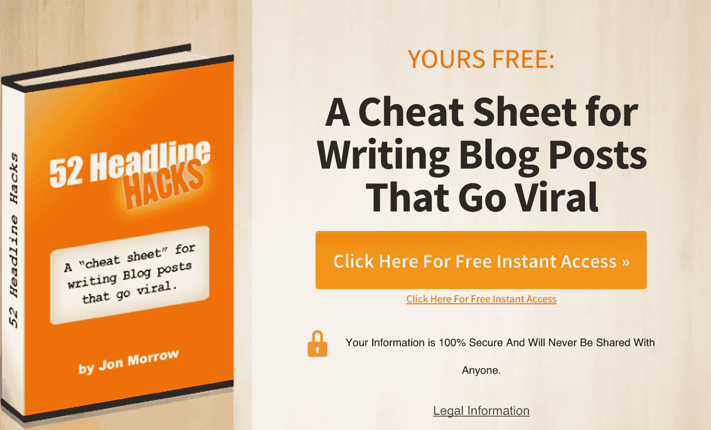

我对这个链接了如指掌，因为它一次又一次地证明了它对我的价值。把它标上书签，偷走它最好的头条，总共 52 条。

### 10.[尤利西斯](http://www.ulyssesapp.com/)

#### Mac 应用程序| $44.99

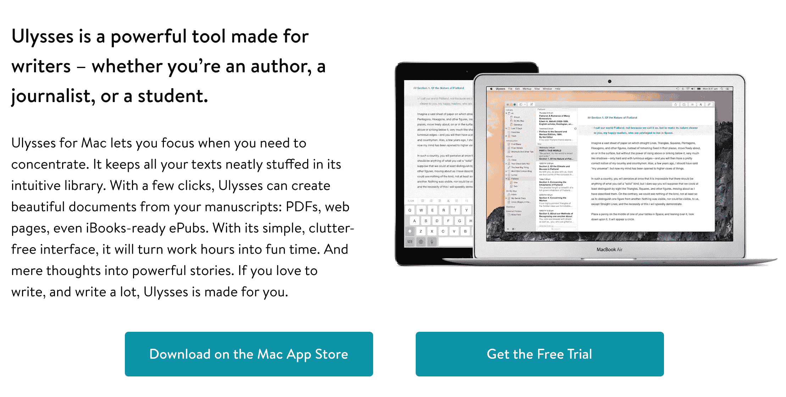

我已经试过了市面上所有的 Mac 写作应用，而《尤利西斯》是我迄今为止最喜欢的。它就像一个更干净、更简单的 Evernote 版本。我发现它的“复制为”功能非常有用，因为和我一起工作的作家在 Markdown 中提交他们的副本，而我显然不能复制到 WordPress 中。

### 11.[海明威](http://www.hemingwayapp.com/)

#### 网络和桌面应用程序|免费

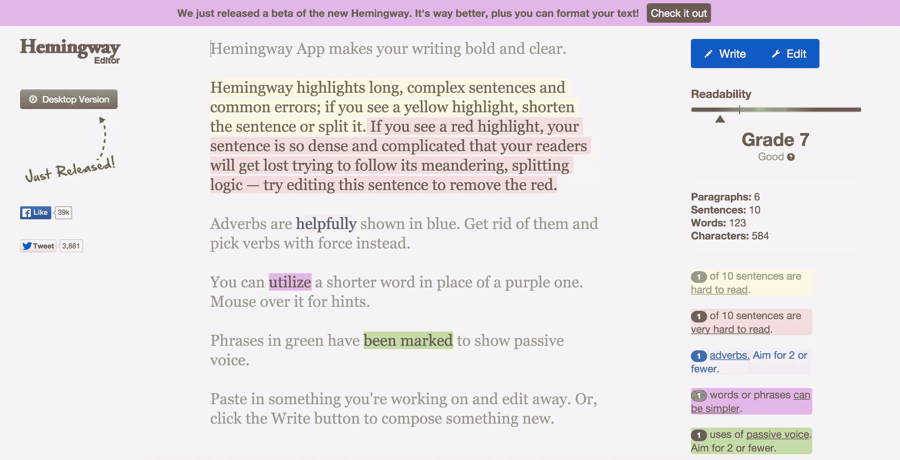

海明威编辑器在编辑你的文章时很有用。它不仅会告诉你它的“可读性”分数，还会突出显示哪些句子很难(或非常难)阅读，更简单的短语替代，何时删除副词，以及何时使用被动语态。

### 12.[口袋](http://getpocket.com)

#### 网络和桌面应用|免费增值

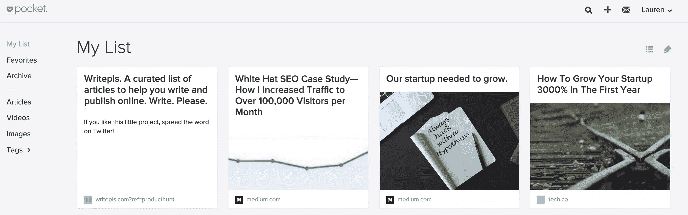

口袋是我存放所有我喜欢的文章的地方——不仅仅是我现在没有时间阅读的文章。通过“标记”和“收藏”帖子，我能够非常快速地重新访问这些必须添加书签的帖子。这也是博客主题想法的一个很好的来源。

### 13.[中等](http://medium.com)

#### 发布平台|免费

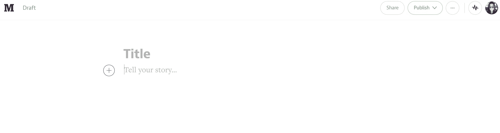

如果你正在寻找一个写博客的地方，我强烈推荐使用 Medium 的平台。它漂亮的界面让写作变得愉快。

### 14. [Writepls](http://www.writepls.com/)

#### 目录|免费

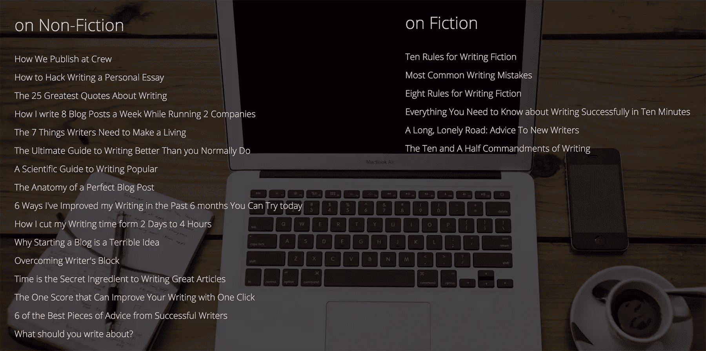

刚刚在产品搜索上发现了这个。这是一个精选的文章列表，可以帮助你在线写作和发表文章。我还没有全部看完，但是它们看起来很棒。

### 15.[现代说书人的工具箱](http://readthisthing.com/toolbox)

#### 目录|免费

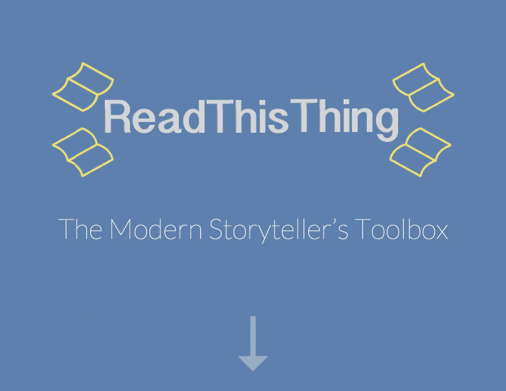

ReadThisThing 策划了一系列工具、产品和资源来帮助你讲述精彩的故事。

### 16.[谷歌语音](http://google.com/voice/)

#### 工具|免费

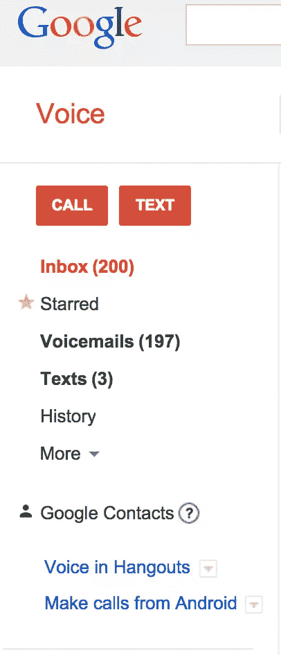

我喜欢用谷歌语音进行采访，因为它可以让我录下电话，然后提交给 [Rev](https://www.rev.com/) 进行转录服务。

### 17.[帮我写](http://helpmewrite.co/)

#### 网站/社交网络|免费

有没有想过，在你投资之前，是否有人真的想读你想写的东西？《帮助我写作》就是来帮助你做到这一点的。发布你的想法，用户会投票选出他们想看的内容。

### 18. [101 个销售邮件模板](https://attach.io/sales-email-templates/)

#### 模板|免费

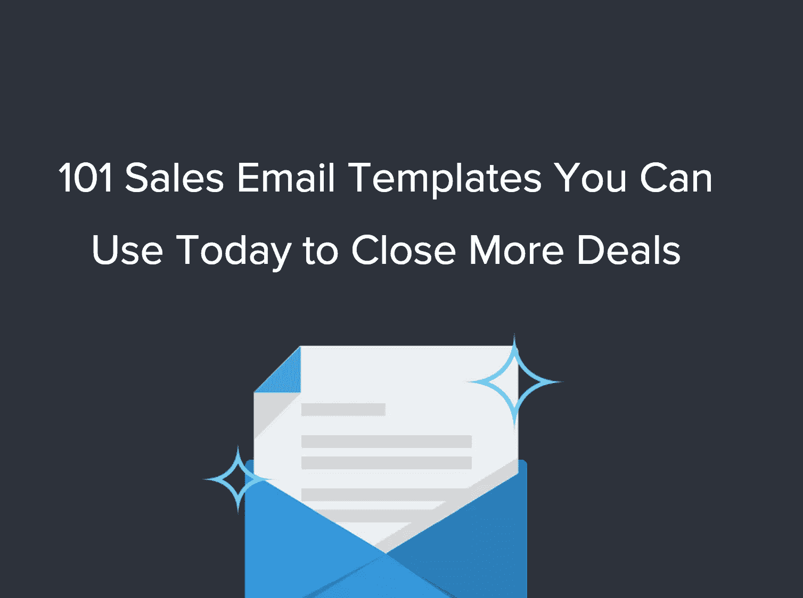

这是我在互联网上偶然发现的最好的东西之一。下一封给客户的电子邮件需要一句开场白吗？还是在做一些冷冰冰的外联？无论你在做什么电子邮件活动，使用这 101 个模板来帮助你的写作脱颖而出。

### 19.[精彩的邮件文案](http://greatemailcopy.tumblr.com/)

#### 灵感|免费

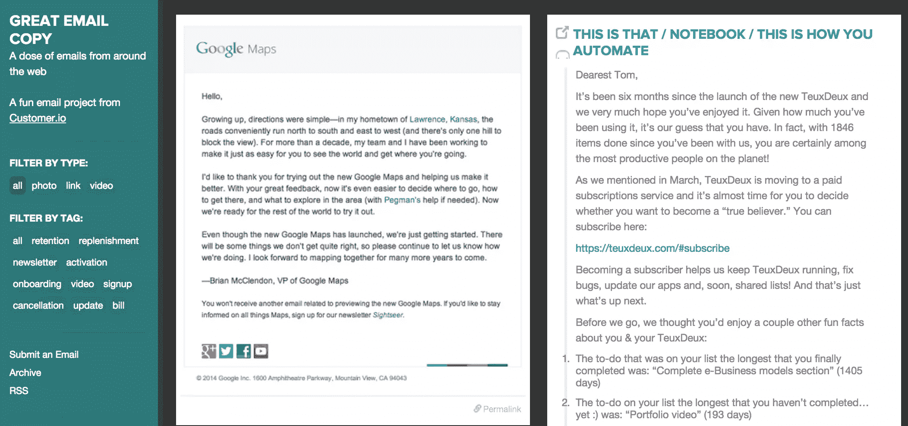

如果你想从网上获得最好的电子邮件，那么你需要访问这个网站。您可以按标签或类别进行过滤。

### 20.[非常好的电子邮件](http://reallygoodemails.com/)

#### 灵感|免费

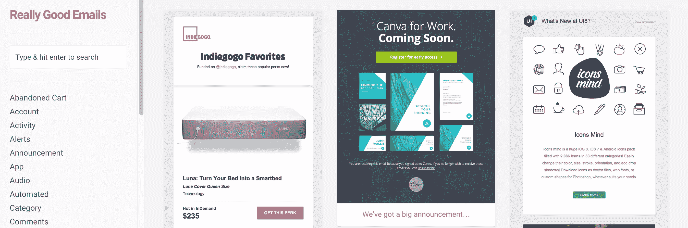

这和 19 号一模一样，但是我都喜欢，所以我都分享了。

### 21.[固定邮件](http://www.cannedemails.com/)

#### 模板|免费

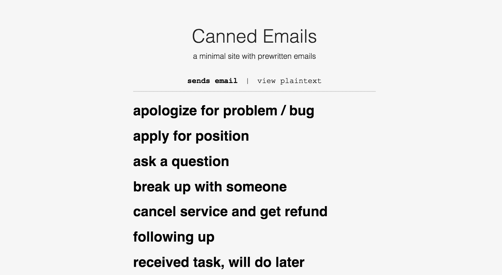

罐装电子邮件是一个最小的网站，有一长串预先写好的电子邮件。点击“查看纯文本”查看每个主题的不同电子邮件。话题从“道歉”到“跟进”不一而足，列表还在滚动。

### 22. [Kopywriting Kourse](http://kopywritingkourse.com/blog/)

#### 课程|免费

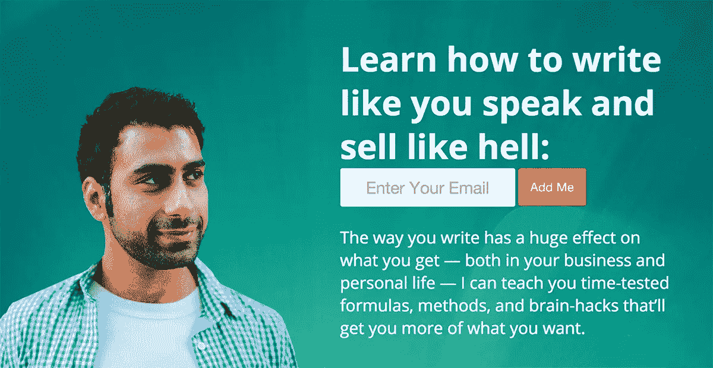

这是我迄今为止参加过的最好的写作课程。不想买？那就看看内维尔的博客吧。我保证你不会后悔的。

#### 你最喜欢的写作工具是什么？请在下面的评论中告诉我们。不要害羞。=)

## 分享这篇文章