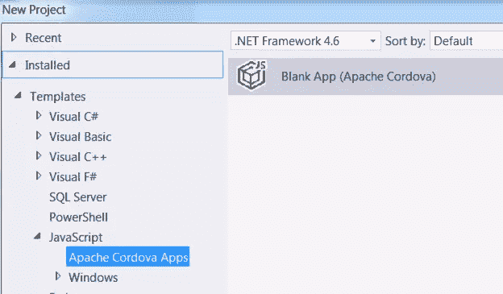
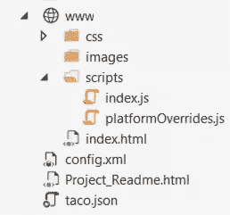
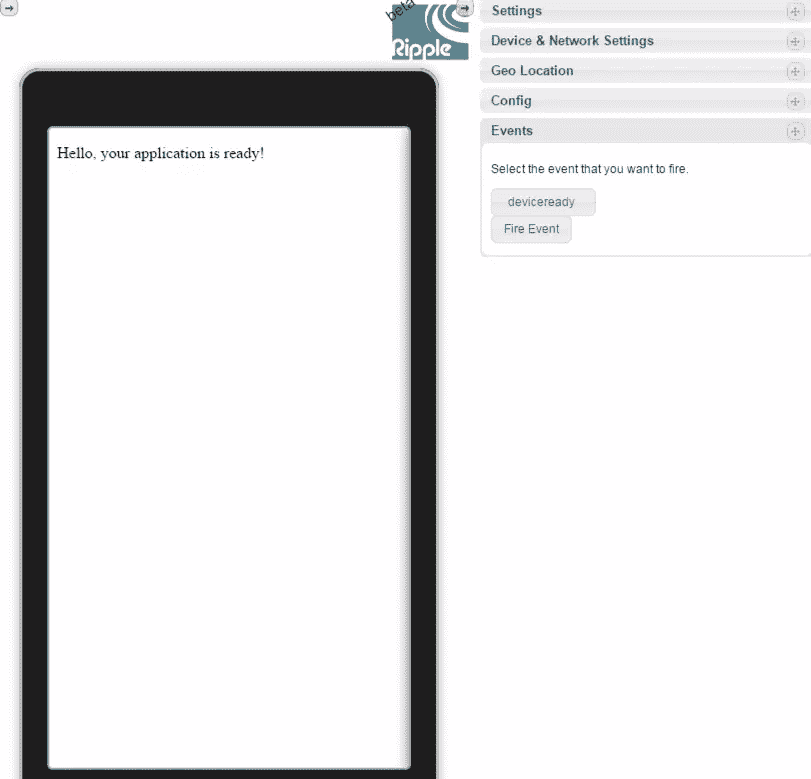
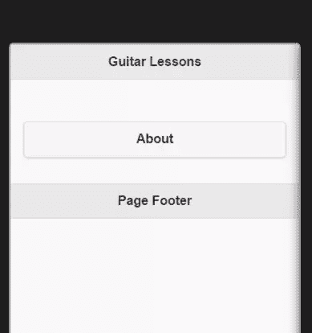
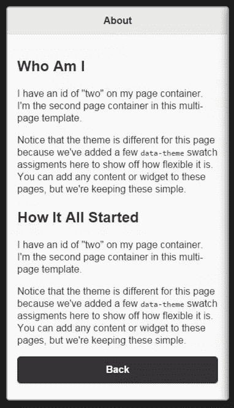
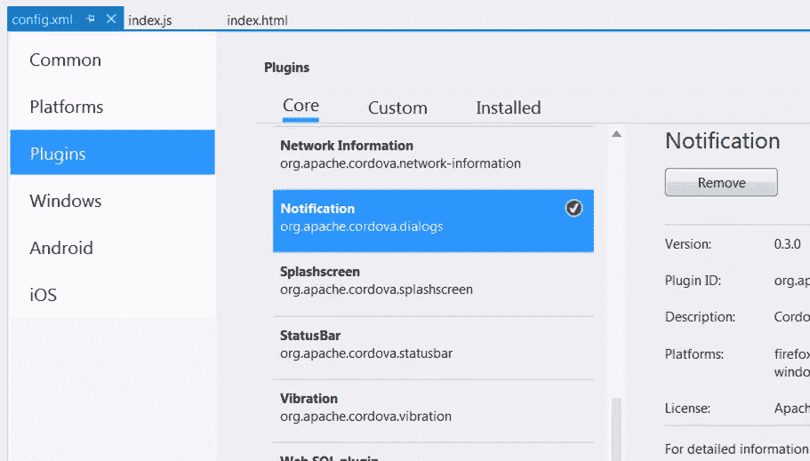
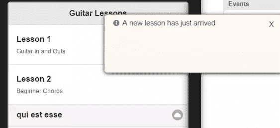

# Visual Studio 社区 2015:走向移动

> 原文：<https://www.sitepoint.com/visual-studio-community-2015-going-mobile/>

*本文由[微软](http://aka.ms/visualstudiocomm2013)赞助。感谢您对使 SitePoint 成为可能的赞助商的支持。*

欢迎回到我们的系列文章，使用微软的现代 IDE: Visual Studio Community 2015 为客户快速设计和构建一个有吸引力的功能性网站。如果您错过了前几期，请查看以下内容:

*   [Visual Studio 社区 2015:建立网站](https://www.sitepoint.com/design-develop-microsoft-community-2015-setting-up-site/)
*   [Visual Studio 社区 2015:添加电子邮件和联系人页面](https://www.sitepoint.com/design-develop-microsoft-community-2015-email-contact-pages/)
*   [Visual Studio 社区 2015:添加电子商务功能](https://www.sitepoint.com/visual-studio-community-2015-adding-ecommerce-functionality/)

在本系列的最后一篇文章中，我们将创建一个移动应用程序。如果有新的课程，应用程序将显示通知。一旦用户看到通知并取消它，他们会在新的课程旁边看到一个云图标，这有助于该课程从其他课程中脱颖而出。

我们将使用流行的 Cordova 框架创建我们的应用程序。这将允许我们使用 HTML 和 Javascript 等网络语言。

在幕后，我们将看到如何使用 jQuery Mobile 创建一个多页面应用程序。jQuery Mobile 将帮助我们设计样式，并调用 REST 服务。我们将使用 REST 服务来模拟从远程资源获取课程。这将让您了解如何检索远程数据并解析它。

## 创建科尔多瓦项目

若要在 Visual Studio 中创建 Cordova 应用程序，请选择“文件”>“新建”>“项目”>“空白应用程序(Apache Cordova)”。



现在你已经创建了一个新的基于 Cordova 的项目，让我们来谈谈文件夹和文件。



如上所示，我们将主要使用 index.html 和 index.js。把 index.html 想象成一个网站的主页。它将包含我们的观点。index.js 是我们可以放置业务逻辑的地方。

如果您现在通过选择 Android 作为解决方案平台和 Ripple 设备之一来运行应用程序，您应该会看到类似于以下内容的内容:



这是一个工作的移动应用程序。它在这一点上没有多大作用，但我们即将修复它。

## 添加 jQuery Mobile

我们将把 jQuery 移动库添加到我们的项目中。因为它需要 jQuery，所以我们也需要这个库。去 https://code.jquery.com/mobile/下载最新缩小版的 jQuery Mobile。只需右击并下载 JS 文件。保存到项目的 wwwroot/script 文件夹中。

也可以从同一位置下载最新版本的主题文件。主题文件是帮助我们设计应用程序的 CSS。保存到 wwwroot/css。

现在我们需要 jQuery 库。这里下载缩小版的 2.x 版本:[https://code.jquery.com](https://code.jquery.com)。保存到 wwwroot/script。

在 index.html 中，我们可以添加对 JS 文件的引用。Cordova 项目略有不同，因为 JS 文件位于页面底部。一旦添加了引用，`index.html`的底部应该是这样的:

```
<!-- Start of first page: #one -->
  <div data-role="page" id="one">

    <div data-role="header">
      <h1>Guitar Lessons</h1>
    </div><!-- /header -->

    <div role="main" class="ui-content">
      <p><a href="#two" class="ui-btn ui-shadow ui-corner-all">About</a></p>
   </div><!-- /content -->

    <div data-role="footer" data-theme="a">
      <h4>Page Footer</h4>
    </div><!-- /footer -->
  </div><!-- /page one -->

  <!-- Start of second page: #two -->
  <div data-role="page" id="two" data-theme="a">

    <div data-role="header">
      <h1>About</h1>
    </div><!-- /header -->

    <div role="main" class="ui-content">
      <h2>Who Am I</h2>
      <p>I have an id of "two" on my page container. I'm the second page container in this multi-page template.</p>
      <p>Notice that the theme is different for this page because we've added a few <code>data-theme</code> swatch assigments here to show off how flexible it is. You can add any content or widget to these pages, but we're keeping these simple.</p>
      <h2>How It All Started</h2>
      <p>I have an id of "two" on my page container. I'm the second page container in this multi-page template.</p>
      <p>Notice that the theme is different for this page because we've added a few <code>data-theme</code> swatch assigments here to show off how flexible it is. You can add any content or widget to these pages, but we're keeping these simple.</p>

<p><a href="#one" data-direction="reverse" class="ui-btn ui-shadow ui-corner-all ui-btn-b">Back</a></p>

    </div><!-- /content -->

    <div data-role="footer">
      <h4>Page Footer</h4>
    </div><!-- /footer -->
  </div><!-- /page two -->
```

如果您运行该应用程序，它应该是这样的:



此时，您可以单击“关于”按钮，这将显示“关于”页面:



## 添加课程

我们要模拟课间休息。我们将使用 jQuery Mobile 和一个名为`jsonplaceholder.typicode.com`的服务来帮助通话。这个服务对于测试 REST 调用和取回一些 JSON 非常有用。它将在测试阶段为您节省大量时间，此时您所需要的只是到达一个端点并取回一些结构化数据。

在我们调用 REST 之前，我们会用已知的课程填充我们的应用程序。也就是说，服务器上的课程。然后，我们可以设置一个计时器来定期轮询服务器，检查新的课程。

我们将向 index.js 添加一个名为`initialCheck()`的函数。这将进行初始调用，并用课程填充列表。

打开 index.js，你会看到几个方法。是我们开始做事的主要方法。这类似于网页设计界的`$(document).ready()`。在两个`addEventListener`方法下，添加下面的函数调用:

```
initialCheck();
```

在`onPause()`和`onResume()`下面，定义`initialCheck()`方法如下:

```
function initialCheck() {
  var lessonList = $("#lessonlist");
  var lesson1 = "<li><h2>Lesson 1</h2><p>Guitar In and Outs</p></li>";
  var lesson2 = "<li><h2>Lesson 2</h2><p>Beginner Chords</p></li>";
  lessonList.append(lesson1);
  lessonList.append(lesson2);
}
```

我们希望这个方法进行远程调用，但是为了简单起见，我们将在第二个方法中这样做。这里所做的是将课程添加到一个名为`lessonlist`的列表中。

我们需要给`index.html`添加一个`lessonlist`元素。这将被添加到标题下的第一页代码中:

```
<div role="main" class="ui-content">
    <ul data-role="listview" id="lessonlist">
    </ul>
    <p>&nbsp;</p>
    <p><a href="#two" class="ui-btn ui-shadow ui-corner-all">About</a></p>
</div>
```

如果你运行应用程序，你会看到课程开始出现。


请注意每课的副标题。从`initialCheck()`函数中的代码，您可能可以确定子标题是如何创建的。标题的`H2`标签和副标题的`p`标签。

## 从 REST 调用填充课程

我们将在`index.js`中定义我们的第二个方法。在`onDeviceReady()`和`initialCheck()`下，添加以下内容:

```
window.setInterval(getLessons, 60000);
```

这段代码将每分钟执行一次`getLessons()`函数。对于测试，如果您希望每 5 秒发生一次，只需将`interval`值更改为 5000。

在`initialCheck()`功能下定义`getLessons()`功能:

```
function getLessons() {
    $.getJSON("http://jsonplaceholder.typicode.com/posts/2", function (data) {

    if (data.length > 0) {
      var lessonList = $("#lessonlist")
      lessonList.append('<li data-icon="cloud"><a>' + data.title + '</a></li>');
      /*$.each(data, function (index) {
        lessonList.append('<li><a>'+data[index].title+'</a></li>');
      });
      */
      lessonList.listview("refresh");
      navigator.notification.alert(
      'A new lesson has just arrived', // message
      '',                // callback
      'New Lesson Available',      // title
      'Ok'               // buttonName
      );
    }
});
```

我们做的第一件事是获取 JSON。该调用的结果将被赋给数据变量。请注意，该循环被注释掉了。这是因为我们得到的 JSON 的结构。如果你把上面的网址粘贴到你的浏览器中，你就会明白我的意思了。我们得到下面的内容，而不是一个数组:

```
{
 "userId": 1,
 "id": 2,
 "title": "qui est esse",
 "body": "est rerum tempore vitae\nsequi sint nihil reprehenderit dolor beatae ea dolores neque\nfugiat blanditiis voluptate porro vel nihil molestiae ut reiciendis\nqui aperiam non debitis possimus qui neque nisi nulla"
}
```

当 JSON 从我们的服务器返回时，我们可能会完全控制它。在这种情况下，JSON 在数组中工作得更好，即使它只有一个元素。在这种情况下，我们总是可以使用循环。

您可以看到，我们调用了一个函数来刷新列表。这确保了新课会实时出现。为了突出它，我们将新的列表项包装在锚标记中，这将使这一行具有灰色。云图标也会出现在该行的右侧。

你可能想知道`navigator.notification.alert`代码。这实际上是一个插件，用于在新课到来时通知用户。

在下一节中，我们将安装通知插件。

## 安装通知插件

单击 config.xml 文件将其打开。这是我们移动应用程序的大部分元数据存储的地方。这也是我们可以安装插件的地方。点按“插件”标签，然后向下滚动，直到看到通知。在下面的截图中，我已经安装了它:



现在，如果你运行这个应用程序，一旦`getLessons()`方法触发，你就会看到通知。



也请注意新课已经上了。虽然它显示的标题来自 typicode.com，这对于我们的测试来说很好。云图标也在那里。

## 摘要

在本文中，我们创建了一个基于 Cordova 的移动应用程序。我们集成了 jQuery Mobile 来帮助设计应用程序的外观，并提供一些强大的功能，比如调用 REST 服务。我们也看到了添加扩展功能的插件是多么容易。

有了这个基础，你当然可以扩展应用的功能。jQuery 移动网站将是一个很好的资源，可以查看还有哪些组件可以用来增强这个应用程序。网站上的例子也是功能性的，并显示了它们背后的源代码。这对学习和灵感来说是很棒的。

这就是我们关于 Visual Studio Community 2015 系列的结尾。我希望你已经意识到这个应用程序在开发和设计网站和应用程序，以及为它们配备强大的工具和服务集成方面是多么有用。

*你用过 Visual Studio 社区 2015 吗？你有什么充分利用这款应用的技巧？*

## 分享这篇文章