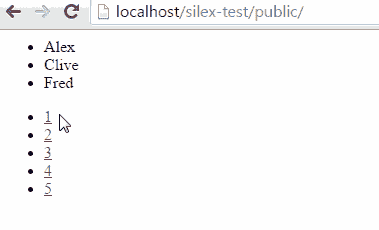

# 用 jQuery、AJAX 和 PHP 实现分页

> 原文：<https://www.sitepoint.com/pagination-jquery-ajax-php/>

在本文中，我们将解释通过 [jQuery](https://jquery.com) 使用 PHP 和 AJAX 对数据集进行分页是多么容易。为了简单起见，我们还将使用 [Silex 框架](https://www.sitepoint.com/introduction-silex-symfony-micro-framework/)。


## 数据源

首先，我们需要一些数据来分页！

| 身份证明（identification） | 名字 | 年龄 |
| --- | --- | --- |
| one | 杰米 | Forty-three |
| Two | 乔（人名） | Twenty-four |
| three | 图像读取器设备（figure-reader electronic device 的缩写） | Twenty-three |
| four | 克莱武 | Ninety-two |
| five | 罗伊(男子名) | Seventy-three |
| six | 杰夫（男子名） | Twenty-four |
| seven | 光线 | Twelve |
| eight | 约翰 | nine |
| nine | 银箱 | Thirty-two |
| Ten | 拉尔夫 | Thirty-four |

出于这个例子的目的，我们将使用 [MySQL](https://www.mysql.com/) ，但是当然我们可以很容易地将其替换为 [SQLite](https://www.sitepoint.com/getting-started-sqlite3-basic-commands/) 或任何其他 RDBMS。我们将把我们的数据库命名为`example`，这个表将被命名为`people`。

## 后端

因为我们要在 Silex 上构建我们的应用程序，我们需要首先使用 [Composer](https://getcomposer.org/) 安装 Silex。用命令`composer require silex/silex`通过 composer 安装。

接下来，我们需要设置我们的`index.php`文件，连接到数据源并选择数据库。我们将使用 [PDO](https://php.net/manual/en/book.pdo.php) 来实现这一点，因为它很容易在以后更改为其他数据库软件，并且它还可以处理转义用户输入(从而防止 SQL 注入攻击)。如果你仍然停留在`mysqli`或者更糟的`mysql`扩展上，请看本教程。我们将把连接放在`$app`容器中，以便在我们的路由中方便使用。

```
$app['db'] = function () {
    $host = 'localhost';
    $db_name = 'example';
    $user = 'root';
    $pass = '';

    return new \PDO(
        "mysql:host={$host};dbname={$db_name}",
        $user,
        $pass,
        array(\PDO::ATTR_EMULATE_PREPARES => false)
    );
};
```

现在我们已经连接到数据库，我们将在应用程序中提供三条路线，这将启用:

1.  检索我们想要显示的结果集部分
2.  检索结果集中的总行数
3.  查看 HTML 前端

第一条路线如下:

```
$app->get('/data/page/{page_num}/{rows_per_page}', function ($page_num, $rows_per_page) use ($app) {
    $start = ((int)$page_num - 1) * (int)$rows_per_page;
    $total_rows = (int)$rows_per_page;

    $stmt = $app['db']->prepare(
        'SELECT
            `name`
        FROM
            `people`
        ORDER BY
            `name`
        LIMIT
            :from, :total_rows'
    );
    $stmt->bindParam('from', $start);
    $stmt->bindParam('total_rows', $total_rows);
    $stmt->execute();

    $result = $stmt->fetchAll(\PDO::FETCH_ASSOC);
    return $app->json($result);
});
```

这使我们的前端能够从数据库中获取结果集的子集。通过 URI 可以提供两个参数；一个用于页码，一个用于每页应该有多少行。页码与每页的行数一起用于确定我们需要从结果集中的哪一行开始检索数据。

在本例中，我们将对表中的所有数据进行分页。然而，在实际应用中，我们可能需要包含一个`WHERE`子句来过滤返回的数据。例如，如果我们只想显示 30 岁以下的人，我们可以修改上面的代码，在查询中包含一个`WHERE`子句:

```
$stmt = $app['db']->prepare(
    'SELECT
        `name`
    FROM
        `people`
    WHERE
        `age` < 30
    ORDER BY
        `name`
    LIMIT
        :from, :total_rows'
);
```

该查询使用一个准备好的语句来插入请求了页码以及每页输出多少行的变量。这些在 URI 中提供，然后动态插入到 SQL 查询的`LIMIT`子句中。

第二种方法提供了执行查询以返回表中的总行数的能力。这很重要，因为我们希望在前端利用页码链接。这条路线应该是这样的:

```
$app->get('/data/countrows', function () use ($app) {
    $stmt = $app['db']->query(
        'SELECT
            COUNT(`id`) AS `total_rows`
        FROM
            `people`'
    );

    $result = $stmt->fetch(\PDO::FETCH_ASSOC);
    return $app->json($result);
});
```

这里我们使用一个名为 [`COUNT()`](https://dev.mysql.com/doc/refman/5.1/en/group-by-functions.html#function_count) 的聚合 SQL 函数。这是一个`GROUP BY`函数——这意味着它会将选定的行组合在一起，以提供一个单独的行。在这种情况下，它以整数形式提供所有选定行的总和。

另一个需要注意的重要后端特性是，数据获取路径应该以 JSON 的形式返回，因为这将简化与前端的集成。Silex 使用 [JSON 助手方法](https://silex.sensiolabs.org/doc/usage.html#json)为我们处理这个问题。

最后一条路线只是指示根 URI 输出一个 HTML 页面。

```
$app->get('/', function () use ($app) {
    return file_get_contents(__DIR__.'/../resources/views/index.html');
});
```

这就把我们带到了…

## 前端

现在是有趣的部分！

我们需要确保我们的前端包括 jQuery，并且有一个用于页码链接和数据本身的容器。

```
<ul id="rows"></ul>
<ul id="page-numbers"></ul>

<script src="//code.jquery.com/jquery-1.11.2.min.js"></script>
```

在本例中，我们将使用`<ul>` s，但是在实际应用中，我们可能希望使用`<table>`来存储数据(如果我们希望每行显示多条信息，这一点尤其重要)。

我们需要 Javascript 中的两个自定义函数；一个用于获取特定页面，一个用于初始化页码链接。在我们的示例中，在进入代码的主要部分之前，我们还做了一些设置:

```
var rows_per_page = 3;
var total_rows;
```

这将初始化两个全局变量，一个是我们希望每页显示的行数，另一个是表中的总行数(稍后将通过 AJAX 获取后者)。

为了初始化页码链接，我们需要对 PHP 脚本进行 AJAX 调用，以获取表中的总行数。然后，我们将使用 success 函数回调，根据总行数将链接到每个页面的 HTML 注入到页码链接容器中。它应该是这样的:

```
function initPageNumbers()
{
    //Get total rows number
    $.get('data/countrows', function(data){
        total_rows = parseInt(data.total_rows);

        //Loop through every available page and output a page link
        var count = 1;
        for(var x = 0;  x < total_rows; x += rows_per_page)
        {
            $('#page-numbers').append('<li><a href="#'+count+'" onclick="getPage('+count+');">'+count+'</a></li>');
            count++;
        }
    });
}
```

注意，我们为页面链接注入的 HTML 已经附加了一个 Javascript 函数调用。这意味着单击这些链接将触发我们的页面获取功能，而无需我们手动附加一个单击事件。还要注意,`href`属性被设置为带有页码的散列片段——这意味着 URI 将被修改以反映我们正在查看的页码。

获取特定页面的函数也使用 AJAX 调用，但是有一些关键的区别；

```
function getPage(page_num)
{
    //Clear the existing data view
    $('#rows').html('');

    //Get subset of data
    $.get('data/page/'+page_num+'/'+rows_per_page, function(data){
        //Loop through each row and output the data
        $(data).each(function(){
            $('#rows').append('<li>'+this.name+'</li>');
        });
    });					
}
```

要注意的第一个区别是，首先使用 jQuery 的 [`html()`](https://api.jquery.com/html/) 函数清除容器。这是因为这个函数将被多次调用，并且每次都需要一个空白的开始工作。第二个区别是数据本身在成功函数回调中循环。这是使用非常有用的 jQuery [`each()`](https://api.jquery.com/jQuery.each/) 函数完成的。

这两个函数都使用了 jQuery AJAX 速记函数 [`get()`](https://api.jquery.com/jQuery.get/) 来发出 HTTP GET 请求。可以使用 jQuery [`ajax()`](https://api.jquery.com/jQuery.Ajax/) 函数来代替，这允许更多的配置，但是这种简写对于这个例子来说已经足够了。

`getPage()`函数也不同于`initPageNumbers()`函数，因为它传递两个参数和 HTTP GET 请求。这些都是在一个对象中提供的 [`get()`](https://api.jquery.com/jQuery.get/) 函数调用的第二个参数。然后由 PHP 脚本按照前面的定义进行处理。

现在剩下的就是设置页面初始化逻辑了。为此我们将使用 jQuery [`ready()`](https://api.jquery.com/ready/) 函数；

```
$(document).ready(function(){
    //Set up the page number links
    initPageNumbers();

    //Set the default page number
    var page_num = 1;

    //If there's a hash fragment specifying a page number
    if(window.location.hash !== '')
    {
        //Get the hash fragment as an integer
        var hash_num = parseInt(window.location.hash.substring(1));

        //If the hash fragment integer is valid
        if(hash_num > 0)
        {
            //Overwrite the default page number with the user supplied number
            page_num = hash_num;
        }
    }

    //Load the first page
    getPage(page_num);
});
```

这将调用我们的页码初始化函数，并获取要显示的结果集页面。

如果在 URI 的末尾提供了一个散列片段，那么它将被解析成一个页码，并被设置为要显示的页面，否则默认显示页面 1。这种散列片段功能让搜索引擎索引我们的单个页面，而不仅仅是第一页。它还允许我们提供直接指向特定页码的外部链接。

对这种技术的一个改进是提供诸如`app.com/page/2`、`app.com/page/3`等链接。与使用哈希片段或查询字符串(URI 上的`?`后缀)相比，这样做的好处是它更受搜索引擎和网站爬虫的支持。



关于我们的页面初始化逻辑需要注意的一点是，两个 AJAX 操作将异步发生，这意味着浏览器将在计算要显示多少页面链接的同时获取一页数据。这对用户体验非常好，因为这意味着在获得完整体验之前等待的时间更少。

## 结束语和替代解决方案

使用 AJAX 对结果集进行分页的技术最适合大型结果集，在这种情况下，数据量非常大，以至于:

1.  一次包含和操作 DOM 中的所有结果集对浏览器性能有害，或者；
2.  在一次查询中从 RDBMS 获取和接收整个结果集非常慢。

如果结果集不够大，不足以引起这样的问题，那么最好的方法是在页面加载时将整个结果集加载到 DOM 中，然后使用 Javascript 通过显示/隐藏 CSS 技术对 UI 中的数据进行分页。

这就是全部了！如果您想查看并下载所述示例的完整源代码，您可以通过[这个 GitHub repo](https://github.com/sitepoint-editors/jquery-php-ajax-pagination-example) 来完成。

## 分享这篇文章