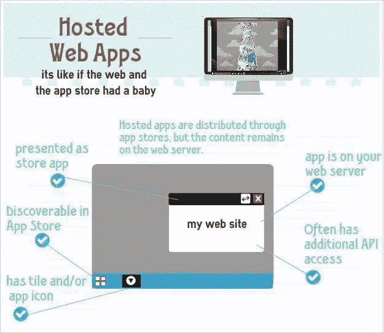
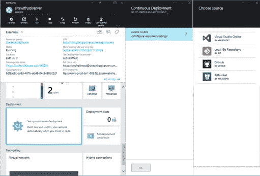
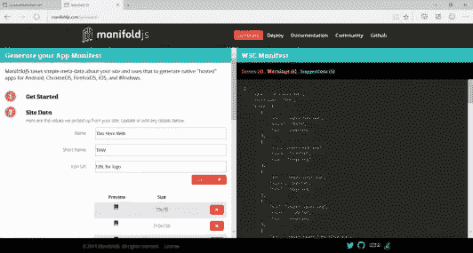
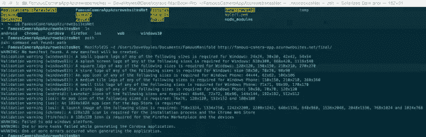
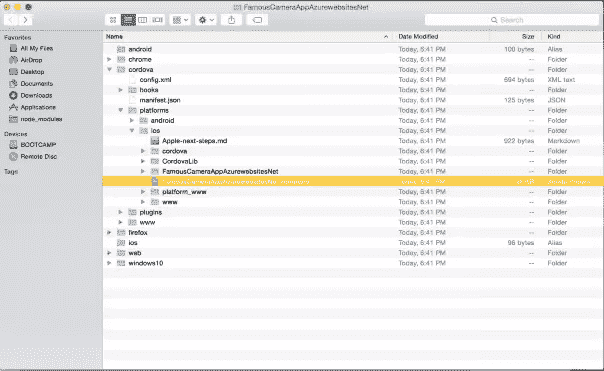
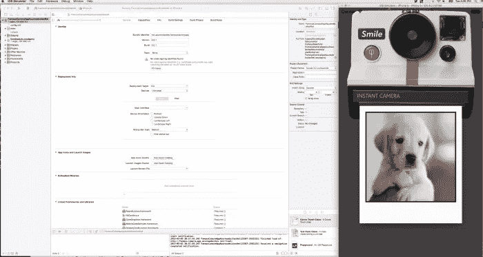

# 使用 Famo.us 和 manifold.js 创建移动应用程序

> 原文：<https://www.sitepoint.com/creating-mobile-app-famo-us-manifold-js/>

本文是微软网站开发技术系列的一部分。感谢您对使 SitePoint 成为可能的合作伙伴的支持。

在过去的几个月里，自从我在 2014 年 10 月看到他们的发布活动以来，我一直想深入了解这个新的 JavaScript 框架。Famo.us 包括一个完全集成了 3D 物理动画引擎的开源 3D 布局引擎，可以渲染到 DOM、Canvas 或 WebGL 简而言之，您可以获得 web 应用程序的本机性能，这在很大程度上归功于 Famo.us 处理其内容渲染的方式。

网络平台播客[的 Jenn Simmons 最近邀请 Famou.us 首席执行官 Steve Newcomb 在播客](http://thewebplatform.libsyn.com/39-famous-mobile-performance-mixed-mode?WT.mc_id=13401-DEV-sitepoint-article25)上讨论移动性能和他们即将到来的混合模式。这是一个完美的时机，因为微软刚刚发布了 ManifoldJS，这是一个允许你将你的网络体验打包成跨 Android、iOS 和 Windows 的原生应用的工具。我想测试这两种技术。

简而言之，我想确定 Famo.us 是否真的有很好的移动性能，并了解将我的 web 应用程序打包为移动应用程序的过程有多简单。

## 这两个东西解决什么问题？

web 并不一定以创建高性能的应用程序而闻名，这是一个遗憾，因为它确实能够运行速度极快的交互式应用程序，但不幸的是，它一直受到 DOM 的困扰。有了 HTML5 canvas、WebGL 和 asm.js 等技术，浏览器真的可以成为前沿交互的游乐场。Famo.us 旨在解决这个问题，绕过大多数 web 应用程序的瓶颈，即 DOM，并利用 WebGL 和从 DOM 中抽象出您的工作。稍后将详细介绍。

ManifoldJS 旨在通过利用 [Web 应用清单](https://www.w3.org/TR/appmanifest/?WT.mc_id=13401-DEV-sitepoint-article25)，让移动开发者的生活比以往任何时候都更容易，该清单允许网站声明类似应用的属性。ManifoldJS 在支持它的平台上使用该标准，但在不支持它的平台上使用 Cordova。科尔多瓦很棒，但 W3C 也考虑了 Mozilla (Firefox 开放网络应用)、谷歌(Chrome 托管应用)和微软(Windows 8 有本地网络应用，Windows 10 扩展到托管网络应用)所做的工作。有了这个，我们现在可以包装网站并创建可以部署在各种应用商店中的混合应用程序，同时仍然利用每个设备的许多本机方面(联系人、日历、文件存储、gyro、GPS 等)。).

当我们将两者结合起来时，我们可以用本地速度创建应用程序，这些应用程序可以部署在许多应用程序商店中，主要利用一个代码库。移动开发没有灵丹妙药，但这无疑使过程变得更加容易。

## Famo.us 入门

Famo.us 有一个大学页面，,它为理解框架如何工作提供了一个很好的起点，并提供了一些示例项目。我浏览了大学网站上的所有课程，对这个框架的工作原理有了一个非常清晰的理解。它们也可以与其他库集成，比如 Angular，但是我还没有时间深入研究。

接下来，我点击页面右上角的链接[下载他们的指南包和两个示例项目。](http://code.famo.us/famous-starter-kit/famous-starter-kit.zip?source=top)这和[在他们的 GitHub](https://github.com/Famous/famous?WT.mc_id=13401-DEV-sitepoint-article25) 上找到的不一样。

我打开`famous-starter-kit`文件夹，导航到`/reference-tutorials`，找到了`/slideshow`和`/timbre`的文件夹。幻灯片相当聪明；它从 Picasa 抓取图像，并将其绘制到屏幕上，就好像它们是刚从宝丽来相机上拍摄下来的一样。你可以在我的网站上找到这个[的现场版。](http://famous-camera-app.azurewebsites.net/final/?WT.mc_id=13401-DEV-sitepoint-article25)


尽管开箱即用，但并不奏效。

我很快意识到问题出在哪里。他们的样本指向了一个无效的 Picasa URL 。这个示例已经发布了六个月了，所以我希望它现在已经被修正了，因为我可以想象这对许多学习使用这个非常棒的框架的人来说是一个打击。

一旦我更改了`SlideData.js`文件中的 URL，一切都好了。该项目所做的是从 Picasa 相册中抓取图像，并将其绘制到屏幕上。随着每一次点击，相机会放下当前的图像，一个新的图像会从相机前面弹出，并很快暴露在你的眼前，同时一些漂亮的物理应用到图像的来回摆动。

创建这个项目的分步说明可以在这里找到。

在`/timbre`文件夹中有另一个项目，但是我也不能让它工作。[你可以通过](http://famo.us/university/famous-102/timbre/?WT.mc_id=13401-DEV-sitepoint-article25)在这里找到相关的教程，至少你可以自己完成构建的过程。

## Famo.us 是怎么运作的？

在这里，我不打算花太多时间来讨论 Famo.us 的细节，但是如果你真的想深入研究的话，[这篇关于 Medium 的文章是一个很好的概述](https://medium.com/@joaomilho/famo-us-behind-the-scenes-acb64f5e1618?WT.mc_id=13401-DEV-sitepoint-article25)。

来自 Famo.us 网站:

与 DOM 的交互充满了性能问题。Famo.us 抽象出 DOM 管理[…]如果你检查一个运行 Famo.us 的网站，你会注意到 DOM 是非常扁平的:大多数元素是彼此的兄弟。[……]开发人员习惯于嵌套 HTML 元素，因为那是获得相对定位、事件冒泡和语义结构的*和*方式。然而，这些都是有代价的:相对定位导致动画内容页面回流缓慢；当事件传播没有被仔细管理时，事件冒泡是昂贵的；而且语义结构和 HTML 中的可视化渲染没有很好的分离。

Famo.us 承诺丰富的 60 FPS 体验，为此，我们需要规避这些低效问题。

通过利用 CSS3 原语 *-webkit-transform: matrix3d，*以及它提供的硬件加速，我们可以获得比仅仅修补 DOM 更好的性能。任何时候接触 DOM，都是贵的。妮可·沙利文是一位出色的网络开发人员，以她的 CSS 工作而闻名，她对浏览器内部的回流和重绘做了一个[的精彩解释，以及我们如何避免这些问题。幸运的是，Famo.us 从我们这里抽象出了所有这些。](http://www.stubbornella.org/content/2009/03/27/reflows-repaints-css-performance-making-your-javascript-slow/?WT.mc_id=13401-DEV-sitepoint-article25)

我们所有的 Famo.us 代码都是用 JavaScript 编写的，而不是编写任何 HTML 代码。[看看他们在 CodePen](http://codepen.io/befamous/?WT.mc_id=13401-DEV-sitepoint-article25) 上的一些示例，就能很好地理解你实际上写的 HTML 有多少(一个都没有)以及 JavaScript 是什么样子的。在接下来的教程中，我将对 Famo.us 进行更深入的探讨。

现在我们在说我的语言！浏览器中的高性能应用程序！

## ManifoldJS 是如何工作的？

ManifoldJS 的安装过程非常简单。查看他们的 GitHub 了解更多信息。杰夫·伯托夫特还将带你了解在 ThisHereWeb.com 创建托管网络应用的[流程。](http://www.thishereweb.com/manifoldjs-building-simple-hosted-web-apps/?WT.mc_id=13401-DEV-sitepoint-article25)

该项目将在未来几个月继续发展。仅在上周，我就看到了几个补充。在原生支持 web 应用的平台上，如 Windows 10、Chrome OS 和 Firefox OS，ManifoldJS 将创建原生包。在 iOS 和 Android 等平台上，使用 Cordova，这允许开发人员编写 web 应用程序，但仍然可以通过 rdova 本身或活动插件社区访问设备的许多原生功能。



杰夫·布尔托夫特在他的博客或他最近的[//构建/演示](http://channel9.msdn.com/Events/Build/2015/2-665?WT.mc_id=13401-DEV-sitepoint-article25)中很好地解释了托管网络应用[。](http://www.thishereweb.com/hosted-web-apps-explained/?WT.mc_id=13401-DEV-sitepoint-article25)

### 这个来自//BUILD 2015 的视频展示了您可以利用这项技术做些什么

## 我的设置

我在一台运行 Yosemite 10.10.3 的 Mac Book Pro 上做这个教程， [Visual Studio Code 作为我的 IDE](https://code.visualstudio.com/?WT.mc_id=13401-DEV-sitepoint-article25) ，MAMP 作为我的本地 web 服务器。然后我使用源代码树作为我选择的 Git 工具，并在 [GitHub](https://github.com/DaveVoyles/Famous_slideshow_sample?WT.mc_id=13401-DEV-sitepoint-article25) 上托管我的开源代码，我将通过 Xcode 部署到 iOS。

我知道——一个微软的技术布道者使用苹果产品并告诉你开源工具。这个世界会变成什么样子？

## 把所有的放在一起

我做的第一件事是从他们的网站下载 Famo.us 样本。我对他们的`SlideData.js`文件做了适当的修改，正如我上面提到的，
,这样我的项目就可以从 Picasa 获取提要。我已经把它上传到 GitHub，这样你就有了一个可以立即工作的样本。[在这里查看现场](http://famous-camera-app.azurewebsites.net/final/?WT.mc_id=13401-DEV-sitepoint-article25)前往 GitHub[下载工作项目](https://github.com/DaveVoyles/Famous_slideshow_sample?WT.mc_id=13401-DEV-sitepoint-article25)。

后来，我登录了 Azure 并创建了一个新网站。你可以在这里获得价值 [$200 的 Azure 试用积分](http://azure.microsoft.com/en-us/pricing/free-trial/?WT.mc_id=13401-DEV-sitepoint-article25)或者联系我，为你自己或你的创业公司申请免费的 BizSpark 会员资格，这将给予每月$150 的虚拟主机服务。然后，我将这个新的 Azure 网站指向我的 GitHub repo。 [Scott Hanselman 用几个步骤解释了如何做到这一点。](http://www.hanselman.com/blog/MovingAWebsiteToAzureWhileAddingContinuousDeploymentFromGit.aspx?WT.mc_id=13401-DEV-sitepoint-article25)

在那里，我让 Azure 监控我的 GitHub repo，我对这个库的任何更改都会立即被 Azure 获取，最新的更改可以立即在网站和清单项目上查看。



## 正在生成应用程序清单

接下来，我们需要使用 ManifoldJS 来“包装”我们的 web 应用程序，以便我们可以将它部署到各种应用程序商店。Firefox OS 和 Chrome 原生支持这一点，但对于 iOS、Android 和 Windows 8 或 10，我们需要利用 Cordova。ManifoldJS 将为我们生成一个 App Manifest 文件，其中包含了 app stores 让我们的项目正常运行所需的所有信息。

这里有两个选择:使用 [Manifold Web App Generator](http://www.manifoldjs.com/generator?WT.mc_id=13401-DEV-sitepoint-article25) ，它将提供一个 GUI 和一步一步的指令，或者通过命令行运行它。



或者，对于命令行，需要先安装 ManifoldJS。 [**确保你已经安装了 NPM**](https://www.npmjs.com/?WT.mc_id=13401-DEV-sitepoint-article25)**，**然后运行:

```
npm install -g manifoldjs/manifoldjs
```

跟我到目前为止？现在我们可以调用 Manifold，让它为我们生成一个文件夹，其中包含每个平台的项目。在终端我输入:

```
ManifoldJS -d /Users/DaveVoyles/Documents/FamousManifold
```



跟在`-d`后面的路径告诉 ManifoldJS 我希望它存储在哪个目录下。不久之后，你应该在你的眼前建设项目的终端。



导航到您存储该项目的位置，您将在那里找到一系列文件夹。然后我导航到 cordova/platforms/iOS，寻找以`xcodeproj,`结尾的文件，因为我想在 iOS 模拟器中测试一下。双击图标，在 Xcode 中打开项目。



这是一个 Famo.us 应用程序，运行在 iOS 上的 Cordova 中。

## 把一切都包起来

我计划在我即将到来的一个演示中尝试 Angular + Famo.us，并将其包装在 Manifold 中以测试在 iOS 上的性能。如果你想调试这些应用，我建议你看看 VorlonJS？它是平台无关的，需要一分钟来设置，在上面的链接中，我说明了如何在桌面浏览器和移动设备上测试应用程序。

我真的很想对移动浏览器在结合 Famo.us 和 Cordova 这样的框架时的能力进行压力测试，所以请尽快寻找涉及这两个框架的示例。随着网络的不断发展，微软将继续更新其 [status.modern.ie](http://dev.modern.ie/platform/status/?utm_source=SitePoint&utm_medium=article25&utm_campaign=SitePoint) 网站，以反映新 Edge 浏览器的变化。然而，最令我兴奋的是最近 asm.js 标签从“in development”切换到“in edge”。[很快我们就能在浏览器内部运行原生应用](http://blogs.msdn.com/b/ie/archive/2015/02/18/bringing-asm-js-to-the-chakra-javascript-engine-in-windows-10.aspx?WT.mc_id=13401-DEV-sitepoint-article25)——这是一个在网络上工作的激动人心的时刻。

## JavaScript 的更多实践

这可能会让你有点惊讶，但微软有许多关于开源 JavaScript 主题的免费学习，我们的任务是用 [Microsoft Edge](http://blogs.windows.com/msedgedev/2015/04/29/introducing-microsoft-edge-the-browser-built-for-windows-10/?WT.mc_id=13401-DEV-sitepoint-article25) 创造更多。

或者我的团队和同事:

*   [托管网络应用和网络平台创新](http://channel9.msdn.com/Events/Build/2015/2-665?WT.mc_id=13401-DEV-sitepoint-article25)(深入探讨流形等主题。射流研究…
*   【2015 年微软 Edge 网络峰会(关于新浏览器、新网络平台功能和社区演讲嘉宾的完整系列)
*   //BUILD/和 Windows 10 的构建(包括网站和应用的新 JavaScript 引擎)
*   [在不破坏网络的情况下推进 JavaScript](http://channel9.msdn.com/Events/WebPlatformSummit/2015/Advancing-JavaScript-without-breaking-the-web?WT.mc_id=13401-DEV-sitepoint-article25)(Christian heil Mann 最近的主题演讲)
*   [让你的 HTML/JavaScript 更快的实用性能技巧](http://channel9.msdn.com/Series/Practical-Performance-Tips-to-Make-Your-HTMLJavaScript-Faster/06?WT.mc_id=13401-DEV-sitepoint-article25)(从响应式设计到休闲游戏再到性能优化的 7 部分系列)
*   现代网络平台快速启动(HTML、CSS 和 JS 的基础)

以及一些免费的入门工具: [Visual Studio Code](https://code.visualstudio.com/?WT.mc_id=13401-DEV-sitepoint-article25) 、 [Azure 试用版](http://azure.microsoft.com/en-us/pricing/free-trial/?WT.mc_id=13401-DEV-sitepoint-article25)和[跨浏览器测试工具](http://dev.modern.ie/?utm_source=SitePoint&utm_medium=article25&utm_campaign=SitePoint)——都适用于 Mac、Linux 或 Windows。

本文是微软网站开发技术系列的一部分。我们很高兴与您分享微软 Edge 和新的 T2 Edge html 渲染引擎。获得免费虚拟机或在您的 Mac、iOS、Android 或 Windows 设备上进行远程测试@【http://dev.modern.ie/ 

## 分享这篇文章