# 如何对你的网站进行内容审核

> 原文：<https://www.sitepoint.com/how-to-content-audit/>

看到“审计”这个词，大多数人都会出一身冷汗。

好消息是这篇文章不是关于传统审计的。它实际上是对你的网站进行内容审核。然而，就像你的个人财务一样，内容审计是必要的，如果做得正确，对你的网站非常有益。

根据你网站的大小，内容审查可能需要几个小时，但是你从中获得的好处将远远超过你的投资。您可以使用它们来查找和纠正 SEO 错误，发现哪些实践产生了最好的结果，并改进您的内容制作过程。

在本教程中，您将学习进行第一次内容审计所需的一切，而无需重新发明轮子。以下是我们将采取的步骤:

1.  你将学习如何从谷歌分析等来源收集原始数据；
2.  然后，您将学习如何将不同来源的数据合并到一个电子表格中；
3.  最后，您将收到关于如何使用您收集的信息的提示，以便获得洞察力并找到改进内容的机会。

本指南中推荐的所有工具要么完全免费，要么有试用版。

你需要使用电子表格软件来收集和处理审计信息。你选择哪家供应商取决于你自己。最流行的是微软 Excel 和谷歌电子表格。我推荐后者，因为它是免费的，允许您轻松地从外部来源(如 Google Analytics)获取和操作数据，稍后我将向您展示如何操作。

然而，人们抱怨说，随着电子表格的增长，谷歌电子表格往往运行缓慢。所以如果你的网站很大，你可能想用 Excel。

## 步骤 1:收集 SEO 数据

### 使用尖叫青蛙生成所有 URL 的列表

从你的网站上收集数据最简单的方法是在你的电脑上下载并运行[尖叫青蛙](http://www.screamingfrog.co.uk/seo-spider/)。这个软件是专门为 SEO 专家打造的。虽然它的免费版本非常有用(并将用于内容审计)，但大多数高级功能只对付费用户可用。

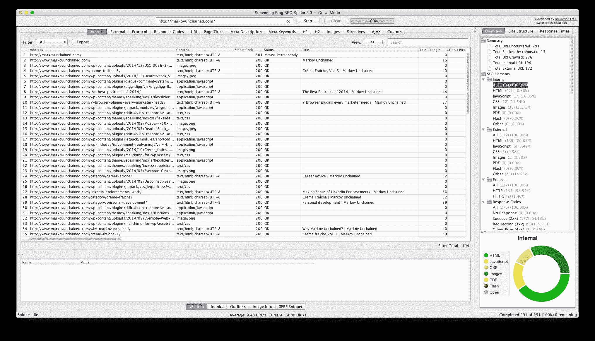

为您的站点运行报告，并将结果导出为. csv 文件。然后将文件上传(或粘贴)到谷歌电子表格中。

《尖叫的青蛙》会给你很多工作，由你来选择哪些信息与你的分析最相关。以下是我觉得有用的数据点及原因。

*   URL (duh)
*   标题(关键词)
*   标题长度(字符)
*   元描述(关键字)
*   元描述长度(字符)
*   字数
*   H1 和 H2 标题(关键词)

我将更详细地讨论这些要点，并在本教程的后面详细解释它们为什么重要。

### 从谷歌分析中提取数据

一旦你在电子表格中收集了所有的 URL，是时候获取更多的数据，并把它添加到你的电子表格中。正如我在开始提到的，我使用谷歌电子表格，因为它允许你从谷歌分析中提取数据。下面是怎么做的。

首先，进入你的电子表格中的附加组件菜单，确保你安装了谷歌分析(如果你没有安装，使用**附加组件>获取附加组件…** 来启用它)。

选择**附加组件>谷歌分析>创建新报告:** 

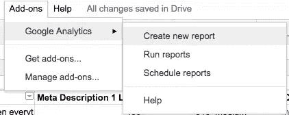

将出现一个新窗口，其中有几个选项:

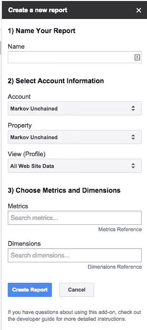

*   命名您的报告(例如“MySite.com 唯一页面浏览量”)
*   选择您正在收集统计数据的站点
*   选择您将使用的指标和维度——在我们的示例中，指标将是*唯一页面浏览量*和维度*页面* 

点击**创建报告**，将出现一个新的表格，其中包含您刚刚创建的配置的详细信息:

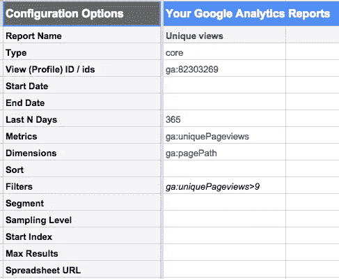

您可以使用此工作表来更改报告的某些详细信息。

例如，在上面的例子中，我将报告设置为从一年前的分析中收集数据( **Last N Days** 字段)，并且只包括至少有 10 次独立访问的页面(通过将 *ga:uniquePageviews > 9* 添加到 **Filters** 字段)。

当你对自己的配置满意时，选择**附加组件>谷歌分析>运行报告。** 

根据站点的大小和报告的配置，这可能需要几分钟的时间，但最终您应该会得到一个包含您所请求的数据的新工作表。

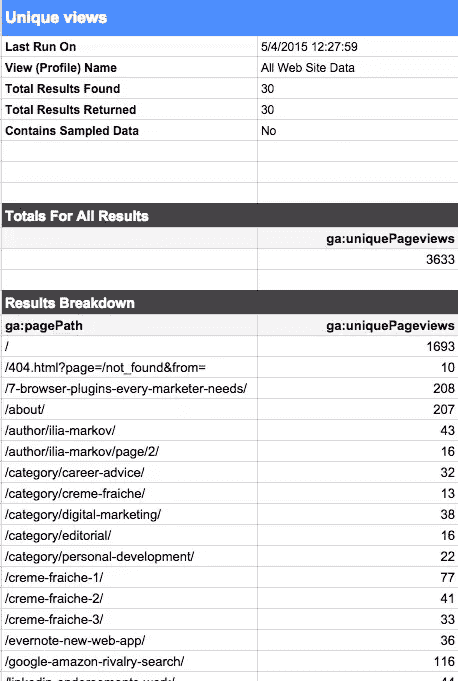

这只是一个小例子，说明通过从分析中提取数据可以实现什么。改进您的分析的最简单的方法是添加更多的指标，以下是您应该考虑的一些指标:

*   **(唯一)访问:**在上面的例子中已经包括了这一点
*   **入口:**在分析你的登陆页面的性能时非常有用
*   **跳出率:**了解哪些页面的跳出率高/低，为什么
*   **页面上的时间:**了解你的内容的哪一部分引人入胜，让访问者一直读到最后

### 收集关于社交分享的数据

带着你从尖叫青蛙那里得到的网址列表，前往 [SharedCount](http://sharedcount.com) 并使用批量上传功能。注意:你需要登录才能使用它，注册是免费的。

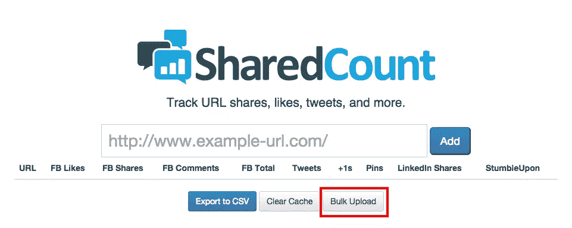

运行报告并将其导出到。csv 文件快速添加到您的电子表格中。

SharedCount 向你提供来自脸书、Twitter、Google+、LinkedIn、Pinterest 和 StumbleUpon 的统计数据，但保留哪一个供你审计取决于你自己。对于我的网站，我发现 Twitter、脸书、G+和 LinkedIn 是最相关的。

## 步骤 2:将所有 SEO 数据放在一个地方

到目前为止，您应该有大量数据分散在电子表格的不同部分。是时候把它们结合起来，这样你就可以更快地分析和得出真知灼见。

这就是我们要做的。

#### 请注意:我们将在本节中大量使用 VLOOKUP 函数，所以如果你不确定它是如何工作的，最好[看一段初级视频](https://www.youtube.com/watch?v=-WAEzokHSJM)。

选择一个工作表作为所有数据的主工作表。当然，这可能是一个新的工作表，但是您上传来自尖叫青蛙的数据的工作表也是一个很好的候选，因为您无论如何都需要从这个数据开始。

很有可能尖叫青蛙收集的一些网址对你的审计是不需要的。

例如，由于我使用 WordPress，有大量的作者、类别和标签存档的 URL，这是我不需要的。

使用谷歌电子表格中的过滤功能来隐藏这些条目(它们仍然在电子表格中，只是不在显眼的地方)。下面是怎么做的。

选择单元格范围，点击**过滤器**按钮:

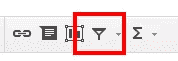

单击您在要应用过滤器的列的标题行中看到的小下拉按钮。

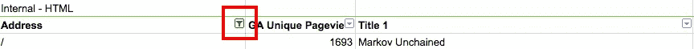

将出现一个新对话框。在文本区输入您想要过滤的文本，然后点击**清除。**然后点击**确定。**它应该是这样的。

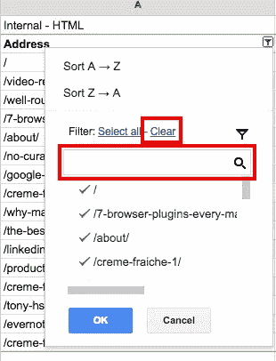

接下来，为 Google Analytics 数据的每个指标添加一列。在示例 1 中，我们只收集了唯一浏览量的数据，所以我将只添加一列。

使用 VLOOKUP 从相关工作表中获取数据。我在做这件事时遇到的一个问题是，尖叫的青蛙给了你完整的网址，而谷歌分析删除了你的基本域名。

这使得运行 VLOOKUP 更加困难。不过我在 [SpreadsheetPro](http://spreadsheetpro.net/removing-the-first-x-number-of-characters-from-a-string-in-excel-and-google-spreadsheets/) 上找到了一个简单的方法来解决这个问题。它是这样工作的。

使用 RIGHT()函数(它在 Excel 和 Google 电子表格中都有效)从给定单元格中的文本字符串的末尾提取一些字符。

因为你想从一开始就删除一定数量的字符，所以你需要使用这个(假设你要删除的 URL 位于单元格 B1 中，所以相应地改变):

=RIGHT(B1，LEN(B1)-要删除的字符数)

LEN()是另一个公式，它给出特定字符串的长度(以字符为单位)。

例如，我在这个例子中使用的域名——markovunchained.com，当您添加“http://www”时，正好是 30 个字符长因此，我需要编写以下内容:

=右(B1，LEN(B1)-30)

这是我对表中的所有 URL 都这样做时的样子。

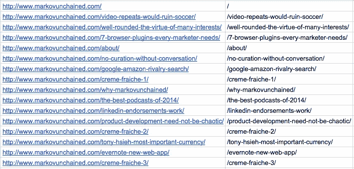

现在，做这个 VLOOKUP 并把你的分析数据添加到主页面上就容易多了。请记住，您可以**隐藏**列(通过右键单击它们),这些列在您的分析中并不需要，只是用于您的公式。

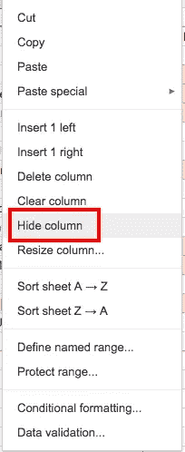

现在，对 SharedCount 数据重复相同的过程。呜！完成准备阶段，然后进入分析部分。

## 第三步:审核和分析你的内容

在这一步中，你将进行核心分析，了解什么可行，什么不可行，什么需要重复、改进和/或彻底废弃。下面是你可以用收集到的数据做些什么。

### 检查 SEO 元素

您之前运行的尖叫青蛙报告提供了关于对您的搜索引擎性能有影响的基础的有价值的信息。复习你所掌握的信息，找出并改正常见的错误。这些都是你应该学习的元素。

#### 标题、标题和元描述

这些对你的 SEO 非常重要，因为它们引导搜索引擎，告诉他们你的内容是关于什么的。因此，在给定的页面中包含你的焦点关键词是很重要的。

此外，每个元素都有细微差别，您也应该努力做到正确。

**标题**出现在搜索结果中。这是您应该将最重要和最相关的关键字定位到您的页面的地方。

**元描述**是出现在搜索结果中的一小段文字。也许比用关键字填充更重要的是，你必须确保它是为人类阅读而写的。你不仅会让你的访问者高兴，而且还有可能提高你在搜索结果中的排名(因为:你写了一个好的描述- >更多的人在看到你的网站时点击它- >更高的点击率=向搜索引擎发出关于你的内容的好信号)。

你的**标题**是你应该考虑瞄准所谓的长尾关键词的地方。试图对具有巨大搜索量(以及随之而来的流量)的基本关键词进行排名是非常具有挑战性的。另一方面，有数百个，甚至数千个竞争力较低的短语，仍然可以带来良好的流量，也有助于在那些难以排名的搜索词上获得优势。

### 标题和元描述长度

你应该始终记得留意你的标题和描述的长度，因为搜索引擎通常会选择每个特定字段的一部分来显示和截断其余部分。

用户能看到多少也取决于他们使用的屏幕。让你的元标签太长，这就是你可能得到的。

对于这两个区域的最佳大小存在许多意见。title 标签的黄金中间值是 50-55 个字符，绝对最大值是 70(如果超过这个值，它肯定会被截断)。对于元描述，大多数专家认为 150-160 个字符是最佳长度。

使用条件格式突出显示标题和描述字符超过最佳长度的页面。为此我开发了一个颜色编码系统。这是我用的标签。

*   绿色–55 个字符或更少
*   黄色–56-70 个字符
*   红色–70 多个字符

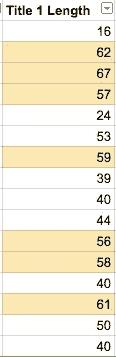

#### 内容、关键词和内部链接

审核过程让你有机会从上往下看你的内容，确保它是有趣的、吸引人的和相关的。

你提到的目标关键词是足够多还是太多？你有没有在你的内容中针对长尾关键词每页少于三到四次？

最后，确保你有足够的内部链接在每一页。在同一个网站中链接到至少两到三个页面是一个很好的策略。

始终致力于链接到深层资源，如博客帖子和内容提供。重定向到你的核心页面之一(主页，关于等)。)应该只在绝对必要的时候做。

#### 分析你最好的内容

有了来自 Google Analytics 和 SharedCount 的信息，你可以找到你真正击中要害的地方。

将这些数据与额外的信息层(如字数和搜索流量)结合起来，可以给你带来难以置信的洞察力。这里有几个例子。

#### 大多数社交分享的理想内容长度

使用这个技巧，你可以决定你的文章应该有多长，以最大化社交分享的数量。

首先，决定如何对长度进行分类。我推荐以下标签:

*   少于 500 字:短
*   500-1000 字:中等
*   1000 多字:长

创建新列并使用双 IF 公式。在我的电子表格上，看起来是这样的:

=IF(G3<500，“短”，IF(G3<1000，“中”，“长”))

最后，您应该会得到这样的结果:

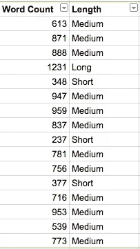

创建另一个列来汇总所有社交共享。

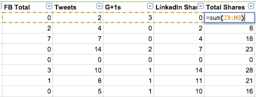

现在，是时候创建一个数据透视表来合并这两组数据了。在谷歌电子表格中选择你的整个数据范围，进入**数据>数据透视表**，一个新的数据表和对话窗口将会出现。

使用我的例子，我选择**分组依据:长度**和**显示:总份额**以及选项*汇总依据:平均值:* 

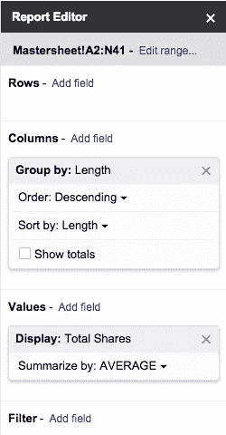

最后，为了更好地可视化您的发现，使用数据透视表中的数据创建一个图表，下面是我的图表。

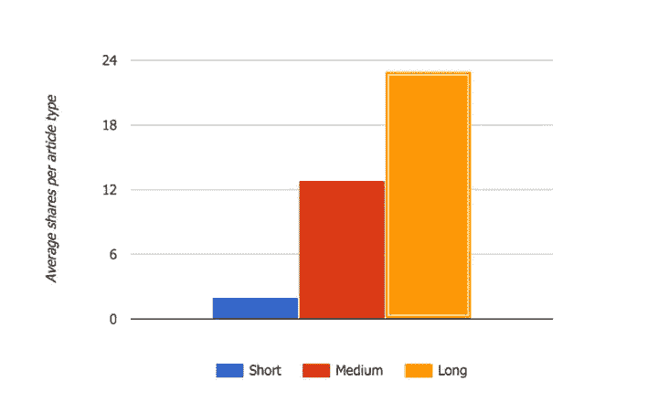

不出所料，较长的文章通常比较短的文章获得更多的份额。您可以使用相同的技术来查看哪些被更多的人阅读(通过使用独特的浏览量而不是总分享量)，但我会让您自己尝试。

#### 在你的网站上发布的最佳时间

使用同样的技术，你还可以发现发布内容的最佳时间，以便获得最多的访问和/或分享。为此，您需要提取关于发布日期的信息，并手动找出每个日期对应的星期几。

注意:我确信有一种自动化的方法可以做到这一点。只是还没找到。如果你知道怎么做，请在评论里告诉我。

#### 分析登录页面性能

谷歌不再公布你的访问者用来访问你的网站的确切搜索条件，但这并不意味着没有办法扣除这些信息。

首先，你必须在[谷歌站长工具](https://www.google.com/webmasters/)上注册你的网站。

在**搜索流量>搜索查询**下，你可以了解一些你正在排名的关键词，以及你的页面在这些关键词中的排名。

但是从您的内容审计中可以得出更有用的结论。

理想情况下，您已经在使用登录页面来定位特定的关键字。

从 Google Analytics 获取关于从这些页面进入你的网站的人数的数据(相关的指标被称为*入口*)。分析哪些表现好，看看他们的排名有多好的目标关键字。不要忘记也使用谷歌网站管理员工具。

看看这些网页，找出你在结构、内容等方面做得好的地方。从分析中收集更多的数据，并查看它们在反弹、平均网站停留时间等方面的表现。

## 第四步:用审计来指导你的搜索引擎优化策略

利用内容审计的最佳方式是采用战略方法，并使用您的发现来制定战略。我对我的内容使用四个通用桶:

*   *保持原样* 
*   *提高* 
*   *巩固* 
*   *删除* 

如果你对某个内容的表现感到满意，它是最新的、相关的、高质量的，就让它保持原样吧。

如果你的内容有一段时间没有更新，出现了新的信息和研究，或者文章在预定的关键词方面做得不太好，请标记它以进行改进。因为你的时间和资源是有限的，所以确保优先处理你要做的事情。

有些内容放在一起可能会更好。如果你有关于类似主题的文章，但在搜索排名中表现不佳，你可以考虑将它们合并成一个更深入的资源。

对于一些有大量内容的网站，最好的策略可能是从网站地图上删除一些内容。这样你就可以让搜索引擎机器人只关注那些你认为对 pagerank 最有益的内容。

## 结论

内容审计非常有用，因为它可以让你转移注意力，从更高的层面了解网站的表现。

如果你的网站已经存在一段时间了，你可能会惊讶地发现不止一个 SEO 错误或者遗漏了旧文章的信息。

每年经历一次或两次这个过程还会让你优先考虑如何花时间改进你的网站，并且毫无疑问，会给你提供大量关于如何改进网站的新想法。

## 分享这篇文章