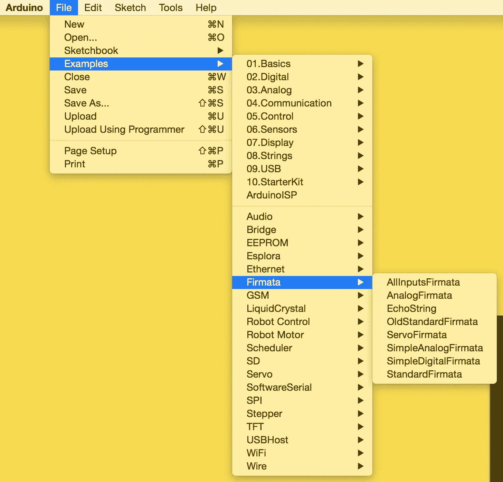
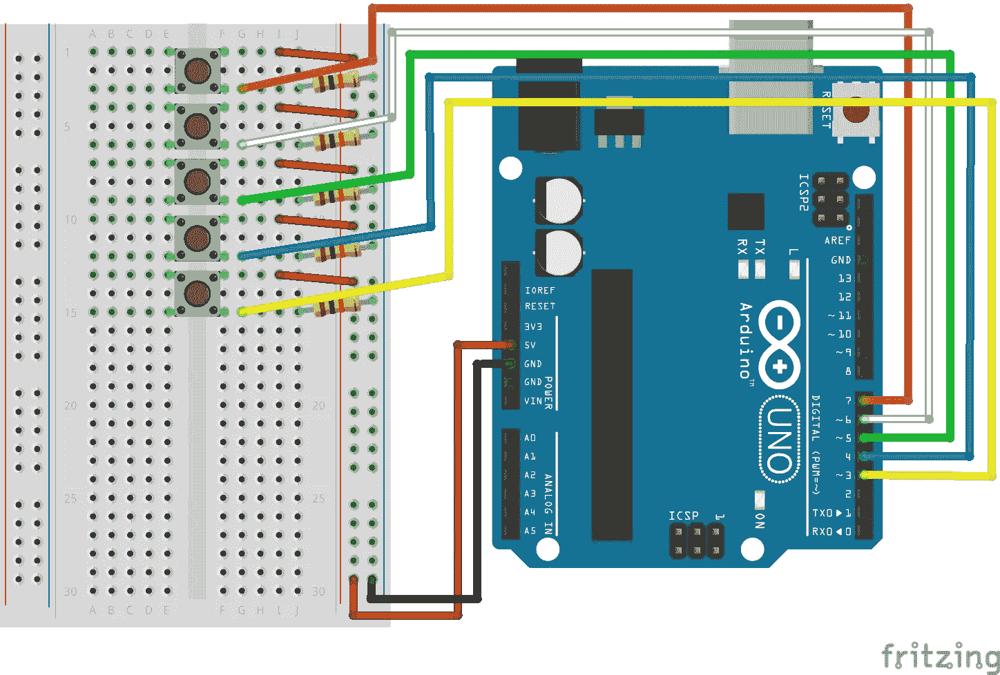
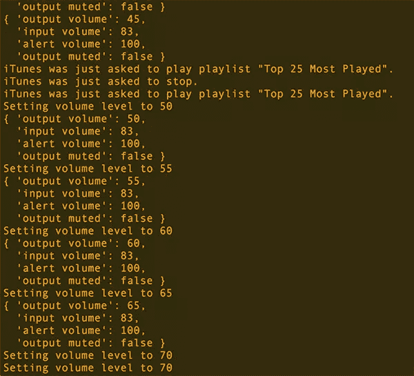

# 使用 Node.js 和 Arduino 遥控您的 Mac

> 原文：<https://www.sitepoint.com/remote-control-mac-node-js-arduino/>

Arduinos 和 Node.js 的结合让我们可以做很多意想不到的事情。在本文中，我将展示如何通过 Arduinos、Node.js 和 AppleScript 为 Mac 创建一个遥控器。

如果你是结合 Arduinos 和 Node.js 的新手，我之前已经介绍过[打开 LED 灯](https://www.sitepoint.com/controlling-arduino-nodejs-johnny-five/)和[在 LCD 文本显示器上显示 web API 数据](https://www.sitepoint.com/web-apis-on-arduino-lcd/)。

我们的 Arduino 遥控器会增加和减少我们 Mac 的音量，告诉我们的 Mac 播放我们选择的 iTunes 播放列表，并设置它停止 iTunes 上正在播放的任何内容(很可能是那个播放列表！).

请记住，本演示提供了在 Mac 上直接访问命令的功能——如果您提供了过多的访问权限，这可能会被滥用或有害！把它留给个人使用，而不是大的公司项目。

## 设置我们的 Arduino

确保您已经在 Arduino 主板上安装了 StandardFirmata sketch，因为我们将使用 johnny-five 库向我们的 Arduino 发送指令。只有首先安装了 StandardFirmata，这种方法才有效:



我们为该演示设置的 Arduino 试验板如下所示:



## 我们的服务器代码

对于这个演示，我们的 Node.js 服务器代码相对来说比较简短:

```
var five = require('johnny-five'),
      board = new five.Board(),
      exec = require('child_process').exec,
      btn1, btn2, btn3, btn4, btn5,
      currentVolLevels = {};

  board.on('ready', function() {
    console.log('Arduino board is ready!');

    btn1 = new five.Button(7);
    btn2 = new five.Button(6);
    btn3 = new five.Button(5);
    btn4 = new five.Button(4);
    btn5 = new five.Button(3);

    btn1.on('down', function(value) {
      askiTunes('play playlist \"Top 25 Most Played\"');
    });

    btn2.on('down', function(value) {
      askiTunes('stop');
    });

    btn3.on('down', function(value) {
      setVolumeLevel(currentVolLevels['output volume'] + 5);
    });

    btn4.on('down', function(value) {
      setVolumeLevel(currentVolLevels['output volume'] - 5);
    });

    btn5.on('down', function(value) {
      toggleMute();
    });

    getVolumeLevels();
  });

  function getVolumeLevels() {
    exec("osascript -e 'get volume settings'", function(err, stdout, stderr) {
      if (!err) {
        var levels = stdout.split(', ');

        levels.forEach(function(val,ind) {
          var vals = val.split(':');

          if (vals[1].indexOf('true') > -1) currentVolLevels[vals[0]] = true;
          else if (vals[1].indexOf('false') > -1) currentVolLevels[vals[0]] = false;
          else currentVolLevels[vals[0]] = parseInt(vals[1]);
        });
        console.log(currentVolLevels);
      }
    });
  }

  function setVolumeLevel(level) {
    console.log('Setting volume level to ' + level);
    exec("osascript -e 'set volume output volume " + level + "'",
      function() {
        getVolumeLevels();
      });
  }

  function toggleMute() {
    var muteRequest = currentVolLevels['output muted'] ? 'without' : 'with';
    console.log('Toggling mute to ' + muteRequest + ' muted');

    exec("osascript -e 'set volume " + muteRequest + " output muted'", function() {
      getVolumeLevels();
    });
  }

  function askiTunes(event, callback) {
    exec("osascript -e 'tell application \"iTunes\" to "+event+"'", function(err, stdout, stderr) {
      console.log('iTunes was just asked to ' + event + '.');
    });
  }
```

## 这段代码解释了

现在是文章最重要的部分——所有这些代码意味着什么！让我们回顾一下所有的东西是如何组合在一起的。

为了与我们的 Arduino 板接口，我们使用 johnny-five。我们首先设置 johnny-five 模块和 Arduino 板。然后我们定义变量来存储我们的五个按钮。

```
var five = require('johnny-five'),
      board = new five.Board(),
      btn1, btn2, btn3, btn4, btn5,
```

我们还设置了我们的`exec()`函数，它允许我们从 Node.js 运行 AppleScript 命令。

```
exec = require('child_process').exec,
```

当 johnny-five 让我们知道我们的板可以使用时，我们运行一个快速的`console.log`并定义我们的五个按钮和它们所连接的 Arduino 引脚(7、6、5、4 和 3)。

```
board.on('ready', function() {
    console.log('Arduino board is ready!');

    btn1 = new five.Button(7);
    btn2 = new five.Button(6);
    btn3 = new five.Button(5);
    btn4 = new five.Button(4);
    btn5 = new five.Button(3);
```

在每个按钮的`down`事件上，我们运行不同的函数。在第一个按钮上，我们运行了向 iTunes 发送请求的`askiTunes()`函数。在我们的例子中，它请求我们的“播放次数最多的前 25 名”播放列表。

```
btn1.on('down', function(value) {
    askiTunes('play playlist \"Top 25 Most Played\"');
  });
```

`askiTunes()`函数使用`exec()`函数执行 AppleScript 的第一部分。我们所有的 AppleScript 命令都使用命令`osascript`在 Node.js 中运行。

我们的`askiTunes()`函数运行命令`osascript -e 'tell application \"iTunes\" to "+event+"'`。这给了我们一个通用命令，告诉 iTunes 做一些事情。我们可以通过`event`变量来调整这个东西是什么。

完成后，我们运行一个`console.log`来确认事件已经被识别。

```
function askiTunes(event, callback) {
    exec("osascript -e 'tell application \"iTunes\" to "+event+"'", function(err, stdout, stderr) {
      console.log('iTunes was just asked to ' + event + '.');
    });
  }
```

我们的第二个按钮运行同样的`askiTunes()`函数，但是我们传递给它`stop`事件来停止当前正在播放的任何东西。

```
btn2.on('down', function(value) {
    askiTunes('stop');
  });
```

如果我们有更多的按钮可以玩，我们可以添加按钮到`pause`和一个通用的`play`事件，它将恢复当前队列中的内容。

我们的第三和第四个按钮通过一个我们称之为`setVolumeLevel()`的功能来调高和调低 Mac 的音量。

```
btn3.on('down', function(value) {
    setVolumeLevel(currentVolLevels['output volume'] + 5);
  });

  btn4.on('down', function(value) {
    setVolumeLevel(currentVolLevels['output volume'] - 5);
  });
```

`setVolumeLevel()`使用我们在代码开头定义的对象`currentVolLevels`。这个对象存储了 AppleScript 从我们的 Mac 返回的四个不同的值。该数据的一个示例如下:

```
{
  'output volume': 5,
  'input volume': 83,
  'alert volume': 100,
  'output muted': false
}
```

如您所见，我们在 JSON 对象中获得了一个名为`'output volume'`的值。我们在第三个按钮上将音量增加 5(增加)，在第四个按钮上将音量减少 5(减少)，然后将该值传递给函数以实现更改。

我们的`setVolumeLevel()`函数使用`set volume output volume`的 AppleScript 命令将 Mac 的音量更改为我们已经通过的音量。我们还运行一个控制台日志，以便跟踪卷级别的请求。

```
function setVolumeLevel(level) {
    console.log('Setting volume level to ' + level);
    exec("osascript -e 'set volume output volume " + level + "'", function() {
      getVolumeLevels();
    });
  }
```

当我们的 AppleScript 代码已经运行时，我们调用`getVolumeLevels()`，这是我们的函数，它设置我们所有的`currentVolLevels`值并跟踪我们 Mac 的音量。在我们完成最后一个按钮后，我会详细解释。

前面提到的最后一个按钮运行`toggleMute()`功能，将我们的 Mac 静音和取消静音。

```
btn5.on('down', function(value) {
    toggleMute();
  });
```

我们的`toggleMute()`函数查看`currentVolLevels['output muted']`并使用`osascript -e 'set volume without output muted'`关闭静音或`osascript -e 'set volume with output muted'`打开静音。如果`currentVolLevels['output muted']`是`true`，那么我们把关键字设置为`'without'`去掉静音。如果是`false`，我们设置关键字为`'with'`开启静音。

```
function toggleMute() {
    var muteRequest = currentVolLevels['output muted'] ? 'without' : 'with';
    console.log('Toggling mute to ' + muteRequest + ' muted');

    exec("osascript -e 'set volume " + muteRequest + " output muted'", function() {
      getVolumeLevels();
    });
  }
```

这个 AppleScript 调用完成后还会运行`getVolumeLevels()`函数。在这个函数中，我们运行`osascript -e 'get volume settings'`来检索 Mac 的当前音量。它以下列格式返回这些值:

```
"output volume:5, input volume:83, alert volume:100, output muted:false"
```

在我们的`getVolumeLevels()`中，我们获取在`stdout`变量中返回的值，并使用如下所示的代码将其格式化为存储在`currentVolLevels`中的 JSON 对象:

```
function getVolumeLevels() {
    exec("osascript -e 'get volume settings'", function(err, stdout, stderr) {
      if (!err) {
        var levels = stdout.split(', ');

        levels.forEach(function(val,ind) {
          var vals = val.split(':');

          if (vals[1].indexOf('true') > -1) currentVolLevels[vals[0]] = true;
          else if (vals[1].indexOf('false') > -1) currentVolLevels[vals[0]] = false;
          else currentVolLevels[vals[0]] = parseInt(vals[1]);
        });
        console.log(currentVolLevels);
      }
    });
  }
```

JSON 转换是专门为我们上面收到的字符串定制的。首先，我们将每个键/值对拆分成一个名为`levels`的数组，方法是在每个逗号之间进行拆分，从而创建一个如下所示的数组:

```
['output volume:5', 'input volume:83', 'alert volume:100', 'output muted:false']
```

然后我们遍历数组中的每个字符串，将它整齐地重新排列到我们的`currentVolLevels` JSON 对象中。为此，我们使用`:`字符作为拆分器，将每个键/值对拆分成一个名为`vals`的数组。`vals[0]`将是每个键，如`output volume`，而`vals[1]`包含实际音量值。我们使用`vals[0]`作为我们的 JSON 对象键，例如`currentVolLevels[vals[0]] = something`。

我们需要记住一个因素，并考虑返回的数量级别。这些值中的一个是真/假值(我们的静音/非静音状态)，而其余的是数字。所有这些都表示为字符串，需要进行转换。我们将通过一个简单的 if 语句来实现这一点，该语句查看`vals[1]`的值。我们检查字符串`"true"`和字符串`"false"`。如果我们找到其中任何一个，我们将`currentVolLevels`中的相关值设置为匹配的布尔值。如果两者都不是，我们将字符串解析成一个整数，表示一个数字音量级别，并将其存储在`currentVolLevels`中。

最终结果看起来是这样的:

```
{
  'output volume': 5,
  'input volume': 83,
  'alert volume': 100,
  'output muted': false
}
```

## 我们的 Package.json 文件

在这种情况下，我们的`package.json`文件相当简单，主要需要确保我们已经安装了 johnny-five 和 serialport npm 模块。

```
{
    "name": "nodemaccontroller",
    "version": "1.0.0",
    "description": "Code to control your Mac via Node",
    "main": "index.js",
    "dependencies": {
      "johnny-five": "^0.8.76",
      "serialport": "^1.7.1"
    },
    "author": "Patrick Catanzariti"
  }
```

## 我们的遥控器在工作

使用`npm install`安装上述所有依赖项，确保 Arduino 已连接并运行 StandardFirmata sketch，然后运行`node index.js`。一旦运行它，按几个按钮，你应该能够控制你的 Mac！当它运行时，它将在控制台中显示如下:



我们的 Arduino 遥控器在工作

## 其他可能性

如果你不是一个超级音乐迷，或者你不使用你的 Mac 来听音乐，有很多其他的 AppleScript 快捷方式可以连接你的 Node.js 服务器。这里有一些想法。

### 启动应用程序

```
function openCalculator() {
    exec("osascript -e 'tell application \"Calculator\" to launch'");
  }
```

### 打开新的 Finder 窗口

```
function openFinderWindow() {
    exec("osascript -e 'tell app \"Finder\" to make new Finder window'");
  }
```

### 让您的 Mac 说话！

```
function tellMacToSpeak() {
    exec("osascript -e 'say \"I am completely operational, and all my circuits are functioning perfectly.\"'");
  }
```

## 结论

你现在有了一个制作你自己的个人 Mac 外设的好方法！如果你想让它作为一个便携式设备工作，你可以设置 websockets、socket.io 或一个基本的 HTTP 服务器，给你的 Arduino Wi-Fi 或一些其他方式远程访问你的 Node.js 服务器(或使用类似于[粒子光子或粒子电子微控制器](https://www.particle.io/)，然后根据远程命令进行这些`exec()`调用(请注意，`exec()`可能会被误用！).这里有很多非常有趣的项目机会！一如既往，如果你真的做了什么好东西，请在评论中留言或者在 Twitter 上联系我( [@thatpatrickguy](http://www.twitter.com/thatpatrickguy) )，我很乐意去看看！

## 分享这篇文章