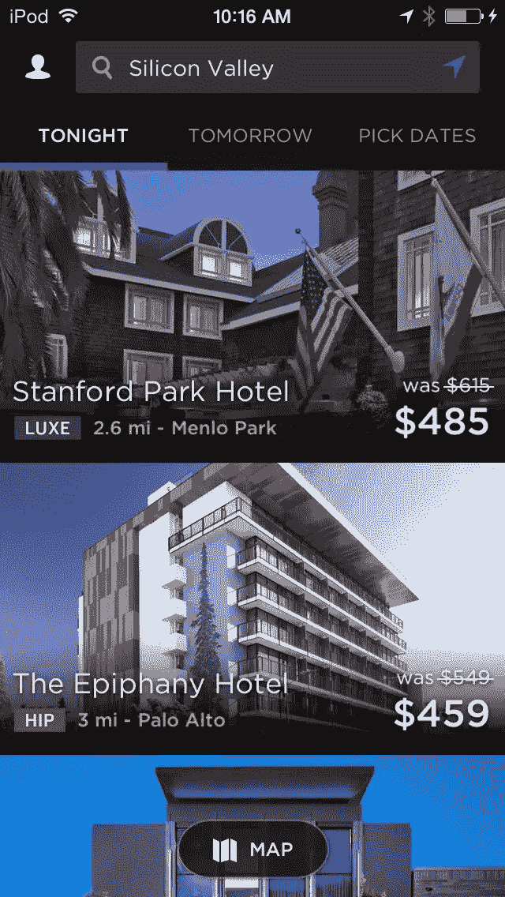
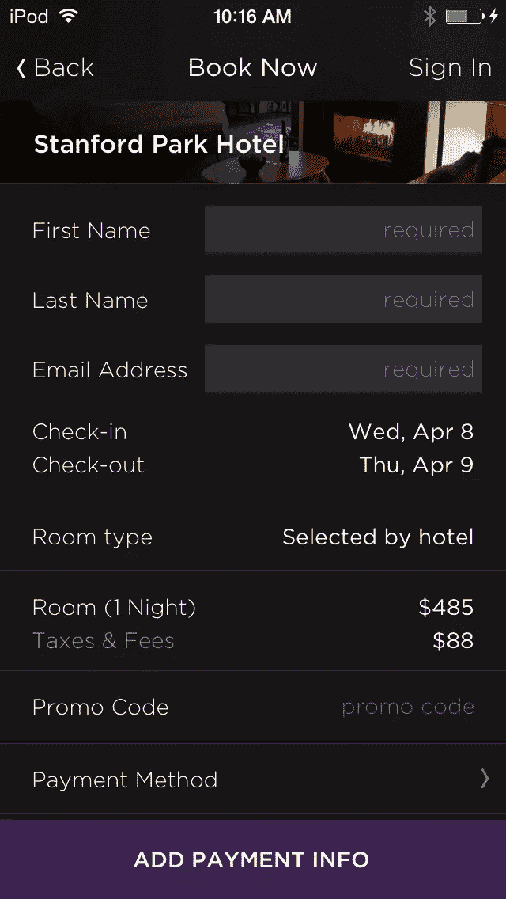
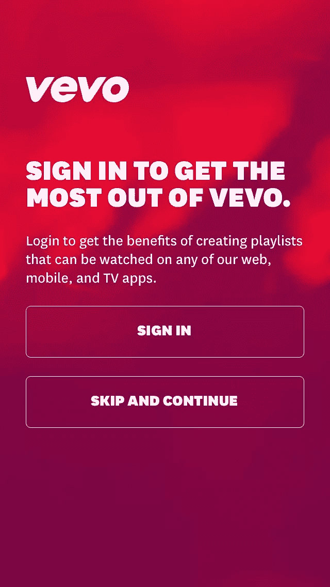
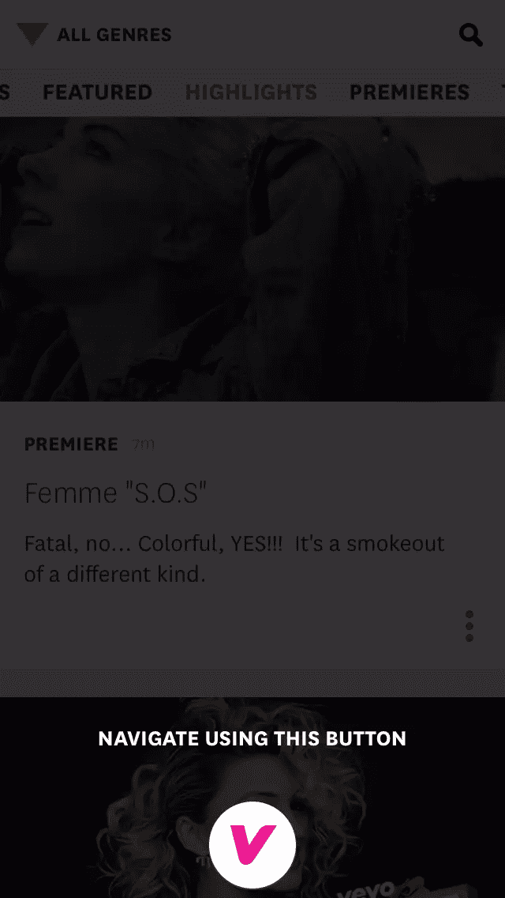
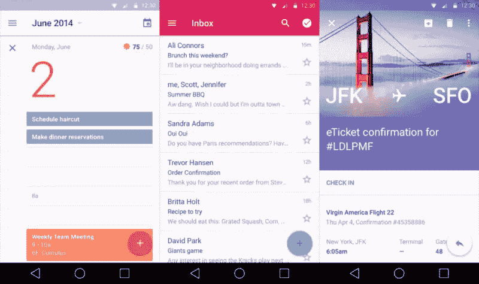
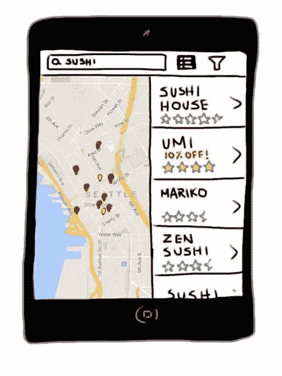
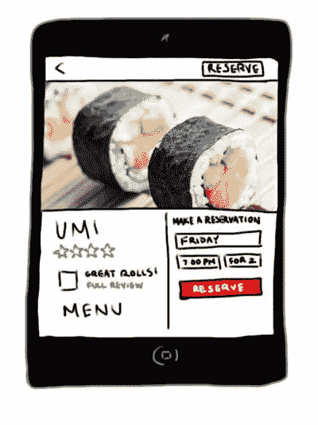
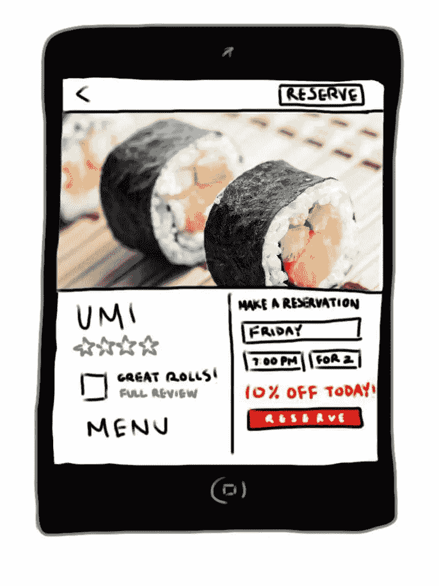

# 7 移动 UX 你现在可能正在犯的错误

> 原文：<https://www.sitepoint.com/7-mobile-ux-mistakes/>

在移动 UX 上做出改变可能是一个棘手的过程，尤其是如果你有网络背景的话。在移动中，开发人员有更多的约束，包括屏幕面积、关注时间和 UI 控件限制。改善移动体验总是一个充满尝试和错误的学习过程，所以这个列表将帮助你避开常见的陷阱，让你步入正轨。

## 错误 1。假设您的用户需要登录

每个人都知道让用户登录有很多好处，但这也是你的用户的一个重大痛点。每个应用程序或服务都要输入成百上千次相同的个人数据，谁不感到不耐烦呢？

大多数应用程序的解决方案是允许用户暂时跳过注册，以便他们可以试用应用程序并获得价值感。

虽然这种方法足够有效，足以让苹果将其纳入用户体验指南，但进一步削减漏斗可能会带来巨大的好处。如果注册是一个痛点，为什么不看看当你完全消除这种痛苦时会发生什么？

*   
*   
*   

酒店预订应用程序 hotel night 使用 A/B 测试创建了一个变种，用户可以在不创建专用帐户的情况下完成交易。以前，所有用户都必须在完成预订前登录。

他们跟踪了跳出率和完成的交易，发现将登录设为可选实际上增加了 15%的预订量。

为了鼓励用户继续注册，他们可以选择注册以保存他们的数据，使未来的预订更加方便快捷。

HotelTonight 通过消除创造价值所需的一个常见痛点显著减少了摩擦，然后通过给予用户额外的激励来激励他们解决这些相同的痛点。事实证明，取消登录对该应用来说是一个伟大的决定，因为他们能够提高他们的底线。

## 错误二。假设你需要用“价值”轰炸用户

对应用程序优化的两个最常见的建议是包含入门教程，并允许用户跳过注册。每一个都应该给用户一个应用程序的巨大价值感，确保他们知道他们可以用你的应用程序做什么，以及他们将从中获得什么。

尽管这些技术通常可以提高签到和参与度， [Vevo](http://www.vevo.com/) 想看看移除这些技术是否可以提高他们的 KPI。他们假设删除教程会增加登录和注册的用户数量。

在测试了两个变体:一个有，一个没有之后，结果很明显。没有教程，多了 10%的用户登录，多了 6%的注册。

*   
*   
*   
*   

Vevo 认为教程是不必要的，因为他们有足够的品牌，大多数下载应用程序的用户都熟悉应用程序的核心价值主张。他们不需要说服。

相反，用户只是想尽快开始观看音乐视频，而教程只是被证明是一个障碍。他们的新流程给出了两套简单的指令，然后你就可以开始了。

试图通过教程让用户相信可能的价值会阻碍他们了解应用程序的实际价值。确保你的应用程序不会做同样的事情。

## 错误三。复制其他应用程序体验

上述两个错误来自于执行普遍接受的良好实践，而没有询问它们是否可以改进。虽然在线建议通常是一个很好的起点，但每个应用和产品在目标、受众、价值、功能等方面都是独一无二的。对别人起作用的东西并不意味着它会自动对你产生同样的效果。

不要实施网上找到的示例测试，而是从客户反馈中得出你的想法。创建调查，阅读评论，收集尽可能多的定性数据，了解用户希望看到哪些改变。使用这些数据，针对你的应用程序创建新的测试想法，然后使用 A/B 测试来确定它们对你的受众的影响。

团队应该努力使用 A/B 测试作为一个强大的工具来获得量化的数据，以确定一个变化是提高了你的 KPI 还是降低了它们，而不是仅仅跟随别人的脚步。

## 错误四。低估了移动设备的更新时间

与网络相比，人们很容易忘记移动设备上的任何变化需要多长时间才能渗透到最终用户。

在网络上，信息存储在公司控制的服务器上，因此进行更改轻而易举。如果生产中出现错误，开发人员可以快速恢复到之前的状态，或者进行调整并立即部署。

在手机上，做出改变并不容易。

由于应用程序是托管在客户的手机上，任何更新都需要经历一个漫长而艰难的旅程才能到达客户手中。开发完成后，任何更改都要经过一个漫长的 app store 审核过程。

更新通常还需要不情愿的用户手动更新他们手机上的应用程序，这本身就是一个挑战。这使得你推出的东西经过彻底的测试和证明能够改善体验，而不是降低体验变得更加重要。

为了帮助减少令人尴尬的失误的机会，使用 beta 测试，或者 A/B 分割测试来获得用户反应的反馈。Beta 测试允许开发人员通过调查、电子邮件、评论或崩溃报告的形式获得定性反馈。A/B 测试帮助您确定定量的因果关系，向您展示每个变化是如何影响您的核心指标的。

在移动设备上修复错误可能是一个痛苦的过程，但是将测试作为开发周期的一部分可以帮助减轻很多风险。

如果确实发生了错误，您还可以使用[功能标记](http://www.apptimize.com/product?utm_source=Guest%20Blog&utm_medium=blogpost&utm_content=Mobile%20UX%20Mistakes&utm_campaign=Guest%20Post)和[即时更新](http://www.apptimize.com/product?utm_source=Guest%20Blog&utm_medium=blogpost&utm_content=Mobile%20UX%20Mistakes&utm_campaign=Guest%20Post)来创建补丁并快速平息任何即将发生的灾难。

## 错误 5。在没有用户反馈和数据的情况下进行重新设计

随着[材料设计](http://www.google.com/design/spec/material-design/introduction.html)成为热门的新事物，很自然会有重新设计你的应用程序以防止它过时的冲动。不幸的是，彻底检查一个应用程序可能是一个巨大的错误，导致 KPI 暴跌。

最终，转化远比美学更重要。几乎所有人都希望有一个可以转化的应用程序，而不是一个在失败时看起来很有吸引力的应用程序。

因此，与其进行大规模的改革，不如进行和测试渐进的改变，让你更接近你的目标，这才是明智之举。

这甚至比网络上的*更关键。正如我们在上面的#4 中提到的，一旦你推送了一个更新，你就不能简单地回复到以前的状态。发布后，用户会一直使用你的产品，直到应用商店决定是时候了。你不希望用户在这段时间删除你的应用吧？*

 *做一次大的检修是有风险的，而且会迫使你从头开始新设计的 [CRO](http://en.wikipedia.org/wiki/Conversion_rate_optimization) 。

不要冒险做出大的改变，而是从你的用户那里得到他们想看到的反馈。有了用户的反馈，你可以设计测试来逐步重新设计你的应用程序，并观察每一个改变的效果。

## 错误 6。没有优先考虑响应。

如今，78%的用户希望移动应用程序的加载速度与移动网站一样快，甚至更快，并且他们采取的任何行动都能得到近乎即时的响应。与网络不同，移动用户希望快速完成任务，因为他们经常在旅途中。无论是在上班途中，还是在聚会上查看手机，移动用户很容易因为各种干扰而变得不工作。

因此，速度和响应能力至关重要。任何不必要的延迟或混乱都会给用户创造机会，让他们脱离应用程序，专注于他们面前任何其他闪亮的物体。即使他们打算以后再回来，用户也经常会忘记，再也不会回来，在几个星期没有使用后删除应用程序。你错过了机会。

不仅要关注加快处理时间，还要关注设计者用户流，这样他们就能尽快从你的应用中得到他们想要的东西。否则，你会增加用户分心的风险，或者放弃你的应用而选择竞争对手的。

## 错误 7。在关键转换前不立即取悦用户

 *任何应用都有少量的关键转换点。它们可以是注册、预订、观看的视频、给出的评论/评级、购买或任何数量的其他信息。

每个应用程序都有自己的一套关键转换，对实现总体目标至关重要。为了确保你的应用程序能够最大限度地提高推动公司目标的转化率，在重要的一步之前，专注于创建一个让用户愉悦的流程。

我们的一个客户，一个餐馆预订应用程序，发现通过改变交易的位置，他们的预订增加了 28.1%。该团队希望为其用户合并特殊交易，但不确定在流程中的哪个位置合并最好。他们假设将它们放在搜索结果中的餐馆旁边会增加这些餐馆的点击率和预订率。

然而，A/B 测试很快否定了这一理论。

*   
*   

该团队发现，被推广的餐馆的浏览量增加了，但预订量和回头率却下降了。

突出交易实际上是把用户拒之门外。他们的结论是，用户可能认为交易伤害了应用程序的编辑完整性，将推广的内容放在了前面，而不是拥有一个公平的市场。

*   
*   

在第二次测试中，他们发现使用惊喜策略将预订率提高了 28.1%。相反，在用户已经阅读了该餐馆的评论后，他们通知用户该餐馆正在进行(相同的)促销。他们决定在用户预订之前*立即进行交易，这使得惊讶和高兴的用户更有可能转化。*

另一个让用户高兴的例子是，在帮助用户完成他们想要的任务后，要求用户对市场上的应用程序进行评级或评论。利用这种兴奋的时刻也可以让用户将你的品牌与积极的情绪联系起来，这将有助于为你的应用程序开发品牌冠军。

#### 结论

记住这些常见的 UX 错误将有助于你在改进产品时朝着正确的方向发展。请记住，改善用户体验是一个持续的过程。使用测试将帮助你从每个不可避免的错误中学习，并让你走上成功的轨道。* 

## *分享这篇文章**