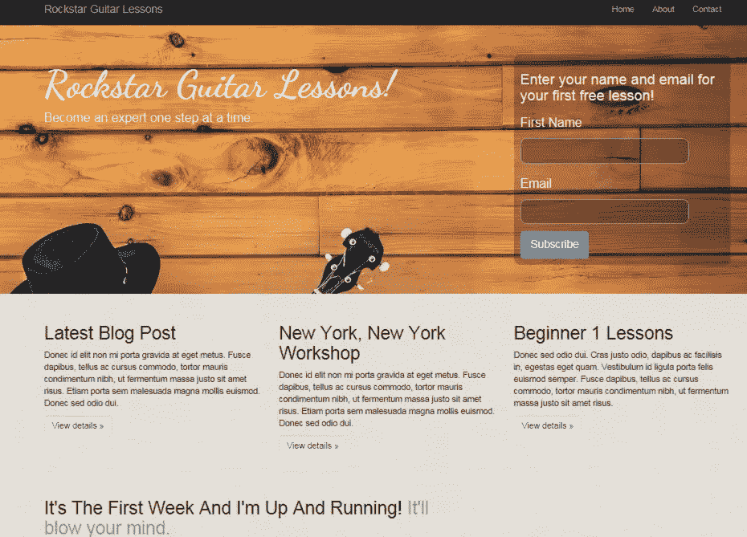
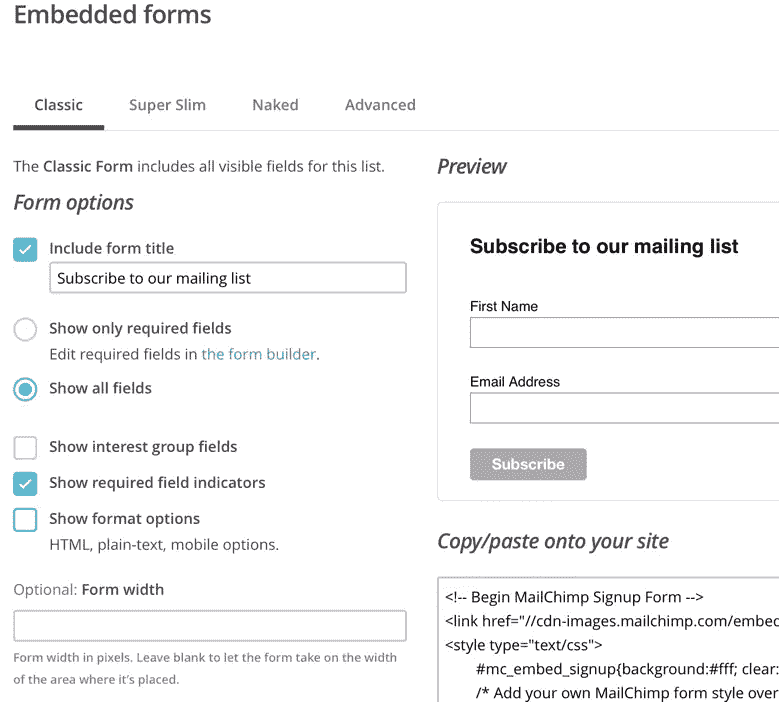
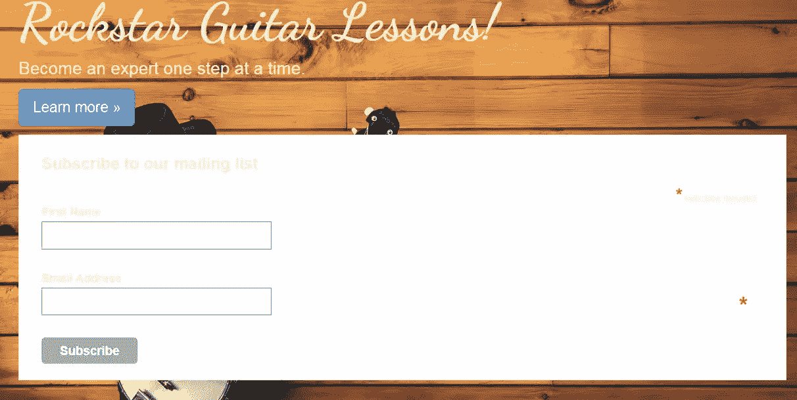
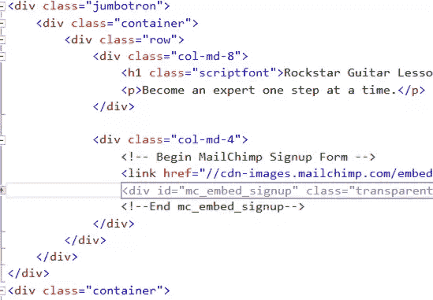
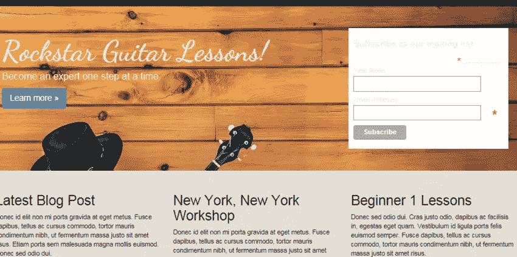
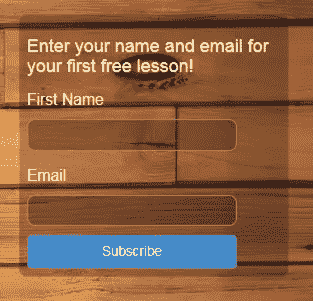
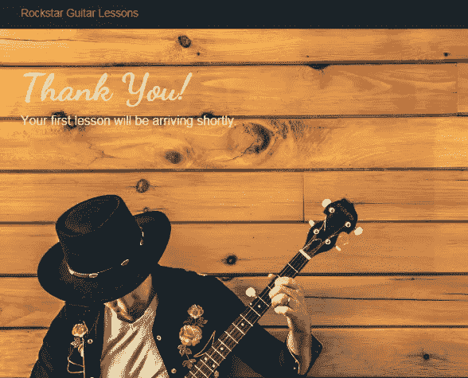
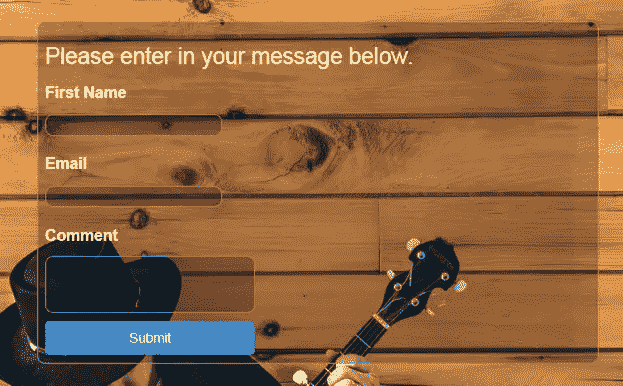

# Visual Studio 社区 2015:添加电子邮件和联系人页面

> 原文：<https://www.sitepoint.com/design-develop-microsoft-community-2015-email-contact-pages/>

*本文由[微软](http://aka.ms/visualstudiocomm2013)赞助。感谢您对使 SitePoint 成为可能的赞助商的支持。*

欢迎回到我们的系列文章，使用微软的现代 IDE: Visual Studio Community 2015 为客户快速设计和构建一个有吸引力的功能性网站。如果你错过了上一期，请点击这里查看。

现在 Andy 已经有了网站首页，他可以开始构建网站了。这将涉及实施一个电子邮件注册表格，以及联系和关于网页。

我们将从电子邮件注册表单开始，然后进入创建一些额外的页面。电子邮件注册表格将在首页的前面和中心。它将被放置在大屏幕的右侧，那里有一些空闲的空间。

对于电子邮件注册表单，我们将使用 MailChimp 中的一个表单。Andy 正在使用他的客户的 MailChimp 帐户，并将使用一个现有的列表作为主页。每个在主页上注册的人都会进入这个列表。

我们的注册表单将设计成这样:



## 从 MailChimp 获取代码

登录 MailChimp 后，选择您想要添加联系人的列表。单击注册表单。单击嵌入表单。经典款就可以。客户想要获取名字和电子邮件地址。MailChimp 实际上将这些作为默认设置，所以我们可以让事情保持原样。

您在 MailChimp 中的屏幕应该如下所示:



复制 HTML。这是我们要粘贴到大屏幕上的内容。在大屏幕上的这条线下面:

```
&amp;lt;p&amp;gt;&amp;lt;a class=&amp;quot;btn btn-primary btn-lg&amp;quot; href=&amp;quot;#&amp;quot; role=&amp;quot;button&amp;quot;&amp;gt;Learn more &amp;amp;raquo;&amp;lt;/a&amp;gt;&amp;lt;/p&amp;gt;
```

添加 MailChimp 表单代码。如果您运行该应用程序，它应该如下所示:



显然这不是我们想要的样子，但这是一个很好的起点。从这里开始，我们将使用 Bootstrap 格式化表单，并正确对齐所有内容。

## 使用引导程序修改注册表单

按照目前的格式，我们已经失去了我们的响应式设计。网站标题应该在左边，而注册表单应该在右边。它们也应该在同一行。Bootstrap 将帮助我们恢复正常。

我们可以增加几列。用一个`包围大屏幕`

 `以及带有`的 MailChimp 代码`

 `。这种格式意味着网站标题文本将占据大屏幕的 2/3，而注册格式将占据 1/3。

您的代码应该如下所示:



记住，Bootstrap 使用的是 12 网格系统。8 + 4 = 12，你可以从这些数字中看出我们是如何得到 2/3 和 1/3 的。

如果你运行这个网站，你会看到我们有两个栏目，我们的响应式网页设计又回来了。



接下来，我们将开始润色注册表单 UI，使其更好地融入网站。

## UI 抛光

与其经历许多小步骤，不如显示 MailChimp 修改完成后的样子。然后我们就可以穿过去了。用以下代码替换您当前的 MailChimp 代码:

```
&amp;lt;!-- Begin MailChimp Signup Form --&amp;gt;
&amp;lt;link href=&amp;quot;//cdn-images.mailchimp.com/embedcode/classic-081711.css&amp;quot; rel=&amp;quot;stylesheet&amp;quot; type=&amp;quot;text/css&amp;quot;&amp;gt;
&amp;lt;div id=&amp;quot;mc_embed_signup&amp;quot; class=&amp;quot;transparent-background soft-border-radius&amp;quot;&amp;gt;
&amp;lt;form action=&amp;quot;#&amp;quot; method=&amp;quot;post&amp;quot; id=&amp;quot;mc-embedded-subscribe-form&amp;quot; name=&amp;quot;mc-embedded-subscribe-form&amp;quot; class=&amp;quot;validate&amp;quot; target=&amp;quot;_blank&amp;quot; novalidate&amp;gt;
  &amp;lt;div id=&amp;quot;mc_embed_signup_scroll&amp;quot;&amp;gt;
  &amp;lt;h3&amp;gt;Enter your name and email for&amp;lt;br /&amp;gt; your first FREE lesson!&amp;lt;/h3&amp;gt;

  &amp;lt;div class=&amp;quot;mc-field-group&amp;quot;&amp;gt;
  &amp;lt;label for=&amp;quot;mce-FNAME&amp;quot; class=&amp;quot;not-bold&amp;quot;&amp;gt;First Name &amp;lt;/label&amp;gt;
  &amp;lt;input type=&amp;quot;text&amp;quot; value=&amp;quot;&amp;quot; name=&amp;quot;FNAME&amp;quot; class=&amp;quot;transparent-background soft-border-radius&amp;quot; id=&amp;quot;mce-FNAME&amp;quot;&amp;gt;
  &amp;lt;/div&amp;gt;
  &amp;lt;div class=&amp;quot;mc-field-group&amp;quot;&amp;gt;
  &amp;lt;label for=&amp;quot;mce-EMAIL&amp;quot; class=&amp;quot;not-bold&amp;quot;&amp;gt;Email &amp;lt;/label&amp;gt;
  &amp;lt;input type=&amp;quot;email&amp;quot; value=&amp;quot;&amp;quot; name=&amp;quot;EMAIL&amp;quot; class=&amp;quot;required email transparent-background soft-border-radius&amp;quot; id=&amp;quot;mce-EMAIL&amp;quot;&amp;gt;
  &amp;lt;/div&amp;gt;

  &amp;lt;div id=&amp;quot;mce-responses&amp;quot; class=&amp;quot;clear&amp;quot;&amp;gt;
  &amp;lt;div class=&amp;quot;response&amp;quot; id=&amp;quot;mce-error-response&amp;quot; style=&amp;quot;display:none&amp;quot;&amp;gt;&amp;lt;/div&amp;gt;
  &amp;lt;div class=&amp;quot;response&amp;quot; id=&amp;quot;mce-success-response&amp;quot; style=&amp;quot;display:none&amp;quot;&amp;gt;&amp;lt;/div&amp;gt;
  &amp;lt;/div&amp;gt;    
  &amp;lt;!-- real people should not fill this in and expect good things - do not remove this or risk form bot signups--&amp;gt;
  &amp;lt;div style=&amp;quot;position: absolute; left: -5000px;&amp;quot;&amp;gt;&amp;lt;input type=&amp;quot;text&amp;quot; name=&amp;quot;b_f27f671242f9376d66eb9034e_a5f924c1e8&amp;quot; tabindex=&amp;quot;-1&amp;quot; value=&amp;quot;&amp;quot;&amp;gt;&amp;lt;/div&amp;gt;

  &amp;lt;input type=&amp;quot;submit&amp;quot; class=&amp;quot;btn btn-primary btn-lg&amp;quot; value=&amp;quot;Subscribe&amp;quot; name=&amp;quot;subscribe&amp;quot; /&amp;gt;

  &amp;lt;/div&amp;gt;
  &amp;lt;/form&amp;gt;
&amp;lt;/div&amp;gt;
&amp;lt;!--End mc_embed_signup--&amp;gt;
```

我在代码中添加了几行空格，以更好地帮助分解表单进行讨论。

我们将创建一些自定义类，包括`not-bold`、`transparent-background`和`soft-border-radius`。我们在`site.css`中定义了这些类。

由于 MailChimp 的大部分代码与我们从 MailChimp 复制的代码相同，所以让我们讨论一下这些自定义类是怎么回事。

`not-bold`定义如下:

```
.not-bold {
    font-weight:normal;
}
```

它只是删除粗体字母。这用于降低表单字段标签的重要性。我们的行动呼吁是加粗的。如果表单域标签也是加粗的，眼睛会很难找到焦点。更糟糕的情况是:人们简单地放弃并绕过我们的注册表单。

下面的截图展示了`.not-bold`的使用



向表单背景和输入字段提供半透明，为我们的设计提供更多的深度。它被定义为:

```
.transparent-background {
   background-color: rgba(0, 0, 0, 0.25)
}
```

`rgba`简单来说就是红、绿、蓝、阿尔法。Alpha 设置不透明度。该值越低，越透明。值的范围可以从`0`到`1`。

使我们的表单和输入字段用圆角来表达一点优雅的细节。该类别被定义为:

```
.soft-border-radius {
  border-radius: 10px;
}
```

最后，我们有一个全宽的蓝色按钮。在这里帮助我们。蓝色不仅提供了很好的对比，吸引了人们的眼球，而且它的大尺寸让人们无法抗拒点击的诱惑。`.max-width`定义为:

```
.max-width { 
width:100%; 
}
```

将上面的类添加到 site.css 中，并粘贴到上面的表单代码中，应该会产生与上面所示相同的注册表单。

## 感谢页面

当用户注册时，最好提供一个确认页面，让他们知道一切都很顺利。有多少次，你注册了某人的名单，却收到了一个极其缺乏想象力的感谢页面？

安迪知道他的客户是一个真正的艺术家，并希望再接再厉。这意味着不要吝啬使用一些股票感谢页面。然而，我们将通过在主页上使用相同的配色方案和主题来保持一致性。

要创建感谢页面，请打开`Controllers/HomeController.cs`。添加以下内容:

```
public IActionResult ThankYou()
    {
        ViewBag.Message = &amp;quot;Your thank you page.&amp;quot;;

        return View();
    }
```

因为这是一个 MVC 的 app，所以当有人输入`/Home/ThankYou`的时候，就会打到上面的方法。当然，我们不希望任何人在感谢页面中输入，因为这将作为注册我们客户的电子邮件列表的确认。

我们需要一个视图来提供这个方法。打开`Views/Home`文件夹，复制一份`Contact.cshtml`。将复制的文件重命名为`ThankYou.cshtml`。

我们的感谢页面基本上将是主页上的大屏幕。清除`ThankYou.cshtml`中的代码，只留下顶部的`ViewBag`代码。粘贴以下内容:

```
&amp;lt;div class=&amp;quot;jumbotron jumbotron-tall&amp;quot;&amp;gt;
&amp;lt;div class=&amp;quot;container&amp;quot;&amp;gt;
    &amp;lt;h1 class=&amp;quot;scriptfont&amp;quot;&amp;gt;Thank You!&amp;lt;/h1&amp;gt;
    &amp;lt;p&amp;gt;Your first lesson will be arriving shortly.&amp;lt;/p&amp;gt;
&amp;lt;/div&amp;gt;
&amp;lt;/div&amp;gt;
```

制作联系页面的副本使我们能够充分利用现有的页面结构。我们将拥有我们熟悉的导航和页脚，而不需要做任何事情。

你可能注意到了这个类`jumbotron-tall`。这是一个新的类，它为感谢页面增加了一些额外的高度。否则，我们最终会得到一个很短的横跨顶部的长条。不会给人留下太深刻的印象。

较大的图像看起来很棒，并给我们的艺术家(即客户)一些额外的播放时间。

`jumbotron-tall`定义为:

```
.jumbotron-tall {
min-height:800px;
}
```

您的最终感谢页面应该如下所示:



## 联系页面

我们想给潜在客户一个机会，通过他的网站直接联系我们的客户。这是联系人页面出现的地方。我们将按照上面的基本框架来创建联系页面。我们的最终页面将如下所示:



打开`Views/Home`，你会注意到已经有一个`Contact.cshtml`。就像我们之前对感谢页面所做的一样，清除除了顶部的`ViewBag`代码之外的所有内容。我们又要用大屏幕了。我们将像以前一样使用两列，只是右边是空的。这让我们的联系方式更加靠左。

我们将引入一些新的 CSS 类，它们也将影响我们的主页。第一节课是:

```
.button-xl {
width:100%;
margin-top:10px;
}
```

这是专门针对表单底部的蓝色按钮的。添加这个类将创建一个更宽的按钮，并在按钮顶部和评论框底部之间增加一点空间。我们也可以将这个类应用到我们的主页按钮上。

接下来是对现有类的修改:

```
.soft-border-radius {
border-radius: 10px;
border: 1px solid #999
}
```

对于这个表单，我们将使用类似于 MailChimp 表单代码的结构。但是我们不会使用 MailChimp 的 CSS，因为我们没有使用他们的注册表单。

MailChimp CSS 提供的一个特性是输入字段周围的深色边框。现在已经没有了。为了补偿，我们在软边界半径内添加了一个边界，这将有同样的效果。

在联系人表单中，我们添加了一个评论`textarea`框。这个框可以有滚动条，默认情况下滚动条是白色的。这种较亮的颜色会与我们较暗的颜色形成强烈的对比。为了帮助滚动条更好地融合，我们需要修改`textarea`:

```
textarea {
scrollbar-arrow-color:#333;
scrollbar-base-color:#333;
scrollbar-darkshadow-color:#333;
scrollbar-shadow-color:#333;
color:#fffad5;
}
```

注意`fffad5`的颜色，它将我们的注释字段文本从黑色变为更亮的黄色。我们对输入字段做了同样的事情:

```
input {
color:#fffad5;
}
```

以上所有 CSS 类都放入`site.css`。

现在我们可以继续讨论表单代码了。

```
&amp;lt;div class=&amp;quot;jumbotron&amp;quot;&amp;gt;
&amp;lt;div class=&amp;quot;container&amp;quot;&amp;gt;
 &amp;lt;div class=&amp;quot;row&amp;quot;&amp;gt;
 &amp;lt;div class=&amp;quot;col-md-8&amp;quot;&amp;gt;
   &amp;lt;div class=&amp;quot;transparent-background soft-border-radius&amp;quot;&amp;gt;
   &amp;lt;form action=&amp;quot;#&amp;quot; method=&amp;quot;post&amp;quot; class=&amp;quot;form-format&amp;quot; target=&amp;quot;_blank&amp;quot; novalidate&amp;gt;
   &amp;lt;div&amp;gt;
   &amp;lt;h2&amp;gt;Please enter in your message below.&amp;lt;/h2&amp;gt;

   &amp;lt;div&amp;gt;
   &amp;lt;label for=&amp;quot;FNAME&amp;quot;&amp;gt;First Name &amp;lt;/label&amp;gt;&amp;lt;br /&amp;gt;
   &amp;lt;input type=&amp;quot;text&amp;quot; value=&amp;quot;&amp;quot; name=&amp;quot;FNAME&amp;quot; class=&amp;quot;transparent-background soft-border-radius&amp;quot; id=&amp;quot;FNAME&amp;quot;&amp;gt;
   &amp;lt;/div&amp;gt;
   &amp;lt;div&amp;gt;
   &amp;lt;label for=&amp;quot;EMAIL&amp;quot;&amp;gt;Email &amp;lt;/label&amp;gt;&amp;lt;br /&amp;gt;
   &amp;lt;input type=&amp;quot;email&amp;quot; value=&amp;quot;&amp;quot; name=&amp;quot;EMAIL&amp;quot; class=&amp;quot;transparent-background soft-border-radius&amp;quot; id=&amp;quot;EMAIL&amp;quot;&amp;gt;
   &amp;lt;/div&amp;gt;

   &amp;lt;div&amp;gt;
   &amp;lt;label for=&amp;quot;COMMENT&amp;quot;&amp;gt;Comment &amp;lt;/label&amp;gt;&amp;lt;br /&amp;gt;
   &amp;lt;textarea value=&amp;quot;&amp;quot; cols=&amp;quot;30&amp;quot; rows=&amp;quot;3&amp;quot; name=&amp;quot;comment&amp;quot; class=&amp;quot;transparent-background soft-border-radius&amp;quot; id=&amp;quot;COMMENT&amp;quot;&amp;gt;  &amp;lt;/textarea&amp;gt;
   &amp;lt;/div&amp;gt;
   &amp;lt;div&amp;gt;
   &amp;lt;input type=&amp;quot;submit&amp;quot; class=&amp;quot;btn btn-primary btn-lg button-xl&amp;quot; value=&amp;quot;Submit&amp;quot; name=&amp;quot;submit&amp;quot; /&amp;gt;
   &amp;lt;/div&amp;gt;
   &amp;lt;/div&amp;gt;
   &amp;lt;/form&amp;gt;
   &amp;lt;/div&amp;gt;
   &amp;lt;/div&amp;gt;

 &amp;lt;div class=&amp;quot;col-md-4&amp;quot;&amp;gt;
 &amp;lt;/div&amp;gt;
 &amp;lt;/div&amp;gt;
 &amp;lt;/div&amp;gt;
&amp;lt;/div&amp;gt;
```

您可能会注意到与 MailChimp 表单的一些相似之处。这实际上是该表单的修改版本。联系表单位于左栏，宽度为`col-md-8`。这产生了一个 2/3 宽的列，因为我们的右列是 col-md-4。请记住，8 + 4 = 12，这是 Bootstrap 中构成 12 列网格的列数。

## 摘要

安迪的客户现在有了一个很好看的注册表单，肯定会吸引注册。他还添加了一个联系方式，与网站的整体主题融为一体。在这一点上，安迪的客户开了一个好头。

接下来，我们将为客户添加一种购买课程的方式。Andy 的客户认识到移动设备现在是网络的重要组成部分。他希望确保移动网站提供出色的用户体验。这其中的一部分是在有新的课程时发送通知。

安迪有一些令人兴奋的功能来建立网站。我们将继续跟进，并在他的肩膀上观察一切进展。

## 分享这篇文章``