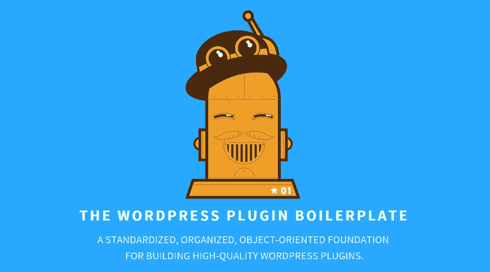

# 使用 WordPress 插件样板加速开发

> 原文：<https://www.sitepoint.com/wordpress-plugin-boilerplate/>

WordPress 插件开发的低学习曲线意味着没有一个确定的方法来构建插件。一个插件可以像一个简单的文件 [Hello Dolly](https://wordpress.org/plugins/hello-dolly/) 一样简单，也可以根据需要构造成复杂的结构来满足不同的需求和功能。 [WordPress 插件样板](http://wppb.io/)旨在提供一个标准化的、高质量的基础来构建你的下一个令人敬畏的插件。

在本系列的第一部分中，我们将深入了解样板文件，包括文件和文件夹的结构以及样板文件的代码组织。



## 背景

WordPress 插件样板最初是由 Tom McFarlin 提出的，目的是提供一种标准化的、面向对象的方法来构建 WordPress 插件。因为样板文件是建立在[插件 API](https://codex.wordpress.org/Plugin_API) 之上的，并且遵循 WordPress 推荐的[编码标准](https://codex.wordpress.org/WordPress_Coding_Standards)和[文档标准](https://make.wordpress.org/core/handbook/inline-documentation-standards/)，你可以确信你是安全的。

样板文件最近更新到版本 3.0.0，在代码组织方面对样板文件本身进行了重大改进，并进一步分离了插件中的关注点。如果您已经熟悉使用以前版本的 boilerplate (v2.6.2)开发您的插件，您可能需要花一些时间来重新学习最新版本中的新内容，其中包括新的文件夹结构。

这个样板文件不再由汤姆·麦克法林本人维护(在撰写本文时)，他已经把火炬传给了德文·罗宇胜。开发仍在照常进行，所以如果你有任何问题，请随时[在](https://github.com/DevinVinson/WordPress-Plugin-Boilerplate/issues) [GitHub 库](https://github.com/DevinVinson/WordPress-Plugin-Boilerplate)报告一个。当然也欢迎投稿。

## 给你自己一份拷贝

获得 WordPress 插件样板文件的最简单的方法是克隆 git 库本身。

```
git clone https://github.com/DevinVinson/WordPress-Plugin-Boilerplate.git
```

或者您也可以从 GitHub 资源库下载一个 zip 副本。

由于 3.0.0 版本已经发布，插件不能简单的直接复制到你的`wp-content/plugins`里。这是因为插件的实际源代码并不包含在根目录中，而是实际驻留在名为`trunk`的子目录中。现在不要担心这个，我们将在本文的后面讨论新的文件夹结构。

关于如何正确安装样板文件的完整详细说明在`README.md`文件中有描述。简而言之，您可以:

*   将`trunk`目录复制到`wp-content/plugins`文件夹或
*   复制整个样板文件目录，然后创建一个从`trunk`子目录到`wp-content/plugins/<plugin-name>/`的符号链接。创建符号链接将取决于您使用的操作系统。

一旦你这样做了，现在你应该在管理面板的插件列表中找到一个名为`WordPress Plugin Boilerplate`的插件，假设你没有对样板文件本身做任何修改。只需激活插件，你就可以开始了！

### 使用在线生成器定制插件

一旦激活，你将拥有一个普通的插件，它实际上什么也不做——也就是说，还没有。您还需要运行搜索并替换整个样板文件的代码库，这个过程可能非常繁琐和耗时。幸运的是，有一个由恩里克·查韦斯建造的非官方发电机可以自动完成这个过程。只需前往 http://wppb.me/的[并完成页面底部的表格，就可以生成一份个性化的 WordPress 插件样板文件。](http://wppb.me/)

## 文件夹结构

让我们仔细看看 WordPress 插件样板 3.0.0 版本与旧版本相比是如何组织的。如前所述，实际的插件代码包含在名为`trunk`的子目录中，而不是根目录中。

这是为了遵循 WordPress 官方插件库中采用的标准，该库包含三个主目录，分别是`assets`、`branches`和`trunk`。样板文件已经提供了其中的两个，`assets`和`trunk`。

在撰写本文时，样板文件中包含了完整的目录和文件:

```
|-- plugin-name/
|   |-- assets/
|   |   |-- banner-772x250.png
|   |   |-- icon-256x256.png
|   |   |-- screenshot-1.png
|   |
|   |-- trunk/
|       |-- admin/
|       |   |-- css/
|       |   |   |-- plugin-name-admin.css
|       |   |-- js/
|       |   |   |-- plugin-name-admin.js
|       |   |-- partials/
|       |   |   |-- plugin-name-admin-display.php
|       |   |
|       |   |-- class-plugin-name-admin.php
|       |   |-- index.php
|       | 
|       |-- includes/
|       |   |-- class-plugin-name-activator.php
|       |   |-- class-plugin-name-deactivator.php
|       |   |-- class-plugin-name-i18n.php
|       |   |-- class-plugin-name-loader.php
|       |   |-- class-plugin-name.php
|       |   |-- index.php
|       | 
|       |-- languages/
|       |   |-- plugin-name.pot
|       |
|       |--  public/
|       |   |-- css/
|       |   |   |-- plugin-name-public.css
|       |   |-- js/
|       |   |   |-- plugin-name-public.js
|       |   |-- partials/
|       |   |   |-- plugin-name-public-display.php
|       |   |
|       |   |-- class-plugin-name-public.php
|       |   |-- index.php
|       |
|       |-- LICENSE.txt
|       |-- README.txt
|       |-- index.php
|       |-- plugin-name.php
|       |-- uninstall.php
|
|-- .gitignore
|-- CHANGELOG.md
|-- README.md
```

下面是对每个文件和文件夹的作用的一点解释:

*   `.gitignore`

    提供一个合理的默认值。git 忽略大多数不应该存在于 git 存储库中的东西。

*   `CHANGELOG.md`

    样板文件变更的标准变更记录，并注明变更日期。

*   `README.md`

    这是一本有用的入门指南，列出了安装说明，以及其他几个部分，如工具推荐和学分。

*   `assets`

    这个目录包含了推荐的资源，当你决定发布你的插件到 WordPress 插件库时，你需要提供这些资源。此目录中包含的所有图像都是推荐的发布分辨率。

*   `trunk`

    这是您将要开发的实际插件。有几个文件夹将管理功能和面向公众的功能的代码库分开。我们将详细介绍每个子目录所代表的内容。

    *   `admin`

        `admin`目录下包含三个目录，分别是`css`、`js`和`partials`。顾名思义，所有面向管理员的功能都应该放在这里。默认情况下，`plugin-name-admin.js`和`plugin-name-admin.css`会排队到您的`wp-admin`中。`class-plugin-name-admin.php`将提供通用功能，您可以在其中定义您的管理员特定的挂钩。

    *   `public`

        这个目录与`admin`目录非常相似，唯一的区别是`public`目录应该用来存储所有面向公众的功能代码库。

    *   `languages`

        一个起始的`.pot`文件，在这里你可以为你的插件提供翻译功能。

    *   `includes`

        这可能是几乎所有奇迹发生的地方。默认情况下包含五个起始类，我们将在下一节讨论。

    *   `LICENSE.txt`

        默认情况下包含 GPL v2 许可证的副本。

    *   `README.txt`

        插件自述文件的起点。这个文件很好的覆盖了所有你可以进一步填充的部分，以在 WordPress 插件库中提供一个好的插件页面。

    *   `plugin-name.php`

        你的插件的入口点。这里有一个通用的插件文件头，你可以根据自己的喜好进行修改。如果你需要在插件激活和/或去激活中包含某种功能，那么`register_activation_hook`和`register_deactivation_hook`也会在这个文件中注册。

## 包含的类别

如前所述，`trunk/includes`目录中提供了五个默认类。让我们来看看它们各自的功能:

*   `class-plugin-name-activator.php`

    这个类在插件激活期间被实例化。它只有一个静态方法，`activate()`被注册到`register_activation_hook`。当你发现自己需要激活插件时，比如创建自定义表格或者保存默认选项，就使用这个类。

*   `class-plugin-name-deactivator.php`

    `class-plugin-name-deactivator.php`的对应方。它也只包含一个静态方法，`deactivate()`,可以用来在插件停用期间运行任何功能。

*   `class-plugin-name-i18n.php`

    插件的 i18n 功能的起点。它有一个属性，`$domain`存储你的插件文本域。这个属性可以使用公共方法`set_domain()`来设置。最后，每当加载插件时，这个类中的方法`load_plugin_textdomain()`都会被调用。

*   `class-plugin-name-loader.php`

    可能是样板文件中最重要的类。它包含两个属性,`$actions`和`$filters`,插件中注册的所有钩子都将存储在这里。它提供了两个简单的包装函数，`add_action()`和`add_filter`，用于将动作或过滤器添加到`$actions`和`$filters`属性中。这不应该与 WordPress 默认的`add_action()`和`add_filter()`函数混淆，因为这个类实际上并没有直接注册它们。所有的钩子只会在另一个叫做`run()`的方法中被注册。

*   `class-plugin-name.php`

    将所有部分粘合在一起的类。它保存了关于插件的重要信息，比如插件名称和版本。另外，它将使用方法`load_dependencies()`加载依赖项，该方法将包括上述所有四个类，插件文本域将使用`set_locale()`方法设置。以前注册的所有管理和公共挂钩也可以在这里定义。

    这个类还提供了简单的`get`方法，比如返回插件名称的`get_plugin_name()`、返回当前插件版本的`get_version()`和保存`class-plugin-name-loader.php`实例的`get_loader()`。

## 结论

简而言之，WordPress 插件样板为插件开发者提供了一个极好的起点。它遵循推荐的 WordPress 编码标准以及 WordPress 文档标准，所以你知道你是从正确的地方开始的。此外，发布到 WordPress 插件库变得更加容易，因为样板文件已经提供了你需要的大部分内容。

一旦我们熟悉了代码组织和文件夹结构，我们将在本系列的第二部分探索如何使用 WordPress 插件样板开发一个真正的插件。

## 分享这篇文章