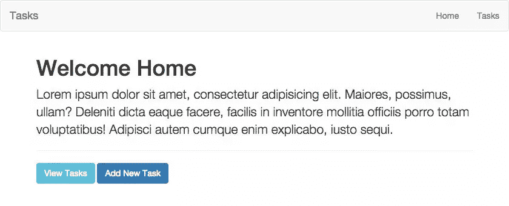
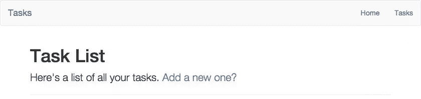

# 引导一个 Laravel CRUD 项目

> 原文：<https://www.sitepoint.com/bootstrapping-laravel-crud-project/>

在本教程中，我们将使用 Laravel 5 从头构建并运行一个简单的 CRUD 应用程序。


## 安装和设置

如果你已经精通 PHP，那么本节中的一些内容对你来说将是常识。无论如何，让我们过一遍。我们使用 Composer 创建了一个全新的 Laravel 5 安装。首先，`cd`进入你选择的目录。现在，运行以下命令:

```
composer create-project laravel/laravel MYPROJECT
```

如果你没有安装 Composer，你自然需要先[做第一步](https://www.sitepoint.com/re-introducing-composer/)，但是我推荐使用一个环境，比如 [Homestead Improved](https://www.sitepoint.com/quick-tip-get-homestead-vagrant-vm-running/) 来启动你的开发流程——它已经在全球范围内预装了 Composer。

名称“MYPROJECT”将是您的应用程序目录的名称。对于本教程，我只是称我的为“crud”。

## 首次启动和数据库配置

我们来整理一下数据库。

如果你不熟悉环境文件，我建议你在这里读一读它们。将来，当您准备推出一个需要更强大数据库的生产级应用程序时，它会对您有所帮助。不过现在，我们将只使用[SQLite](https://www.sitepoint.com/getting-started-sqlite3-basic-commands/)——一个基于文件的零配置数据库引擎。开箱即用，不需要配置任何东西，这使得像这样的测试应用程序很容易。

导航到`config`目录，打开`database.php`文件。将默认的数据库连接设置更改为`sqlite`，我们就可以开始工作了。在该文件中再向下滚动一点，您将看到实际的数据库连接。您会注意到 SQLite 利用了保存在根目录下的`storage`目录中的`database.sqlite`文件(可以通过`storage_path()`访问)。我们还没有这个文件，所以让我们在命令行中快速创建它:

```
touch storage/database.sqlite
```

确保存储文件夹可由 web 服务器写入。如果您正在使用我们的 [Homestead 改良版](https://www.sitepoint.com/quick-tip-get-homestead-vagrant-vm-running/)盒子，它会为您服务。

我们的数据库现在已经设置好了，我们准备运行一些 CRUD 操作。但是首先，让我们看看 Laravel 中的路由，以及一些刀片语法和设置一个基本模板。

## Artisan CLI 快速说明

[Artisan](https://laravel.com/docs/5.0/artisan) 是 Laravel 内置的命令行界面。它允许我们在开发过程中很好地与我们的应用程序交互。它附带了许多命令，让我们可以创建模型、控制器、数据库迁移，甚至执行手动 CRUD 操作。要查看命令列表，请在命令行中运行`php artisan`。从现在开始，我会经常使用`artisan`命令，所以请阅读文档以熟悉它。

## 资源丰富的路由

在`app/Http`目录中，您会发现一个名为`routes.php`的文件。routes 文件定义了应用程序中的大多数路由。默认情况下，已经定义了一些路线。让我们把它们全部删除，从头开始。对于本教程，让我们在一个简单的任务列表上运行 CRUD 操作。我们的应用需要两条主要路线:

*   主页路径——只显示普通主页的路径
*   我们的任务路径，它将是将要执行的 CRUD 操作的 RESTful 结构的基础。

在这一点上，我建议你仔细阅读 Laravel 5 中的[路由](https://laravel.com/docs/5.0/routing)。我将使用[命名的路由](https://laravel.com/docs/5.0/routing#named-routes)，以及控制器动作来管理输出。对于我们的主页，我们将只使用一个基本的 GET 路径:

```
Route::get('/', [
    'as' => 'home',
    'uses' => 'PagesController@home'
]);
```

注意，我使用了一个我们还没有的`PagesController`。不要担心，我们将很快使用`artisan`创建它。在我们开始之前，是时候阅读一下 [RESTful 资源控制器](https://laravel.com/docs/5.0/controllers#restful-resource-controllers)，以及它们通过`artisan`命令行界面的无痛生成。我们可以向控制器注册一个资源丰富的路由，如下所示:

```
Route::resource('tasks', 'TasksController');
```

根据 Laravel 的说法:

> 这个单一的路由声明创建了多个路由来处理资源上的各种 RESTful 操作。

记住所有这些，我们现在可以通过命令行创建两个控制器:

```
php artisan make:controller PagesController
php artisan make:controller TasksController
```

我们先打开`PagesController`。导航到`app/Http/Controllers/PagesController`，查看文件。你会注意到`artisan`为我们生成了一堆对 RESTful 动作有用的方法。我们将为我们的`TasksController`保留这些，但是对于我们的`PagesController`，我们现在只想要一个方法——`home`。删除所有方法，并创建 home 方法:

```
public function home()
{
    return 'Welcome home!';
}
```

刷新浏览器的主页，我们就到家了！到现在为止，你可能很兴奋进入好的东西，但是让我们首先谈论视图，拉几个资产，并且做一个基本的模板，所以我们的应用看起来很漂亮。

顺便提一下，如果您想使用 artisan CLI 创建一个控制器，并且希望它没有默认的方法，您可以像这样在命令中添加`--plain`标志:

```
php artisan make:controller YourController --plain
```

好吧，继续。

## 使用 Blade 的视图和基本模板

到目前为止，我们已经设置了一些路线，并向屏幕返回了一个无意义的字符串。虽然不多，但这是个开始。让我们返回一个视图，而不是返回一个字符串。[视图](https://laravel.com/docs/5.0/views)服务于你的应用程序的前端。把它们想象成纯粹的表象。我们希望视图只提供已经传递给它们的数据，稍后我们将看到如何将数据传递给视图。在`/resources`目录中，您会看到一个名为“views”的目录。这是我们保存观点的地方，也是我们能够引用它们的地方。让我们在这里做几件事:

1.  让我们创建一个名为`pages`的子目录，在其中创建一个名为`home.blade.php`的新文件。
2.  让我们创建另一个名为`layouts`的子目录，在其中创建一个名为`master.blade.php`的新文件。

如你所料，我们希望有某种主布局，这样我们就不必重复大块的 HTML。我们的应用程序中的不同页面将引用主布局视图，并将内容注入专用部分。为了 CSS 的方便，我们将引入 bootstrap，并起草一个基本的 HTML 文件:

```
<!doctype html>
<html lang="en">
<head>
<meta charset="UTF-8">
<meta name="viewport" content="width=device-width, initial-scale=1">
<title>Tasks</title>
<link rel="stylesheet" href="https://maxcdn.bootstrapcdn.com/bootstrap/3.3.2/css/bootstrap.min.css">
</head>
<body>

<nav class="navbar navbar-default">
  <div class="container-fluid">
    <div class="navbar-header">
      <a class="navbar-brand" href="#">Tasks</a>
    </div>
    <div class="nav navbar-nav navbar-right">
        <li><a href="#">Home</a></li>
        <li><a href="#">Tasks</a></li>
    </div>
  </div>
</nav>

<main>
    <div class="container">
        @yield('content')
    </div>
</main>

</body>
</html>
```

特别要注意这个文件的`@yield('content')`部分。这将允许我们引用任何模板页面中的内容部分，并在其中注入您想要的任何内容。在我们的`home.blade.php`文件中，我们现在可以有这样的内容:

```
@extends('layouts.master')

@section('content')

<h1>Welcome Home</h1>
<p class="lead">Lorem ipsum dolor sit amet, consectetur adipisicing elit. Maiores, possimus, ullam? Deleniti dicta eaque facere, facilis in inventore mollitia officiis porro totam voluptatibus! Adipisci autem cumque enim explicabo, iusto sequi.</p>
<hr>

<a href="{{ route('tasks.index') }}" class="btn btn-info">View Tasks</a>
<a href="{{ route('tasks.create') }}" class="btn btn-primary">Add New Task</a>

@stop
```

我们正在**扩展**主布局，并插入到**内容**部分。如您所见，刀片语法使这种事情变得轻而易举。我们将继续，但是你可以在这里阅读更多关于[刀片语法和模板的内容](https://laravel.com/docs/5.0/templates)。

回到我们的`PagesController`，我们现在可以将视图返回到主页。如果您阅读了关于视图的文档，您会知道事情就像这样简单:

```
public function home()
{
    return view('pages.home');
}
```

刷新你的浏览器，就可以了！



让我们现在去我们的`TasksController`吧。这一次，我们将保留通过`artisan`命令行自动生成的方法，原因如下:

1.  它们已经以一种宁静的方式为我们命名了。
2.  由于 Laravel 的资源丰富的路由，这些路由已经连接到各自的方法。

如果我们导航到`/tasks`，我们会看到一个空白页。那是因为我们的应用程序正在使用`index`方法，我们还没有任何东西在里面。仅仅通过简单的逻辑推理，我们就可以找出其他每个方法应该负责什么来适应 RESTful 结构:

*   `create`将是我们用来生成页面的方法，我们可以在其中创建新任务
*   `store`将是我们用来处理来自任务创建的 POST 数据的方法，并将它存储在数据库中
*   `show`将用于显示单个任务的方法
*   `edit`将被用来允许我们编辑一个已存在的任务的方法
*   `update`将是更新现有任务时调用的方法
*   `destroy`将使用什么方法来销毁或删除任务

现在，让我们只关注我们的`index`方法。在 views 目录中，我将在`tasks/index.blade.php`下创建一个新文件，并像上次一样拉入布局。这是我的模板:

```
@extends('layouts.master')

@section('content')

<h1>Task List</h1>
<p class="lead">Here's a list of all your tasks. <a href="/tasks/create">Add a new one?</a></p>
<hr>

@stop
```

下面是进度截图。



现在，我希望您注意到，我已经对链接进行了硬编码，以创建一个任务。如果您已经阅读了我前面提到的文档链接，那么您现在应该对命名路由很熟悉了。资源丰富的路由会自动为我们命名路由，您可以在`artisan`命令行中看到它们:

```
php artisan route:list
```

现在，我们可以链接到刀片模板中的创建路线，如下所示:

```
<a href="{{ route('tasks.create') }}">Add a new one?</a>
```

让我们也更新我们的导航，这样我们就可以轻松地点击进入:

```
<nav class="navbar navbar-default">
  <div class="container-fluid">
    <div class="navbar-header">
      <a class="navbar-brand" href="{{ route('home') }}">Tasks</a>
    </div>
    <div class="nav navbar-nav navbar-right">
        <li><a href="{{ route('home') }}">Home</a></li>
        <li><a href="{{ route('tasks.index') }}">Tasks</a></li>
    </div>
  </div>
</nav>
```

好的，我们的应用程序正在整合。我们已经准备好开始添加任务，构建我们的`create`方法和视图，但是我们还没有完成。我们希望将任务存储到数据库中，但是我们还没有建立一个表。幸运的是，Laravel 使表的创建和维护变得轻而易举。让我们开始吃吧。

## 数据库迁移

让我们看一下[迁移文档](https://laravel.com/docs/5.0/migrations)。

> 迁移是数据库的一种版本控制。它们允许团队修改数据库模式，并保持最新的模式状态。

使用`artisan`创建迁移很容易。下面是我们创建任务表迁移要做的事情:

```
php artisan make:migration create_tasks_table
```

我们可以在迁移命令中使用另外两个选项:

*   `--create`–让 artisan 知道我们希望我们的迁移实际上创建表
*   让 artisan 知道我们希望我们的迁移引用哪个表

在我们的例子中，我们是第一次创建表，所以我们的`artisan`命令应该是这样的:

```
php artisan make:migration create_tasks_table --create=tasks
```

导航到新生成的迁移—它将位于`/database/migrations`目录中。运行一个`migrate`命令将指示 Laravel 查看这个目录，并跟踪任何尚未发生的数据库迁移。每次迁移有两个功能:

*   `up`–调用迁移命令时运行
*   `down`—这在迁移回滚时运行

在我们的例子中，我们的`up`函数将创建包含必要字段的任务表，而`down`命令将删除它。我们可能希望我们的任务也有一个标题和描述，所以让我们把它们添加进去。下面是我们的`up`函数现在的样子:

```
public function up()
{
    Schema::create('tasks', function(Blueprint $table)
    {
        $table->increments('id');
        $table->string('title');
        $table->text('description');
        $table->timestamps();
    });
}
```

现在，让我们运行迁移来设置我们的数据库:

```
php artisan migrate
```

现在我们有了任务表。我们使用的是 SQLite，所以让我们通过命令行来确保这一点。运行以下两个命令:

```
sqlite3 storage/database.sqlite
.tables
```

第一个启动 SQLite 命令行界面，第二个输出我们的表。如果迁移成功，您应该会看到列出的`tasks`。我们现在准备执行 CRUD 操作。

## 模型和雄辩的表单

既然我们的数据库建立好了，就该说说雄辩模型和 Laravel 的雄辩 ORM 了。翻到[文档](https://laravel.com/docs/5.0/eloquent)，特别要注意这一点:

> Laravel 中包含的雄辩 ORM 为处理数据库提供了一个漂亮、简单的 ActiveRecord 实现。每个数据库表都有一个相应的“模型”，用于与该表进行交互。

基本上，可以把模型看作是数据库表的表示，通过它我们可以执行数据库操作。让我们创建我们的任务模型:

```
php artisan make:model Task
```

默认情况下，我们不需要指定要与哪个表进行交互。Laravel 将读取`Task`并自动获取`tasks`表。要使用自定义表，只需在模型类中像这样指定它:

```
protected $table = 'custom_tasks';
```

现在，通过从我们的控制器内部引用模型，我们可以使用口才与数据库进行交互。

## 结论

在这一部分中，我们通过创建数据库、一些控制器、基本路线和简单视图来引导我们的 Laravel CRUD 应用程序。在第二部分，我们将实现所有的 CRUD 功能，这是我们在这篇文章中准备的基础。

## 分享这篇文章