# Visual Studio 社区 2015:设置站点

> 原文：<https://www.sitepoint.com/design-develop-microsoft-community-2015-setting-up-site/>

*本文由[微软](http://aka.ms/visualstudiocomm2013)赞助。感谢您对使 SitePoint 成为可能的赞助商的支持。*

对于这一系列文章，我们将使用微软的现代 IDE: Visual Studio Community 2015，以及各种可能熟悉的有用工具，包括 Bootstrap、MailChimp 和 Adobe Kuler。

Visual Studio 最常被用作开发工具。它确实履行了这一职责。但很多人可能不知道的是，它也是一种设计工具。它完全支持前端语言，如 CSS，AngularJS，jQuery 等等。

在长时间输入代码后，您可能会回过头来发现您的代码格式已经关闭，或者需要进行一些清理。无论是后端代码还是前端代码，Visual Studio 都可以介入并用清晰可读的对齐方式格式化您的代码。

将 Bootstrap(已经下载并在您的(Starter Web)项目中可用)与 Visual Studio 的 IDE 结合起来，可以为设计一个漂亮、专业外观的网站建立一个很好的环境。

## Visual Studio 2015 功能

Visual Studio 2015 引入了一些很棒的新功能来帮助我们的开发。其中之一就是组织。在我们的项目参考中不再有一个大的 dll 序列列表。所有这些 dll 现在都已分组。展开一个组会显示相关的 dll 和其他关联的引用，比如 NuGet 包。这使得 References 部分非常简洁，避免了在不同的位置搜索各种引用类型。

项目中还包含一个新文件夹。叫`wwwroot`。该文件夹包含静态文件，将它们与动态文件分开。你可能会想，“这两种类型有什么区别？”静态文件是图像、CSS 和 Javascript，以及像 Bootstrap 和 jQuery 这样的框架。动态文件主要是 CS 和 CS html——能够处理 C##代码的文件。

Visual Studio Community 2015 还提高了开发人员工作流程的效率。一个是能够改变控制器中的代码，例如，刷新浏览器而不需要再次编译项目。页面刷新后，您的更改将在浏览器中呈现。与重新编译和运行应用程序相比，这为开发人员节省了几秒钟的时间。

随着 Bower 的引入，下载包和框架变得简单了。在根项目文件夹中有一个名为`bower.json`的文件。在这个文件中，您可以配置希望包含在项目中的框架及其版本。下面是来自`bower.json`文件的代码片段:

```
{
"name": "WebApplication",
"private": true,
"dependencies": {
    "bootstrap": "3.0.0",
    "jquery": "1.10.2",
    "jquery-validation": "1.11.1",
    "jquery-validation-unobtrusive": "3.2.2",
    "hammer.js": "2.0.4",
    "bootstrap-touch-carousel": "0.8.0"
},
```

您可以看到包含了 jQuery 以及正在使用的版本。对于管理框架来说，这是一个非常简单快捷的约定。

我们将在本文稍后详细讨论上述特性。首先，让我们认识一下安迪。

## 开发商/设计师

安迪是一名自由网页设计师。他的新客户想要一个为他的吉他课程设计的网站。

安迪已经和他的客户讨论了网站应该是什么样子。这将是一个简单的网站，有着世俗的色调，灵感来自吉他中的木头。该网站的顶部将有一个大的图像，上面有文字。文本将是网站名称，后面跟着一个标语。

中间部分将包含三列，用于展示不同的内容。例如，最新博客文章的摘要、产品预览或一条简短的新闻。

网站的底部将包含快乐顾客的报价。客户希望允许从该网站购买他的课程。他还希望在右上方有一个电子邮件注册表单。

我们将跟随安迪建立一个客户网站。有很多内容要讲，所以让我们开始吧。

## 引导程序

虽然 Visual Studio 将使用 MVC 提供一个很好的应用程序结构，但是 Bootstrap 对于加速设计过程是很棒的。它的反应也很灵敏。

第一个里程碑站点将如下所示:

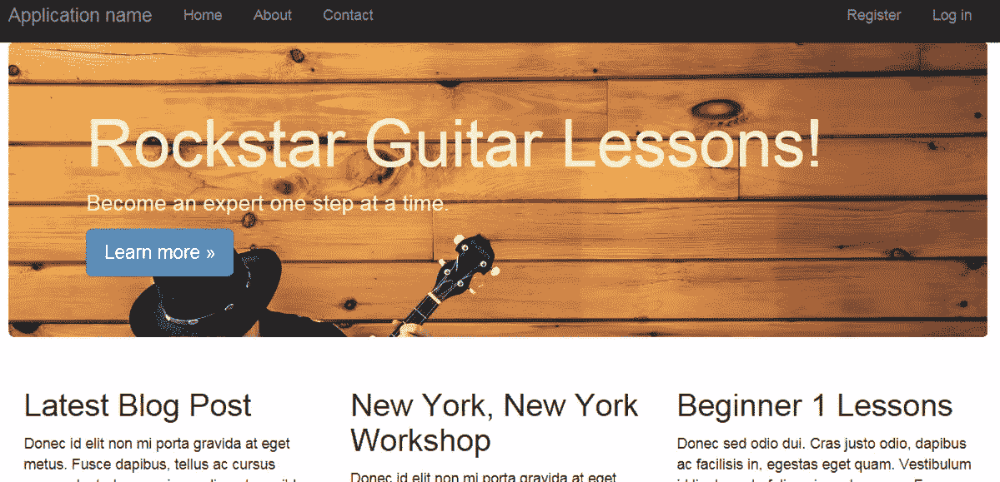

让我们看看我们将在网站中使用的几个模板。转到[主引导站点](http://getbootstrap.com/)并点击顶部的开始。向下滚动基本模板，直到找到示例。

大屏幕看起来会满足我们对网站顶部的要求。

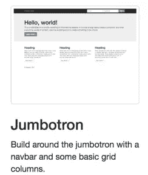

它在顶部有一个大的灰色区域，我们可以用我们的图像替换它。灰色区域上方也有文字。三根柱子也在那里。太棒了。

现在我们需要为客户找到一些报价。查看模板示例，看起来 Carousel 会做我们想要的事情。

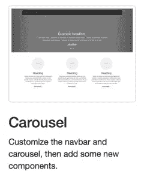

您可以在缩略图中看到它，但如果您单击它，它将显示完整的模板。向该模板的底部滚动。有几行文字比较大，非常适合引用。

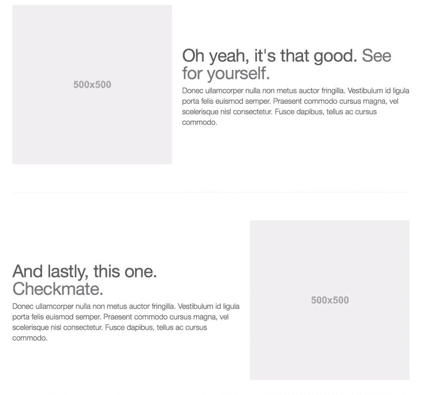

## 色彩设计

对于配色方案，我们将在 Adobe Kuler 上查看一些流行的方案。前往[https://color.adobe.com](https://color.adobe.com/)，点击探索，然后点击最受欢迎。我们正在寻找一个良好的地球色调为基础的方案，蜜罐看起来会符合要求。

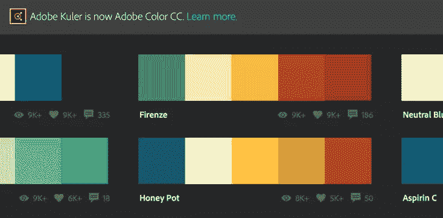

如果您将鼠标移到该方案上，将会出现提示。单击编辑。这使您可以查看配色方案的详细信息。单击较亮的黄色。这是我们将在大屏幕上使用的标题字体的颜色。

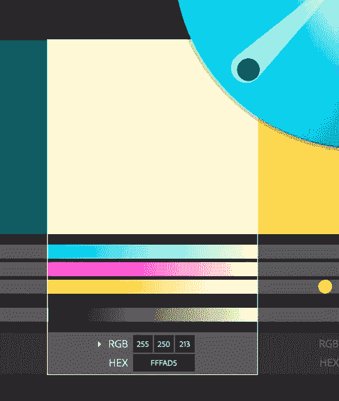

## 开始一个新项目

Andy 将利用 Visual Studio 2015。我们将继续跟进，因此请点击此处下载 Visual Studio 2015 [。](https://www.visualstudio.com/en-us/downloads/visual-studio-2015-downloads-vs##DownloadFamilies_1)

首先，在 Visual Studio 中启动一个新项目，并选择 ASP.NET Web 应用程序，如下所示。

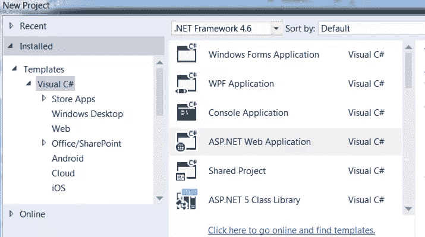

接下来，选择 ASP.NET 预览开始网站:

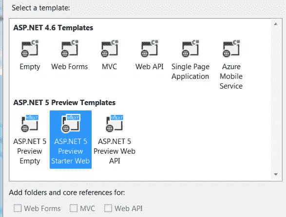

如果您运行该项目，它应该会显示一个类似于以下内容的网页:

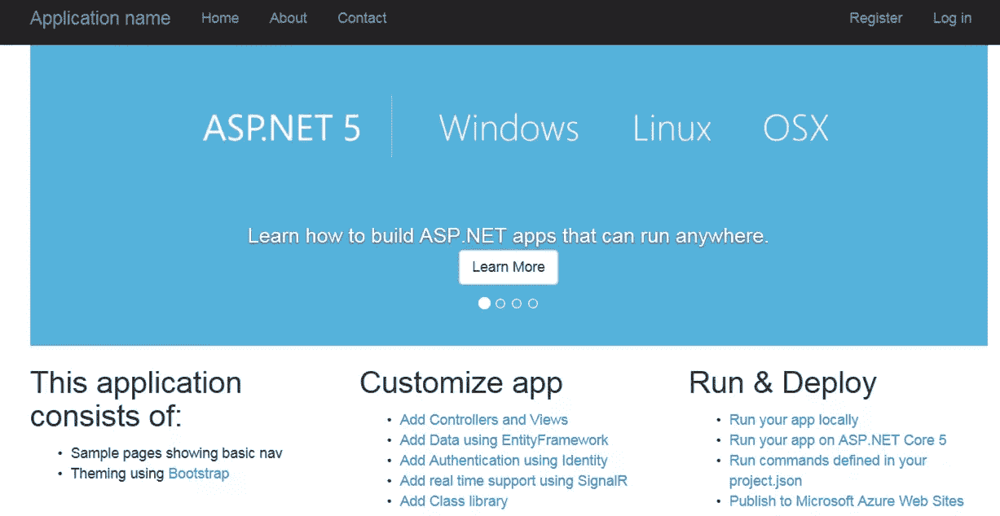

我们将使用上述引导模板中的部分内容来修改此基本站点的布局。

在此之前，我想指出 Visual Studio 2015 中的一些新功能。下面是应用程序文件夹结构的截图。请注意 wwwroot 文件夹。这个文件夹包含我们所有的静态文件。这些包括 css、图像和 js 文件。

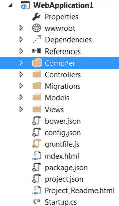

wwwroot 文件夹背后的原因是为了进一步将动态代码与静态代码分开。C##(动态)代码文件仍然在控制器、模型和视图文件夹中，正如您所期望的那样。

下面我展开了`wwwroot`文件夹，以便更好地了解它的内部结构和里面的内容。

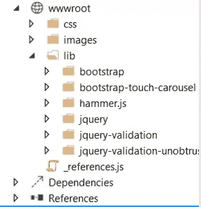

另一个变化是 DLL 和其他引用现在是如何分组的。我们有一个可以扩展的组，而不是大量的参考文献列表。

请注意，下面仅列出了 DNX 4.5.1 和 DNX 核心 5.0 的参考资料。

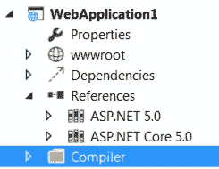

如果我展开 DNX 核心 5.0 参考，我会看到 Nuget 包和 dll 的列表。

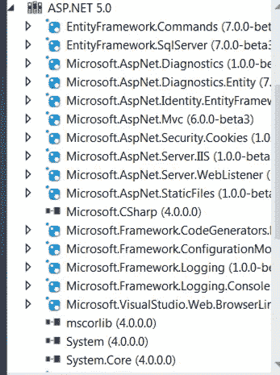

这是一个很好的方法，可以避免开发环境被那些在需要时才知道的信息堵塞。

## 建设场地开发

我们的 ASP.NET 5 入门网站包括引导。再也不需要下载 Bootstrap 了。在 Visual Studio 的以前版本中，我们需要一个 Nuget 包用于 Bootstrap，或者从 Bootstrap 网站下载并将其添加到我们的项目中。

为了帮助管理客户端框架，Visual Studio 现在包含了 Bower。如果您查看项目的根目录，您会看到`bower.json`。在这里，您将看到特定版本的引导参考。添加一个新的客户端框架将检索该版本并将其引入项目。

首先，我们想从 bootstrap 网站下载代码示例。去 getbootstrap.com，点击下载引导。在源代码下，单击下载源代码。解压缩该文件并转到`docs > examples > jumbotron`。将`jumbotron.css`文件拖到`wwwroot > css`文件夹中。您也可以将`index.html`拖到项目的根目录中。它不会在站点启动时显示，因为这是一个 MVC 站点。但我们会把它作为参考。

我们将从修改主站点布局开始。在解决方案资源管理器中，打开`Views > Shared > _Layout.cshtml`。您将在该文件的顶部看到以下 CSS 文件引用:

```
<link rel="stylesheet" href="~/lib/bootstrap/css/bootstrap.css" />
<link rel="stylesheet" href="~/css/site.css" />
<link rel="stylesheet" href="~/lib/bootstrap-touch-carousel/css/bootstrap-touch-carousel.css" />
```

拆下`bootstrap-touch-carousel.css`线。在 bootstrap.css 行下新建一行。拖动`jumbotron.css`文件并将其放在这一新行上。它现在看起来应该如下所示:

```
<link rel="stylesheet" href="~/lib/bootstrap/css/bootstrap.css" />
<link href="~/wwwroot/css/jumbotron.css" rel="stylesheet" />
<link rel="stylesheet" href="~/css/site.css" />
```

打开视图文件夹中的主文件夹，然后打开`Index.cshtml`文件。删除该文件中除顶部以外的所有内容:

```
@{
    ViewBag.Title = "Home Page";
}
```

打开我们之前拖入的 index.html 引导文件。折叠`nav`、`div class=jumbotron`和`div class=container`节点，以便于查看，如下所示:

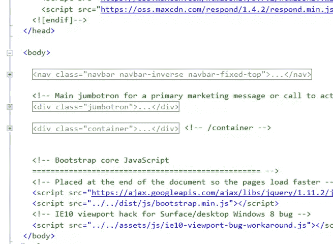

复制两个 div 并粘贴到`Index.cshtml`文件中。现在运行应用程序。您应该看到以下内容:

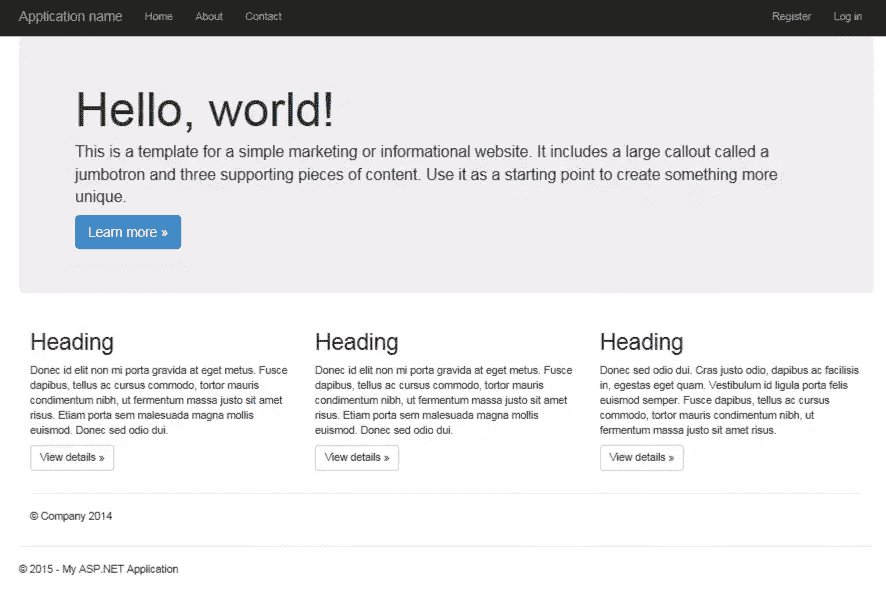

你会注意到我们有两个页脚。这可以通过删除 Index.cshtml 底部的以下代码来解决:

```
<hr>
<footer>
    <p>&copy; Company 2014</p>
</footer>
```

在同一个文件中，我们可以向三列添加一些更有意义的标题。在三个`下的`H2`标签中添加以下标题`

 `线条:

```
Latest Blog Post
New York, New York Workshop
Beginner 1 Lessons
```

如果您运行该应用程序，您应该会看到以下内容:

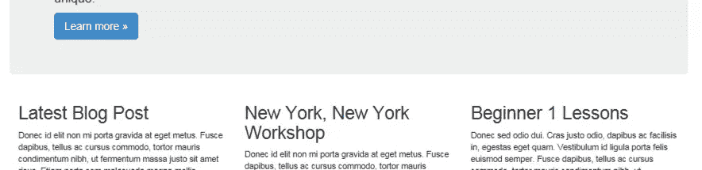

## 更新大屏幕

我们现在可以用图像更新我们的大屏幕了。大屏幕是网页顶部的灰色大框。

我们将使用[这个图像](http://pixabay.com/en/musician-country-song-banjo-ukulele-349790/)作为大屏幕的图像。下载大版放在`wwwroot > images`里。打开`wwwroot > css > site.css`。在该文件的底部键入以下内容:

```
.jumbotron {
    background-image: url('img/musician-349790_1920.jpg');
    background-size:cover;
    color:#fffad5;
}
```

您实际上可以拖动图像，Visual Studio 将创建必要的`background-image`代码。

颜色`fffad5`来自我们的 Adobe Kuler 配色方案。

我们现在可以更新大屏幕文本。回到`Index.cshtml`中。打开大屏幕节点并替换:

```
<div class="container">
<h1>Hello, world!</h1>
<p>This is a template for a simple marketing or informational website. It includes a large callout called a jumbotron and three supporting pieces of content. Use it as a starting point to create something more unique.</p>
```

包含以下内容:

```
<div class="container">
<h1 class="scriptfont">Rockstar Guitar Lessons!</h1>
<p>Become an expert one step at a time.</p>
```

让我们运行应用程序，看看我们目前有什么。您的页面应该如下所示:

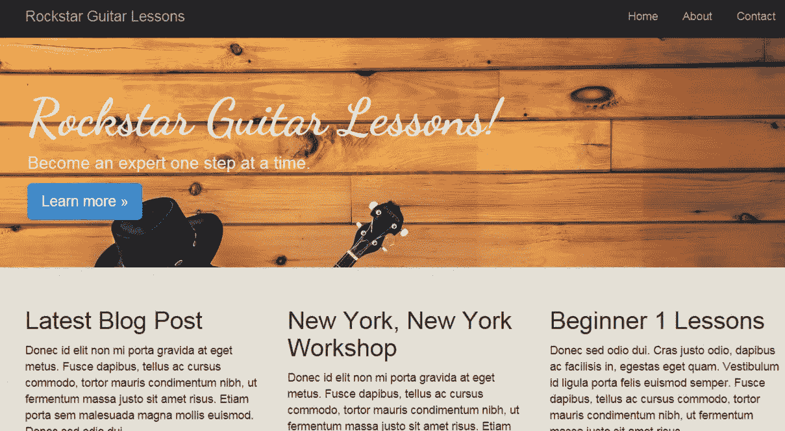

如你所见，我们越来越接近了。大屏幕应该一直延伸到边缘。这让我们的整体设计更有深度。为此，在`Index.cshtml`中，移除包围`@Renderbody()`的`container body-content`格。

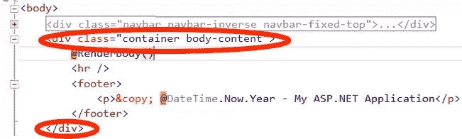

现在，您的代码应该如下所示:

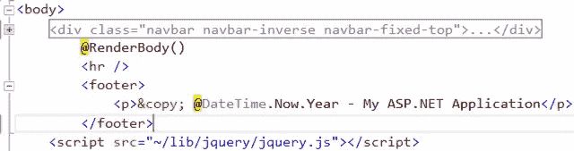

## 更新字体

在大屏幕里面，我们想要一个不同的正面。更非正式的东西。我们将使用一种叫做舞蹈脚本的字体。谷歌网络字体将帮助我们获得字体。

导航[这里](http://www.google.com/fonts)，在左上方，输入舞蹈，应该会弹出舞蹈脚本。单击添加到收藏，然后单击使用。取消选中正常并选中粗体。复制底部的脚本链接。

在`_Layout.cshtml`中，将脚本链接粘贴到`title`标签下。它应该如下所示:

```
<title>@ViewBag.Title - My ASP.NET Application</title>
<link href='http://fonts.googleapis.com/css?family=Dancing+Script:700' rel='stylesheet' type='text/css'>
```

现在我们要给`site.css`添加一个新的类。这将允许我们针对特定文本的字体。将以下内容添加到`site.css`:

```
.scriptfont {
    font-family: 'Dancing Script', cursive;
}
```

在大屏幕中，将`class="scriptfont"`添加到`H1`标签，如下所示:

```
<h1 class="scriptfont">Rockstar Guitar Lessons!</h1>
```

运行应用程序，查看大屏幕标题字体。它现在应该在脚本中。

## 收尾

为了给我们设计的第一阶段提供一点润色，我们将添加一个背景，并对页脚做一点调整，页脚目前是左对齐的。

我们将使用一个图像作为背景，以及一些与我们的朴实色调相匹配的东西。在这里下载[并输入“无缝纸纹理”。下载这个纹理添加到`wwwroot > images`。](http://subtlepatterns.com/seamless-paper-texture/)

打开`site.css`。在第一个`body`标签中添加一个新行。然后把纸纹理拖进去。它应该如下所示:

```
body {
    padding-top: 50px;
    padding-bottom: 20px;
    background-image: url('img/seamless_paper_texture.png');
}
```

当我们在这里时，在这个文件的底部添加以下内容:

```
footer {
    margin-left:15px;
}
```

如果你现在运行应用程序，背景应该是可见的，页脚离开边缘。

## 客户报价

我们现在可以格式化我们的报价部分。报价代码可以在同一个 Bootstrap examples 文件夹中找到。打开轮播文件夹，然后打开`index.html`文件。

从该注释开始复制特辑代码

```
<!-- START THE FEATURETTES -->
```

并以此评论结束

```
<!-- /END THE FEATURETTES -->
```

现在将这段代码粘贴到前面添加的三列下面的`index.cshtml`文件中。您的应该如下所示:

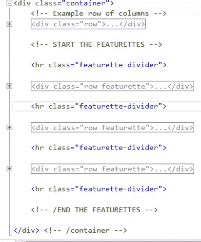

您可以通过打开每个 featurette div 并修改以下每个`H2`标签之间的文本来添加一些自定义引用:

```
<h2 class="featurette-heading">
```

完成后的网页应该类似于以下内容:


## 摘要

安迪现在已经为他的客户完成了一个网页，这将是新的吉他课程面向客户的网站。

通过使用 Visual Studio 2015 和 Bootstrap，Andy 能够毫不费力地创建一个外观精美的网站。

下一次，我们将看看如何集成 MailChimp，让 Andy 的客户能够向客户发送电子邮件更新。我们将添加几个新页面，比如一个感谢注册邮件列表的人的页面和一个联系页面。

## 分享这篇文章`