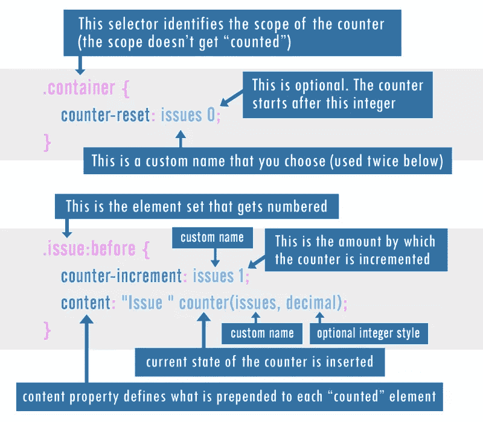
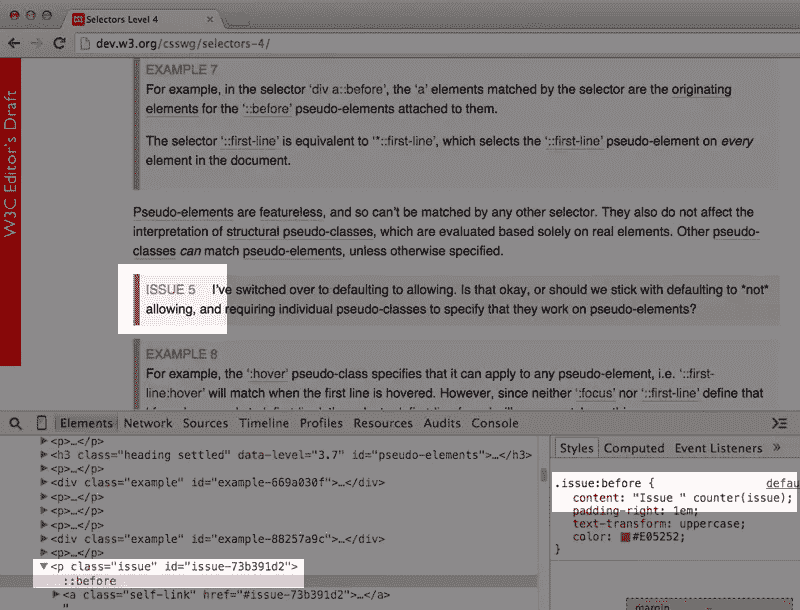

# 了解 CSS 计数器及其用例

> 原文：<https://www.sitepoint.com/understanding-css-counters-and-their-use-cases/>

有些 CSS 特性我们可能不会经常使用。我认为 [CSS 计数器](http://dev.w3.org/csswg/css-lists/#auto-numbering)对我们大多数人来说都属于这一类，而且很可能有两个原因:

1.  他们似乎没有太多的用例。
2.  编写它们的代码有点复杂。

我最近看到了一个计数器的实际用例，所以我想我应该给出一个简短的关于如何编写计数器的速成课程，并在这里分享这个用例。

## CSS 计数器速成班

CSS 计数器允许您使用动态编号对 CSS 中的项目进行编号，类似于有序列表的工作方式。但是 CSS 计数器完全不同。这个特性使用一个伪元素和一些特定于计数器的 CSS 来将一个动态的“计数”添加到一组指定的元素中。

下面是一个代码示例，类似于我将在本文结尾的演示中使用的代码:

```
.container {
  counter-reset: issues 0;
}

.issue:before {
  counter-increment: issues 1;
  content: "Issue " counter(issues, decimal);
  display: block;
}
```

第一个声明块定义了计数的范围。这意味着我的计数器只会在拥有类`.container`的元素中递增。我选择了一个名为“issues”的自定义标识符，这是将容器链接到被计数的元素所必需的。

第二个声明块使用了`:before`伪元素(我也可以使用`:after`，但这在计数器中很少见)和`content`属性来添加定义的内容。

作为`content`属性值的一部分，我使用了带有一个字符串的`counter()`函数，类似于 JavaScript 或其他更典型的编程语言。[counter()函数](http://dev.w3.org/csswg/css-lists/#counter-functions)接受两个参数:之前定义的计数器标识符(在本例中为“issues”)和计数器样式，后者可以是用于有序列表中`list-style-type`属性的任意值。缺省值是“decimal”，我在这个例子中使用了它。

如果你仍然不明白计数器是如何工作的，也许这个迷你信息图会有所帮助:



如果这还不够，这里还有一些额外的资源，包含更多信息，包括我自己的文章，我最初在那里发表了一个类似的信息图:

*   CSS 计数器:计数器增量和朋友
*   [如何从 CSS 生成的内容和计数器中获益](http://www.smashingmagazine.com/2013/04/12/css-generated-content-counters/) (Smashing Magazine)
*   CSS 计数器样式级别 3 (W3C 规范)

最后一个链接是 counters 规范的编辑草案，它引入了一些全新的与 counter 相关的特性，这些特性可能没有太多浏览器支持，并且在规范的未来版本中可能会有风险。然而，我在本文中使用的特性是跨浏览器的，可以追溯到 IE8。

## 确定 CSS 计数器的值

乍一看，当第一次考虑实现 CSS 计数器时，会出现两个主要问题:

1.  有序列表已经做到了这一点，那么我为什么还需要一个如此复杂的特性来给项目编号呢？
2.  生成的内容是不可访问的，这是将内容与演示混为一谈。

这两个问题中的第一个真的根本不是问题。如果你想对连续的条目进行编号，那么使用一个有序列表是合适的(即一个嵌套了`<li>`元素的`<ol>`)。但是 CSS 计数器不用于对连续的项目进行编号；它们用于对不连续的条目进行编号，不管它们在 DOM 中的位置在哪里，然后能够对它们进行重新排序，而不需要改变每个条目前面的数字。

此外，尽管乍一看，计数器可能有点复杂，但是一旦您掌握了 [CSS 的伪元素](http://www.smashingmagazine.com/2011/07/13/learning-to-use-the-before-and-after-pseudo-elements-in-css/)的概念，修改和维护它们就不会那么困难了。

另一个问题与可访问性有关，似乎不像过去那样是个大问题。莱奥妮·沃森的一篇文章总结道:

> “生成的内容在大多数浏览器中都支持可访问性，并相应地被屏幕阅读器识别。”

然而，支持并不是 100%，所以我想说，如果你打算使用伪元素来生成内容，那么“内容”应该具有装饰价值，而不是对网站的理解或功能至关重要。考虑到这种平衡的方法，在某些情况下使用计数器应该没问题，如下所述。

## 一个简单的用例

最近，我在看 W3C 的选择器 4 级规范，注意到它们的内容中散布着“问题”和“例子”。我以前见过这种情况，但直到那时我才决定稍微调查一下。这些元素都是有编号的，所以我想知道他们如何能够添加和删除它们，而不需要每次都重新编号。我想这可能是一个脚本，或者是在后端生成的，或者类似的东西。

没有。他们使用 CSS 计数器，如下图所示:



在他们的页面上，他们有编号的问题(红框)和编号的例子(黄框)。通过为每个计数集使用自定义标识符，他们可以轻松地添加、删除甚至重新排序项目，CSS 会自动为项目添加正确的编号。

此外，这些规范页面还在页面末尾包含一个[问题索引](http://dev.w3.org/csswg/selectors/#issues-index)，它使用与问题相同的计数器标识符，但是在一个新的范围内，因此它开始重新计数。重复的问题列表确实增加了维护问题的工作量，但是，同样，只要与内容体中的更改相匹配，顺序通常很容易维护。

## 拖放演示

我重新创建了 W3C 的例子，这样您就可以随意摆弄计数器的工作方式，同时也可以看到用 HTML 和 CSS 以这种方式从不相邻的项目中创建动态列表是多么容易。

见[码笔](http://codepen.io)上 SitePoint ( [@SitePoint](http://codepen.io/SitePoint) )的笔[20 Fe 8 f 19 AE 48 c 210 da 6 C5 df 78 c 0 cf 6 f 8](http://codepen.io/SitePoint/pen/20fe8f19ae48c210da6c5df78c0cf6f8/)。