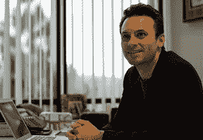
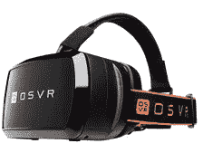

# 虚拟现实用户界面:我们到了吗？

> 原文：<https://www.sitepoint.com/virtual-reality-ui/>

当你想到虚拟现实时，脑海中可能会浮现出《黑客帝国》或《盗梦空间》的画面。随着 [Oculus](https://www.oculus.com/) 和其他竞争设备的发布，虚拟现实为游戏和改善社会的实际应用开辟了一个新的前沿。

## 但是有一个条件

能够生活在你梦想的世界中，在那里你可以与坏人战斗，或者生活在交替的现实中，这是虚拟现实最受欢迎的方面之一。不幸的是，由于我们身体的构造方式，现代模拟目前正在形成，就像乘坐温柔的平底船穿越威尼斯一样刺激。

目前，开发人员强烈反对实现高动作场景，因为一种被称为“sim 病态”的现象，这是*模拟器病态*的缩写，是一个用来描述虚拟现实引起的眩晕的术语。

Sim 病是因为人类不能在静止时处理运动而引起的。虽然虚拟现实欺骗我们的眼睛相信另一个世界，但我们耳朵中的平衡中心正在报告一个完全不同的信息。

处于这种输入中心的可怜的大脑试图理解它，但没有成功——当它失败时，结果是一种恶心的感觉。这种恶心感可能会很强烈，有时会在取下 VR 头戴式耳机后持续数小时。

## 这是一个新问题吗？

与普遍的看法相反，sim 病已经存在了几十年。自 20 世纪 80 年代以来，战斗机飞行员在飞行模拟器中训练时经历了严重的疾病。美国军方发表的一项研究表明，用于提供真实感的惯性经常导致飞行员晕车发作，持续时间从六个半小时到超过十二个小时。

### 解决方案就在你眼前

尽管人的局限性是一个很大的障碍，这个问题的部分解决方案很简单。濮培德大学的科学家在一项研究中发现，使用虚拟鼻子有助于减少晕动病。

但是不要指望嗅觉视觉会很快出现。解决方法很简单，就是在玩家眼睛附近放一个鼻子的图像。不幸的是，这仅仅提高了用户 2 到 93 秒的耐力。

## 行业领导者的观点

### Oculus Creator 的预测

在 TechCrunch Disrupt 2014 上，Oculus 的创造者布兰登·伊里贝(Branden Iribe)提供了一些有趣的见解，他认为虚拟现实将在未来十年走向何方。Irbes 最引人注目的焦点是移动设备是二维空间的最终重大创新。

近年来，手机屏幕上的视频质量一直处于平稳状态，人眼无法感知任何额外的细节。

未来在于虚拟现实取代自然视觉——让人们沉浸在书籍、视频游戏中，甚至与他人交流(例如第二人生等虚拟化身)。然而，这项技术将在 10 到 20 年内无法使用，因为虚拟现实控制台的内容需要每个用户的单独 3D 建模。

## 其他主要参与者的想法

第二年在 2015 年国际消费电子展上，虚拟现实成为展会期间的热门话题。虽然 Oculus 在这次活动中有着明显的先见之明，但他们不是唯一代表 VR 领域的人。

在题为“虚拟现实的今天和明天”的会议中， [Jaunt](http://www.jauntvr.com/) 首席执行官延斯·克里斯滕森， [ADR1FT](http://adr1ft.com/) 开发商三一零的亚当·奥斯， [Razer](http://www.razerzone.com/osvr) 首席执行官陈民亮都提供了他们对虚拟现实现状和未来几年发展方向的见解。

CES 小组讨论了“电影虚拟现实”如何构成今天的大部分内容。这样做的原因是，从技术角度来看，记录线性内容并将其投影给用户更容易。另一方面，视频游戏的开发更具挑战性，因为即时渲染游戏内容很困难。

## 让它成为主流

为了让虚拟现实对大众有吸引力，我相信有一个简单的公式要记住——x3(或“XXX”)——剥削、借口和扩展的简称。正如一篇题为[七宗罪如何推动创新](http://charlescosta.net/2014/04/how-the-seven-deadly-sins-drive-innovaiton/)的文章中所讨论的，今天最成功的技术至少迎合了人类被禁止的欲望之一。

1.  **Exploit** :创业公司解决问题了吗？
2.  **借口**:产品是否满足了用户的欲望？
3.  **Extend** :创业公司允许人们与他人建立联系吗？

为了让客户想要你的技术，给用户提供一种方法，在不打破禁忌的情况下打破禁忌。

这方面最显著的例子是《侠盗猎车手》系列游戏，它沉溺于一种愤怒感。该系列的兴起是因为它允许玩家在没有现实生活负面后果的情况下犯罪。

最后，嫉妒是适用于虚拟现实的另一个最显著的罪恶。让顾客能够在舒适的客厅里体验冒险，或以更好的方式治疗医疗问题，其他人必然会想要同样的体验。

当然，适当的可用性测试——正如经常在 [SitePoint](https://www.sitepoint.com/choosing-usability-tests-participants/) 上讨论的那样——对于这项技术的成功至关重要，因为它让我们能够了解用户的想法。

七宗罪是人类痛点的定义。通过专注于在虚拟现实中迎合他们——就像在大多数领域一样——你将获得成功。

## 分享这篇文章