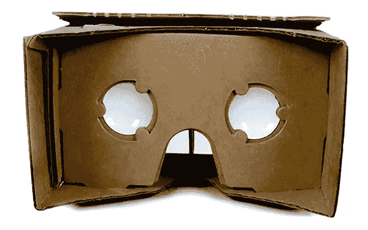
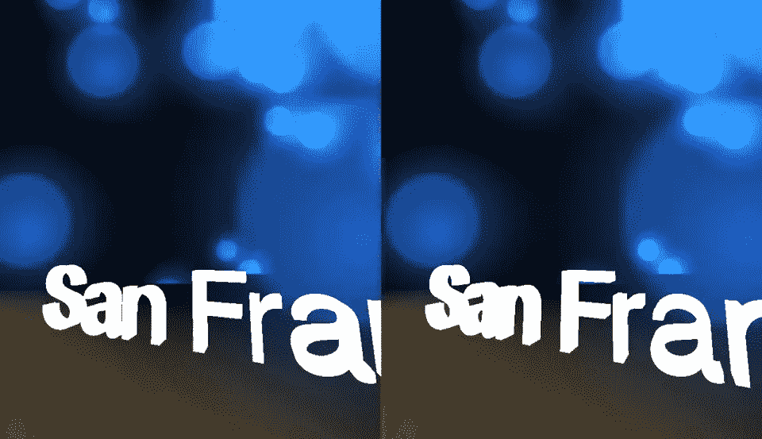
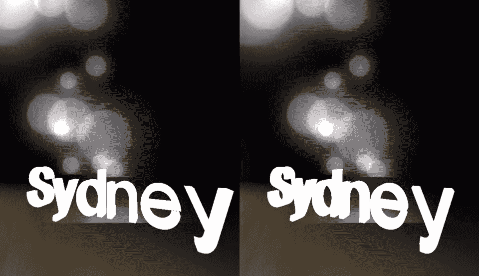
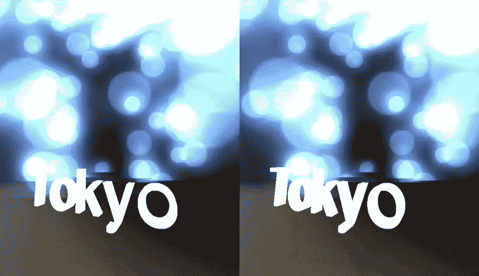
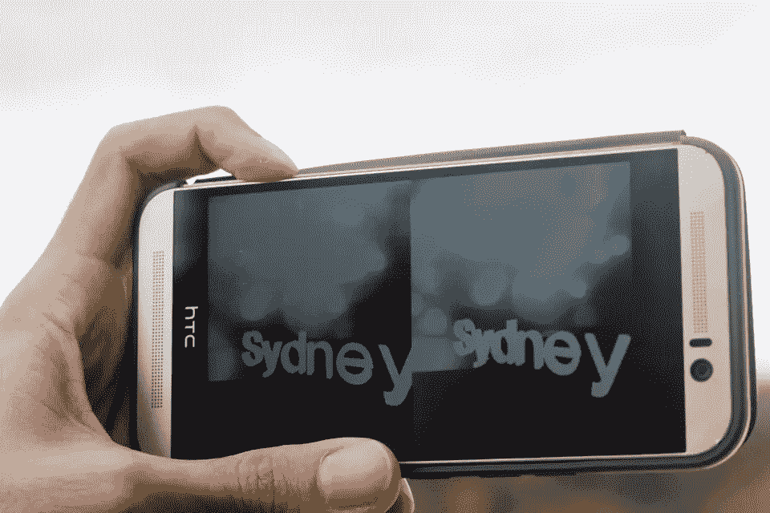

# 用 Google Cardboard 和 Three.js 把 VR 带到网络上

> 原文：<https://www.sitepoint.com/bringing-vr-to-web-google-cardboard-three-js/>

虚拟现实来了。作为一名开发者，你知道你想加入。Oculus Rift、Gear VR、HTC Vive 等正在掀起波澜，然而许多开发人员并没有意识到其中最简单的产品——谷歌 Cardboard 有多大的潜力。

我一直在 SitePoint 上撰写一系列与物联网相关的文章，探索将 web APIs 连接到几乎任何东西。到目前为止，我已经介绍了[web API 和 Unity 游戏引擎](https://www.sitepoint.com/web-apis-and-iot-in-unity/)、[Jawbone Up API 和 Node.js](https://www.sitepoint.com/connecting-jawbone-up-api-node-js/) 以及[通过 Node.js](https://www.sitepoint.com/web-apis-on-arduino-lcd/) 在 Arduino LCD 上显示 web API 数据。在本文中，我希望将 web APIs 引入虚拟现实世界，让 JavaScript 开发人员能够轻松入门。Google Cardboard 和 Three.js 是这方面最完美的第一次飞跃。这也意味着你的用户不需要安装任何特定的东西，你也不需要花数百美元买一个虚拟现实耳机。只需准备一部兼容的智能手机，将其放入一个纸板耳机中，就可以开始使用了。



图片来源:谷歌

## 我在哪里得到一个？

有一大堆不同的制造商在生产谷歌 Cardboard 兼容耳机。谷歌在他们的 [Get Cardboard 页面](https://www.google.com/get/cardboard/get-cardboard/)上有一个很棒的列表。我最兴奋的一个将在今年晚些时候推出——[重新推出的 View-Master](http://www.view-master.com/en-us) (那个奇妙的 clicky 幻灯片玩具！).新的 View-Master 将与 Google Cardboard 兼容！

我目前的谷歌 Cardboard 耳机来自于 [Dodocase](http://www.dodocase.com/products/google-cardboard-vr-goggle-toolkit) 的团队。这些人非常聪明。他们的客户支持非常友好，反应非常迅速。如果你更喜欢自己动手，你可以根据[获取纸板页面](https://www.google.com/get/cardboard/get-cardboard/)上的说明找到所有部件，自己制作一个耳机。

## 我们将要建造的

我们将建立一个相对简单(但仍然非常漂亮)的场景，围绕着我们的头部漂浮着发光的光球(我们称之为“粒子”)。这些粒子会随着全球各地的天气而移动并改变颜色。

这里有一个[的工作演示](http://patcat.com/demos/VRWeatherParticles/)，所有的源代码等都是未经删节的，你可以随意查看和使用。所有的源代码也可以在 [GitHub](https://github.com/sitepoint-editors/VRWeatherParticles) 上获得。

## 开始我们的 Three.js 场景

我们的整个演示将在 [Three.js](http://threejs.org/) 上运行，这是一个奇妙的 3D JavaScript 库，使得在浏览器中渲染 3D 更加容易掌握。如果你以前没有使用过它，有一点学习曲线，但我会尽量解释我们进行的大多数事情。

我们从添加 Three.js 和几个 Three.js 附带的关键模块开始。这些模块实现了我们想要的功能。

```
<script src="./js/three.min.js"></script>
<script src="./js/StereoEffect.js"></script>
<script src="./js/DeviceOrientationControls.js"></script>
<script src="./js/OrbitControls.js"></script>
<script src="./js/helvetiker_regular.typeface.js"></script>
```

*   `three.min.js`–three . js 的主缩小库。
*   `StereoEffect.js`–允许我们将常规的 Three.js 显示器变成一分为二的显示器，为我们的 VR 体验提供深度错觉(“离轴立体效果”)。
*   `DeviceOrientationControls.js`–让 Three.js 能够判断我们的设备面向哪里，移动到哪里。它遵循 [W3 DeviceOrientation 事件规范](https://w3c.github.io/deviceorientation/spec-source-orientation.html)。
*   `OrbitControls.js`–当 DeviceOrientation 事件不可用时(通常是在计算机上测试时)，允许我们通过用鼠标拖动或通过触摸事件来控制场景。
*   `helvetiker_regular.typeface.js`–我们将在 Three.js 中使用的字体。

在我们的 JavaScript 中，我们设置了初始全局变量，并调用了一个`init()`函数来启动一切。

我们的`init()`函数首先将我们的`scene`变量设置为一个 Three.js `Scene`对象。每一个 Three.js 可视化都需要一个场景，因为那是放置其他元素的地方。

```
function init() {
  scene = new THREE.Scene();
```

然后我们设置一个 Three.js `PerspectiveCamera`对象，它接受以下参数:`PerspectiveCamera(fov, aspect, near, far)`。它们代表:

*   `fov`–摄像机的垂直视野。我们的设置为 90 度，这意味着当我们环顾四周时，我们将以大约 90 度的角度上下观看。
*   `aspect`–摄像机的长宽比。它通常设置为视口的宽度除以高度。在我看到的一个例子中，谷歌将它设置为`1`,这似乎也很有效。
*   `near`和`far`——我们的相机中任何在`near`和`far`值之间的元素都会被渲染。

```
camera = new THREE.PerspectiveCamera(90, window.innerWidth / window.innerHeight, 0.001, 700);
```

我们使用`camera.position.set(x,y,z)`设置相机的初始位置。主要是我们要设置 y 轴。这决定了我们在虚拟世界中的高度。我发现 15 是一个合理的高度。

```
camera.position.set(0, 15, 0);
```

然后我们将摄像机添加到场景中。

```
scene.add(camera);
```

我们需要页面上的一个元素来绘制所有这些内容，所以我们定义了渲染器，并将其分配给一个 ID 为`webglviewer`的元素。在 Three.js 中，我们有两种类型的渲染器，它们定义了 Three.js 将如何渲染 3D 对象—`CanvasRenderer`和`WebGLRenderer`。`CanvasRenderer`使用 2D 画布上下文而不是 WebGL。我们不希望这样，因为我们将在支持 WebGL 的 Android 平台上运行。因此，我们将渲染器设置为一个三. js `WebGLRenderer`。

```
renderer = new THREE.WebGLRenderer();
element = renderer.domElement;
container = document.getElementById('webglviewer');
container.appendChild(element);
```

为了获得我们的 VR 立体视图，我们通过之前在`StereoEffect.js`中导入的`StereoEffect`对象传递我们的渲染器。

```
effect = new THREE.StereoEffect(renderer);
```

## 控制我们的摄像机

接下来定义使用鼠标或触摸事件来移动摄像机的控件。我们传入摄像机和 DOM 元素，我们将把事件监听器附加到这个元素上。我们将旋转的目标点设置为比相机的 x 位置大 0.15，但 y 和 z 点相同。

我们也关闭平移和缩放，因为我们想呆在原地，只是四处看看。缩放也会使事情复杂化。

```
controls = new THREE.OrbitControls(camera, element);
controls.target.set(
  camera.position.x + 0.15,
  camera.position.y,
  camera.position.z
);
controls.noPan = true;
controls.noZoom = true;
```

接下来，我们设置 DeviceOrientation 事件监听器，它将允许我们在 Google Cardboard 设备中跟踪手机的运动。这使用了我们在前面的`DeviceOrientationControls.js`中导入的 JS 模块。我们将侦听器添加到代码的更下方，如下所示:

```
window.addEventListener('deviceorientation', setOrientationControls, true);
```

我们将附加到事件监听器的函数是`setOrientationControls()`。它的定义就在`addEventListener`之上。当 DeviceOrientation 事件监听器发现一个兼容的设备时，它返回三个值-`alpha`、`beta`和`gamma`。我们在函数开始时检查`alpha`值，以确保事件数据按预期通过。

```
function setOrientationControls(e) {
  if (!e.alpha) {
    return;
  }
```

如果我们有一个支持 DeviceOrientation 规范的设备(我们的 Google Chrome 移动浏览器)，那么我们就把之前有`OrbitControls`对象的`controls`变量，替换成我们的`DeviceOrientationControls`对象。这将切换兼容浏览器与场景交互的方式。他们现在将移动设备，而不是鼠标或触摸事件。然后我们运行`DeviceOrientationControls`对象自带的`connect()`和`update()`函数，为我们设置好一切。

```
controls = new THREE.DeviceOrientationControls(camera, true);
controls.connect();
controls.update();
```

我们还为这些移动设备添加了一个事件，在点击时将我们的浏览器设置为全屏，因为在 Google Cardboard 上查看这个没有地址栏时效果最好。

```
element.addEventListener('click', fullscreen, false);
```

最后，一旦我们设置了我们的`DeviceOrientationControls`对象，我们就可以删除 DeviceOrientation 监听器。

```
window.removeEventListener('deviceorientation', setOrientationControls, true);
```

## 照亮我们的场景

我在这个场景中放置了相当简单的照明，这样地板(我们将在接下来定义)就可见了，你就有了深度感。我有两个亮度和颜色相同的点光源，只是角度不同。`light`的角度更大，而`lightScene`则直接指向下方，照亮我们将要站立的地方。照明是一门复杂的艺术，我确信有人能让这种照明看起来比现在更令人兴奋！

```
var light = new THREE.PointLight(0x999999, 2, 100);
light.position.set(50, 50, 50);
scene.add(light);

var lightScene = new THREE.PointLight(0x999999, 2, 100);
lightScene.position.set(0, 5, 0);
scene.add(lightScene);
```

## 创建地板

即使我们在场景中没有重力或类似的东西(我们将完全静止不动，只是四处看看)，有一个地板只是让人们看起来更自然一点。我们已经以不同的速度在它们周围旋转闪亮的粒子，感觉有必要给它们一些静止的东西来站立。

我们的地板将使用存储在变量`floorTexture`下的重复纹理。我们加载一个名为`'textures/wood.jpg'`的图像文件，然后设置它在放置它的任何物体上双向重复。`new THREE.Vector2(50, 50)`设置我们正在重复的纹理的大小。

```
var floorTexture = THREE.ImageUtils.loadTexture('textures/wood.jpg');
floorTexture.wrapS = THREE.RepeatWrapping;
floorTexture.wrapT = THREE.RepeatWrapping;
floorTexture.repeat = new THREE.Vector2(50, 50);
```

默认情况下，纹理会变得有点模糊以加快速度(有时稍微模糊会看起来更好)，但是因为我们已经有了相当详细的地板纹理，我们希望看起来更清晰，所以我们将`anisotropy`设置为`renderer.getMaxAnisotropy`。

```
floorTexture.anisotropy = renderer.getMaxAnisotropy();
```

我们的地板需要质地和材料。这种材料控制着地板对光线的反应。我们使用`MeshPhongMaterial`,因为它使我们的物体对光做出反应，看起来漂亮而有光泽。在这个材料中，我们设置了前面定义的要使用的`floorTexture`。

```
var floorMaterial = new THREE.MeshPhongMaterial({
  color: 0xffffff,
  specular: 0xffffff,
  shininess: 20,
  shading: THREE.FlatShading,
  map: floorTexture
});
```

为了设置我们想要的地板形状，我们必须创建一个对象来定义我们想要的几何形状。Three.js 有一系列的几何图形，比如立方体、圆柱体、球体、圆环等等。我们将坚持一个非常简单的几何图形，一个平面。需要注意的一点是，我用过`PlaneBufferGeometry`型的飞机。你也可以在这里使用`PlaneGeometry`,但是它会占用更多的内存(我们真的不需要太花哨的东西……它是一层楼！).我们定义它的高度和宽度为 1000。

```
var geometry = new THREE.PlaneBufferGeometry(1000, 1000);
```

我们的地板本身需要有一个物理表示，将我们定义的几何图形和材质放入一个可以添加到场景中的实际对象中。我们用一个`Mesh`来做这件事。当添加一个网格时，它被放置在直立的场景中(更像一面墙而不是地板)，所以我们在将它添加到我们的场景之前，旋转它，使它在我们的虚拟脚下是平的。

```
var floor = new THREE.Mesh(geometry, floorMaterial);
floor.rotation.x = -Math.PI / 2;
scene.add(floor);
```

## 把我们的粒子放在一起

在脚本的最顶端，我们为粒子设置了几个全局变量，并设置了一个`particles`对象来存储我们所有的浮动粒子。当我们在代码中遇到下面的变量时，我们会更详细地讨论它们，只是要注意这是这些值的来源。

```
particles = new THREE.Object3D(),
totalParticles = 200,
maxParticleSize = 200,
particleRotationSpeed = 0,
particleRotationDeg = 0,
lastColorRange = [0, 0.3],
currentColorRange = [0, 0.3],
```

让我们从高层次的概述开始看我们的粒子代码。我们最初在`'textures/particle.png'`将粒子的纹理设置为透明的 png。然后我们迭代我们在`totalParticles`中定义的粒子数。如果你想改变场景中出现的粒子数量，你可以增加这个数字，它会生成更多的粒子并为你排列它们。

一旦我们遍历了所有的对象并把它们添加到我们的`particles`对象中，我们就把它举起来，这样它就会在我们的相机周围浮动。然后我们将我们的`particles`对象添加到我们的场景中。

```
var particleTexture = THREE.ImageUtils.loadTexture('textures/particle.png'),
    spriteMaterial = new THREE.SpriteMaterial({
    map: particleTexture,
    color: 0xffffff
  });

for (var i = 0; i < totalParticles; i++) {
  // Code setting up all our particles!
}

particles.position.y = 70;
scene.add(particles);
```

现在我们来看看在 for 循环中到底发生了什么。我们首先创建一个新的 Three.js Sprite 对象，并将我们的`spriteMaterial`赋给它。然后我们把它缩放到 64×64(和我们的纹理一样大小)并定位。我们希望我们的粒子在我们周围的随机位置，所以我们使用`Math.random() - 0.5`设置它们的 x 和 y 值在-0.5 到 0.5 之间，使用`Math.random() - 0.75`设置它们的 z 值在-0.75 到 0.25 之间。为什么是这些价值观？经过一点试验，我认为这些在相机周围浮动时效果最好。

```
for (var i = 0; i < totalParticles; i++) {
  var sprite = new THREE.Sprite(spriteMaterial);

  sprite.scale.set(64, 64, 1.0);
  sprite.position.set(Math.random() - 0.5, Math.random() - 0.5, Math.random() - 0.75);
```

然后我们将每个粒子的大小设置在 0 和我们之前设置的`maxParticleSize`之间。

```
sprite.position.setLength(maxParticleSize * Math.random());
```

使这些看起来像发光粒子的一个关键部分是 Three.js 中的`THREE.AdditiveBlending`混合样式。这将纹理的颜色添加到它后面的颜色，给我们更多的发光效果在其他粒子和我们的地板之上。我们应用它，然后将每个精灵添加到我们的`particles`对象中。

```
sprite.material.blending = THREE.AdditiveBlending;

  particles.add(sprite);
}
```

## 天气预报

到目前为止，所有这些已经让我们达到了这样一种状态，我们在一个有地板和灯光的场景中准备了一组静态粒子。让我们通过添加一个 web API 来使场景更加生动，从而使事情变得更加有趣。我们将使用 [OpenWeatherMap API](http://openweathermap.org/) 来获取各个城市的天气情况。

我们将要设置的连接天气 API 的函数是`adjustToWeatherConditions()`。我们将从整体上看一下代码，然后检查它在做什么。

如果我们在一个 HTTP 请求中完成对多个城市的调用，OpenWeatherMap API 的效果最好。为此，我们创建了一个名为`cityIDs`的新字符串，它以空开始。然后，我们在这里添加一个城市 id 列表，该列表可以传递给 GET 请求。如果你想从城市列表中选择，他们在 http://78.46.48.103/sample/city.list.json.gz 的下载样本中有一个全球城市及其相关 id 的完整列表。

```
function adjustToWeatherConditions() {
  var cityIDs = '';
  for (var i = 0; i < cities.length; i++) {
    cityIDs += cities[i][1];
    if (i != cities.length - 1) cityIDs += ',';
  }
```

脚本开头的城市数组包含名称和 id。这是因为我们还想显示正在显示天气数据的城市的名称。API 提供了一个您可以使用的名称，但是我更喜欢自己定义它。

为了能够调用这个 API，您需要一个 API 键来传递给`APPID` GET 参数。要获得 API 密钥，在[http://openweathermap.org](http://openweathermap.org)创建一个账户，然后进入你的[“我的主页”](http://openweathermap.org/my)。

我们示例中的`getURL()`函数是一个非常非常简单的 XMLHttpRequest 调用。如果确实有跨源错误，可能需要将这个函数切换到使用 JSONP 的函数。从我在开发时的演示中看到的情况来看，使用 XMLHttpRequest 似乎可以很好地处理这些 API。

一旦我们的 GET 请求成功，我们就有一个回调函数来检索变量`cityWeather`下所有城市的天气数据。我们想要的所有信息都在返回的 JSON 的`info.list`中。

```
getURL('http://api.openweathermap.org/data/2.5/group?id=' + cityIDs + '&APPID=kj34723jkh23kj89dfkh2b28ey982hwm223iuyhe2c', function(info) {
  cityWeather = info.list;
```

接下来，我们将查看每个地点的时间。

## 通过时区获取当地城市时间 b

[TimeZoneDB](http://timezonedb.com/) 非常友好，有一个整洁的小 JavaScript 库，我们将使用它来保持事情的美观和简单:

```
<script src="timezonedb.js" type="text/javascript"></script>
```

一旦我们在`adjustToWeatherConditions()`中检索到天气数据，我们调用下一个函数`lookupTimezones()`，它将检索每个位置的时间。我们给它传递一个零值，告诉它我们想要查找第一个城市的时区，我们传递天气数组的长度，这样它就知道在那之后我们还想遍历多少个城市。

```
lookupTimezones(0, cityWeather.length);
```

我们的`lookupTimezones()`函数本身是从使用`TimeZoneDB`对象开始的，我们可以从`timezonedb.js`访问这个对象。然后，我们将 TimeZoneDB 的`getJSON()`函数与我们从天气 API 的`cityWeather`数组系列数据中检索的每个位置的纬度和经度配对。它检索每个位置的时间，我们将它存储在一个名为`cityTimes`的数组中。只要我们有更多的城市要查找，我们就运行它(`t`记录我们正在进行的索引，`len`记录我们的天气数据数组的长度)。一旦我们遍历完所有这些，我们就运行`applyWeatherConditions()`。

*更新:感谢评论中的 Voycie，她注意到由于一秒钟内调用太多，TimeZoneDB 开始返回 503 错误。为了解决这个问题，下面的代码现在将我们的循环`lookupTimezones(t, len);`包围在一个`setTimeout()`中，这个循环在再次调用 API 之前等待 1200 毫秒。*

```
function lookupTimezones(t, len) {
  var tz = new TimeZoneDB;

  tz.getJSON({
    key: "KH3KH239D1S",
    lat: cityWeather[t].coord.lat,
    lng: cityWeather[t].coord.lon
  }, function(timeZone){
    cityTimes.push(new Date(timeZone.timestamp * 1000));

    t++;

    if (t < len) {
      setTimeout(function() {
        lookupTimezones(t, len);
      }, 1200);
    } else {
      applyWeatherConditions();
    }
  });
}
```

## 应用天气条件

现在我们已经有了所有需要的数据，我们只需要应用效果和运动来响应这些数据。`applyWeatherConditions()`函数是一个相当大的函数，所以我们将一步一步来看。

在变量声明中 JavaScript 的开始，我们设置一个变量，如下所示:

```
currentCity = 0
```

这是它发光的时候了！我们使用这个变量来跟踪我们在城市系列中显示的城市。你会看到它在`applyWeatherConditions()`内被大量使用。

我们在`applyWeatherConditions()`函数的开头运行了一个名为`displayCurrentCityName()`的函数，它添加了一些 3D 文本来显示我们当前的城市名称。稍后我们将更详细地解释这是如何工作的。我发现在这个函数开始时使用它效果最好，这样如果在处理所有这些颜色时有任何延迟，我们至少可以先得到几毫秒的城市名称作为响应。

然后，我们将当前城市的天气数据赋给`info`变量，以便在整个函数中更清楚地引用。

```
function applyWeatherConditions() {
  displayCurrentCityName(cities[currentCity][0]);

  var info = cityWeather[currentCity];
```

接下来，我们设置两个与风相关的变量。`particleRotationSpeed`将以英里/秒为单位的风速除以 2(为了让它慢一点，这样我们就能看到粒子)，而`particleRotationDeg`将以度为单位表示风向。

```
particleRotationSpeed = info.wind.speed / 2; // dividing by 2 just to slow things down 
particleRotationDeg = info.wind.deg;
```

我们从我们的`cityTimes`数组中检索这个位置的时间。时间用 UTC 时间表示，所以我们使用`getUTCHours()`函数提取小时值。如果因为某种原因那里没有可用的时间，我们就用 0。

```
var timeThere = cityTimes[currentCity] ? cityTimes[currentCity].getUTCHours() : 0
```

为了在这个演示中显示白天和黑夜，我们将使用一个非常宽泛的估计值。如果时间在 6 点和 18 点之间，那么就是白天。否则，就是晚上了。理论上你可以对太阳位置进行一系列的计算，或者找到一个不同的 API，如果你愿意的话，它包括白天/夜晚的信息，但是对于基本的可视化来说，我认为这已经足够了。

```
isDay = timeThere >= 6 && timeThere <= 18;
```

如果是白天，那么我们根据天气数据调整粒子的颜色。我们使用 switch 语句来查看天气数据的`main`键。这是来自 OpenWeatherData API 的一系列值，代表该地区天气的一般分类。我们会留意“云”、“雨”或“晴”。我寻找这些值，并据此设置粒子的颜色范围。

我们的颜色范围将用 HSL 表示，所以`currentColorRange[0]`表示我们颜色的色调，`currentColorRange[1]`表示饱和度。阴天的时候，我们设置色相为 0，所以是白色。下雨的时候，我们把色调设置为蓝色，但是用饱和度值把它变暗。清除后，我们用漂亮的浅蓝色显示它。如果是夜晚，那么我们设置色调和饱和度为较浅的紫色。

```
if (isDay) {
  switch (info.weather[0].main) {
    case 'Clouds':
      currentColorRange = [0, 0.01];
      break;
    case 'Rain':
      currentColorRange = [0.7, 0.1];
      break;
    case 'Clear':
    default:
      currentColorRange = [0.6, 0.7];
      break;
  }
} else {
  currentColorRange = [0.69, 0.6];
}
```

在我们函数的末尾，我们要么去下一个城市，要么循环到第一个城市。然后我们设置一个超时，它将在 5 秒钟内用新的`currentCity`值重新运行我们的`applyWeatherConditions()`函数。这就是我们在每个城市建立的循环。

```
if (currentCity < cities.length-1) currentCity++;
else currentCity = 0;

setTimeout(applyWeatherConditions, 5000);
```

## 显示我们当前城市的名称

为了显示我们当前的城市名，我们删除了存储在名为`currentCityTextMesh`的变量中的任何先前的 Three.js 网格(在已经运行过的情况下)，然后我们用我们新的城市名重新创建它。我们使用 Three.js `TextGeometry`对象，它让我们传入我们想要的文本，并设置它的大小和深度。

```
function displayCurrentCityName(name) {
  scene.remove(currentCityTextMesh);

  currentCityText = new THREE.TextGeometry(name, {
    size: 4,
    height: 1
  });
```

然后，我们建立一个简单的，完全不透明的白色网格。我们使用`position`和`rotation`参数定位它，然后将它添加到我们的场景中。

```
currentCityTextMesh = new THREE.Mesh(currentCityText, new THREE.MeshBasicMaterial({
  color: 0xffffff, opacity: 1
}));

currentCityTextMesh.position.y = 10;
currentCityTextMesh.position.z = 20;
currentCityTextMesh.rotation.x = 0;
currentCityTextMesh.rotation.y = -180;

scene.add(currentCityTextMesh);
```

## 保持时间

为了在运行 Three.js 的过程中记录时间，我们创建了一个包含 Three.js `Clock()`对象的`clock`变量。这将跟踪每次渲染之间的时间。我们在我们的`init()`函数的末尾设置了这个。

```
clock = new THREE.Clock();
```

## 动画！

最后，我们希望每一帧都移动和刷新。为此，我们运行一个名为`animate()`的函数。我们首先在我们的`init()`函数的末尾运行它。我们的`animate()`函数从获取 Three.js 场景已经运行的秒数开始。它在`elapsedSeconds`内存储。我们也决定我们的粒子应该旋转的方向，如果风小于或等于 180 度，我们将顺时针旋转它们，如果不是，我们将逆时针旋转它们。

```
function animate() {
  var elapsedSeconds = clock.getElapsedTime(),
      particleRotationDirection = particleRotationDeg <= 180 ? -1 : 1;
```

为了在 Three.js 动画的每一帧中实际旋转它们，我们计算动画已经运行的秒数，乘以我们希望粒子运行的速度和我们希望它们前进的方向。这决定了我们的`particles`组旋转的`y`值。

```
particles.rotation.y = elapsedSeconds * particleRotationSpeed * particleRotationDirection;
```

我们还跟踪当前和最后的颜色，所以我们知道在哪些帧中我们需要改变它们。通过知道它们在最后一帧中是什么，我们避免了为那些我们还没有改变城市的帧重新计算一切。如果它们不同，那么我们为我们的`particles`对象中的每个粒子设置 HSL 值为新的颜色，但是亮度的随机值在 0.2 到 0.7 之间。

```
if (lastColorRange[0] != currentColorRange[0] && lastColorRange[1] != currentColorRange[1]) {
  for (var i = 0; i < totalParticles; i++) {
    particles.children[i].material.color.setHSL(currentColorRange[0], currentColorRange[1], (Math.random() * (0.7 - 0.2) + 0.2));
  }

  lastColorRange = currentColorRange;
}
```

然后我们设置我们的`animate()`函数在下一个动画帧再次运行:

```
requestAnimationFrame(animate);
```

最后，我们运行两个函数来保持一切顺利运行。

保持我们的渲染器、相机对象和控件与浏览器视窗大小相匹配。

每一帧渲染我们的场景。在这个函数中，我们在`effect`上调用这个函数，使用我们之前设置的立体效果来渲染它:

```
effect.render(scene, camera);
```

## 在行动！

把它放在一个面向公众的网络服务器上，用谷歌 Chrome 把它加载到你的手机上，点击它使它全屏，然后把它放入你的谷歌 Cardboard 耳机。在跑步的过程中，你应该有一个由头部运动控制的美妙景象:







与我窗外悉尼的天气相比，它似乎是准确的！



您可以随意定制新城市，根据自己的喜好更改颜色、速度等，或者创建一个全新的视觉效果。这就是乐趣的一部分！

## 结论

你现在应该对在 Google Cardboard 和 Three.js 中获得 3D VR 体验的要求有了相当好的了解。如果你确实基于这些代码做了一些东西，请在评论中留下注释或在 Twitter ( [@thatpatrickguy](http://www.twitter.com/thatpatrickguy) )上与我联系，我很乐意去看看！

## 分享这篇文章