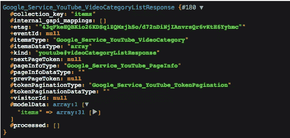
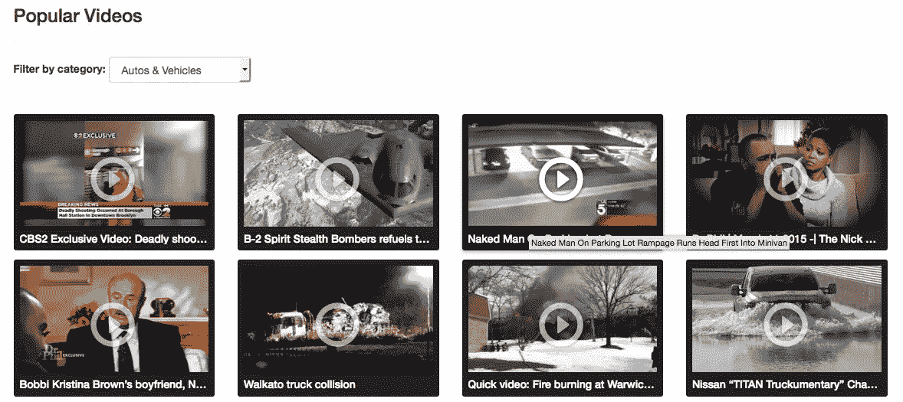
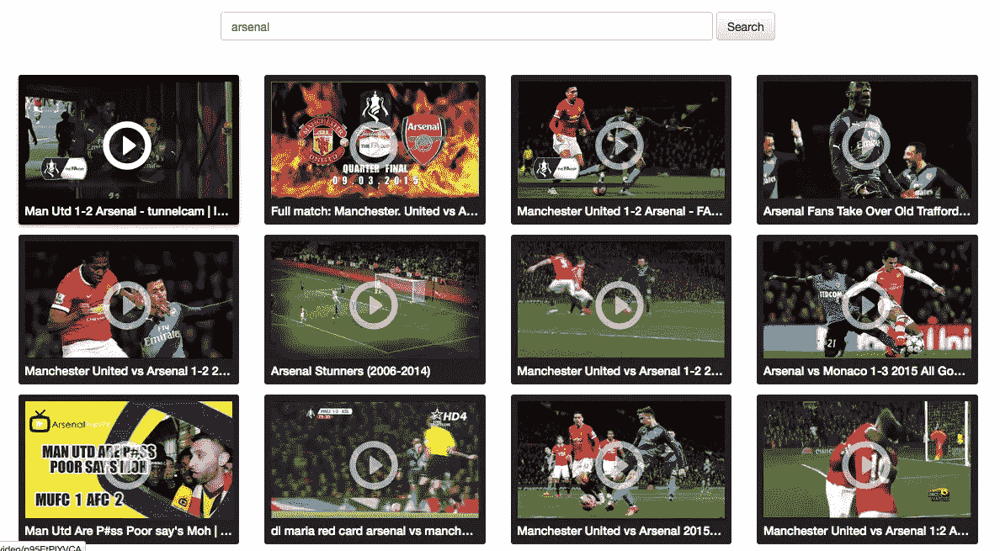
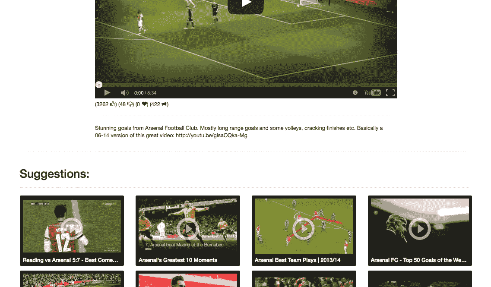
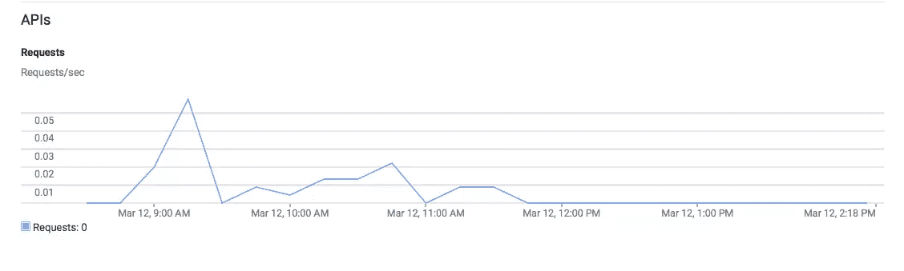

# PHP 中的 YouTube 视频:分类、搜索和建议

> 原文：<https://www.sitepoint.com/youtube-videos-php-categories-search-suggestions/>

在[第一部分](https://www.sitepoint.com/displaying-youtube-videos-php/)中，我们介绍了 YouTube API，并构建了一个小演示来列出 YouTube 上最受欢迎的视频。在这一部分，我们将扩展我们的应用程序，使其具有搜索功能，我们还将列出 YouTube 上可用的类别，让用户缩小他们感兴趣的领域。让我们开始吧。


## 列表类别

YouTube 视频是按类别分组的。我们可以使用他们的 [ISO 代码](http://en.wikipedia.org/wiki/ISO_3166-1#Current_codes)来检索某个国家的类别列表。也可以使用可选参数(如`en_US`、`fr_FR`等)对结果进行定位。你可以在[文档](https://developers.google.com/youtube/v3/docs/videoCategories/list)中了解更多信息。

```
// app/Http/routes.php

Route::get('/categories', ['uses' => 'YouTubeAPIController@categories']);
```

```
// app/Http/Controllers/YouTubeAPIController.php

public function categories()
{
  $youtube = \App::make('youtube');
  $categories = $youtube->videoCategories->listVideoCategories('snippet', ['regionCode' => 'MA']);

  dump($categories);
}
```

和以前一样，第一个参数是`part`，我使用我的国家代码作为过滤器。结果如下所示。



回到我们的演示，我们需要使用类别列表，并让用户能够过滤视频列表。

```
// app/Http/Controllers/YouTubeAPIController.php

public function videos()
{
  $options = ['chart' => 'mostPopular', 'maxResults' => 16];
  $regionCode = 'MA';
  $selectedCategory = 0;

  if (\Input::has('page')) {
    $options['pageToken'] = \Input::get('page');
  }

  if (\Input::has('category')) {
    $selectedCategory = \Input::get('category');
    $options['videoCategoryId'] = $selectedCategory;
  }

  $youtube = \App::make('youtube');
  $categories = $youtube->videoCategories->listVideoCategories('snippet', ['regionCode' => $regionCode])->getItems();
  $videos = $youtube->videos->listVideos('id, snippet', $options);

  return view('videos', ['videos' => $videos, 'categories' => $categories, 'selectedCategory' => $selectedCategory]);
}
```

当用户选择一个类别时，我们将类别 ID 作为参数传递给 videos 方法。这应该可以很好地处理分页，所以让我们看看视图标记的变化。

```
// resources/views/videos.blade.php

{!! Form::open(['route' => 'videos', 'name' => 'formCategory', 'class' => 'form-inline']) !!}
    <label for="category">Filter by category: </label>
    <select name="category" id="category" class="form-control" onchange="this.form.submit()">
        <option value="0">All</option>
        @foreach($categories as $category)
            <option value="{{ $category->getId() }}" @if($selectedCategory == $category->getId()) selected @endif>{{ $category['snippet']['title'] }}</option>
        @endforeach
    </select>
{!! Form::close() !!}

<!-- Pagination -->
<li @if($videos->getPrevPageToken() == null) class="disabled" @endif>
  <a href="/videos?page={{$videos->getPrevPageToken()}}&category={{ $selectedCategory }}" aria-label="Previous">
    <span aria-hidden="true">Previous &laquo;</span>
  </a>
</li>
<li @if($videos->getNextPageToken() == null) class="disabled" @endif>
  <a href="/videos?page={{$videos->getNextPageToken()}}&category={{ $selectedCategory }}" aria-label="Next">
    <span aria-hidden="true">Next &raquo;</span>
  </a>
</li>
```

表单是在类别列表发生变化时提交的，我们确保将选择的类别和页面标记一起传递到导航中。零类别重置了我们的过滤器。



## 视频搜索

搜索是 YouTube 平台的一个重要方面，我们需要在我们的演示中有这个功能。用户可以在结果列表中进行搜索和分页。



```
// app/Http/routes.php

Route::any('/search', ['as' => 'search', 'uses' => 'YouTubeAPIController@search']);
```

```
// app/Http/Controllers/YouTubeAPIController.php

public function search()
{
  if (!\Input::has('query')) {
    return view("search");
  }

  $options = ['maxResults' => 16, 'q' => \Input::get("query")];
  if (\Input::has('page')) {
    $options['pageToken'] = \Input::get('page');
  }

  $youtube = \App::make('youtube');
  $videos = $youtube->search->listSearch("snippet", $options);

  return view("search", ['videos' => $videos, 'query' => \Input::get('query')]);
}
```

如果`query`参数不存在，这意味着我们只需要用搜索输入呈现一个空页面，否则，我们将查询参数添加到选项列表中，并查看是否有分页参数。该视图与视频中的视图几乎相同。

```
// resources/views/search.blade.php

{!! Form::open(['route' => 'search', 'class' => 'form-inline']) !!}
    <input type="text" name="query" class="form-control" style="width: 50%;" autofocus="true" value="{{ $query }}"/>
    <input type="submit" class="btn btn-default" value="Search"/>
{!! Form::close() !!}

@if(isset($videos))
    <ul class="list-unstyled video-list-thumbs row">
    @foreach($videos as $video)
        <li class="col-lg-3 col-sm-4 col-xs-6">
            <a href="{{ URL::route('video', ['id' => $video->getId()->getVideoId()]) }}" title="{{ $video['snippet']['title'] }}" target="_blank">
                
                <h2 class="truncate">{{ $video['snippet']['title'] }}</h2>
                <span class="glyphicon glyphicon-play-circle"></span>
            </a>
        </li>
    @endforeach
    </ul>

    <nav class="text-center">
      <ul class="pagination pagination-lg">
        <li @if($videos->getPrevPageToken() == null) class="disabled" @endif>
          <a href="/search?page={{$videos->getPrevPageToken()}}&query={{ $query }}" aria-label="Previous">
            <span aria-hidden="true">Previous &laquo;</span>
          </a>
        </li>
        <li @if($videos->getNextPageToken() == null) class="disabled" @endif>
          <a href="/search?page={{$videos->getNextPageToken()}}&query={{ $query }}" aria-label="Next">
            <span aria-hidden="true">Next &raquo;</span>
          </a>
        </li>
      </ul>
    </nav>
@else
    <h2>No result.</h2>
@endif
```

您会看到 videos 结果与 video 页面相同，除了`$video->getId()`方法返回一个资源，并且您需要使用一个链式调用来获取 video ID。YouTube API 结果具有数组访问，因此您可以将它们作为数组使用，而不是调用 getter 方法。
响应还包含关于视频频道、创建日期、质量等的信息。你可以用它们来丰富你的页面。

当您访问 YouTube 上的单个视频页面时，您会看到基于您当前视频的建议列表。搜索端点通过一些选项提供了这种可能性:

```
// app/Http/Controllers/YouTubeAPIController.php

public function video($id)
{
  $options = ['maxResults' => 1, 'id' => $id];

  $youtube = \App::make('youtube');
  $videos = $youtube->videos->listVideos('id, snippet, player, contentDetails, statistics, status', $options);
  $relatedVideos = $youtube->search->listSearch("snippet", ['maxResults' => 16, 'type' => 'video', 'relatedToVideoId' => $id]);

  if (count($videos->getItems()) == 0) {
    return redirect('404');
  }

  return view('video', ['video' => $videos[0], 'relatedVideos' => $relatedVideos]);
}
```



根据[文档](https://developers.google.com/youtube/v3/docs/search/list)，当你想进行相关视频搜索时，需要将`type`参数设置为`video`。搜索端点有很多选项，比如将搜索限制在某个质量、某个类别或某个频道等。请务必查看[文档](https://developers.google.com/youtube/v3/docs/search/list)中的可用选项列表。

## 扩展演示

因为我们不能涵盖本教程中的所有内容，所以您可以从这里开始进行演示，并开始用一些新功能来扩展它。可以先在每个视频元素下显示视频频道名称和链接，当用户点击链接时，重定向到`/channel/channel_id`路由，只显示频道视频；您可以按播放列表等对视频进行分组。

## 配额和缓存

使用 API 的一个重要部分是配额。YouTube 每天给你 50，000，000 个单位，正如我们前面所说，单位是根据每个请求计算的，当你要求更多信息时，可以增加。一些 API 调用比其他调用花费更多。例如，对搜索端点的调用花费 100 个单位。除此之外，你被限制在 3000 个请求/秒/用户。



### Etags 缓存

如果您在前面的截图中注意到了，我们有一个 Etag 属性，它标记了实体结果的当前状态。这个属性可以在 HTTP 头中发送，如在 [HTTP spec](https://www.w3.org/Protocols/rfc2616/rfc2616-sec14.html#sec14.19) 页面上所描述的，如果实体已经更改，您将获得一个刷新的版本，否则您将获得一个 304(未修改)响应。你可以在[文档](https://developers.google.com/youtube/v3/getting-started#etags)中了解更多关于优化和性能的信息。

## 结论

在本文中，我们介绍了 YouTube API v3，并构建了一个演示。该 API 提供了许多功能，如处理用户活动、播放列表、频道、订阅等。请务必查看[入门指南](https://developers.google.com/youtube/v3/getting-started#etags)以熟悉限制和可能性。

你可以在 [Github](https://github.com/Whyounes/YouTubeAPI_Demo) 上查看最终的演示，它包括一个让你开始的安装指南。如果你有任何意见或问题，不要犹豫，把它们贴在下面，我会尽我所能回答他们。

## 分享这篇文章