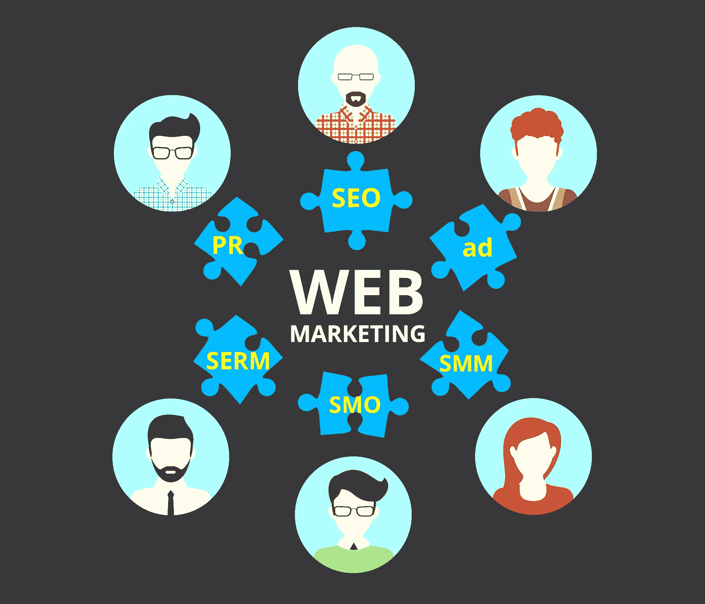

# 如何开展集客营销和 SEO 来提高排名

> 原文：<https://www.sitepoint.com/inbound-marketing-and-seo/>

如果谷歌是你的珠穆朗玛峰，那么 SEO 就是你的攀登工具。没有它，你不太可能达到梦寐以求的顶峰:搜索结果第一。

SEO 是一种战略、技术和策略的方法论，用于提高网站在搜索引擎的搜索结果中的可见性。虽然搜索引擎优化的规则总是在不断发展，但有一点是不变的:为了充分利用搜索引擎优化，它应该被整合到所有的集客营销活动中。

将搜索引擎优化融入你的营销策略是最有效的方法之一，更不用说最具成本效益的方法了，它可以为你的网站带来有机流量，留住现有客户，转化新客户，最大化知名度，提高品牌可信度。

以下是开始的方法。

## 棘手问题

棘手问题是客户面临的一个问题。好的产品或服务解决了他们的问题，好的营销瞄准了最有可能遇到这个问题的受众。好的 SEO 遵循同样的逻辑。

将 SEO 整合到您的营销策略中的第一步是了解您的客户的痛点，并确定他们与之相关的关键词和短语。

想象你是顾客。你想解决什么问题？你用哪些单词和短语来寻找解决方法？

例如，假设你的公司生产和销售胡须油。

如果你的胡须油解决的问题是气味问题，也许你的顾客会在搜索引擎中输入“如何让你的胡须闻起来好闻”或“最好的胡须油气味”这样的搜索词。

你可以通过[关键词工具](http://keywordtool.io/)和 [Google Adwords 关键词规划器](https://adwords.google.com/ko/KeywordPlanner)等工具找到相关关键词及其搜索量。

有了数据支持的高质量关键词列表，你就可以开始将它们融入到你的营销信息中。

## 创建一个 SEO 友好的博客

截至 2015 年，运营公司博客几乎是做生意的标准成本。近 40%的美国公司将博客用于营销目的，优先考虑博客的营销人员获得正投资回报(ROI)的可能性是[的 13 倍](http://offers.hubspot.com/2014-state-of-inbound)。

首先，你的公司博客应该成为你的客户的资源。可以把它想象成一个内容中心，在这里他们可以找到有用的、信息丰富的材料，以及最新的公司新闻和事件的更新。

你的博客也应该建立在一个坚实的 SEO 基础上，这意味着正确构建的，关键词丰富的标题标签，元描述，标题和网址是必不可少的。

对于一个搜索引擎优化友好的博客来说，每篇文章都应该面向客户的兴趣，同时无缝地结合那些客户用来寻找你的公司的关键词和短语。

为了建立网站架构和促进链接的公平性，你还需要在你的内容中嵌入内部链接。内部链接是指向链接所在的同一网站上的另一个页面的超链接。如果深思熟虑地执行，内部链接可以进一步吸引客户，同时提高搜索引擎的排名。

但是使用关键词和内部链接需要一定的技巧。

在过去的几年里，谷歌重新调整了它的排名算法，以惩罚垃圾内容和关键词填充的提供者。

关键词填充就像它听起来的那样:为了操纵搜索引擎结果而过度使用关键词。

这里有一个关键词填充的真实例子。

“事实上，有几种被证明有助于减肥的健康补充剂。他们六个，背后有无可争议的减肥证明。减肥食品补充剂是钙、纤维、共轭亚油酸、绿茶提取物、膳食替代品和奥利司他——一种非处方减肥药物。”

除了大量的语法错误，请注意“减肥”这个短语在三个句子中被使用了四次。

现在这里有一个搜索引擎优化友好的内容片段，涵盖了相同的主题。

当你减肥时，你的新陈代谢会下降，因为你的身体需要更少的卡路里或“能量”来为更小的你提供能量。当你开始减肥之旅时，你最初摄入的卡路里需要调整，以符合你身体当前的减肥需求。”

在这个例子中，短语“减肥”自然地出现，并且不会使内容过载。与前一个例子相比，这个副本更有个性，感觉不那么普通。

要遵守谷歌的新规则，就要瞄准为读者提供真正价值的原创内容。如果可能的话，优先考虑长格式的内容，而不是简短的，快速的花絮，并采取更周到的方法来整合关键词和内部链接。

制作一个 SEO 友好的博客是一个微妙的平衡行为。一方面，关键词和内部链接对链接建设和搜索引擎排名很重要，但另一方面，谷歌正在打击它们的使用。

虽然这迫使内容创作者更加努力地工作，但也让互联网变得更加美好。好的内容进来，不好的内容出去。质量胜于数量，宝贝。

关于一些制作精良的公司博客的例子，它们提供原创的、信息丰富的和搜索引擎优化友好的内容，请查看 [ModCloth](http://blog.modcloth.com/) 和 [Optimizely](http://blog.optimizely.com/) 。

## 社会化媒体

从 2015 年开始，任何自尊的营销策略都应该包含社交媒体。如果你不通过推文和帖子来推广你的品牌，你就是在背弃大量精明且积极参与的消费者。

但没有足够的营销人员将社交媒体与 SEO 包装在一起。

社交媒体是你业务的另一个分支，SEO 可以在你控制下的任何在线内容中实现。这意味着 SEO 对社交媒体信息的重要性不亚于它对你的网站或博客的重要性。

将关键词和链接整合到你的社交媒体信息中，因为包含高质量关键词的推文和帖子会在搜索引擎中被编入索引。在某些情况下，一家公司的社交媒体简介甚至可能会出现在搜索结果的第一位。

社交媒体信息也是高度共享的。一条搜索引擎优化友好的推文更有可能接触到更高比例的目标受众，他们反过来也更有可能转发你。

## 一对

媒体关系和搜索引擎优化的结合是一个新旧结合的恰当例子。公关通常被归入线下部门，但通过将传统公关与基于 SEO 的数字化策略相结合，公司可以建立更强大的媒体合作伙伴关系，并获得更多的媒体报道。

这里有一些基于 SEO 的公关策略可以考虑:

### 客座博客

通过向相关网站和博客贡献 SEO 友好的内容，你的公司可以增加链接的权威性，带来更多的流量。你还可以通过向其他品牌借用信任来建立品牌信誉。

### 编辑日历

至关重要的是，所有的公关活动都要与公司的其他营销活动保持一致。通过创建一个每个部门都可以共享的日历来实现这一点。这样，如果一篇关于公司职业发展计划的博客文章被安排在周四，公关团队知道，在周四，他们应该把他们的信息集中在职业发展上。混杂的信息会迷惑顾客，分散兴趣，转移注意力。

### 联系人列表

公关经理们有一长串与他们建立了私人关系的联系人。与 SEO 团队分享这些联系方式，因为在推广博客帖子、活动或宣传噱头时，它们可能会派上用场。

## 结论

SEO 不应该存在于真空中。为了最大限度地提高其有效性，公司必须将 SEO 实践融入到整个集客营销策略中。这意味着将关键词编织到社交媒体信息中，并在博客内容中包含内部链接。这意味着推倒隔离 PR 和 SEO 部门的墙。邀请营销和搜索引擎优化团队到酒吧琐事。进行视觉探索。尽一切努力让 SEO 成为你日常业务的一部分。

## 分享这篇文章