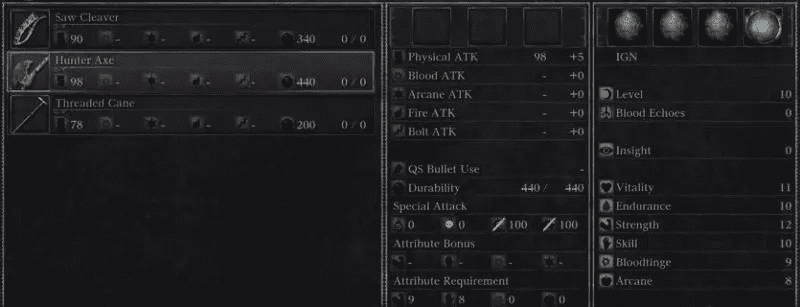

# 当坏 UX 变好

> 原文：<https://www.sitepoint.com/bad-ux-turns-good/>

我知道你在想什么，但这个标题并不疯狂。反正不是*完全*。

虽然我们作为设计师每天都在努力追求优秀的设计，试图简化我们的界面，创造一些让我们的用户生活轻松愉快的东西，但仍有各种形状和大小的设计背离了我们神圣的原则。不仅这些设计有坏的 UX 似乎是故意的，而且人们实际上似乎更喜欢这样。

我可以告诉你可能不相信我，所以让我们深入一些例子。

## 按开始

一个通常被认为是“坏 UX”的行业实际上可以提升体验，那就是视频游戏。以最近的 [Bloodborne](http://en.wikipedia.org/wiki/Bloodborne) 为例，索尼娱乐公司(Sony Entertainment)曾希望这个标题会成为他们的游戏机 Playstation 4 的独家拯救恩典。

玩过游戏，可以告诉你很难。我的意思是，这真的很有挑战性，作为一名球员，它真的很喜欢踢你的屁股。没有手把手的入门教程，通常是至关重要的，让玩家沉浸到世界中，并适应它的游戏性和元素。

库存界面是一种查看你所携带的物品、武器和其他随身物品的方式，它非常密集、迟钝，有点难以导航，我花了足足五分钟(加上谷歌搜索)才弄明白如何将武器放在我的角色手中。也没有暂停按钮，所以你可以在任何时候因为快速去洗手间而被杀。

很少被解释和透露，这取决于玩家在这个恶劣的环境中自己去发现事情。虽然这在任何意义上都可能是传统的 UX 禁忌，但这款游戏目前的评论评级在 95%左右，受到大批粉丝的崇拜，成为索尼娱乐未来相对风暴中的成功灯塔。

### 8 比特西

然后是巨头《我的世界》。我怀疑我需要给一个已经成为文化标志的东西做介绍，但是很少，如果有的话，玩家评论这个游戏中的 UX 实际上有多糟糕。

同样，几乎没有对玩家所处的世界的介绍，尽管创造和发现的潜力几乎是无穷无尽的，但一个新玩家如果不首先跳到谷歌上搜索广泛的漫游，是不可能知道这一点的。

即使你在游戏中进步了，更复杂的系统、工具和物品需要越来越多的谷歌搜索，反过来需要用户付出更多的努力。然而，正如许多人所知，《我的世界》无疑是世界上最受欢迎的游戏之一，已经进入流行文化，最近以 25 亿美元的价格卖给了微软。

这到底是怎么回事？

## 复杂系统

当然，这种现象并不是电子游戏独有的。走进飞行员的驾驶舱或走过潜艇，你会看到界面上充满了可能性和误差。而且，不像在电子游戏中，犯错误要严重得多。

当然，这里操作的机器更复杂。作为一名飞行员，无论是在飞机上还是在潜艇上，都有更多的事情需要跟踪，包括高度(或深度)、速度和压力等。这意味着那些使用这些界面的人需要大量的培训才能理解所有的内容。

唐·诺曼的书《与复杂性共存》在开篇就提到了这一点。作为一个外行人来看上面的图像，你或我可能很难理解所有这些混乱，但对于一个训练有素的飞行员来说，这个系统是显而易见和有组织的。这对他们来说是有意义的。

这与上面提到的视频游戏没有太大的不同，视频游戏也需要用户经过“训练”或有经验才能有效地玩。

## 为什么这么受欢迎？

那么为什么这些界面如此受欢迎呢？在没有人试图“修复”它们的情况下，是什么让人们对使用这样迟钝的系统感到非常高兴，甚至兴奋呢？

答案并不总是那么直截了当。当然，特别是在视频游戏的情况下，有一个来自理解这些系统的社区元素。上网，你会发现很多志同道合的人在分享这些游戏的信息和技巧，在这个过程中创造社交互动。与航空公司飞行员交谈，你会知道有一个人们互相帮助的网络，几乎就像一个“俱乐部”。潜艇驾驶员也是如此(在这种情况下，与几个人在密闭的金属管中在水下度过几周可能有助于建立持久的社会联系)。

在其他情况下，发现和学习的感觉实际上是用户的驱动力。像《《我的世界》》这样的视频游戏无疑就是如此，它依靠用户学习和实验来创造奇妙的东西。编程是另一个例子；尽管代码的界面一点也不用户友好，但随着他们对主题的发现越来越多，初级开发人员感到越来越有力量。

## 结论

有许多系统和界面最初很难掌握，并且充满了出错的机会。它们的范围从面向儿童的视频游戏到运载许多人穿越潜在危险环境的地铁控制面板，然而人们对它们非常舒适(甚至喜欢它们)。

部分原因是这种迟钝带来的社区和社会联系感，部分原因是掌握一些最初很难的东西带来的授权和成长感。

无论哪种方式，这些在许多领域和领域的接口都不会很快走向任何地方，它们是一个很好的提醒，有时，也只有有时，坏 UX 也可能是好的。

## 分享这篇文章