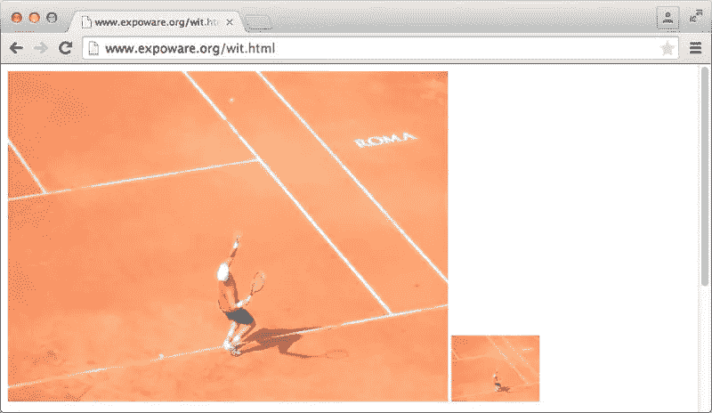
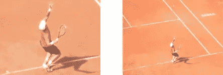

# 带有 WURFL 图像定制的响应图像

> 原文：<https://www.sitepoint.com/responsive-images-wurfl-image-tailor/>

Bootstrap 被一致认为是在 web 和移动站点中快速实现真正响应性设计的事实标准。然而，虽然 Bootstrap 通过原生网格系统在表格、菜单和一般布局方面做得很好，但在处理图像方面却没有达到应有的水平。特别是，Bootstrap 只提供了一个预定义的类来响应地设计图像。下面是它的定义:

```
.img-responsive {
  display: block;
  max-width: 100%;
  height: auto;
}
```

`img-responsive`类的最终效果是，图像显示为一个块，并适当调整大小，使其既不超过容器的宽度，也不超出其原始宽度。这是一个很好的妥协，但它是一个妥协。特别是，Bootstrap 的解决方案做了两个假设:

*   您总是要为每个特定的页面和场景链接一个给定的图像
*   您主要关心的是，当您调整屏幕大小时，图像显示得很好

Bootstrap 解决方案没有具体解决以下任何问题:

*   基于每个设备调整图像大小的需要
*   基于每个场景调整图像的大小

提供每设备映像是根据请求设备的实际能力向其提供适当的映像。在这种情况下，无论屏幕大小如何，智能手机都不同于平板电脑，也不同于台式电脑。换句话说，处理一个桌面浏览器窗口调整到 480px 宽度是一回事；对付同样屏幕尺寸的低端智能手机设备完全是另一回事。理想情况下，您可能希望能够基于每个设备提供不同的图像。

但是还有更多。

当您考虑为较小的移动设备提供较小的图像时，您确定您只是想要较小的相同图像吗？看下面两张图片:



原图 2560x1920px。页面中较大的图像为 500 像素宽；缩略图大小的小尺寸是 100 像素宽。缩略图你能接受吗？

当谈到移动和 web 场景中的图像时，在采用一种或另一种解决方案之前，有几个方面需要考虑。

*   下载的大小
*   对缩略图的需求
*   艺术指导

让我们来看看每个方面的要点。

## 下载的大小

如果您担心下载的大小和对低端设备的影响，您有两种可能的选择:1)维护映像的多个副本，2)使用服务器端路由算法来检测设备，并智能地提供最合适的映像副本。像 Bootstrap 这样的框架在这种情况下不会有帮助。您可以编写自己的服务器端基础设施(即 HTTP 处理程序)，也可以使用类似于 [WURFL Image Tailor (WIT)](https://web.wurfl.io/#wit) 的东西。

WIT 是一个免费的服务器端工具，充当 WURFL 网站和图像来源之间的代理。不是直接从源服务器请求图像，而是将源 URL 传递给 WIT 服务。WIT 将从原始服务器获取图像，调整其大小以匹配检测到的设备的能力，并向用户代理返回它认为合适的位。换句话说，基于请求设备的类型动态地调整图像的大小，并且缓存调整后的图像以备将来使用。如果除了下载文件的大小之外，您对图像没有其他顾虑，以下是您需要的全部内容:

```

```

如前所述，WIT 是一项免费服务，每个网站每月限量 20，000 张图片。超过这个限制后，你的页面仍然可以正常工作，而 WIT 只是作为一个重定向器。

## 需要缩略图

另一个场景是当你需要提供缩略图时。例如，想象一个新闻门户，当在详细模式下查看时，每个新闻条目都有一个大图像，当它在主页上列出时，有一个缩略图就足够了。缩略图应该是一个单独的图像还是在一个更小的容器中呈现的同一个图像？这取决于页面的预期用途。

如果你希望用户主要看标题，偶尔点击阅读新闻，那么你可能希望在智能手机和其他低端设备上使用单独的缩略图。这将确保提供较小的图像，并尽可能快地呈现页面。当用户点击阅读新闻时，他们使用像 WIT 这样的服务来优化下载，从而下载完整的图片。

缩略图可以是保存在服务器上的不同图像，也可以是即时创建并使用 WIT 缓存的图像。在这种情况下，您可以使用如下扩展语法:

```

```

`w_100`命令指示 WIT 服务将原始图像的宽度调整为 100 像素，保持纵横比。或者，您可以使用`h_XXX`命令设置一个固定的高度，或者甚至指出您希望图像占据屏幕的百分比。在这种情况下，您使用`pc_XX`命令，其中`XX`是 1 到 100 之间的一个数字(百分比)。注意，当使用百分比命令时，WIT 会将最长的屏幕尺寸设置为宽度。这样，无论设备的当前方向如何，都可以保证获得最佳结果。

在桌面浏览器上，这并没有太大的区别，你可以简单地使用引导式响应图像，只需将图像放在最外面的`div`中，适当调整大小以显示为缩略图。

当所有图像具有相同的大小或至少相同的比例时，缩略图相对容易获得。如果不是这样，你可以让 WIT 把调整过大小的图片放到一个固定大小的盒子里。如果尺寸与原始图像的比例兼容，WIT 将按原样拟合图像。否则，它只会按照您的指示运行，如下所示:

```

```

该示例将调整图像大小为 200×200 的图像，并重新采样以适合该大小。如果原始图像不是正方形，则从中心裁剪图像，并截取指定大小的部分。下表列出了有效的重采样选项。要使用装箱，您必须指出宽度和高度。

| 名字 | 命令 | 描述 |
| :-: | :-: | :-: |
| 箱子 | m_box | 返回给定框中包含的保留原始纵横比的图像。 |
| 伸展 | m _ 拉伸 | 不管原始纵横比如何，返回与给定框匹配的图像。 |
| dropbox | m_cropBox | 如果尺寸不匹配，则返回一个与从中心裁剪重新采样的给定框匹配的图像。 |
| 邮筒 | 信箱 | 像“盒子”一样，除了如果调整大小的图像不完全适合时，它可以用空白填充。可以选择填充的颜色为`m_letterbox_aarrggbb`。 |

## 艺术指导

最后，在有些情况下，您只想拥有相同图像的不同副本，以便在各种情况下使用。例如，当您想要匹配特定的像素密度以调整 retina 显示屏时，或者当您想要确保图像即使在较小的尺寸下也能传递重要的内容时，就属于这种情况。例如，回头看看前面显示的图像中的缩略图。假设 100×75 是我们的目标尺寸，下面哪个缩略图更合适？



重点是右边的可以通过机智轻松获得；左边的这个需要一些艺术指导和一些你自己的工作。

## 最后的想法

尽管“响应式”在今天是一个非常常见的形容词，Bootstrap 是一个非常受欢迎且做得非常好的框架，但当涉及到图像和移动设备时，还有更多的东西需要考虑。在未来的某个时候，所有正在使用的浏览器都将支持比今天的`img`元素更丰富的原生解决方案[。目前，似乎我们将有一个很好的、类似媒体查询的语法来将不同的图像链接到同一个地方。使用 WIT，在大多数情况下，您可以创建和维护单个图像，并将调整大小和缓存的任务留给服务。](http://alistapart.com/article/responsive-images-in-practice)

更多信息，请查看 [WURFL 图像定制](https://web.wurfl.io/#wit)服务和[的文档](https://web.wurfl.io/documentation/wit-getting-started.php)。

## 分享这篇文章