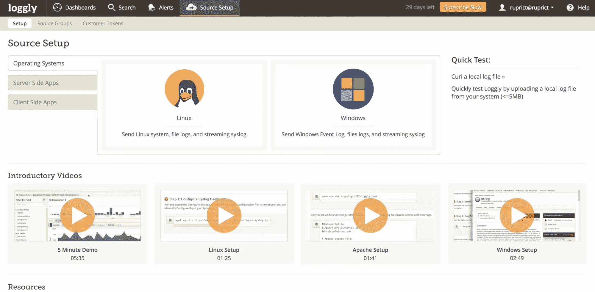
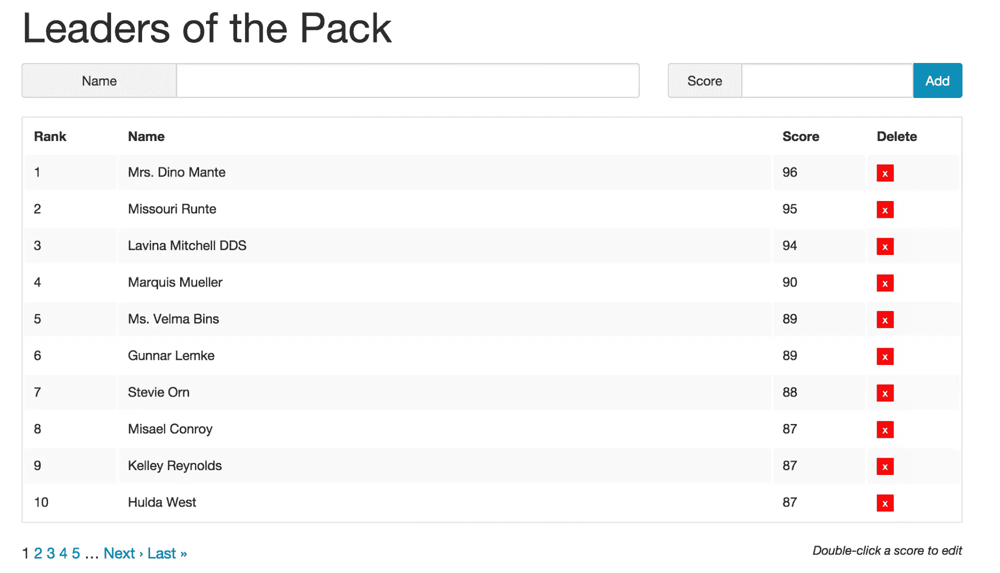
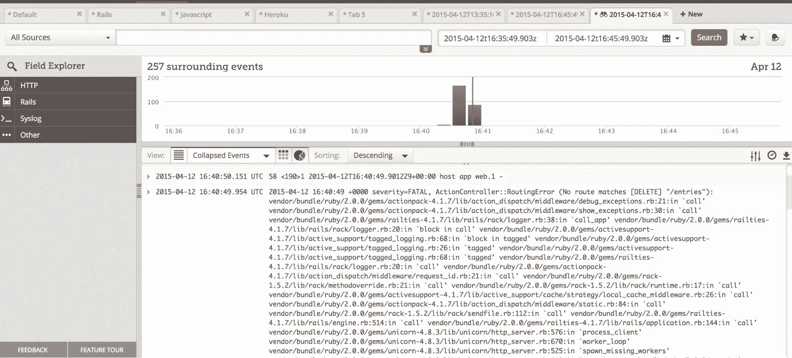
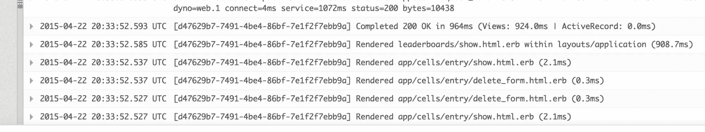

# 优化 Ruby 日志记录，加快调试和解决问题的速度

> 原文：<https://www.sitepoint.com/optimizing-ruby-logging-faster-debugging-problem-solving/>

*本文由 [Loggly](http://loggly.com) 赞助。感谢您对使 SitePoint 成为可能的赞助商的支持。*

在英语中，以“-ly”后缀结尾的单词通常被归类为副词。对于语法有问题的人来说，副词修饰动词。以下是一些用粗体表示副词的例子:

*   Jezebel 跑得很快。(意思是，非常快)
*   评论巨魔隐藏在互联网匿名的背后**悄悄地**。(意思是，像一个懦夫或以一种无法察觉的方式)

不管你对评论巨魔的感觉如何，我希望这些例子能让你对英语副词有一个基本的了解。这种理解是中肯的，因为我建议创造一个新的副词:

****，记录完整，可扩展。谨慎的开发者逻辑地部署了应用程序。”****

 ***我不会轻易接受这个建议**。虽然任何语言都是活的，会呼吸的东西，但只有当一个概念在现有的习语中没有得到充分体现时，才应该增加新的术语。在尝试了 [Loggly](https://www.loggly.com/) 提供的服务后，我感觉找到了这样一个概念。**

 **在这篇文章中，我将从 Rubyist 的角度来看 Loggly，解释如何通过将它添加到我的[排行榜示例](https://www.sitepoint.com/leaderboards-rails/)来设置 Loggly。如果你读过那篇文章，你就会知道排行榜是一个简单的 Rails 应用程序，托管在 Heroku 上。它确实有一些 JavaScript 行为，这将允许我展示一些客户端日志。

但是首先，在开始为我们的目的设置它之前，让我们先看看为什么您想要登录。

## 为什么要日志？

多年来，大多数应用程序都忽略了有效的日志策略。在大多数情况下，日志记录为开发人员提供了在运行时查看应用程序的唯一途径。有效的日志使用和监控可以帮助您预测应用程序的未来，从而支持主动维护，而不是被动维护。

然而，当时间紧迫时，重点是特性，而不是日志。日志记录和测试是开发过程中必须遵守的两项规则。否则，你的生产经验很有可能**变得**糟糕**。**

 **一旦你接受了记录的需要，就有了新的问题。大多数应用程序都有大量的活动部分:操作系统、web 服务器、应用程序、数据库、后台作业…仅举几例。所有这些部分都有一个或多个要记录的进程，我们甚至还没有谈到集群。当你需要看到生产幕后时，你如何管理所有的日志？Loggly 可以帮助实现简单和可扩展的日志搜索、直观的用户界面、免代理部署(我认为这是最棒的部分)和按需付费模式。

## 安装

前往[登录](https://loggly.com/)并注册一个免费账户。一旦你登录并使用你的 Loggly 账户的子域(user.loggly.com ),各种设置页面**很方便**可用，所以你可以按照我下面的设置进行操作。



当你登陆源码设置页面时，你可以**轻松**看到如何设置操作系统、服务器端应用和客户端应用。我将用 Rails 和 Angular 来设置它，目的是将 Loggly 添加到我上面提到的[排行榜示例](https://www.sitepoint.com/leaderboards-rails/)中。我已经为这些变化在应用程序库上创建了一个分支[这里](https://github.com/ruprict/ccleader/tree/loggly)。

### 服务器端

当谈到将 Loggly 与 Rails 一起使用时，您有几个选择。第一个是配置 syslog 来使用 Loggly，然后在你的应用中使用 [syslogger gem](https://github.com/crohr/syslogger) 。第二个是使用 [logglier 宝石](https://github.com/freeformz/logglier)，我决定这样做。

配置 logglier gem 是标准的 Rails 工作:1)将配置信息放入初始化器中，2)像平常一样登录。

*Gemfile*

```
gem ‘logglier’
```

(别忘了捆绑)

*config/initializer/log Gly . Rb*

```
loggly = Logglier.new(‘<a href="https://logs-01.loggly.com/inputs/3e8f8c6f-2161-4544-8c04-bc134ac82590/tag/rails">https://logs-01.loggly.com/inputs/3e8f8c6f-2161-4544-8c04-bc134ac82590/tag/rails</a>‘, threaded: true, format: :json) <br />
Rails.logger.extend(ActiveSupport::Logger.broadcast(loggly))
```

伙计，那个配置做得**快**，而不是**赶紧**。仅供参考，这只能在 Rails 4 中工作，因为它增加了向多个日志记录器广播日志的能力。如果你在 Rails 3，[看看这个帖子](http://railsware.com/blog/2014/08/07/rails-logging-into-several-backends/)。

是时候写入 Rails 日志了，就像我们不使用 Loggly 时一样:

*app/控制器/排行榜 _controller.rb*

```
class LeaderboardsController < ApplicationController
  before_action :query_options

  def show
    Rails.logger.info("Showing a leaderboard")
    ...rest of file...
```

**说真的**，还有比这更简单的吗？

因为我喜欢完整地通知你**，注意上面的配置会将所有的 Rails 日志发送到 Loggly。这意味着所有的模板渲染和其他东西都将呕吐**喋喋不休地**记录到它的日志中。如果你不喜欢这样，你可以**明智地**加入一些像 [lograge](https://rubygems.org/gems/lograge) 这样的东西来让事情安静一点。稍后我会展示一些例子。**

 **### 客户端

您的应用程序中有多少是从客户端登录的？您有发送日志事件的 javascript 吗？你的 iOS 或 Android 应用怎么样？我敢打赌，我们大多数人都没有从客户端**登录足够多的日志。**

幸运的是，有一个社区创建的开源角度模块，叫做(**无创意**够了)[。一旦您将源代码包含在资产管道中，大多数配置都是样板角度的东西。](https://github.com/GoAugust/angular-loggly)

*application.js*

```
//= require angular/angular
//= require angular-loggly/logglyService.min # I added this
//= require_tree
```

注意，如果您不使用`.min`文件，您将需要单独引入 Loggly javascript。

*leaderboards.js.erb*

```
var App = angular.module('App', ['loggly'])
.run(function(loggly) {
    loggly.setApiKey('3e8f8c6f-2161-4544-8c04-bc134ac82590');
})
...existing angular code...
```

同样，我需要的大部分是角度引导。我将 Loggly 模块包含在我的应用程序依赖项中，然后在 run 函数中配置 API 键，该函数在每次页面加载时运行一次。

现在，简单来说就是使用 Loggly 服务进行日志记录的 T2 问题。下面是我如何更改`entryForm`指令的，该指令在用户双击分数时处理单个排行榜条目的编辑:

```
.directive('entryForm', function (loggly){ // Inject loggly service
  return {
    restrict: 'E',
    scope: {
      entry: '=entry'
    },
    templateUrl: "<%=asset_path 'templates/entry_form.html'%>",
    link: function(scope, elem, attrs) {
      var input = elem.find('input'),
          form = elem.find('form');
      scope.editing = false;

      elem.bind('dblclick', function(){
        loggly.info("Editing started"); // Call loggly
        scope.editing = true;
        input.select();
        scope.$apply();
      });

      input.bind('keydown', function(e) {
        switch(e.which) {
          case 13: //Enter
            form.submit();
          case 27: //Esc
            loggly.info("Editing Cancelled") // Call loggly
            scope.editing = false;
        }
        scope.$apply();
      });
    }
  };
})
```

还有客户端日志处理**巧妙**。摇滚。

### 基础设施–Heroku

今天我要给大家做的最后一点演示是将 Loggly 配置为 Heroku 的[日志排出](https://devcenter.heroku.com/articles/log-drains)。Heroku 的大部分事情都很简单:

```
$> heroku drains:add https://logs-01.loggly.com/bulk/<your loggly token>/tag/heroku --ap <your heroku app name>

Successfully added drain https://logs-01.loggly.com/bulk/<your loggly token>/tag/heroku
updating...done. Updated to 3.30.3
```

注意，它只是使用了 Loggly HTTP/S 批量事件端点，这个端点，**令人惊叹地**，支持单个和批量事件处理。基本上只要配置任意 app 发布到`http://logs-01.loggly.com/inputs/<your loggly="" token="">/tag/http/</your>`就可以了，像这样:

```
curl -H "content-type:text/plain" -d '{ "message" : "hello" }' http://logs-01.loggly.com/inputs/<token>/tag/http/
```

你就完了。批量端点允许每批发送 5MB。

在 HTTP/S 和[文件监控](https://www.loggly.com/docs/file-monitoring/)(另一个我们**不幸**在本文中忽略的特性)之间，绝对没有**不能记录的东西。没什么。随意花时间**不明智地**尝试想出一个。**

## 行动中的逻辑

在将应用程序投入生产之前，很难知道何时以及如何需要日志解决方案。应用程序在生产中的行为方式与在开发中的行为方式完全不同。在这里，我将介绍几个我自己使用前面提到的排行榜应用程序的例子。

概括地说，这是一个由简单的排行榜组成的 Rails 应用程序，能够接受新条目的名称和分数，返回带有所提供名称的 JSON 表示，支持排行榜上所有条目的 HTML 和 JSON 表示，不允许为单个请求返回超过 100 条记录，并允许从排行榜中删除指定的名称。我使用了 redis 和 Github 用户 [agoragames](http://github.com/agoragames) 的排行榜 [gem](http://github.com/agoragames/leadeboard) 。

这是我想出的一个截图，但是点击上面的链接可以看到完整的故事。



现在让我们来看看 Loggly **谢天谢地**是如何帮助我解决排行榜记录难题的。

## 记录错误

Loggly 已经**巧妙地**整合了一个基于网络的用户界面，既直观又可扩展。一旦您定义了一些事件，单击您的登录页面顶部的“Dashboards”选项卡，会看到类似这样的内容:


该控制面板提供了上一小时的“所有事件”条形图。只需点击一下,**就可以轻松地将**更改为过去 24 小时。还有“保存的搜索”、“提醒”和“最高值”。这是默认的仪表板，但是您可以通过单击选项卡栏上的“+ New”链接来添加您自己的仪表板。

有了这个强大的用户界面，并尝试了排行榜应用程序的功能，我发现我会在日志中看到一些帖子/条目的错误:

```
2015-04-12 13:30:10.837 UTC at=info method=POST path="/entries/" host=ccleader.herokuapp.com request_id=0e02eb90-f4bc-4e30-b5c9-7773d8dc3517 fwd="75.190.154.129" dyno=web.1 connect=1ms service=63ms status=404 bytes=1804
2015-04-12 13:27:25.863 UTC at=info method=POST path="/entries/" host=ccleader.herokuapp.com request_id=98e34aee-c08d-4b5c-b8d9-fc495293a12ffwd="75.190.154.129" dyno=web.1 connect=0ms service=10ms status=404 bytes=1804
```

没有其他信息。

**幸运的是**，Loggly 的搜索标签允许你输入搜索词或标签，指定日期范围(浏览日志时至关重要)，最喜欢的搜索，或者根据搜索创建提醒。搜索也是全文启用的，因此您可以在需要时准确定位条目。

有基于诸如上述标记、主机、优先级等项目的深入查看功能。现在，你可以**简单地**点击来隔离你的搜索为**快速地**如你所愿。

寻找这些 404:有很多。当选择一个显示所选事件周围事件的日志条目时，Loggly 还有一个非常方便的“查看周围事件”按钮。当我点击它时，它显示:



因此，一些条目的删除失败了。但是为什么呢？我无法复制它。在通常的 Rails/ActiveRecord 应用程序中，会有一个 id 参数与请求相关联。在这里，我们使用上面的请求中没有的名称。该请求应该类似于:

```
Started DELETE "/entries/Catherine%20Lynch%20MD"
```

但是看起来

```
Started DELETE "/entries/"
```

我们的排行榜上必须有一个空的字符串键。看起来我们需要一些验证…(我很乐意把它留给用户做练习。)

## 跟踪请求

这是日志记录的另一个潜在应用:通过请求在其生命周期中的所有部分(web 服务器、应用程序、服务对象等)来跟踪请求。)简单的解决方案是给 HTTP 请求添加一个`Request ID`,并让 Rails 将其写入日志。正如 Heroku 博客上的这篇文章所解释的，补充:

```
config.log_tags =[:uuid]
```

…到**配置/应用. rb** 或**配置/环境/生产. rb** 。现在，当我发现一个错误的请求时，我可以抓取那个`id`，在 Loggly UI 中搜索它，并获得所有相关的日志条目。从上面的例子中，404 中的一个有一个`d52588de-6aee-42d5-b223-3e2586388d61`的`request id`。在 Loggly UI 中搜索，我得到了 Rails 和路由器日志条目。

```
2015-04-12 16:49:27.361 UTC at=info method=POST path="/entries/" host=ccleader.herokuapp.com request_id=d52588de-6aee-42d5-b223-3e2586388d61 fwd="75.190.154.129" dyno=web.1 connect=5ms service=73ms status=404 bytes=1804
2015-04-12 16:49:27.299 UTC [d52588de-6aee-42d5-b223-3e2586388d61] Started DELETE "/entries/" for 75.190.154.129 at 2015-04-12 16:49:27 +0000
```

您可以看到添加到上面的 Rails 条目中的`UUID`标记。当与 Loggly UI 结合使用时，这是非常有用的**。**

 **

## 包裹

如今，在任何严肃的应用程序中，有效地记录日志都是一个必要的支柱。开发者再也不能在不严重危及他们应用程序的生产健康的情况下**将日志推到一边。**

Loggly 提供了一个非常引人注目、易于配置、易于使用的解决方案来确保日志记录得到处理，以便您可以专注于您的应用程序。试试吧，我知道你会和我一样印象深刻。

当你这么做的时候，我会联系韦伯斯特关于添加我的新副词…

## 分享这篇文章***********