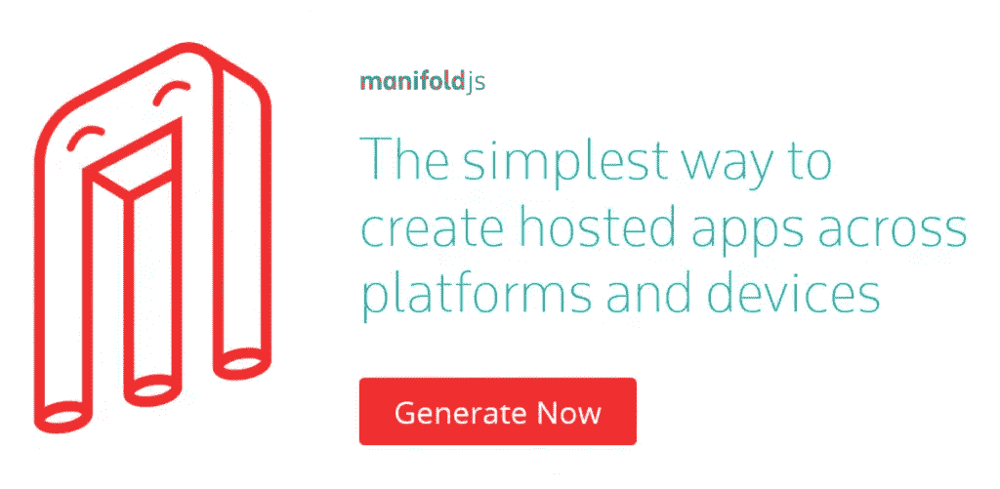
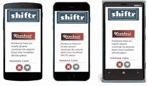
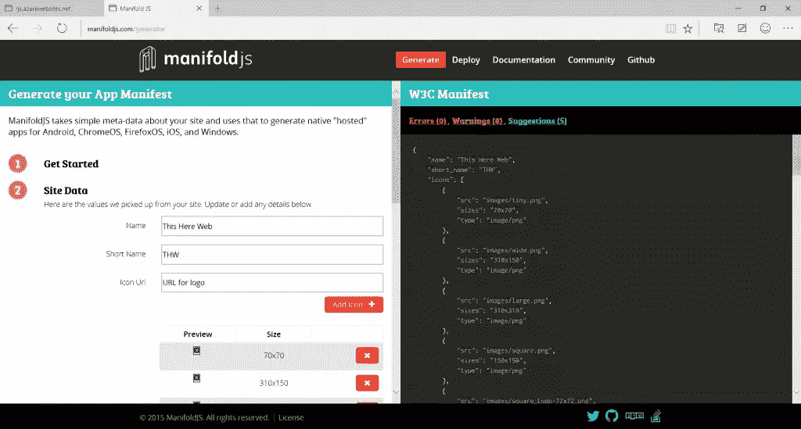

# 使用 manifold 在 Android、iOS 和 Windows 上托管 Web 应用。射流研究…

> 原文：<https://www.sitepoint.com/build-hosted-web-apps-android-ios-windows-manifold-js/>

本文是微软网站开发技术系列的一部分。感谢您对使 SitePoint 成为可能的合作伙伴的支持。

最近在 [//build/ 2015](http://channel9.msdn.com/coding4fun/blog/build-2015?WT.mc_id=13397-DEV-sitepoint-article21) 上，微软宣布了[manifoldJS](http://www.manifoldjs.com/?WT.mc_id=13397-DEV-sitepoint-article21)——跨平台构建托管应用的最简单方式。虽然微软开发者平台的技术研究员兼首席技术官约翰·休丘克(John Shewchuk)在构建托管 web 应用方面做得非常出色(你可以在这里看到概述)，但我想更详细地解释一下为什么你会想要使用托管 Web 应用，并解释如何使用 manifoldJS 为自己构建一个托管 Web 应用。

## 为什么是 Hosted 和 manifoldJS？

托管的 web 应用程序以最小的努力带来了最好的 Web 来存储应用程序。这是一个很好的方式，可以通过你已经建立的体验来接触到更多的用户。当您更新您的网络体验时，您的用户也会在托管的网络应用中获得相同的更新！问题是，到目前为止，托管应用的难点在于每个平台上的流程有多么不同。manifoldJS 通过将重点放在 Web 应用程序的 W3C 清单上来改变这一点，这是一种标准驱动的、开源的创建应用程序的方法，然后使用元数据在 Android、iOS 和 Windows 上创建托管的原生应用程序。当一个平台支持托管应用时，我们在本地构建它，然后我们使用 Cordova 来填充没有本地支持的平台。



## manifoldJS 入门

基本上有两种方法可以开始。如果您是一名生活在命令行中的 web 开发人员，请从 CLI 界面开始。对于想在云中运行 manifoldJS 的开发人员，我们在网站上有相同的工具。



你要做的第一件事，是为你的网站创建一个清单。web 开发人员应该对此非常熟悉，因为它是一个相当简单的 JSON 对象。以下是该网站的一个示例:

```
{
"name":"ThisHereWeb",
"short_name":"THW",
"icons":[
{
"src":"images/tiny.png",
"sizes":"70x70",
"type":"image/png"
}
],
"start_url":"index.html",
"scope":"http://*.thishereweb.com"
"display":"standalone",
"orientation":"landscape"
}
```

关于构建清单文件的更多细节，包括如何从你的 web 服务器提供服务，查看清单上的[这篇文章。如果你想在构建清单方面得到一些帮助，试试 manifoldjs.com 站点](http://www.thishereweb.com/understanding-the-manifest-for-web-app/?WT.mc_id=13397-DEV-sitepoint-article21)上的代码生成器。我们将通过向导向您介绍您需要的值，然后在最后为您提供一份完整的网站清单。

## 使用 CLI 工具

ManifoldJS 运行在熟悉的技术上。唯一的要求是您已经安装了 Node.js。ManifoldJS 可以在任何系统(Mac、Linux 和 Windows)上运行，但只能为该系统支持的平台构建应用程序。

### 安装工具:

```
npm install manifoldjs
grunt manifoldjs
```

ManifoldJS 将通过 npm 处理其所有依赖项的安装。从那里，你只需传入你的网站:

```
manifoldjs http://www.thishereweb.com
```

接下来会发生两件事中的一件:

1.  如果你的网站上有一个清单，它会把它和相应的图片一起拉下来，并从中构建应用程序。
2.  如果您在网站上没有清单，我们将简单地假设一些默认数据并生成您的应用程序，以及一份清单。我们还将使用占位符图像，这样我们仍然可以构建工具。

如果您想了解发生了什么，请打开一些日志记录并关注控制台。除了日志记录，我们还可以设置许多其他选项来控制工具的输出:

**参数**

| 参数 | 描述 |
|  | (必需)托管网站的 URL |
| -m &#124;–清单 | (可选)W3C Web App 清单文件的位置(URL 或本地路径)。如果未指定，该工具将在站点 URL 中查找清单。否则，将创建一个指向站点 URL 的新清单。 |
| -d &#124;–目录 | (可选)生成的项目文件的路径(默认值:当前目录) |
| -s &#124;–简称 | (可选)应用程序简称。指定时，它会覆盖清单的 short_name 值 |
| -l &#124;–日志级别 | (可选)跟踪日志级别选项可用的日志级别:调试、跟踪、信息、警告、错误(默认值:警告) |
| -p &#124;–平台 | (可选)要生成的平台。支持的平台:windows、android、ios、chrome(默认值:所有平台) |
| -b &#124;–构建 | (可选)强制构建过程 |

## 使用基于 Web 的清单生成器

所有这些同样强大的功能在我们基于网络的工具中也是可用的。[访问 web 生成器](http://www.manifoldjs.com/generator?WT.mc_id=13397-DEV-sitepoint-article21)并开始使用。



完成这些步骤后，您只需点击最后的下载，一个包含您所有软件包的 zip 文件就会发送给您。

## 您的应用程序“范围”

Web 应用程序清单允许您指定应用程序的“范围”。这有助于确定您的应用程序停止的位置，以及开放 web 开始的位置。只有你的范围内的网址将显示在应用程序中。如果您使用多个域，或者从我们的域调用内容，只需在您的清单中添加 URI 访问值。

```
"mjs_urlAccess":[

{"url":"http://manupjs.azurewebsites.net/"},

{"url":"http://www.manifoldjs.com/"}

],
```

## 使用原生 API 获得更强大的 Web 体验

作为 web 开发人员，我们总是要求 API 帮助我们模糊本地应用程序和 web 应用程序之间的界限。在大多数平台上，托管 Web 应用程序是一个可信的环境，其中的代码直接与开发人员联系在一起。因此，一些平台允许您访问在浏览器中无法访问的本机 API。

在 Android、iOS 和 Windows 上，我们使用 Cordova 来填充托管应用程序。这样做的额外好处是，您可以将 Cordova JavaScript 文件添加到您的网站，并在您的托管应用程序中使用这些 API。然而，在 Windows 10 中，你实际上可以访问 Windows Universal Apps 的整个 API 表面，这是从蓝牙到低级人机界面的一切。要允许您的应用程序使用这些 API，只需将其添加到您的清单中:

有了访问规则，我们将打开 API 供您直接调用，或者通过 cordova APIs 调用。

## 后续步骤

我们正在努力使构建托管 web 应用程序的过程变得更加容易，但目前仍有一些最后的步骤将由开发人员来完成。对于每个平台，我们提供[如何部署到每个应用商店](http://www.manifoldjs.com/deploy?WT.mc_id=13397-DEV-sitepoint-article21)。测试是应用开发的一个重要部分，我们也有一些技巧和建议来让你的托管 web 应用发挥最大作用。此外，所有应用都必须提交到相应的应用商店，我们也会为您指出正确的方向。

## 最后的想法

托管 web 应用程序允许您开发商店应用程序，同时保持 Web 的完整性和唯一性。现在，使用 [manifoldJS](http://www.manifoldjs.com/?WT.mc_id=13397-DEV-sitepoint-article21) 开发这些应用变得更加简单。您专注于 web 标准，剩下的我们来做。

## JavaScript 的更多实践

这可能会让你有点惊讶，但微软有许多关于开源 JavaScript 主题的免费学习资源，我们的任务是利用 [Microsoft Edge](http://blogs.windows.com/msedgedev/2015/04/29/introducing-microsoft-edge-the-browser-built-for-windows-10/?WT.mc_id=13397-DEV-sitepoint-article21) 创建更多资源。查看我们团队的学习系列:

*   [让你的 HTML/JavaScript 更快的实用性能技巧](http://channel9.msdn.com/Series/Practical-Performance-Tips-to-Make-Your-HTMLJavaScript-Faster/06?WT.mc_id=13397-DEV-sitepoint-article21)(从响应式设计到休闲游戏再到性能优化的 7 部分系列)

*   现代网络平台快速启动(HTML、CSS 和 JS 的基础)

*   [使用 HTML 和 JavaScript JumpStart 开发通用 Windows 应用](http://www.microsoftvirtualacademy.com/training-courses/developing-universal-windows-apps-with-html-and-javascript-jump-start?WT.mc_id=13397-DEV-sitepoint-article21)(使用您已经创建的 JS 来构建应用)

以及一些免费工具: [Visual Studio 社区](http://www.visualstudio.com/en-us/products/free-developer-offers-vs.aspx?WT.mc_id=13397-DEV-sitepoint-article21)、 [Azure 试用版](http://azure.microsoft.com/en-us/pricing/free-trial/?WT.mc_id=13397-DEV-sitepoint-article21)，以及[针对 Mac、Linux 或 Windows 的跨浏览器测试工具](http://modern.ie/?utm_source=SitePoint&utm_medium=article21&utm_campaign=SitePoint)。

本文是微软网站开发技术系列的一部分。我们很高兴与您分享微软 Edge 和新的 T2 Edge html 渲染引擎。获得免费虚拟机或在您的 Mac、iOS、Android 或 Windows 设备上进行远程测试@【http://dev.modern.ie/ 

## 分享这篇文章