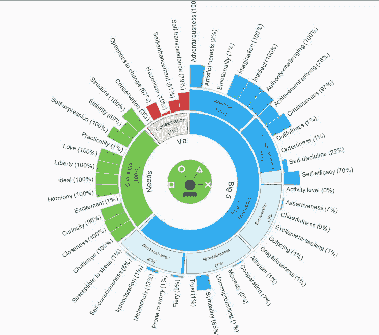
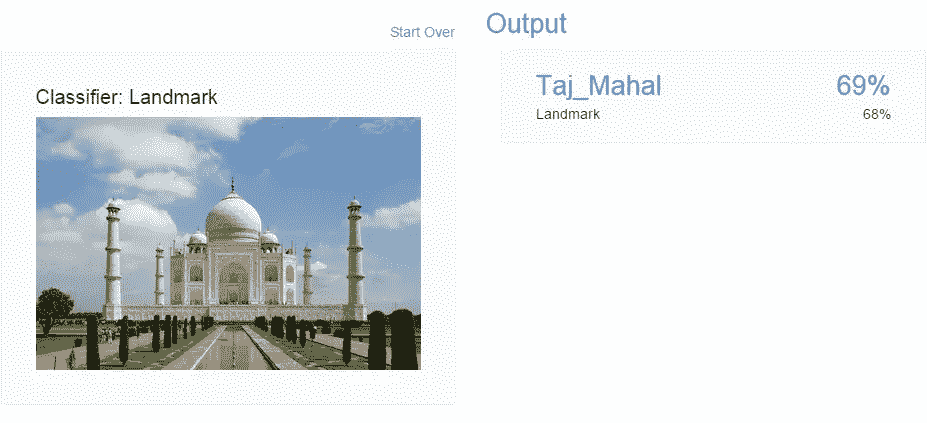

# IBM 的沃森开发者云

> 原文：<https://www.sitepoint.com/ibm-watson-developer-cloud/>

几年前，IBM 在人工智能领域首次亮相，推出了能够回答自然语言问题的人工智能计算机系统 [Watson](http://en.wikipedia.org/wiki/Watson_%28computer%29) 。

Watson 现在包括了一个 web APIs 集合，使 Web 开发人员能够在他们的 Web 应用程序中利用 Watson 的认知能力。这些 REST APIs 可以通过 IBM 的 Bluemix 云服务平台公开获得，该平台被称为 Watson 开发者云。

IBM 的沃森首席技术官 Rob High 曾被[引用](https://gigaom.com/2013/11/14/have-at-it-programmers-ibm-makes-watson-available-via-api/)的话说，开发者可以利用这些 API，而不需要了解任何关于机器学习的知识。

## 开发者云上的演示应用

### 个性见解演示

IBM[Watson personal Insights](http://watson-um-demo.mybluemix.net/?reset=true)服务提供了一个 API，使应用程序能够从社交媒体、企业数据或数字通信中获得洞察力。

沃森以所谓的“五大”百分比的形式给出了人格见解。这些是开放、认真、外向、情感丰富和随和的人类特征。除了“五大”之外，它还提供了一些关于一个人个性需求和价值的见解。

他们的网站[建议](https://www.ibm.com/smarterplanet/us/en/ibmwatson/developercloud/doc/personality-insights/)—

> 这些见解有助于企业了解客户的偏好，并通过预测客户需求和建议未来行动来提高客户满意度。这使得企业能够提高客户获取、保留和参与度，并加强与客户的关系。

它还以图表的形式提供了漂亮的可视化结果，这是在 [D3.js](http://d3js.org/) 的帮助下创建的:

它的文档可以在[这里](http://www.ibm.com/smarterplanet/us/en/ibmwatson/developercloud/doc/personality-insights/index.html)获得，它的 REST API 可以从[这里](http://www.ibm.com/smarterplanet/us/en/ibmwatson/developercloud/apis/#!/personality-insights)访问，你可以通过分叉[这个](https://github.com/watson-developer-cloud/personality-insights-nodejs) GitHub 库来破解代码。

### 问答

[沃森问答](http://watson-qa-demo.mybluemix.net/)服务通过获取基于原始数据源(小册子、网页、手册、记录等)的有意义的信息来解释和回答与旅游和健康行业相关的问题。

每个答案都有一个相关的置信度，并且链接到答案的支持证据。该应用程序目前处于测试阶段，因为它目前尚未通过机器学习进行训练。

它的文档可以在这里[找到](http://www.ibm.com/smarterplanet/us/en/ibmwatson/developercloud/doc/qaapi/)，你可以通过分叉[这个](https://github.com/watson-developer-cloud/question-and-answer-ruby) GitHub 库来破解代码。

### 视觉识别

IBM [Watson 视觉识别](http://www.ibm.com/smarterplanet/us/en/ibmwatson/developercloud/doc/visual-recognition/)服务提供了一个 API，使用户能够分析图像或视频帧以理解它们的内容。

我们决定[测试](http://visual-recognition-demo.mybluemix.net/)该应用程序，并在 landmarks 类别中提供了一张来自维基百科的图片作为输入:

而 Watson 不到 8 秒就给出了下面的输出！

视觉识别文档在[这里](http://www.ibm.com/smarterplanet/us/en/ibmwatson/developercloud/doc/visual-recognition/)可用，它的 REST API 可以从[这里](http://www.ibm.com/smarterplanet/us/en/ibmwatson/developercloud/apis/#!/visual-recognition)访问，你可以通过分叉[这个](https://github.com/watson-developer-cloud/visual-recognition-nodejs) GitHub 库来破解代码。

## IBM 目前提供的 13 种服务

1.  **[个性洞察](http://www.ibm.com/smarterplanet/us/en/ibmwatson/developercloud/personality-insights.html)**
    能够更深入地了解人们的个性特征、需求和价值观，以帮助用户按照自己的方式参与进来。
2.  **[概念洞察](http://www.ibm.com/smarterplanet/us/en/ibmwatson/developercloud/concept-insights.html)**
    基于你输入背后的概念探索信息，而不是将调查局限于基于传统文本匹配的发现。
3.  **[概念扩展](http://www.ibm.com/smarterplanet/us/en/ibmwatson/developercloud/concept-expansion.html)**
    将委婉语或口语术语映射到更容易理解的短语。
4.  **[语言标识](http://www.ibm.com/smarterplanet/us/en/ibmwatson/developercloud/language-identification.html)**
    标识书写文本的语言。
5.  **[机器翻译](http://www.ibm.com/smarterplanet/us/en/ibmwatson/developercloud/machine-translation.html)**
    将一种语言的文本输入转换成最终用户的目标语言。
6.  **[信息共鸣](http://www.ibm.com/smarterplanet/us/en/ibmwatson/developercloud/message-resonance.html)**
    以适合人们的方式和语言与他们交流。
7.  **[问答](http://www.ibm.com/smarterplanet/us/en/ibmwatson/developercloud/question-answer.html)**
    基于原始数据来源，直接解读并回答用户问题。
8.  **[关系提取](http://www.ibm.com/smarterplanet/us/en/ibmwatson/developercloud/relationship-extraction.html)**
    智能查找句子成分(名词、动词、主语、宾语等)之间的关系。).
9.  **[语音转文本](http://www.ibm.com/smarterplanet/us/en/ibmwatson/developercloud/speech-to-text.html)**
    以低延迟将英语语音转录为文本。
10.  **[文本到语音](http://www.ibm.com/smarterplanet/us/en/ibmwatson/developercloud/text-to-speech.html)**
    从英语或西班牙语文本合成听起来自然的语音。
11.  **[权衡分析](http://www.ibm.com/smarterplanet/us/en/ibmwatson/developercloud/tradeoff-analytics.html)**
    帮助人们优化决策，同时在多个——通常是相互冲突的——目标之间取得平衡。
12.  **[视觉识别](http://www.ibm.com/smarterplanet/us/en/ibmwatson/developercloud/visual-recognition.html)**
    对图像和视频帧的视觉内容进行分析，直接理解内容，无需文字描述。
13.  **[可视化效果图](http://www.ibm.com/smarterplanet/us/en/ibmwatson/developercloud/visualization-rendering.html)**
    提供了数据分析的图形化表示，便于理解。

## 结论

IBM 已经迈出了可喜的一步，将 Watson 的 API 免费提供给开发人员，使他们能够让自己的应用程序具有认知能力，更加智能。希望随着时间的推移，更多像这样的机器学习和自然语言处理服务将免费提供给开发者。如果它们也可以开源，那将是锦上添花！

各种个人和组织目前正在开发自然语言处理解决方案，如 [Siri](http://en.wikipedia.org/wiki/Siri) 、 [Google Now](http://en.wikipedia.org/wiki/Google_Now) 、 [Cortana](http://en.wikipedia.org/wiki/Microsoft_Cortana) 、 [Jasper](http://jasperproject.github.io/) 和 [Sirius](http://sirius.clarity-lab.org/) 。将这种服务与 web 应用程序集成的能力将是一个额外的奖励，它开创了一个使用 web 服务进行语音交互的新时代，让我们从鼠标和键盘中解放出来！

那么，你觉得沃森的新 API 怎么样？你试过了吗？如果没有，你能想象有一天你会用它们做什么吗？

## 分享这篇文章