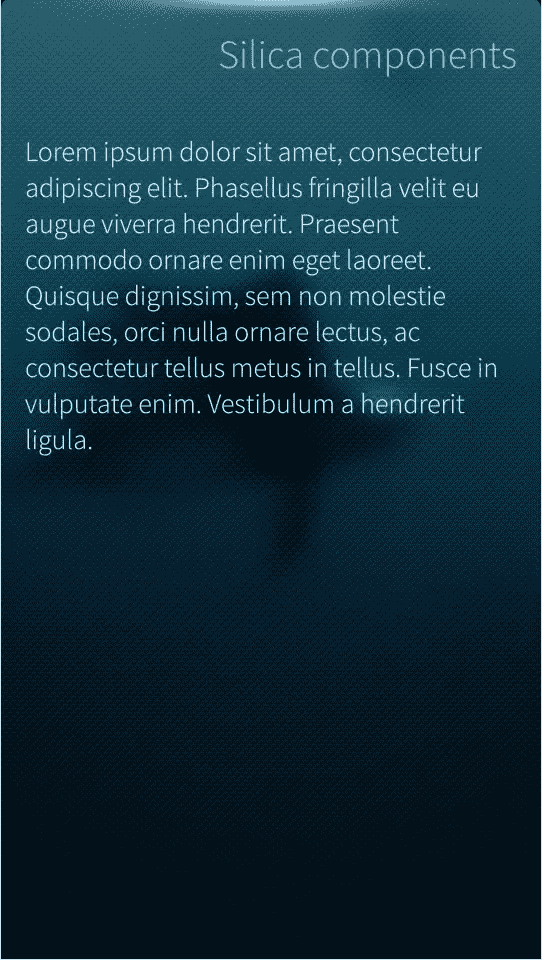
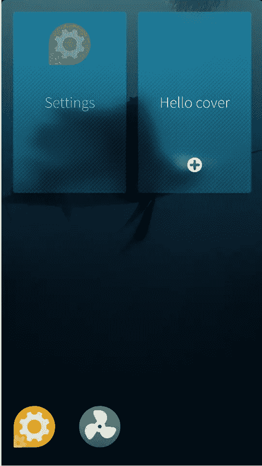
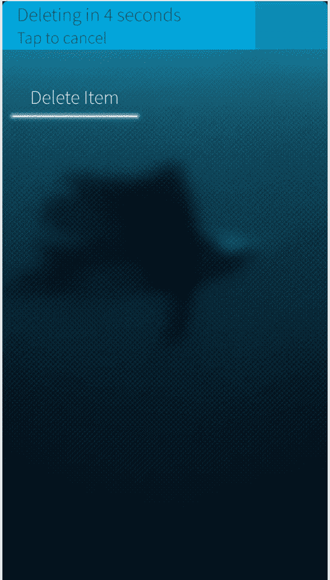
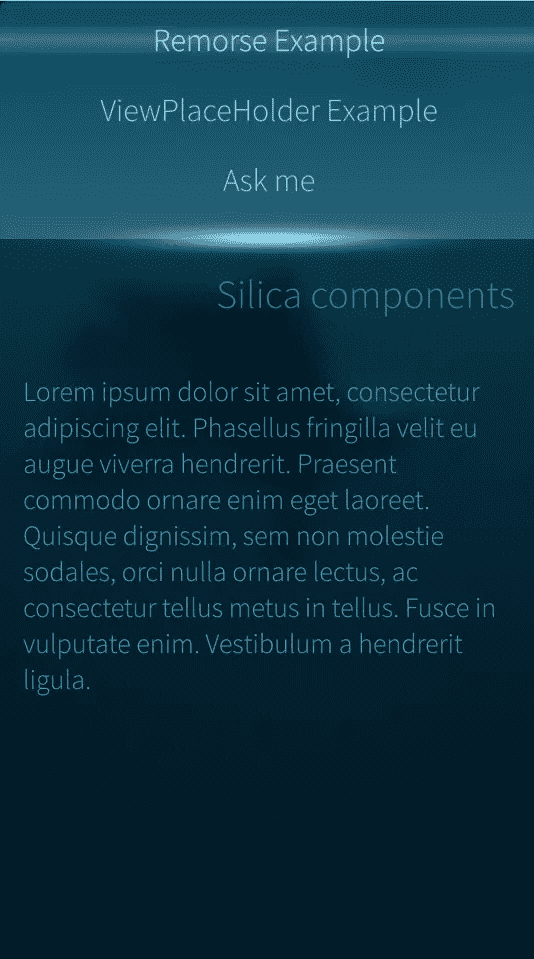
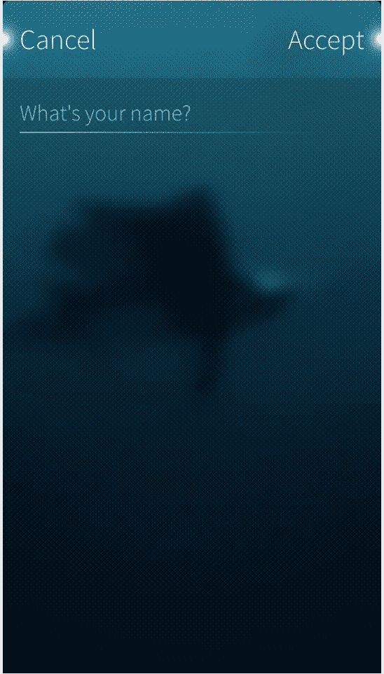

# 旗鱼操作系统用户界面的二氧化硅组件

> 原文：<https://www.sitepoint.com/silica-components-user-interfaces-sailfish-os/>

Sailfish UI 是使用 QML 声明性语言编写的，这种语言允许根据用户界面的可视组件以及它们如何相互交互和关联来描述用户界面。

它有一个类似 JSON 的语法，支持 Javascript 表达式和动态属性绑定。它的一个关键特性是它的可读性很高，并且允许在用户界面中重用和定制组件。

有了 QML，创建高性能、流畅和吸引人的应用程序变得简单，而`QtQuick`模块提供了基本组件。

Sailfish SDK 包括 Sailfish Silica，这是一个扩展 QML 模块，提供了为 Sailfish 应用程序设计的其他类型。

用 QML 编写 Sailfish 应用程序时，您需要同时使用 Sailfish Silica 和 QtQuick 模块。您应该尽可能使用 Silica，因为这些组件具有 Sailfish 的外观和感觉，与标准 Sailfish 应用程序的行为一致，并使应用程序能够利用独特的 Sailfish 功能，如滑轮菜单和应用程序外壳。

在这篇文章中，我将描述最常见的组件，如何使用它们以及何时使用。

## 基本组件

QTQuick 提供了一个 app 需要的基本对象类型，比如`Image`、`Rectangle`、`Circle`、`Item`、`ListView`。完整的列表可以在[这里](http://doc.qt.io/qt-5/qtquick-qmlmodule.html)找到。

这些都可以在 Sailfish 应用程序中使用，但是你应该使用正确的 Silica 组件(SilicaListView vs ListView，SilicaGridView vs GridView 等)。)因为它们有旗鱼的外观和感觉。

要使用这些组件，只需将以下内容添加到 QML 文件中:

```
import QtQuick 2.0
```

并在 QML 文件中添加:

```
import Sailfish.Silica 1.0
```

开始使用二氧化硅成分。

## 主题

现在让我们讨论二氧化硅成分。对象提供了常见的样式信息，如颜色、字体和边距。颜色将与用户选择的环境相匹配。

让我们从一个例子开始:

```
Text {
    color: Theme.primaryColor
    font.family: Theme.fontFamily
    font.pixelSize: Theme.fontSizeMedium
}
```

文本元素是一种只读的格式化文本视图。这里我定义了文本的三个最常见的属性，使用相对主题的属性。主题对象定义了一组大小、颜色和字体属性:

Sailfish UI 中使用了两种标准字体:

*   `Theme.fontFamily`–默认字体，用于标签、按钮等
*   `Theme.fontFamilyHeading`–用于显示标题文本。标题、页眉等。

字体像素大小由以下属性定义:

*   `Theme.fontSizeExtraSmall`
*   `Theme.fontSizeSmall`
*   `Theme.fontSizeMedium`
*   `Theme.fontSizeLarge`
*   `Theme.fontSizeExtraLarge`

和颜色值:

*   `Theme.primaryColor`–用于标签
*   `Theme.secondaryColor`–用于用户界面不太突出的部分
*   `Theme.highlightColor`–用于用户界面的活动和选定区域
*   `Theme.secondaryHighlightColor`–不太突出的亮色

在 Silica 模块中，标签组件是可用的，它应该优先于文本元素使用，因为它利用了上面的属性。

最后，主题对象公开了所有标准的项目大小和填充值:

*   `itemSizeSmall`–小项目尺寸，例如用于单行列表项目
*   `itemSizeMedium`–中等项目大小，例如用于两行列表项目
*   `itemSizeLarge`–用于复杂列表项目的大项目尺寸，用于有一些内容要预览的项目
*   `itemSizeExtraLarge`–超大项目尺寸，为纵向宽度的四分之一，用于列表标题网格
*   `paddingSmall`–小衬垫，常用于紧密贴在一起的标签之间
*   `paddingMedium`–中等填充，用户界面组件内的普通边距
*   `paddingLarge`–大填充，通常用作靠近显示边框的页边距

尽可能地使用这些，这样应用程序看起来与平台的外观和感觉一致。

## 页面和页面堆栈

一个`Page`定义了一个单独的内容屏幕，用户可以从应用程序中导航到该屏幕。对于当前方向，它的大小通常是屏幕的全宽和全高。它可能会因方向更改或显示的输入面板而调整大小。

如果页面太小，为了确保内容可以滚动，将所有内容放在一个`SilicaFlickable`中。

如果你需要显示一个页面标题，使用为这个用途设计的`PageHeader`类型。

一个例子:



```
import QtQuick 2.0
import Sailfish.Silica 1.0

Page {
    SilicaFlickable {
        contentHeight: column.height
        anchors.fill: parent

        VerticalScrollDecorator {}

        Column {
            spacing: Theme.paddingLarge
            id: column
            width: parent.width

            PageHeader {
                title: "Silica components"
                id: header

            }

            Label {
                text: "Lorem ipsum dolor sit amet, consectetur adipiscing elit. Phasellus fringilla velit eu augue viverra hendrerit. Praesent commodo ornare enim eget laoreet. Quisque dignissim, sem non molestie sodales, orci nulla ornare lectus, ac consectetur tellus metus in tellus. Fusce in vulputate enim. Vestibulum a hendrerit ligula."
                font.pixelSize: Theme.fontSizeSmall
                wrapMode: Text.Wrap

                anchors {
                            left: parent.left
                            right: parent.right
                            margins: Theme.paddingLarge
                        }
            }

        }
    }
}
```

上面我定义了一个只包含一个孩子的`Page`,一个`SilicaFlickable`,以确保如果内容太长不适合，它将是可滚动的。我添加了一个`VerticalScrollDecorator`，在滚动时给用户视觉反馈。

接下来，`Column`和`QtQuick`组件用于垂直定位一系列项目，无需使用锚。我使用了`Theme`对象来设置间距属性。

我使用了`PageHeader`类型来显示页面标题，并最终创建了一个`Label`，带有一些文本和一个属性来按照我的意愿显示它。

页面通过由`PageStack`类型提供的基于堆栈的导航模型来处理。我们的`ApplicationWindow`(Sailfish 应用程序的顶层组件)有一个名为`pageStack`的属性，它保存了一个这样的实例，总是显示页面堆栈中最顶层的页面。

可以将一个页面推送到堆栈上(使用`push()`方法),将其放在堆栈的顶部，或者弹出页面(使用`pop()`方法)将其移除。

有了这个模型，很容易在应用程序中提供层次导航，手势和标准按钮允许用户来回导航


在上图中，您可以看到页面堆栈左上角(或右上角)的指示器指示页面是否可以向后或向前滑动。导航手势可以通过`navigateBack()`和`navigateForward()`功能实际调用。

例如，如果我将这段代码添加为`Column`对象的子对象:

```
Button {
            text: "next page"
            onClicked: pageStack.push("MyPage.qml")
        }

        Button {
            text: "previous page"
            onClicked: pageStack.pop()

        }
```

其中`MyPage.qml`是页面本身的名称，用户可以来回浏览同一页面的更多实例。

## 涉及

活动封面是旗鱼的特色之一。它是在后台运行的应用程序的可视化表示，它将在主屏幕上可见。

它可用于向用户显示实时信息(如当前播放的歌曲)，并提供一个或两个无需打开应用程序即可直接触发的封面动作(如暂停、跳过歌曲)。

`ApplicationWindow`保存了可以使用顶级元素创建的封面实例，即`CoverBackground`类型:



```
import QtQuick 2.0
import Sailfish.Silica 1.0

CoverBackground {

    Image {
        id:background
        fillMode: Image.PreserveAspectCrop
        source: "landscape.png"
    }

    Label {
        anchors.centerIn: parent
        id: label
        width: parent.width
        horizontalAlignment: Text.AlignHCenter
        text: "Hello cover"
    }

    CoverActionList {
        id: coverAction

        CoverAction {
            iconSource: "image://theme/icon-cover-new"
            onTriggered: addItem()
        }

    }

    function addItem() {
        console.log("Adding item")
    }

}
```

在这个例子中，我创建了一个`CoverBackground`对象，并添加了一个图像作为它的子对象，这个子对象将被用作背景并填充整个封面，保持图像的纵横比。

我添加了一个居中的标签和一个带一个`CoverAction`的`CoverActionList`。

`CoverAction`指定当一个覆盖手势被激活时要采取的动作。它定义了一个图标和一个在合适的时间触发的功能。Sailfish 只为一个封面处理两个`CoverAction`。您可以看到如何在 QML 中使用类似 javascipt 的函数和语法来声明函数，并将它们用作事件的回调。

## RemorsePopup 和 RemorseItem

Sailfish UI 工具包中另一个有趣的元素是`RemorsePopup`。

这允许在*后悔*期过去后执行破坏性选项。用户改变了主意，或者按错了按钮，所以为他们提供一个取消破坏性操作的选项总是好的，尤其是在触摸设备上。



用户可以在超时前点击弹出菜单，取消破坏性操作。

添加一个`RemorsePopup`很容易。如果我有一个“删除”按钮:

```
Button {
   text: "Delete Item"
   onClicked: deleteItem()
}
```

离开`deleteItem`方法，我可以像这样修改代码:

```
Button {
   id: button
   text: "Delete Item"
   onClicked: remorse.execute("Deleting",  deleteItem )
   RemorsePopup { id: remorse }

}
```

当用户点击按钮时，`RemorsePopup`将显示指定的文本。

一旦超时，将调用`deleteItem`回调。

`RemorseItem`类型以同样的方式工作，但是可以附加到一个对象(比如一个列表元素),在那里它将成为其目标父对象的兄弟。

## 滑轮菜单

在 Sailfish 中，菜单通常表示为滑轮菜单。它位于视图内容的上方/下方，可通过上下拖动视图来访问。菜单项由以下任一方式激活:

*   向下/向上拖动视图以高亮显示菜单项，然后松开鼠标激活。
*   拖动或轻拂以显示整个菜单，并轻按菜单项以激活。

滑轮菜单应添加到`SilicaFlickable`、`SilicaListView`、`SilicaGridView`或`SilicaWebView`才能工作。

`PullDownMenu`用于创建滑轮菜单，它将通过声明`MenuItem`对象为其子对象来填充。



```
import QtQuick 2.0
import Sailfish.Silica 1.0

Page {
        SilicaListView {
            PullDownMenu {
                MenuItem {
                    text: "Option 1"
                    onClicked: console.log("Clicked option 1")
                }
                MenuItem {
                    text: "Option 2"
                    onClicked: console.log("Clicked option 2")
                }
            }
            header: PageHeader { title: "Header" }
            delegate: MyListItem {}
            model: MyModel {}
        }
    }
```

## 视图占位符

另一个方便的组件是`ViewPlaceholder`。它提供了占位符文本，当没有可用内容时，这些文本将显示在空视图中。

通过这种方式，用户将会意识到应用程序已经准备好了，但是没有什么要显示的。

如果视图有一个`PullDownMenu`，点击`ViewPlaceholder`将显示菜单，向用户指示可能有可用的选项。

```
Page {
    SilicaListView {
        id: view
        anchors.fill: parent
        model: ListModel { }

        ViewPlaceholder {
            enabled: view.count == 0
            text: "Nothing to show now"
        }

        delegate: BackgroundItem {
            width: view.width
            Label { text: "Item " + index }
        }
    }
}
```

在这个例子中，我给一个`SilicaListView`添加了一个`ViewPlaceholder`，并将它的 enabled 属性绑定到列表本身的`count`属性。

一旦我们向列表模型添加了一些东西，我们的`ViewPlaceholder`就会消失。

## 对话

是一个通用容器，用于显示接受用户输入的对话框。它将显示为一个添加到`PageStack`顶部的模态对话框。用户可以接受对话框(确认修改，或输入并继续)，从右向左推动页面，或点击接受按钮。相反，通过从左向右推动页面或点击取消按钮来拒绝对话框。

一个简单的对话框是这样创建的:



```
import QtQuick 2.0
import Sailfish.Silica 1.0

Dialog {
    property string name

    Column {
        width: parent.width

        DialogHeader { }
        TextField {
            id: nameField
            width: 480
            placeholderText: "What's your name?"
        }
    }

    onDone: {
        if (result == DialogResult.Accepted) {
            name = nameField.text
        }
    }
}
```

当用户接受或取消对话框时，将触发`onDone`事件。`DialogResult.Accepted`持有用户意图。

`DialogHeader`应该用来在对话框页面的顶部提供页面指示器。

该对话框可作为普通页面推至`pageStack`显示。

```
Column {
    Label {
        id: displayedName
    }

    Button {
        text: "Ask me"
        onClicked: {
            var dialog = pageStack.push("NameInputDialog.qml", {"name": displayedName.text})
            dialog.accepted.connect(function() {
                displayedName.text = "My name: " + dialog.name
            })
        }
    }
}
```

上面我使用对话框的`name`属性(当对话框被接受时设置)将对话框的信号“accepted”连接到一个更新标签的 javascript 函数。

如果对话框被拒绝，则调用`onRejected`信号处理器，并将结果设置为`DialogResult.Rejected`。

## 结论

这是对最流行的二氧化硅组件的简要介绍，理解和正确使用这些组件对于创建具有 Sailfish 外观和感觉的本机应用程序非常重要。我将在以后的文章中更详细地介绍更多的组件。同时，享受旗鱼，我很想知道你的意见。

## 分享这篇文章