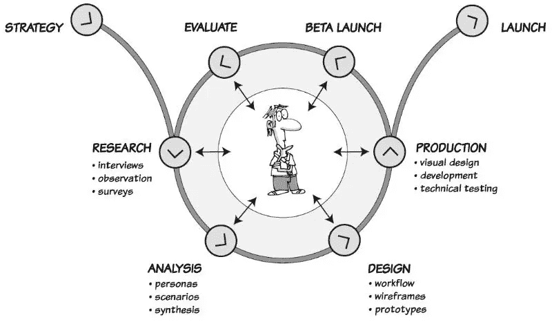
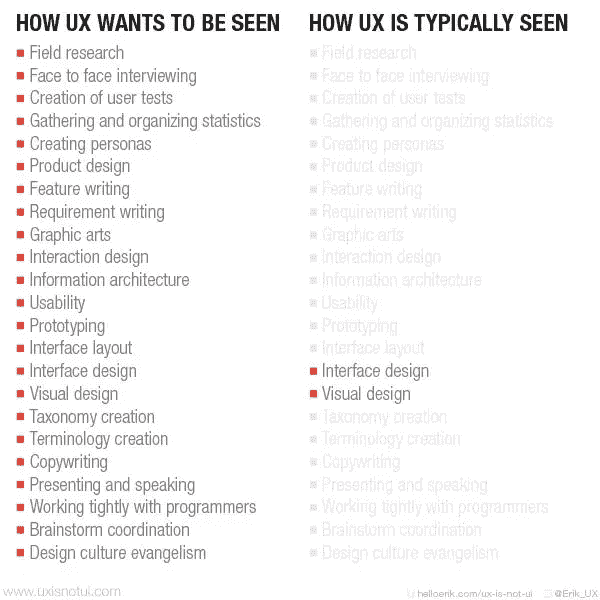
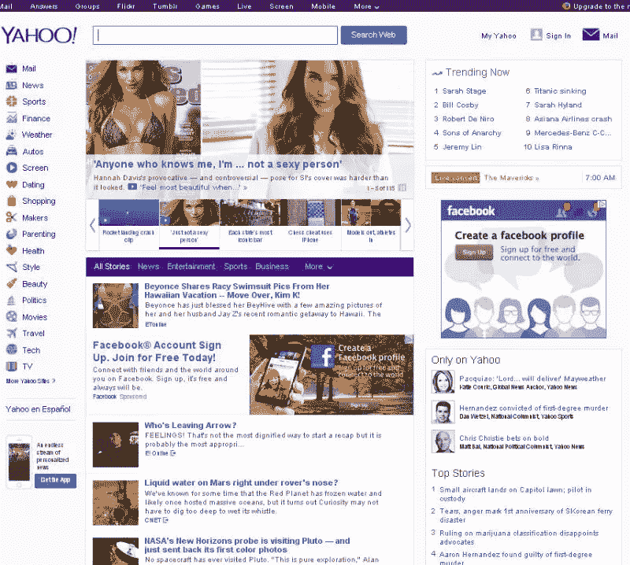
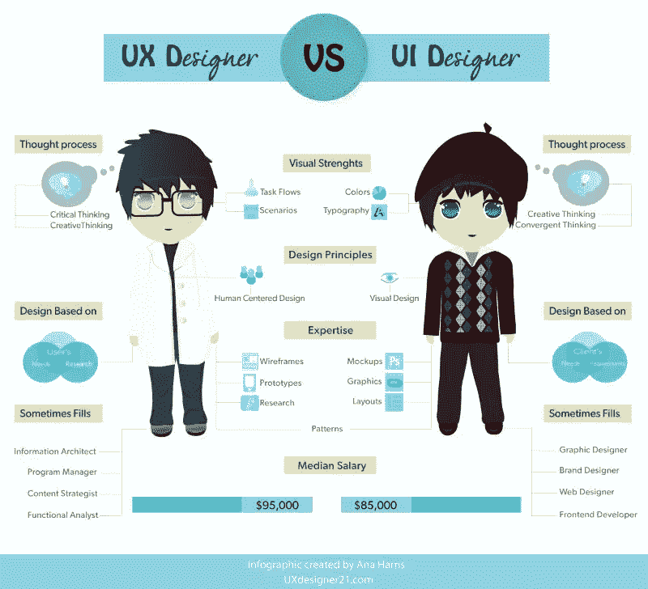
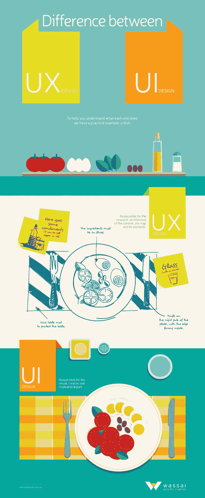
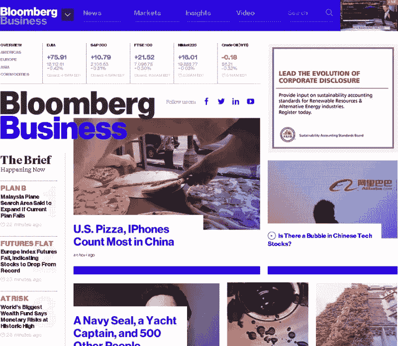
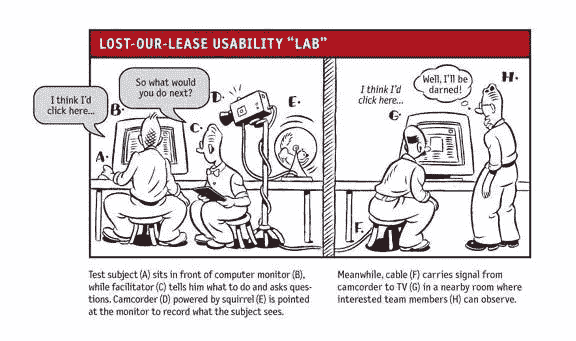
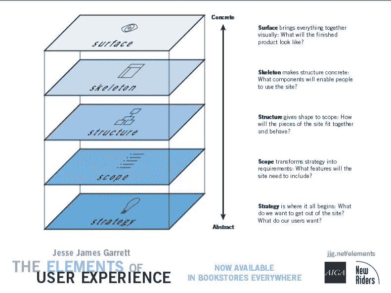
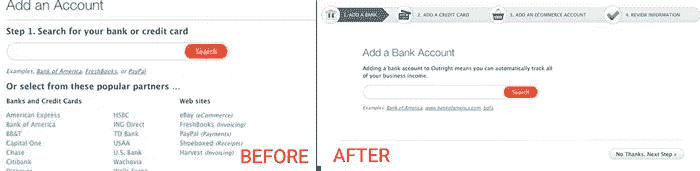

# 关于 UX 的 5 个荒谬的常见误解

> 原文：<https://www.sitepoint.com/5-ridiculously-common-misconceptions-about-ux/>

如果我说用户体验(又名 UX)是你的义务而不是选择，你会怎么说？

虽然这个术语是由 Don Norman 在 90 年代中期创造的，并且被认为是影响转化的关键因素，但 UX 仍然没有被许多企业战略性地纳入核心设计业务。

也许这只是因为我们不熟悉衡量优秀 UX 的方式，或者这只是一些企业没有历史或传统的一个新头衔。无论如何，我认为现在是我们揭示一些围绕 UX 的关键误解以及它如何影响你的核心转变的时候了。

## 误解 1——UX 和用户界面是同义词

虽然用户体验和用户界面乘坐同一艘船，有相同的目的地，但每个人在不同的地点登机，并支付不同的费用。然而，一些人(可能不太了解)仍然认为 UX 和 UI 是可以互换的术语。

“用户界面”是“用户体验的一个组成部分，但是还有更多“T1”，Adaptive Path 的联合创始人[彼得·梅尔霍尔茨](http://www.peterme.com/)说。

简而言之，UI 是提供用户体验的整个过程中的一个步骤，而不是过程本身。这是一个可以显著影响用户(顾客、访问者等)体验的元素。).

*[用户体验流程概述](http://uxmastery.com/resources/process)——明白了吧，我的意思？*

这里有一个例子可以说明 UX 到底是什么，以及有些人是如何看待它的:

*现实 vs 误解——[UX 不是 UI](http://www.uxisnotui.com/)*

## 误解 2——花哨的元素赞美 UX

被花哨的铃铛和哨子吸引，一些设计师会疯狂地在设计中加入花哨的元素。他们的理由是，如果他们发现构建令人兴奋，用户肯定也会感到更高的参与度。这是一个容易落入的陷阱。

设计不仅仅是让事物变得漂亮，还包括如何让一件作品在性能上更流畅，使用上更简单。一些设计者认为吸引他们的东西通常只会增加用户的复杂性。这种复杂性会对转化率产生负面影响，但只会影响产品的使用。

正如 Don Norman 所说，“以人为中心的设计的全部意义在于驯服复杂性，将看似复杂的工具转变为适合任务的工具，可以理解、使用和享受。”

简而言之，尽量避免过度填充你的设计，让它尽可能简单而强大。

*[雅虎主页](http://www.yahoo.com):来到这里使用搜索，但后来分心了。难怪谷歌更受青睐。*

## 误解 3——我们只需要设计师，而不是 UX 专家

培育一个以设计为中心的环境可能会给你带来视觉震撼的设计，但不是以用户为中心的体验。将 UX 专家视为你团队中不可或缺的一部分，失去你渴望的用户中心！

两人(UX 和 UI 设计师)的主要区别在于，设计师倾向于从客户驱动的创意角度思考问题，而 UX 的专家会从用户驱动的决策角度思考问题。因此，从一开始就让一名 UX 专家加入是有意义的。

设计师可能会给产品(应用程序或网站)面子，但 UX 专家通常会研究市场，战略性地审查分析，进行采访或调查以获得反馈，批准故事板，以及其他专注于创造出色的整体体验的任务。

有时，UX 专家可能是在该领域拥有丰富专业知识的个人。其他时候，它可以是一组来自不同领域的专家个人，如市场营销、故事写作、产品管理、信息架构师等。

简而言之，设计一个伟大的 UX 是设计师和 UX 专家的工作。

以下是 UX 和 UI 设计师的区别:

*由[安娜·哈里斯](http://uxdesigner21.com/)*

康卡斯特信息架构和 UX 负责人利维雅·拉巴特说:“用户体验不仅仅是一个部门或一个人的责任。对 UX 的这种分隔主义观点证明，它不是组织文化的一部分，并暗示团队没有共同的目标或愿景来实现他们应该集体交付的体验。”

以下是双方对整个项目的贡献:

*由[华赛](http://wassai.com.uy/en/understanding-the-difference-between-ui-and-ux-design/)*

## 误解 4——UX 不需要测试，这是一个完成并交付的任务

出色的用户体验是精心策划的策略的结果，而不是偶然！

由于 UX 完全迎合用户的行为，让这些用户试驾设计并提供他们的反馈是非常重要的。

Chrome 上的 *[彭博网站](http://www.bloomberg.com/):左边和左上角的字体几乎不可读。似乎没有对 Chrome 做足够的测试。同样的网站在 Firefox 上看起来很好。*

UX 咨询公司 Tec-Ed，Inc .的首席执行官斯蒂芬妮·罗森鲍姆(Stephanie Rosenbaum)说，“*真正的用户总是给我们带来惊喜。他们经常会遇到我们意想不到的问题，有时他们会轻而易举地解决我们认为他们会陷入困境的问题。*

因此，将“测试”视为 UX 进程的一个重要组成部分比以往任何时候都更加重要。

我想引用可用性专家顾问史蒂夫·克鲁格的一句话来结束这个误解:“大多数网页设计问题都没有简单的‘正确’答案(至少对重要的问题来说是这样)。起作用的是好的、满足需求的集成设计——经过深思熟虑、良好执行和测试。”

摘自史蒂夫·克鲁格的《不要让我思考:网站可用性的常识方法》

## 误解 5——设计第一，UX..嗯..后来

大 UX 走在所有成功产品设计运作的最前沿——无论是有形产品(如汽车)还是无形产品(如网站或应用程序)。将它洒在一个完成的项目上不可避免地不仅会导致投资回报率(ROI)的降低，还会导致大量不满意的客户和/或访问者。

从项目一开始，就有一个 UX 专家——一个非常熟悉目标受众、他们的兴趣和行为的人——是至关重要的。

简而言之，从第一天开始就将 UX 策略整合到项目中，可以让您更早地做出明智的设计决策，从而节省时间和金钱。

Jesse James Garrett， [UX 专家和 Adaptive Path](http://www.adaptivepath.com/about/team/jesse-james-garrett/) 的联合创始人，在他的书《用户体验的要素》中定义了 UX 设计的 5 个层次，UX 战略是其核心，最后是视觉设计。

*用户体验的要素 [(PDF 下载)](http://www.jjg.net/elements/pdf/elements_simpleplanes.pdf)*

为了更好地理解它，让我们来看看《精益创业的 UX》一书的作者劳拉·克莱因进行的案例研究。几年前，她为一家会计和税务咨询公司 outlete 重新设计了 UX。

在最初的研究中，我们发现网站取消率高的一个主要原因是由于大量的“添加帐户”过程。帐户设置页面被所需的信息弄得乱七八糟，这使得新用户不知道该放什么信息。

这显然是 UX 的失误。如果他们先雇佣了 UX 的设计师，他们就能避免很高的取消率。所以，[以下是劳拉·克莱因和她的 UX 团队如何重新设计网页，并看到取消率降低了 20%。](http://www.smashingmagazine.com/2011/08/17/breaking-the-rules-a-ux-case-study/)

*页面重新设计前后*

## 结论

在 2015 年，在你的项目中拥有一个精心规划的 UX 战略是绝对不可或缺的。另外，更熟悉它的具体细节也很重要。正如汽车安全带曾经是一个配件，UX 现在是一个必需品，而不是一个选项！

## 分享这篇文章