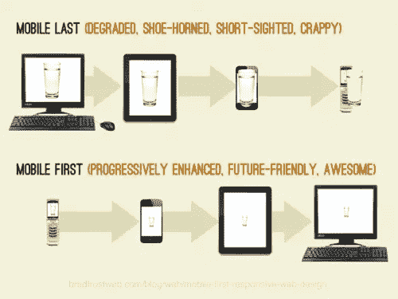

# 移动优先媒体查询简介

> 原文：<https://www.sitepoint.com/introduction-mobile-first-media-queries/>

不可否认，响应式方法在我们的设计和实现工作中的影响。曾经是新的和未知的现在是假定的标准。当我开始理解响应式网站设计的影响时，我很容易就找到了如何应对媒体的询问，但我很难找到为什么我应该以某种方式去做。这篇文章试图补救这种情况。

我的意图是，对于那些试图理解移动优先方法的巨大影响的人来说，它将是一个有用的介绍，对于那些对该方法更有经验的人来说，它可以作为一个很好的复习。

我将重点关注编写移动优先媒体查询的细节，这也将包括我们为什么应该这样做，并以开始的指导结束。然而，首先我们应该看看“移动优先”这个短语的一些重要区别。

## 手机的阴影-第一

对于我们的讨论来说，区分“移动优先”有两种不同的含义是很重要的。有些人可能认为这是不必要的，但对于我将在文章结尾分享的指导来说，这是很重要的。

许多人都熟悉卢克·乌鲁布莱夫斯基在他的书《移动优先》中提出的哲学方法。Luke 写了移动优先策略的设计优势，最大的影响是移动设备强加的限制，迫使我们专注于本质。他还谈到了移动设备如何能够让我们增强体验(例如 GPS、加速度计等)。).这就是我所说的*移动优先设计*。

然而，这不是唯一的意义，本文将重点讨论第二种意义。第二种意义我称之为*移动优先实现*。这使用了由 Ethan Marcotte 创造的响应式设计的技术原则。这意味着当我们实际实现界面(原型或产品)时，我们从尽可能小的视口开始设计(我们称之为“移动视口”，但有一天这可能是最小的“观察视口”)，然后随着视口的增加，我们逐渐添加样式，有时添加其他增强。

现在让我们来看看移动优先媒体查询的方式和优势。

## 创建移动优先媒体查询

在本节中，我不想解释媒体询问的所有细节，而是想特别关注这项技术在技术上是如何实现的。让我们看两个不同的媒体查询，并剖析它们的实现。请注意，我保持简单，所以我将避免任何特定的类命名结构或风格。

```
.sidebar {
  float: left;
  width: 25%;
}

.content {
  float: left;
  width: 75%;
}

@media (max-width: 40em) {
  .sidebar, .content {
     float: none;
     width: auto;
  }
}
```

你可以在这个 CodePen 演示中看到这个简单的例子[。调整窗口大小以查看发生的变化。](http://codepen.io/SitePoint/pen/pJjjKj/)

在这个例子中，我有两个使用浮动的元素，所以它们是水平排列的，我对它们都使用了基于百分比的宽度。然后我有一个媒体查询断点，其中浮动被禁用，宽度使用“auto”值恢复为全宽。

这种方法有什么问题？

1.  它迫使我们通过媒体查询来“撤销”风格。这不是管理你的风格的有效方法，但是我们应该添加风格。
2.  我们最初的浮动样式违背了 HTML 元素的自然流程。块元素自然地在顶部和底部清除，并以 100%流动，所以“撤销”样式仅仅是显式地声明元素已经自然地做了什么。
3.  这不允许我们接受我们在移动优先设计中可能使用的相同约束。我们基本上朝着两个不同的哲学方向前进。

您通常可以通过媒体查询中“max-width”的出现来发现从大视口开始的实现。情况并不总是如此，但它通常是一个相当强的指标。现在让我们看另一个例子:

```
@media (min-width: 40em) {
  .sidebar {
     float: left;
     width: 25%;
  }

  .content {
     float: left;
     width: 75%;
  }
}
```

现在让我们来看看这个模型的优势，这实际上是我们从上面开始的问题的反面(在 CodePen 上的一个演示[也是](http://codepen.io/SitePoint/pen/OVyywG))。

1.  我们只需要在需要的时候添加浮动，而不是在下降的时候撤销浮动。这样就减少了很多不必要的 CSS。
2.  在这种情况下，我们接受 HTML 默认给我们的东西，而不是不必要的违背它。默认情况下，浏览器在较小的视窗中给出我们想要和需要的东西，所以我们利用这些默认设置(即默认情况下块元素被设置为`width: auto`)。
3.  使用这种方法，我们在理念上与移动优先的设计是一致的。

## 源排序:一个更复杂的例子

上面的例子非常简单，但是让我们看一个更复杂的例子。您首先要了解和处理的事情之一是 DOM 源排序的问题。

源排序指的是文档如何作为 DOM 结构的结果呈现。DOM 从上到下渲染，在 flexbox 出现之前，我们没有一个纯粹的 CSS 方法将渲染从源代码顺序中分离出来。尽管 flexbox 令人兴奋，但我们在创建响应界面时，永远不会忘记考虑源代码顺序。

在第三个代码笔示例中，你可以看到优先级从左到右突出显示。

当你进入响应式网站设计时，源代码排序是一个非常重要的概念。从上面的例子中，你可以看到当视窗低于 40em 时，最重要的内容(标记为“第一优先”)在最上面。鉴于小视窗中有限空间的重要性，这就是我们希望发生的情况。

现在你可以在桌面下实现中得到类似的东西，但是我看到人们做的是陷入旧的倾向，没有首先考虑源代码排序的重要性。移动优先的设计和实施使其成为不可避免的现实，当这些结合在一起时，结果是一个强大的解决方案。然后，如果需要更改渲染顺序，可以在需要时使用 flexbox 之类的技术作为增强。

## 还有几个优点

上面的移动优先代码是通过渐进增强实现负责任的一个很好的例子。值得注意的是，仍然有旧的移动浏览器不支持媒体查询，这有助于它们接收更小的视窗布局。其他浏览器也存在媒体查询问题，最重要的是 IE8 及以下版本。您可以 [polyfill 媒体查询](https://github.com/scottjehl/Respond)，或者[使用预处理器解决方案](http://seesparkbox.com/foundry/structuring_and_serving_styles_for_older_browsers)。



移动优先的实施更高效，对未来更友好([图片来源](http://bradfrost.com/blog/mobile/the-many-faces-of-mobile-first/))

以这种方式组织我们的媒体查询还有一个重要的好处，那就是性能。Tim Kadlec 已经做了研究,表明以这种方式使用媒体查询可以避免不必要的下载。因此，例如，如果您只想在较大的视窗中添加背景图像，或者甚至将较小的视窗换成较大的视窗，则可以节省下载和加载时间。在上面的例子中，如果我要在我的工具条中添加一个图片，它将会下载并且只有当视窗达到至少 40em 时才会显示。

## 使用 Sass 管理您的媒体查询

在我结束之前，我建议您使用预处理器来帮助您管理您的媒体查询。有无数的选项甚至预处理语法来处理这个问题(Sass，less，Stylus)。我喜欢更简单的方法，Chris Coyier 展示了我在项目中使用的 Sass mixin。我将更新它以使用我喜欢的语言。

```
@mixin mquery($size) {
  if $size == small {
    @media (min-width: 30em) {
      @content; 
    }
  }

  else if $size == medium {
    @media (min-width: 40em) {
      @content;       
    }
  }
}
```

那么我们可以这样参考。

```
.sidebar, .content {
  @include mquery(medium) {
    float: left;
  }
}
```

这很好，因为我们可以集中控制我们的媒体查询值，并且我们总是可以看到我们的元素在所有媒体查询中是如何变化的。它曾经困扰我，我编译的 CSS 输出包含重复的媒体查询语法，但与缩小和 GZIP 它不是一个很大的增加。如果它真的困扰你，你使用 Grunt，那么 Grunt 可以在 Sass 处理之后组合你的媒体查询。

## 结论

当你准备好进一步阅读和研究时，从 Brad Frost 的一篇很棒的文章[高效媒体提问的 7 个习惯](http://bradfrost.com/blog/post/7-habits-of-highly-effective-media-queries/)开始。

本文旨在快速介绍使用移动优先媒体查询的定义、方法和好处。我祝你一切顺利，因为你会继续成长，并接受这些新的和令人兴奋的方法，帮助更好地为我们的客户和顾客服务。

## 分享这篇文章