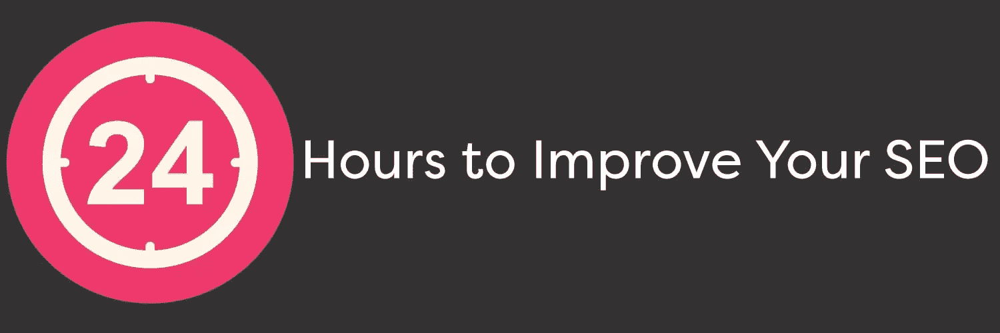

# 在 24 小时内提高 SEO 排名

> 原文：<https://www.sitepoint.com/improve-seo-ranking/>

24 小时内可以做很多事情。可以看 24 集 60 分钟。数到 86400。可能接触到你有线电视公司的人。

虽然你不会在一夜之间看到结果，但 24 小时的时间肯定足以对你的网站的搜索引擎优化做出重大改进。

## 修复断开的链接

断开的链接会损害你的网站在搜索引擎中的排名。幸运的是，您可以使用以下工具找到并修复它们。

谷歌网站管理员工具可以识别外部链接，这些链接在指向你的页面时会产生 404 错误。你可以通过实现 [301 重定向](https://www.sitepoint.com/the-missing-guide-301-redirects-for-mac-and-pc/)来修复这些链接。

使用[尖叫青蛙搜索引擎蜘蛛](http://www.screamingfrog.co.uk/seo-spider/)工具来找出网站中所有损坏的图片和链接。然后深入你的代码，开始修复。如果你的网站是建立在 WordPress 上的，你也可以使用他们的[断链检查器](https://wordpress.org/plugins/broken-link-checker/)。

Trent Blizzard，网站营销和设计公司 [BlizzardPress](http://www.blizzardpress.com/404-errors-and-seo-rankings/) 的所有者，证明了修复损坏的链接对 SEO 的帮助。在移除或修复了 1000 多个损坏的图片、设置了大约 100 个 301 重定向并修复了几十个内部损坏的链接后，该网站的访问量上升了 1713 个点。

## 优化元描述

谷歌并不直接将元描述纳入其排名算法，但高质量的元描述会提高点击率，进而影响排名。

元描述显示在搜索结果的标题下。许多人在决定是否点击之前都会阅读这些描述。

因此，元描述需要不仅仅是关键字 flypaper 它们需要简洁、信息丰富、有吸引力，能说服用户访问网站并阅读更多内容。

尽量将元描述保持在 150 到 160 个字符之间。160 后，谷歌可能会截断描述。

## 优化标题标签

标题标签是一个非常有影响力的排名信号，与元描述不同，谷歌在其排名算法中考虑了标题标签。标题标签也是谷歌搜索结果中的蓝色链接，因此它在点击率中起着重要作用。

确保创建描述性的标题，包括你最有力的关键词，但不要超过 65 个字符。

## 优化标题

标题标签是重要的排名因素，24 小时的时间足够重新访问过去的帖子，并确保所有页面都包含标题标签，其中包含页面内容的基本描述和任何关键的关键字。

有六种标题标签可用。H1 最重要，h6 最不重要。重要的是要记住，这些标签形成了一个层次结构，如果它们没有以正确的顺序使用，或者你跳过了一个标签，层次结构将被打破，你的 SEO 将受到影响。

## 优化内容

取决于你有多少内容，24 小时可能不够时间来梳理所有内容，但一些优化总比没有好。关注最近的帖子，确保它们包含相关的关键词和搜索词。

但是，避免关键字填充。如果在一个特定的句子中添加一个关键词听起来很强迫和不自然，那就放弃它。只有在文章的上下文中有意义时才添加关键词。它需要是有机的。

## 优化图像标题和 Alt 标签

是的，即使是图片标题和 alt 标签也会影响 SEO。搜索引擎会抓取你的图片，如果它们包含相关的搜索词，谷歌可能会在他们的图片搜索中显示它们。

## 优化 URL

每个 URL 都是获得主要 SEO 分数的机会，所以要确保 URL 包含相应页面的主要关键字。查看该页面的 URL 可以获得一个很好的例子。

但重要的不仅仅是 URL 中的内容。URL 由八部分组成:协议、子域、根域、顶级域、子文件夹、页面、参数、名称锚。当构造 URL 时，总是按照这个顺序写。

关于这八个部分的解释，请阅读第二个。

## 缩短加载时间

谷歌的算法使用[站点速度和页面速度](http://googlewebmastercentral.blogspot.com/2010/04/using-site-speed-in-web-search-ranking.html)来帮助确定页面排名，加载时间越快，排名越高。

加载时间越长，跳出率也越高。跳出率是访问者在网站上花费的百分比，搜索引擎认为这是微不足道的时间。谷歌并不看好跳出率高的网站。

要缩短 24 小时内的加载时间，请执行以下操作:

打开你的代码，理清你的 CSS，JavaScript 和 HTML。这包括删除多余的逗号、空格、代码注释和未使用的代码。

接下来，如果您还没有这样做，实现浏览器缓存。这命令用户的浏览器存储诸如样式表和图像之类的信息，以便当访问者返回站点时，浏览器不必重新加载整个页面。关于浏览器缓存的说明，请阅读这篇[优秀教程](https://www.mnot.net/cache_docs/#BROWSER)。

最后，通过确保图片格式正确且不要过大来优化图片。对少于 16 色的图形使用 png，对照片使用 JPEGs。还要确保每张图片都是为网络压缩的。

如果你仍然经历缓慢的加载时间，考虑使用 [CSS 精灵](http://www.w3schools.com/css/css_image_sprites.asp)。精灵将页面上的所有图像合并成一个图像。这减少了很长的加载时间，因为站点只需加载一个图像，并生成一个服务器请求。

## 结论

24 小时对于提高你的搜索引擎优化来说似乎不是很多时间，但是一些快速简单的修复可以为你的搜索引擎优化创造奇迹。有了结构合理、关键词丰富的元数据、标签和内容，以及快速的加载时间和工作链接，你的排名一定会上升。

## 分享这篇文章