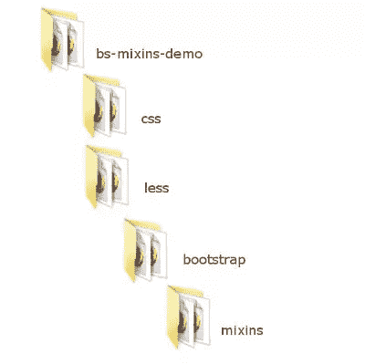
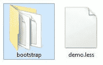
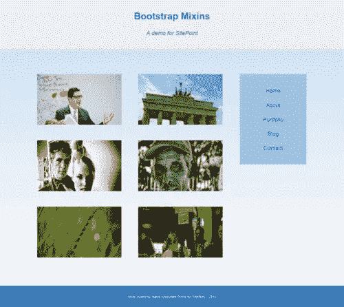
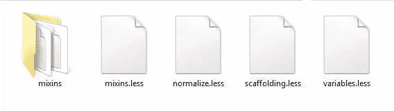
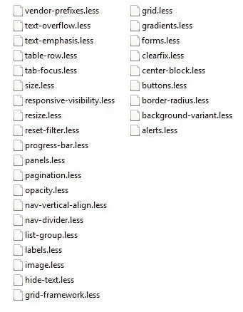

# Less:超越 Bootstrap Mixins 库的基础

> 原文：<https://www.sitepoint.com/less-beyond-basics-bootstrap-mixins-library/>

Less、Sass、Stylus 等预处理程序。，通过包含诸如变量、函数、数学运算等编程语言特性来扩展 CSS 的功能。

适当使用这项技术的目的是确保可维护的样式表文档和改进的工作流。

本文通过使用一些 [Bootstrap 3](http://getbootstrap.com/) Less 代码作为学习和开发工具，超越了 [Less](http://lesscss.org/) 预处理程序语言的基础。

如果你刚刚开始，享受[用更少的](https://www.sitepoint.com/video-speed-web-development-process-less/)加速你的 Web 开发过程，这是 Sandy Ludosky 清晰简洁的视频介绍。

## 演示页面设置

这里讨论的较少的特性都在[这个编译后的 CodePen 页面中实现，并作为这个](http://codepen.io/SitePoint/pen/qdExaN/) [zip 文件](https://uploads.sitepoint.com/wp-content/uploads/2015/05/1430818224Less-beyond-basics-demo.zip)，这样你就可以自由地查看页面的外观，亲自检查代码细节并进行试验。

### 文件夹结构

下面是这个项目的目录结构。



所有引导文件都放在引导文件夹中。这还包括一个 mixins 文件夹，我们在其中放置引导 mixins。

index.html 文件直接放在 bs-mixins-demo 文件夹中。

一旦编译完 Less 文件，demo.css 文件将被添加到 css 文件夹中。

项目的 less 文件 demo.less 放在 Less 文件夹中。我为这个演示编写的所有代码都放在这里。在现实世界的项目中，我会把它的内容分成单独的部分。更少的文件。然而，考虑到这个演示的缩减大小，我们可以只使用一个文件。



### HTML 结构

演示页面包含一个简单的两列布局，带有页眉和页脚。不使用引导组件和 JavaScript 插件。但是不要被愚弄了——这里有足够的内容来展示 Bootstrap 的 mixins 优点:

*   适应性布局
*   嵌套列
*   列偏移量
*   桌面和移动视图上不同的列显示顺序
*   引导按钮
*   CSS3 渐变
*   悬停时的 CSS3 翻卡效果




下面是 index.html 的轮廓。

```
<!-- HEADER -->
<header role="banner">
  <div class="container">
    <h1><a href="#">Site Title</a></h1>
    <p>Site Tagline</p>
  </div>
</header>

<!-- PAGE CONTENT -->
<div class="container">
  <div class="page-content">

    <!-- NAVIGATION -->
    <aside class="sidebar" role="complementary">
      <nav role="navigation">

      </nav>
    </aside>

    <!-- MAIN CONTENT -->
    <main class="main-content" role="main">

      <!-- NESTED COLUMNS GRID -->
      <article class="card">
      <!-- Column 1 -->
      </article>

      <article class="card">
      <!-- Column 2 -->
      </article>

      ...

    </main>
  </div>
</div>

<!-- FOOTER -->
<footer role="contentinfo">
  <div class="container">

  </div>
</footer>
```

使用较少的源代码还有一个好处:一个干净的 HTML 文档，没有任何典型的引导网格类。

### 引导文件

本演示所需的引导文件可以在[引导网站](http://getbootstrap.com/getting-started/)上找到。确保，你抢了**少源**文件。

下面列出的文件需要从下载的源代码的 Less 文件夹中复制到演示的引导文件夹中:

*   mixins.less
*   正常化. less
*   无脚手架
*   变量. less



此外，引导源代码的 mixins 目录的全部内容需要复制到演示的 mixins 文件夹中。



### Less @import 指令

来制作引导程序。我们的演示中可用的文件越少，less 提供的@import 指令就越少。在本演示中，我们将引导文件的副本导入到 demo.less 文件中，如下所示:

```
@import (reference) "bootstrap/variables.less";
@import (reference) "bootstrap/mixins.less";
@import "bootstrap/normalize.less";
@import "bootstrap/scaffolding.less";
```

Less 有六个关键字,可以与@import 指令一起使用:reference、inline、less、css、once 和 multiple。

**引用**关键字是一个很棒的特性:现在我们已经拥有了 bootstrap/variables.less 和 bootstrap/mixins.less 中包含的所有内容。然而，只有我们在项目中实际使用的内容才会被编译到最终的 CSS 文档中。

### 编译器

你可以在**服务器端**和**客户端**编译更少的代码。

客户端编译就像在 HTML 文档的`head`部分添加 demo.less 和 less.js(可从[LssCss.org](http://lesscss.org/#download-options)网站下载)一样快。

```
<link href="less/demo.less" rel="stylesheet/less">
<script src="less/less.js"></script>
```

客户端编译是一个很好的入门和实验工具。然而，对于一个生产站点，最好的选择是使用 **node.js** 或第三方工具进行服务器端预编译。

这个演示使用了 [Prepros](https://prepros.io/) ，这是一个适用于 Windows、Mac 和 Linux 的预编译器，可以免费下载也可以付费下载。你可以自由使用你最喜欢的工具，这不会影响最终结果。

关于如何使用 Prepros 预编译 Less 代码的深入指导，Ivaylo Gerchev 的使用 Prepros 的[多语言预处理将告诉你所有你需要知道的。](https://www.sitepoint.com/multilingual-preprocessing-with-prepros/)

## 什么是少混？

Less 中的 Mixins 提供了一种打包一个类的所有属性的方法，这样我们就可以在另一个类中重用它们。

来自[lessss](http://lesscss.org/)网站:

> 混合是将一组属性从一个规则集包含(“混合”)到另一个规则集中的一种方式。

这里有一个例子。

如果我们选择使用浮动来构建 web 布局，我们将需要一种技术来清除这些浮动。

下面是尼古拉斯·加拉格尔的 Clearfix Hack ,也被 Bootstrap 框架使用，变成了一个更少的 mixin。

```
.clearfix() {
  &:before,
  &:after {
    content: " ";
    display: table;
  }
  &:after {
    clear: both;
  }
}
```

将它打包成 mixin 的好处是，我们现在可以在任何需要清除浮动的地方添加它，只需一行代码。例如，下面是如何将它添加到包含许多浮动元素的容器元素中:

```
.container {
  property1: value1;
  property2: value2;
  .clearfix();
}
```

当编译成 CSS 时，此代码输出以下内容:

```
.container:before,
.container:after {
  display: table;
  content: " ";
}
.container:after {
  clear:both;
}
.container {
  property1: value1;
  property2: value2;
}
```

mixin 的复杂程度取决于你想用它达到什么目的。是时候看看使用 Bootstrap mixins 作为我们项目的库可以实现什么了。

## 利用引导混合

如果您准备从基础开始，踏上 mixins ninjahood 之旅，使用一个优秀的 mixins 库不仅可以帮助您编写出色的 CSS 代码，而且也是向优秀者学习的好方法。

让我们打开 mixins 文件夹，探索 Bootstrap 构建较少代码的方式。

### 布局混合

我个人认为最有用的 mixinss 是那些帮助我构建页面布局的 mixin。

你可以在 grid.less 中找到这些。

#### 的。容器固定()混合

这个 mixin 被设计用来生成使网页内容居中的 CSS。这是:

```
.container-fixed(@gutter: @grid-gutter-width) {
  margin-right: auto;
  margin-left: auto;
  padding-left:  (@gutter / 2);
  padding-right: (@gutter / 2);
  &:extend(.clearfix all);
}
```

让我们仔细看看`.container-fixed()` mixin。

这是一个[参数 mixin](http://lesscss.org/features/#mixins-parametric-feature) ，即一个带有一个或多个参数的 mixin。像这样编写 mixins 给了我们相当大的灵活性。我们可以使用相同的规则集，但是通过改变我们分配给参数的值来定制它。

这个特殊的引导 mixin 使用带有默认值的**参数。参数@gutter 的默认值为@grid-gutter-width，您可以在 variables.less 文件中找到它。这意味着，如果在使用 mixin 时没有为这个参数传递值，代码将返回默认值。**

关于`.container-fixed()` mixin 需要注意的一点是它对 **&的使用:extend(。**。

这段代码执行以下操作:

*   它包括一个用`.clearfix()` mixin 构建的`.clearfix`类。该类具有清除浮动子元素的功能；
*   它将该功能扩展到使用`.container-fixed()` mixin 样式的元素和类。它使用 Less `:extend()`伪类来实现这一点；
*   通过在末尾添加 [`all`关键字](http://lesscss.org/features/#extend-feature-extend-all-)，确保编译器将 clearfix 功能扩展到所有嵌套在扩展类中的选择器。

自从 Bootstrap 框架的[版本 3.1.0](http://blog.getbootstrap.com/2014/01/30/bootstrap-3-1-0-released/) 发布以来，& :extend(。clearfix all)已经取代了。clearfix() mixin 在`.container-fixed()` mixin 里面(你可以在另一个 mixin 里面定义一个 mixin)。让我们来看看为什么我们可以把这一举动看作是对引导 CSS 代码质量的改进。

将`.clearfix()` mixin 应用于任何包含浮动子元素的元素或类，最终会在 CSS 文档中一遍又一遍地重复相同的 clearfix hack。

Less [`:extend()`伪类](http://lesscss.org/features/#extend-feature)所做的是生成一个 CSS 声明，将所有共享相同 CSS 规则的元素和类组合在一起。

例如，如果您将`.clearfix()` mixin 应用到`.container`、`.row`和`.footer`，您编译的 CSS 将为这三个类中的每一个重复相同的 clearfix hack。

然而，使用 Less `:extend()`伪类，如 Bootstrap 现在所做的，将输出如下 CSS 代码:

```
.container:before,
.container:after,
.row:before,
.row:after,
.footer:before,
.footer:after {
  display: table;
  content: " ";
}
.container:after,
.row:after,
.footer:after {
  clear:both;
}
```

使用`:extend()`伪类的好处是符合 [DRY 原则](http://en.wikipedia.org/wiki/Don%27t_repeat_yourself)。特别是，它通过合并共享相同属性的元素和类选择器来避免重复相同的 CSS 代码。

要在代码中使用 Bootstrap `.container-fixed()` mixin，将`.container-fixed()`添加到一个类或 HTML 元素中。在本文的演示中，我将它用于`.container`类，就像 Bootstrap 一样:

```
.container {
  .container-fixed();
}
```

下面是`.container`类的 CSS 输出:

```
.container {
  margin-right: auto;
  margin-left: auto;
  padding-left: 15px;
  padding-right: 15px;
}
```

#### 的。make-row()混合

在引导网格系统中，列存在于包装器元素中。`.make-row()` mixin 为这个元素生成样式。它看起来是这样的:

```
.make-row(@gutter: @grid-gutter-width) {
  margin-left:  (@gutter / -2);
  margin-right: (@gutter / -2);
  &:extend(.clearfix all);
}
```

这个 mixin 计算行的左右边距。此外，因为`.make-row()` mixin 是为浮动列设计包装器的，所以它用`.clearfix`类扩展了浮动清除。

在本文的演示中，我在`.page-content`类上使用它，就像这样:

```
.page-content {
  .make-row();
}
```

CSS 输出是:

```
.page-content {
  margin-left: -15px;
  margin-right: -15px;
}
```

#### 这些列混合在一起

Bootstrap 网格系统使用四种列尺寸进行响应布局:超小型、小型、中型和大型。

每个列的大小由相应的 mixin 生成。因为这些 mixin 具有相似的模式，所以让我们只检查 medium 列的 mixin。

```
.make-md-column(@columns; @gutter: @grid-gutter-width) {
  position: relative;
  min-height: 1px;
  padding-left:  (@gutter / 2);
  padding-right: (@gutter / 2);

  @media (min-width: @screen-md-min) {
    float: left;
    width: percentage((@columns / @grid-columns));
  }
}
```

这是另一个参数混合。`@gutter`参数有一个默认值，但是在使用 mixin 时必须提供`@columns`参数的值。如果你不给`@columns`参数赋值，Less 会抛出一个错误。

Less 提供的一个伟大特性是**嵌套**。您可以在 HTML 文档中以反映父子关系的方式嵌套选择器，而不必在每次引用子元素的选择器时都编写父元素的选择器。

例如，常规 CSS 看起来像这样:

```
article {
  background: blue;
}
article p {
  color: gray;
}
```

…使用较少的嵌套，如下所示:

```
article {
  background: blue;
  p {
    color: gray;
  }
}
```

引导程序`.make-md-column()` mixin 向我们展示了如何在 mixin 中利用这个漂亮的 Less 特性。LessCss 网站称:

> 像`media`或`keyframe`这样的指令可以像选择器一样嵌套。指令放在最上面，同一规则集中其他元素的相对顺序保持不变。这叫冒泡。

当屏幕宽度对应于`@screen-md-min`变量的值时,`.make-md-column()` mixin 中的媒体查询指示列的行为(Bootstrap 给这个变量一个默认值 992px。你可以在 variables.less 中找到它。当屏幕宽度达到指定值时，列宽将等于您的设计列数除以总列数的百分比值(Bootstrap 的总列数默认值为 12)。

该演示将`.make-md-column()` mixin 用于侧栏、主内容列和主内容中的六个嵌套列。

```
.sidebar {
  .make-md-column(4);
}
.main-content {
  .make-md-column(12);
}
.card {
  .make-md-column(5);
}
```

的 CSS 输出。侧栏是:

```
.sidebar {
  position: relative;
  min-height: 1px;
  padding-left: 15px;
  padding-right: 15px;
}
@media (min-width: 992px) {
  .sidebar {
    float: left;
    width: 33.33333333%;
  }
}
```

### 按钮混合

mixin Bootstrap 用于构建按钮元素的样式，这是一个很好的例子，说明使用较少的代码进行 CSS 开发是多么方便。

`.button-variant()` mixin 位于 mixin 文件夹内的 buttons.less 文件中。它输出默认按钮样式，以及常见按钮状态的样式。这意味着您将这个 mixin 添加到按钮元素的选择器中，而不必担心为所有这些按钮状态编写其他规则。多节省时间啊！

这是 mixin 的代码:

```
.button-variant(@color; @background; @border) {
  color: @color;
  background-color: @background;
  border-color: @border;

  &:hover,
  &:focus,
  &.focus,
  &:active,
  &.active,
  .open > .dropdown-toggle& {
    color: @color;
    background-color: darken(@background, 10%);
    border-color: darken(@border, 12%);
  }
  &:active,
  &.active,
  .open > .dropdown-toggle& {
    background-image: none;
  }
  &.disabled,
  &[disabled],
  fieldset[disabled] & {
    &,
    &:hover,
    &:focus,
    &.focus,
    &:active,
    &.active {
      background-color: @background;
      border-color: @border;
    }
  }

  .badge {
    color: @background;
    background-color: @color;
  }
}
```

这个参数 mixin 需要您提供三个值，并吐出一大块覆盖所有按钮状态的 CSS 代码。

这里有一些选择器是引导框架的一部分，比如`.badge`或`.dropdown-toggle`。但是没有什么可以阻止您将这个 mixin 复制到 demo.less 中(或者复制到您的项目的特定 mixin 库文件夹中),并定制它以满足您自己的需要。如果你不想要任何额外的引导选择器，你可以像这样重写`.button-variant()` mixin:

```
.demo-button-variant(@color; @background; @border) {
  color: @color;
  background-color: @background;
  border-color: @border;

  &:hover,
  &:focus,
  &.focus,
  &:active,
  &.active {
    color: @color;
    background-color: darken(@background, 10%);
    border-color: darken(@border, 12%);
  }
  &:active,
  &.active {
    background-image: none;
  }
  &.disabled,
  &[disabled],
  fieldset[disabled] & {
    &,
    &:hover,
    &:focus,
    &.focus,
    &:active,
    &.active {
      background-color: @background;
      border-color: @border;
    }
  }
}
```

这是我如何在演示页面中使用`.demo-button-variant()` mixin:

```
.action-btn {
 .demo-button-variant(@gray; lighten(@brand-info, 20%); darken(@brand-info, 10%));
}
```

CSS 输出是:

```
.action-btn {
  color: #555555;
  background-color: #b0e1ef;
  border-color: #31b0d5;
}
.action-btn:hover,
.action-btn:focus,
.action-btn.focus,
.action-btn:active,
.action-btn.active {
  color: #555555;
  background-color: #85d0e7;
  border-color: #2289a7;
}
.action-btn:active,
.action-btn.active {
  background-image: none;
}
.action-btn.disabled,
.action-btn[disabled],
fieldset[disabled] .action-btn,
.action-btn.disabled:hover,
.action-btn[disabled]:hover,
fieldset[disabled] .action-btn:hover,
.action-btn.disabled:focus,
.action-btn[disabled]:focus,
fieldset[disabled] .action-btn:focus,
.action-btn.disabled.focus,
.action-btn[disabled].focus,
fieldset[disabled] .action-btn.focus,
.action-btn.disabled:active,
.action-btn[disabled]:active,
fieldset[disabled] .action-btn:active,
.action-btn.disabled.active,
.action-btn[disabled].active,
fieldset[disabled] .action-btn.active {
  background-color: #b0e1ef;
  border-color: #31b0d5;
}
```

那些和符号(&)是怎么回事？**与号选择器**是指嵌套选择器中的父选择器。

最常见的用法是伪类，如下例所示。不要像在普通 CSS 中那样重复`.action-btn`,敲打一个&符号就可以完成工作并节省宝贵的时间。

```
.action-btn {
  color: gray;
  &:hover {
    text-decoration: none;
  }
}
```

这将编译成以下 CSS:

```
.action-btn {
  color: gray;
}
.action-btn:hover {
  text-decoration: none;
}
```

您也可以在 mixin 中使用&选择器，就像在引导程序`.button-variant()` mixin 中一样。当&符号放在选择器列表的末尾时，它允许您颠倒嵌套的顺序。以一小块`.button-variant()` mixin 为例:

```
.button-variant(@color; @background; @border) {
...
  &:active,
  &.active,
  .open > .dropdown-toggle& {
    background-image: none;
  }
...
}
```

当在`.action-btn`选择器上使用上述 mixin 时，它输出以下 CSS

```
.action-btn:active,
.action-btn.active,
.open > .dropdown-toggle.action-btn {
  background-image: none;
}
```

### 渐变混合

在 gradients.less 的 mixins 文件夹中，您会发现一堆 mixin 封装在一个**名称空间**中。这是出于组织目的对 mixins 进行分组并使代码更具可移植性的一项伟大技术。

下面是引导渐变混合的一般结构来说明这一点(完整的源代码可以从演示文件中获得)。

```
#gradient {

  .horizontal(@start-color: #555; @end-color: #333; @start-percent: 0%; @end-percent: 100%) {
    //mixin's code goes here
  }

  .vertical(@start-color: #555; @end-color: #333; @start-percent: 0%; @end-percent: 100%) {
    //mixin's code goes here
  }

  .directional(@start-color: #555; @end-color: #333; @deg: 45deg) {
    //mixin's code goes here
  }

  ...

}
```

如您所见，名称空间的定义方式与 CSS ID 选择器相同。

在上面的例子中，每个分组中的代码与你在 CSS 代码中为渐变编写的代码没有什么不同，只是使用了 mixin 的参数而不是固定值。

在本文的演示中，我使用垂直渐变混合来设计整个网页的背景:

```
body {
  #gradient > .vertical(lighten(@brand-primary, 40% ); lighten(@brand-primary, 60%) );
}
```

Bootstrap gradient mixin 将默认值作为参数，因此您可以只使用空括号，它可以工作。在这里，我使用更少的预置 [`lighten()`](http://lesscss.org/functions/#color-operations-lighten) 和 [`darken()`](http://lesscss.org/functions/#color-operations-darken) 颜色函数来改变渐变的开始和结束颜色。

Less 有各种各样的颜色功能。上面使用的那些是设计来产生输入颜色的更亮或更暗的变体。当你需要一种快速的方法来生成相同基本颜色值的不同色度的调色板时，这真的很方便。

## 结论

在这篇文章中，我通过近距离接触 Bootstrap mixins 并在一个小项目中大量使用它们，强调了 Less preprocessor 语言的一些特性。

探索和使用 Bootstrap 作为一个丰富的 mixins 库意味着将我们从书籍、课程和教程中获得的关于 Less preprocessor 语言的所有理论转化到现实世界的上下文中。这是一个很好的方式，可以让你从处理简单的基础工作过渡到成为专业人员。

如果你对这里讨论的内容有任何疑问，或者对帖子中没有提到的现场演示的其他方面有任何疑问，请继续发送给我。期待您的反馈！

## 分享这篇文章