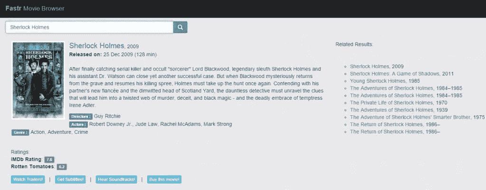

# 使用 Angular 的$http 服务在 AngularJS 中进行 API 调用

> 原文：<https://www.sitepoint.com/api-calls-angularjs-http-service/>

**注:** *本文由思远华于 2016.01.17 更新。*

*   用`ng-model-option`去抖功能和`$watch`服务取代了不必要的`setTimeout`和`clearTimeout`呼叫。
*   `.success()` / `.error()`已被弃用，更新使用`.then(success_callback, error_callback)`代替。
*   修复损坏的海报图像。

* * *

如今，web 应用程序通过[API](http://en.wikipedia.org/wiki/Application_programming_interface)相互通信已经司空见惯。例如，当您在线购买电影票时，电影票网站使用远程 API 来验证您的信用卡信息是否正确。在本教程中，我将研究如何使用 AngularJS 向远程 API 发出 HTTP 请求，以及如何处理 API 的 JSON 响应，以便更新视图。

继续电影主题，我将通过构建一个名为 **Fastr** 的电影浏览器来演示这一点，它将获取关于您想要进入的任何电影的各种不同信息。除了 [AngularJS](https://angularjs.org/) 之外，Fastr 将使用 [Bootstrap](http://getbootstrap.com/) 进行造型，使用 [Animate.css](http://daneden.github.io/animate.css/) 进行一些时髦的效果。

这就是我们的最终结果:



这个项目的代码可以从我们的 [GitHub repo](https://github.com/sitepoint-editors/fastr) 获得，或者你可以在 CodePen 上查看一个正在工作的[演示。](http://codepen.io/SitePoint/pen/YXXQxj)

## 项目结构

我们将代码保存在模块化结构中，如下所示:

```
css/
  animate.min.css
  bootstrap.min.css
  style.css

js/
  angular.min.js
  app.js

partials/
  main-info.html
  related-results.html

index.html
```

文件[index.html](https://github.com/sitepoint-editors/fastr/blob/master/index.html)将包含我们的应用程序的主视图。大部分都是样板文件，但是让我们检查一下动作发生在哪里:

```
<div class="input-group search-bar">
  <input type="text" 
         ng-model="search" 
         ng-model-options="{ debounce: 800 }"
         placeholder="Enter full movie name" />
  ...
</div>

<div id="main-info" 
     ng-include="'partials/main-info.html'">
</div>

<div id="related-results" 
     ng-include="'partials/related-results.html'">
</div>
```

正如您所看到的，我们已经使用`ng-model`将输入字段(用户将在其中输入电影名称)绑定到`search`模型(我们将在我们的控制器中声明它)。我们还使用了值为 800 的`ng-model-options`指令来确保模型更新至少有 800 毫秒的延迟。我们还使用`$watch`服务监控搜索模型的变化，并且我们注册了一个回调函数，以便在每次检测到变化时获取数据。您将在下面的部分看到这一点。

`main-info`和`related-results`div 将分别用于显示当前电影的信息和相关电影的列表。信息将被显示在由`ng-include`指令提取、编译和包含的部分中。

## 为数据调用 API

让我们看看 [app.js](https://github.com/sitepoint-editors/fastr/blob/master/js/app.js) ，它是应用程序的核心。我们首先将`$scope`和`$http`作为参数传递给控制器的构造函数。这意味着我们声明了对[范围对象](https://docs.angularjs.org/guide/scope)和 [http 服务](https://docs.angularjs.org/api/ng/service/%24http)的依赖。

```
.controller('MovieController', function($scope, $http){
```

现在，当页面第一次加载时，搜索模型是未定义的。所以，我们将其设置为“Sherlock Holmes”并调用`fetch`函数，该函数将联系远程 API 并确保视图被初始化。

现在在`MovieController`中，我们设置了对`search`模型的监控，并在搜索框中的字符串发生变化时加载结果。我们想要的是，只有在用户停止输入 800 毫秒后才获取结果(记得我们使用的`ngModelOptions`指令的`debounce`值为 800)。这可以防止应用程序对 API 进行不必要的调用。我们还希望在输入时立即看到结果(我们不想按 enter 或点击任何搜索按钮)。

```
$scope.$watch('search', function() {
  fetch();
});
```

现在我们定义`change`函数。当搜索框中的字符串发生变化时，它会加载结果。我们想要的是，只有在用户停止输入 **800 毫秒**之后，才应该获取结果。这可以防止应用程序向 API 发送不必要的调用。我们还希望在输入时立即看到结果(我们不想按 enter 或点击任何搜索按钮)。

然后，我们在控制器中将`search`模型初始化为“Sherlock Holmes ”,控制器进而调用向`$watch`服务注册的`fetch()`回调，服务联系远程 API 并确保视图被初始化。

```
$scope.search = "Sherlock Holmes";
```

接下来是`fetch`函数。这个函数调用 API 并处理响应中发送的 JSON 数据。我们将在电影浏览器中使用的 API 是[OMDb API](http://www.omdbapi.com/)——一个获取电影信息的免费网络服务。如果您对 API 的工作原理感到好奇，我鼓励您查看上面链接中的综合文档。

为了发出请求，我们使用 Angular 的`$http.get`函数，将 API URL 和一个连接的查询字符串作为参数传递给它。向不同的 URL 发出两个请求——第一个请求检索关于电影的主要信息，第二个请求检索相关结果。

成功后，我们将响应分别存储在名为`details`的模型和名为`related`的模型中。

```
function fetch(){
  $http.get("http://www.omdbapi.com/?t=" + $scope.search + "&tomatoes=true&plot=full")
  .then(function(response){ $scope.details = response.data; });

  $http.get("http://www.omdbapi.com/?s=" + $scope.search)
  .then(function(response){ $scope.related = response.data; });
}
```

接下来是`update`函数。当用户点击视图中的一个相关标题时，就会调用这个函数。它接受一个对象(包含相关电影的信息),并将我们的`Search`模型设置为电影标题的值。当搜索模式改变时,`$watch`服务仍然神奇地获取关于这部电影的信息。

```
$scope.update = function(movie){
  $scope.search = movie.Title;
};
```

最后，我们有一个方便的函数`select`，它确保当用户点击文本输入时，整个文本都被选中。

```
$scope.select = function(){
  this.setSelectionRange(0, this.value.length);
}
```

## 处理响应

现在让我们分析一下 [partials/main-info.html](https://github.com/sitepoint-editors/fastr/blob/master/partials/main-info.html) 文件。

如果列表还没有被加载，我们首先使用`ng-if`指令来显示消息“*加载结果…* ”，然后检查`details.Response==='True'`以查看当请求返回时 API 是否已经找到匹配。

在返回结果的情况下，我们使用`ng-src`指令来检查`details.Poster`的内容，或者加载它所引用的图像，或者在没有图像可用时加载一个占位符图像。

```

```

之后，我们使用 Angular 的数据绑定来显示其余的电影细节，然后在页面底部包括四个进一步的链接，用户可以在这些链接中获得关于电影的更多信息。我们使用`ng-href`指令来呈现这些链接，因为我们在`href`属性中使用了[角度表达式](https://docs.angularjs.org/guide/expression)，如果用户在角度有机会用它的值替换表达式之前点击了一个链接，那么事情就会发生。

最后，让我们检查一下[partials/related-results . html](https://github.com/sitepoint-editors/fastr/blob/master/partials/related-results.html)

```
<div ng-if="related.Response!=='False'">
  Related Results:<hr>

  <ul class="rel-results">
    <li ng-repeat="movie in related.Search">
      <a href="#" id="{{ $index + 1 }}" 
         ng-click="update(movie)">{{ movie.Title }}
      </a>, {{ movie.Year }}
    </li>
  </ul>
</div>
```

同样，我们在渲染任何东西之前使用`ng-if`来检查响应。然后，我们使用`ng-repeat`指令遍历`related`模型的`Search`属性，该属性包含(除了其他内容之外)与我们正在搜索的电影相关的电影标题列表。

我们还使用`ng-click`来调用我们的控制器的更新函数。如上所述，更新功能将确保获取并显示该新电影的信息。

## 一些最后的润色

我们可以给`index.html`添加一些`noscript`标签，这样，如果 JavaScript 在用户的浏览器中被禁用或不被支持，它就会显示一条错误消息。我们也可以包括`animate.css`来添加一些很酷的动画，比如翻转海报图像，放大内容和相关结果的反弹。使用`animate.css`非常简单，只需在元素的类中指定动画的名称，前面加一个字符串`animation`。例如:

```
<div class="animated zoomInRight">
```

### 结果是这样的！

请注意，由于篇幅限制，我在嵌入式演示中隐藏了相关结果。要查看它们，只需在 CodePen 上查看演示即可(无论如何，这是一个好主意，因为那里的演示更快)。

在 [CodePen](http://codepen.io) 上通过 SitePoint ( [@SitePoint](http://codepen.io/SitePoint) )看笔 [YXXQxj](http://codepen.io/SitePoint/pen/YXXQxj/) 。