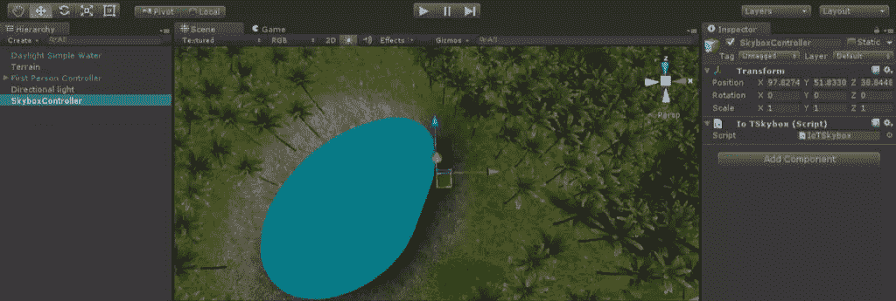
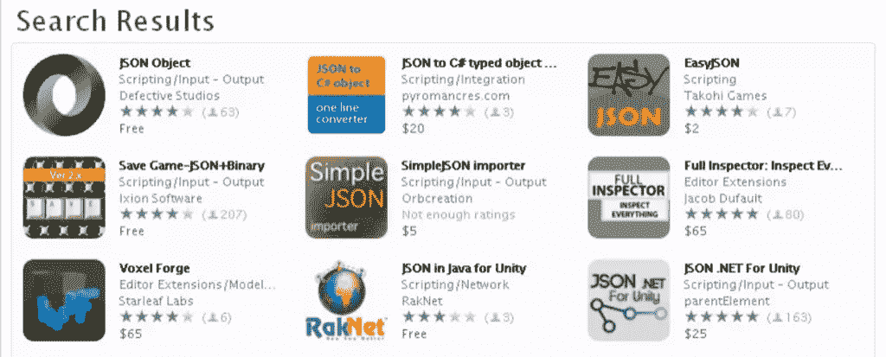
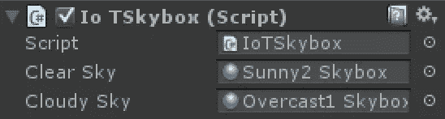
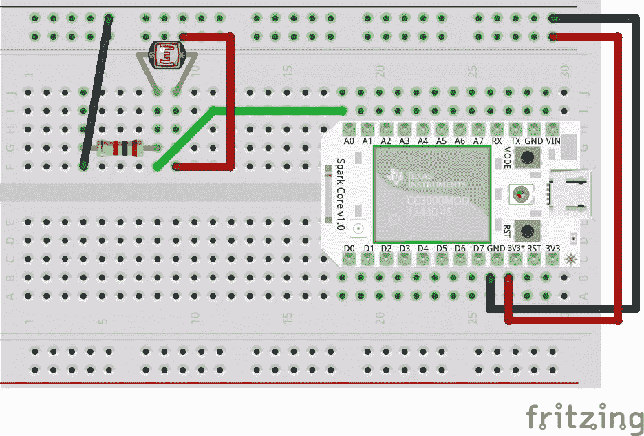
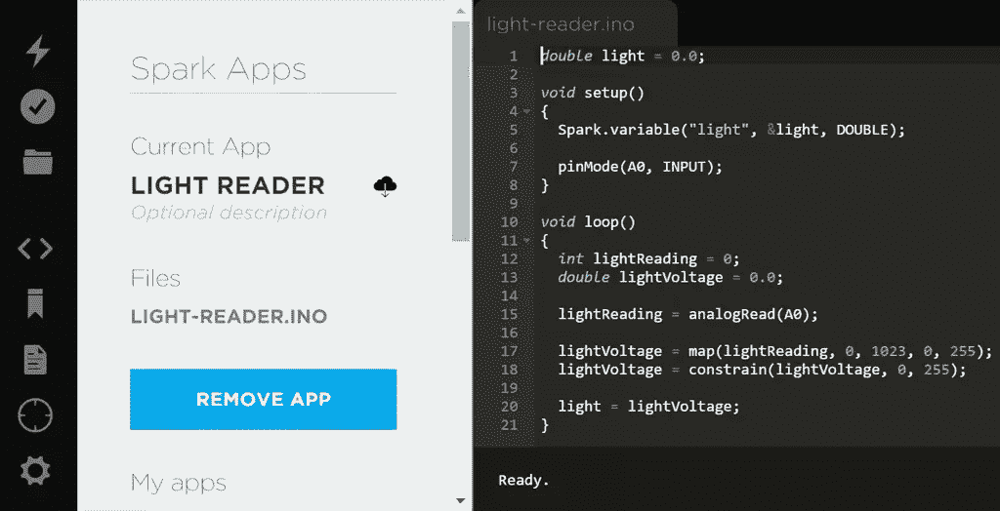

# Unity 中的 Web APIs 和物联网

> 原文：<https://www.sitepoint.com/web-apis-and-iot-in-unity/>

对我来说，当你看到物联网的功能有多强大时，它是最令人兴奋的。随着新设备的不断涌现，有如此多的技术可以从网络连接中受益。在接下来的几个月里，我将在 SitePoint 上关注物联网带来的各种可能性，在每篇文章中回顾不同的平台或设备。在上一篇文章中，我们研究了如何从[颚骨向上](https://www.sitepoint.com/connecting-jawbone-up-api-node-js/)获取数据。

这一次，我们将把物联网数据引入 Unity，这是一个广泛使用的游戏引擎，用于构建从 iOS 和 Android 游戏到主机和脸书游戏的一切。它还作为一个引擎出现，将用于 Oculus Rift、Gear VR 等设备，因此尝试与物联网配对是一件有趣的事情。想象一个适应真实世界条件如天气和光线的游戏，如果你的房间突然变暗，游戏世界也会突然变暗！

首先，我们将把一个 Unity 场景连接到一个天气 API，允许我们在虚拟世界中使用真实世界的天气数据。然后我们将连接一个火花核心来使用它的光传感器数据。

在这篇文章中，我们假设你知道如何在 Unity 中设置一个场景，包括天空盒，地形和灯光。我们将从所有这些都准备好并设置好的场景开始构建。我的代码示例将使用 C#编写，但是如果您愿意，也可以在 UnityScript 中做同样的事情。

## 下载演示代码

对于那些希望看到这一点的人来说，工作演示代码可从[这里](https://github.com/sitepoint-editors/UnityIoTDemo)获得。

## 连接到天气

我们引入真实世界数据的第一个例子是建立一个天空盒来根据天气改变纹理。我们的天空将会改变，以反映我们现实世界城市的天气！我们将使用 [OpenWeatherMap](http://openweathermap.org/) 将最新的天气数据拉入 Unity。

为了控制我们场景的天空盒，我们将把一个名为`IoTSkybox`的脚本附加到一个名为“天空盒控制器”的空游戏对象上:



### 我们的 Skybox 代码

在`IoTSkybox.c`中，我们包含了以下代码:

```
using UnityEngine;
using System.Collections;

public class IoTSkybox : MonoBehaviour {
public Material clearSky;
public Material cloudySky;

IEnumerator AdjustSkyToWeather() {
while (true) {
string weatherUrl = "http://api.openweathermap.org/data/2.5/weather?zip=2000,au";

WWW weatherWWW = new WWW (weatherUrl);
yield return weatherWWW;

JSONObject tempData = new JSONObject (weatherWWW.text);

JSONObject weatherDetails = tempData["weather"];
string WeatherType = weatherDetails[0]["main"].str;

if (WeatherType == "Clear") {
RenderSettings.skybox = clearSky;
} else if (WeatherType == "Clouds" || WeatherType == "Rain") {
RenderSettings.skybox = cloudySky;
}

yield return new WaitForSeconds(60);
}
}

void Start () {
StartCoroutine (AdjustSkyToWeather());
}
}
```

### JSONObject 类

为了让这段代码工作，我们需要做的第一件事是添加 [JSONObject 类](http://wiki.unity3d.com/index.php?title=JSONObject)。为此，请访问 Unity 中的 Asset Store，搜索“JSON Object ”,您将看到它可以导入到您的项目中:



将它安装到您的项目中，您就可以在代码中访问“JSONObject”类。我们应该拥有上面代码运行所需要的一切，所以是时候讨论代码中实际发生的事情了。

### 代码解释

我们注册了两个公共变量来定义——`clearSky`和`cloudySky`。

```
public Material clearSky;
public Material cloudySky;
```

这是两种天空盒材质，我们可以根据天气数据在它们之间切换。然后，我们可以在 SkyboxController 的设置中设置要使用的材质:



接下来我们将使用协程和 IEnumerator。首先，跳到`Start()`功能:

```
void Start () {
StartCoroutine (AdjustSkyToWeather());
}
```

这里我们开始我们的协程。协程允许我们在需要时暂停函数的执行。我们在协程中使用了一个`yield`语句。我们将使用它来等待我们的 web API 响应，并在定期重复我们的 web 调用之前等待。

我们在代码中进一步定义 IEnumerator 函数，它从这一行开始:

```
IEnumerator AdjustSkyToWeather()
```

在它里面，我们用一个`while (true)`语句包围它的内容，这将允许它在最后一个`yield`返回时循环。

我们执行 web 调用的主要部分是下面这组代码:

```
string weatherUrl = "http://api.openweathermap.org/data/2.5/weather?zip=2000,au";

WWW weatherWWW = new WWW (weatherUrl);
yield return weatherWWW;
```

这就向`http://api.openweathermap.org/data/2.5/weather?zip=2000,au`发出了一个 web 调用，您可以对其进行调整以包含您想要的任何邮政编码和国家代码(我已经为悉尼准备了`2000`，为澳洲准备了`au`)。

然后，我们用该 URL 设置一个`WWW`对象，然后设置一个`yield`，一旦它检索到该地址的内容，它将返回 true。在此之前，它会暂停此功能。

这个调用像这样返回 JSON:

```
{
"coord": {
"lon": 151.2,
"lat": -33.86
},
"sys": {
"message": 0.0609,
"country": "AU",
"sunrise": 1430339337,
"sunset": 1430378154
},
"weather": [
{
"id": 801,
"main": "Clouds",
"description": "few clouds",
"icon": "02d"
}
],
"base": "stations",
"main": {
"temp": 291.487,
"temp_min": 291.487,
"temp_max": 291.487,
"pressure": 1038.32,
"sea_level": 1044.67,
"grnd_level": 1038.32,
"humidity": 89
},
"wind": {
"speed": 3.26,
"deg": 133.502
},
"clouds": {
"all": 24
},
"dt": 1430354026,
"id": 0,
"name": "Millers Point",
"cod": 200
}
```

该函数返回一个 JSON 字符串，我们可以使用`weatherWWW.text`读取该字符串。我们创建一个`JSONObject`(还记得我们从 Unity 商店安装的类吗？)从这段文字来看:

```
JSONObject tempData = new JSONObject (weatherWWW.text);
```

然后我们再创建一个`JSONObject`来存储嵌套在`weather`键值中的 JSON 数据。它返回一个数组，所以我们关注数组中的第一个元素，并获取`main`的字符串值，将其存储在`WeatherType`中:

```
JSONObject weatherDetails = tempData["weather"];
string WeatherType = weatherDetails[0]["main"].str;
```

然后，如果它返回的天气类型是“晴朗”，我们设置天空盒使用我们的`clearSky`材料。如果是“云”或“雨”，那么我们使用`cloudySky`材质:

```
if (WeatherType == "Clear") {
RenderSettings.skybox = clearSky;
} else if (WeatherType == "Clouds" || WeatherType == "Rain") {
RenderSettings.skybox = cloudySky;
}
```

最后，我们将 final `yield`设置为等待 60 秒，然后返回 true。这将每 60 秒重复我们的`while`语句，每分钟检查天气。

```
yield return new WaitForSeconds(60);
```

### 我们的结果

如果我们在我们选择的城镇(在我的例子中是悉尼)有晴朗的天空时运行我们的 Unity 场景，看起来是这样的:


如果下雨或多云，看起来是这样的:


## 引入带火花核心的传感器

我们可以通过引入像 [Spark Core](https://www.spark.io/) 或 [Arduino](http://www.arduino.cc/) 这样的微控制器，将这一想法进一步扩展到物联网世界。在本文中，我将使用一个 Spark 内核，因为它非常容易上手，并且有自己的云 API，这使它变得非常简单。如果你有一个不同的设备，同样的技术将是可能的，你只需要将它指向一个显示该设备级别的 web 服务。

我不会详细介绍如何使用和设置 Spark Core，如果你是 Spark Core 的新手，Spark 的团队在这里有一个快速概述。

我用一个光传感器设置了我的火花核心，就像这样:



我们可以把这个火花核心的数据连接到我们的 Unity 场景。

### 将我们的光级连接到我们的统一世界

让我们将 Spark 核心数据带入场景。我们将利用火花核心周围的光线来控制人造太阳的光线强度！

我们首先添加一个名为`IoTLight.c`的新脚本到场景中的平行光物体上。在这个脚本中，我们将添加以下内容:

```
using UnityEngine;
using System.Collections;

public class IoTLight : MonoBehaviour {
public string token = "42fu524tdfey45bd2c650ce12f45dfg3453s124g";
public string deviceId = "j23tsd8j3ns893k2g3932n3u";
public Light sceneLight;

IEnumerator AdjustLightWithSensor() {
while (true) {
string lightUrl = "https://api.spark.io/v1/devices/" + deviceId + "/light?access_token=" + token;

WWW lightWWW = new WWW (lightUrl);
yield return lightWWW;
JSONObject lightData = new JSONObject (lightWWW.text);

float light = lightData ["result"].n;

sceneLight.intensity = light / 255;

yield return new WaitForSeconds (10);
}
}

void Start () {
sceneLight = GetComponent<Light>();

StartCoroutine (AdjustLightWithSensor());
}
}
```

### 代码解释

上面的代码的结构与我们前面的例子相同，但是我们连接到 Spark 核心 API，并更改我们的 Light 对象的设置。

我来解释一下区别的要点。在我们的`Start()`函数中，我们使用代码将脚本指向我们的平行光:

```
sceneLight = GetComponent<Light>();
```

这将允许我们参照我们统一世界的太阳。

然后，在我们的协程中，使用设备 ID 和您的访问令牌对 Spark Core API 进行我们的`WWW`调用。您可以从[build . spark . io](https://build . Spark . io)中获得这两个文件(为了将代码放在 Spark 核心上，您可以访问这个 URL)。我们在`IoTLight`代码的开头定义了这些。

```
string lightUrl = "https://api.spark.io/v1/devices/" + deviceId + "/light?access_token=" + token;

WWW lightWWW = new WWW (lightUrl);
yield return lightWWW;
```

它将返回的 JSON 对象如下所示:

```
{
"cmd": "VarReturn",
"name": "light",
"result": 20,
"coreInfo": {
"last_app": "",
"last_heard": "2015-04-30T05:05:15.039Z",
"connected": true,
"last_handshake_at": "2015-04-30T04:06:06.250Z",
"deviceID": "j23tsd8j3ns893k2g3932n3u"
}
}
```

我们读入数据，将其转换成一个`JSONObject`，并获得光照值本身的一个数值(该值将从 0 到 255)，它在我们 JSON 的`result`部分。然后，我们设置我们的光强度。光照强度需要从 0 到 1，所以我们将光照值除以 255。

```
JSONObject lightData = new JSONObject (lightWWW.text);

float light = lightData ["result"].n;

sceneLight.intensity = light / 255;
```

### 我们的 Spark 核心代码

这一次，由于我们使用的是自己的硬件(Spark Core ),而不是第三方 API，所以我们也需要为它设置代码。前往 [build.spark.io](https://build.spark.io) 创建一个新应用。我把我的命名为“轻读者”:



我们的 Spark 内核的代码设置了一个`light`变量，API 调用可以通过`"light"`访问这个变量。我们连接火花核心上的`A0`引脚，从回路上的光传感器读取模拟值，将它们映射到 0 到 255 之间的值:

```
double light = 0.0;

void setup()
{
Spark.variable("light", &light, DOUBLE);

pinMode(A0, INPUT);
}

void loop()
{
int lightReading = 0;
double lightVoltage = 0.0;

lightReading = analogRead(A0);

lightVoltage = map(lightReading, 0, 1023, 0, 255);
lightVoltage = constrain(lightVoltage, 0, 255);

light = lightVoltage;
}
```

### 我们的世界在行动

到目前为止，事情应该看起来不错！如果我们已经设置了我们的火花核心，并在 Unity 场景旁边运行，那么我们应该看到来自太阳的光照水平与我们火花核心周围的光照水平相匹配。

当我们的光传感器看到大量的光时，我们的世界被照亮了，变得美好而明亮:


当光传感器看到更少的光时，我们的世界也变暗了:


### 尝试一些变化！

对于那些超级热心的人来说，这里有一点额外的代码。如果你连接一个温度传感器到你的火花核心，你可以用这样的东西改变天空的色调:

```
IEnumerator AdjustSkyToTemp() {
while (true) {
string tempUrl = "https://api.spark.io/v1/devices/" + deviceId + "/temperature?access_token=" + token;

WWW tempWWW = new WWW (tempUrl);
yield return tempWWW;
JSONObject tempData = new JSONObject (tempWWW.text);

temp = tempData["result"].n;

Color skyColor = new Color(0.0F, 0.0F, 0.0F, 0.3F);

if (temp >= 25) {
skyColor = new Color(0.0F, 0.3F, 0.1F, 0.3F);
} else if (temp < 25) {
skyColor = new Color(0.5F, 0.5F, 0.5F, 0.3F);
}

RenderSettings.skybox.SetColor("_Tint", skyColor);

yield return new WaitForSeconds(10);
}
}
```

## 结论

从 web APIs 和 Spark Core 等物联网设备中获取数据可以为您的 Unity 场景带来全新的有趣元素！使用这个基本概念，您可以将一系列不同的 API 和数据集连接到您的 Unity 对象。实验！好好享受吧！

## 分享这篇文章