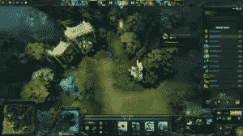

# 铁轨上的蒸汽动力 DOTA

> 原文：<https://www.sitepoint.com/steam-powered-dota-on-rails/>



写了几篇关于用 Rails 构建[认证系统的“严肃”文章后，我决定休息一下，玩一些游戏。我刚刚谷歌了一下网络游戏，无意中发现了](https://www.sitepoint.com/series/authentication-in-rails/) [Dota 2](https://en.wikipedia.org/wiki/Dota_2) 。Dota 2 是一款非常受欢迎的战斗竞技场游戏(上个月有超过 10，000，000 名独立玩家)，由 Valve 开发。

这个游戏相当复杂，一些像 [DotaBuff](http://dotabuff.com) 这样的网络服务被创建来帮助玩家跟踪他们的进度。在访问 DotaBuff 并看到其所有漂亮的表格和图表后，我无法阻止自己搜索关于 Dota 2 API 的信息。Ruby 要做的事情就是和你分享我的研究！

在本文中，我们将使用 Dota 2 API。我们将创建一个借用 DotaBuff 基本功能的应用程序:用户通过 Steam 登录，看到他最近的比赛和统计数据列表。我将指出我在这个应用程序开发过程中遇到的所有问题，并就如何在生产中实现这一点给出一些建议。

源代码可以在 [GitHub](https://github.com/bodrovis/Sitepoint-source) 上获得。

工作演示可以在[sitepoint-dota.herokuapp.com](https://sitepoint-dota.herokuapp.com)找到。

## 什么是 Dota？

根据维基百科，Dota 2 是一款免费的多人在线战斗竞技场视频游戏。它是《魔兽争霸 3:冰封王座》的《古人防御》修改版单机续作。它的机制相当复杂，所以我只给你一个快速的概述。

最初 DotA(防御古人)是一个叫冰蛙的人开发的魔兽争霸 3 的自定义地图。几年后，它变得如此受欢迎，以至于 Valve 决定聘请 IceFrog 并创建一个独立版本的游戏，他们称之为 Dota 2。它于 2013 年发布，现在被认为是世界上最受欢迎的网络游戏之一。许多有奖金的职业比赛正在举行，数百人正在观看由经验丰富的玩家制作的视频流。

谈到游戏性，有两个团队(光辉的，好的，可怕的，邪恶的)，每个团队(通常)有 5 名玩家。游戏开始时，每个玩家从包含 100 个以上英雄的池中挑选一个英雄进入游戏。每个团队都有自己的基地，最终目标是摧毁敌人基地上的主要建筑，同时保护自己的基地。玩家可以购买各种神器(每个英雄一次最多可以拿 6 件)，杀死小兵(生物，由 AI 控制)或敌方英雄来赚取黄金和经验。每个英雄都有一套独特的能力，玩家可以用来帮助他们的队友或破坏敌人。一言以蔽之就是 Dota。

让我们继续，看看 Dota 2 API 带来了什么好处。

## 准备

像往常一样，我们会在进入有趣的部分之前做一些准备。创建一个名为 Doter 的新 Rails 应用程序:

```
$ rails new Doter -T
```

在本文中，我将使用 Rails 4.2.1，但是同样的解决方案也可以用 Rails 3 来实现。

如果你想跟随，挂上`bootstrap-sass`宝石进行造型:

*Gemfile*

```
[...]
gem 'bootstrap-sass'
[...]
```

奔跑

```
$ bundle install
```

并将这些行放入 *application.scss* :

*application.scss*

```
@import 'bootstrap-sprockets';
@import 'bootstrap';
@import 'bootstrap/theme';
```

现在，像这样调整布局:

*视图/布局/应用程序. html.erb*

```
<nav class="navbar navbar-inverse">
  <div class="container">
    <div class="navbar-header">
      <%= link_to 'Doter', root_path, class: 'navbar-brand' %>
    </div>
    <div id="navbar">
    </div>
  </div>
</nav>

<div class="container">
  <% flash.each do |key, value| %>
    <div class="alert alert-<%= key %>">
      <%= value %>
    </div>
  <% end %>

  <div class="page-header"><h1><%= yield :page_header %></h1></div>

  <%= yield %>
</div>
```

添加一个`page_header`助手方法，为`yield`块提供内容:

*application_helper.rb*

```
module ApplicationHelper
  def page_header(text)
    content_for(:page_header) { text.to_s.html_safe }
  end
end
```

最后，设置路线。我想在网站的主页上显示用户的匹配，所以创建一个空的`MatchesController`:

*matches_controller.rb*

```
class MatchesController < ApplicationController
end
```

相应的型号稍后会添加。现在，实际的路线是:

*config/routes.rb*

```
[...]
root to: 'matches#index'
[...]
```

不要忘记为`index`动作创建一个视图:

*views/matches/index . html . erb*

```
<% page_header 'Your matches' %>
```

太好了，准备工作已经完成，我们可以前进了！

## 通过 Steam 认证

Steam 和许多其他网络平台一样，支持 OAuth 协议，你可以验证你的用户以获得他们的详细信息，比如 uID、昵称、头像等。(你可以阅读我的[Rails authentic ation with OAuth 2.0 和 OmniAuth](https://www.sitepoint.com/rails-authentication-oauth-2-0-omniauth/) 的文章来了解更多关于这个协议的信息)。您不必这样做来实际执行 Steam API 调用，但是我们需要用户的 id 来显示匹配列表。因此，我们将使用 Rodrigo Navarro 的[https://github.com/reu/omniauth-steam](https://github.com/reu/omniauth-steam)gem，它为 OmniAuth 添加了一个 Steam 认证策略:

*Gemfile*

```
[...]
gem 'omniauth-steam'
[...]
```

别忘了跑步

```
$ bundle install
```

现在创建 Omniauth 初始化文件:

*config/initializer/omni auth . Rb*

```
Rails.application.config.middleware.use OmniAuth::Builder do
  provider :steam, ENV['STEAM_KEY']
end
```

好吧，这把钥匙在哪？访问[此页面](https://steamcommunity.com/dev/apikey)(您将需要 Steam 帐户才能继续)并简单地注册一个新密钥。在所有支持 OAuth 的 web 平台中，Steam 提供了注册应用程序的最快方法。

现在让我们决定我们想要存储什么用户信息。实际上，Steam 提供了一组非常简单的数据，所以我们没有太多的选择。我将坚持以下观点:

*   `uid` ( `string`，索引，唯一)–用户的唯一标识符。
*   `nickname`(`string`)——用户昵称(Steam 也提供名字)。
*   `avatar_url`(`string`)–链接到用户的头像。对了，我们不能选择头像大小。
*   `profile_url`(`string`)–用户在 Steam 上的个人资料 URL。

运行以下命令:

```
$ rails g model User uid:string nickname:string avatar_url:string profile_url:string
```

打开迁移文件并添加这一行:

*db/migrations/XXX _ create _ users . Rb*

```
[...]
add_index :users, :uid, unique: true
[...]
```

后`create_table`法。

应用迁移:

```
$ rake db:migrate
```

添加一些路线:

*config/routes.rb*

```
[...]
match '/auth/:provider/callback', to: 'sessions#create', via: :all
delete '/logout', to: 'sessions#destroy', as: :logout
[...]
```

第一个是回调路由，在成功认证后，用户将被重定向到该路由。我不得不在这里使用`match`,因为出于某种原因，Steam 似乎在发送 POST 请求，而不是 GET(大多数其他平台都是这样做的)。第二个路由将用于注销用户。

现在，控制器来处理这些路线。我将从`create`动作开始:

*会话 _ 控制器. rb*

```
class SessionsController < ApplicationController
  skip_before_filter :verify_authenticity_token, only: :create

  def create
    begin
      @user = User.from_omniauth request.env['omniauth.auth']
    rescue
      flash[:error] = "Can't authorize you..."
    else
      session[:user_id] = @user.id
      flash[:success] = "Welcome, #{@user.nickname}!"
    end
    redirect_to root_path
  end
end
```

这个`skip_before_filter`是通过 Steam 认证的另一个问题。它发送一个 POST 请求，但是当然它不提供 CSRF 令牌。因此，默认情况下，您会收到一条错误消息，指出有人试图发送恶意数据。因此，我们必须跳过对`create`动作的检查。

这个`create`动作本身很简单。获取存储在`request.env['omniauth.auth']`中的用户数据，并根据这些数据创建一个新用户或找到一个已有的用户(我们稍后将介绍`from_omniauth`方法)。如果一切正常，将用户 id 存储在会话中，设置欢迎消息，并重定向到主页。

现在的`from_omniauth`方法:

*型号/用户. rb*

```
[...]
class << self
  def from_omniauth(auth)
    info = auth['info']
    # Convert from 64-bit to 32-bit
    user = find_or_initialize_by(uid: (auth['uid'].to_i - 76561197960265728).to_s)
    user.nickname = info['nickname']
    user.avatar_url = info['image']
    user.profile_url = info['urls']['Profile']
    user.save!
    user
  end
end
[...]
```

通过用户的 uID 找到一个用户，或者创建一个新用户，然后简单地获取所有必要的数据。但是那个数字是什么？这是第三个问题。通过 Steam 进行身份验证时，将返回用户的 64 位 uID。然而，当列出 Dota 2 匹配时，使用用户的 32 位 id。这肯定是有原因的，但我找不到任何解释。无论如何，我们必须将 64 位 id 转换为 32 位 id，最简单的方法是减去这个大数。不要担心，Ruby 透明地为我们处理 BigInt 数字，所以您不需要执行任何额外的操作。

`destroy`动作甚至更简单:

*会话 _ 控制器. rb*

```
def destroy
  if current_user
    session.delete(:user_id)
    flash[:success] = "Goodbye!"
  end
  redirect_to root_path
end
```

我们需要`current_user`方法来检查用户是否登录:

*application _ controller . Rb*

```
[...]
private

def current_user
  return nil unless session[:user_id]
  @current_user ||= User.find_by(id: session[:user_id])
end

helper_method :current_user
[...]
```

`helper_method`确保这个方法也可以从视图中调用。

修改布局:

*视图/布局/应用程序. html.erb*

```
[...]
<nav class="navbar navbar-inverse">
  <div class="container">
    <div class="navbar-header">
      <%= link_to 'Doter', root_path, class: 'navbar-brand' %>
    </div>
    <div id="navbar">
      <% if current_user %>
        <ul class="nav navbar-nav pull-right">
          <li><%= image_tag current_user.avatar_url, alt: current_user.nickname %></li>
          <li><%= link_to 'Log Out', logout_path, method: :delete %></li>
        </ul>
      <% else %>
        <ul class="nav navbar-nav">
          <li><%= link_to 'Log In via Steam', '/auth/steam' %></li>
        </ul>
      <% end %>
    </div>
  </div>
</nav>
[...]
```

我已经提到 Steam 不允许改变头像大小，所以我们必须应用一些样式来使它看起来更好:

*application.scss*

```
[...]
nav {
  img {
    max-width: 48px;
  }
}
```

您现在可以重新启动服务器，并看到这一切的行动！

## 与 Steam API 集成

下一步是与 Steam API 集成。如果你需要访问基本的 Steam Web API，你可以使用 Olga Grabek 的 [steam-web-api](https://github.com/Olgagr/steam-web-api) 或者 Brian Haberer 的 [steam-api](https://github.com/bhaberer/steam-api) 。然而，只要我们打算专门处理 Dota 2 相关的东西，有一个单独的 gem 提供一些方便的方法就很好了。幸运的是，Vinni Carlo Canos 的 [dota](https://github.com/vinnicc/dota) gem 提供了许多有用的功能(尽管它还没有 100%完成)。在继续之前，您可能需要阅读 Dota 2 API。遗憾的是，目前还没有包含全面的最新文档的页面，但这里有一些资源:

*   [关于 Dota 2 API 的基本信息](http://dev.dota2.com/showthread.php?t=58317)
*   [Dota 2 比赛历史 WebAPI](http://dev.dota2.com/showthread.php?t=47115)

准备好后，将新宝石放入 gem 文件中:

*Gemfile*

```
[...]
gem 'dota', github: 'vinnicc/dota', branch: 'master'
[...]
```

在写这篇文章的时候，我必须指定主分支，因为最近[我们已经透露](https://github.com/vinnicc/dota/pull/7)Dota 2 API 已经做了一些改变，它们在最新的 pull 请求中已经考虑到了，但是 gem 的新版本还没有发布。顺便说一句，我想警告你 Dota 2 API 的某些方面可能会随时改变，你应该小心。

奔跑

```
$ bundle install
```

创建初始值设定项:

*config/initializer/dota . Rb*

```
Dota.configure do |config|
  config.api_key = ENV['STEAM_KEY']
end
```

将您之前获得的 Steam 密钥放在这个文件中。

基本上就是这样。您现在已经准备好执行 API 请求了。

## 获取用户匹配

我想在用户通过 Steam 认证后立即获得他们的匹配列表。然而，在我们继续之前，我想指出一件事。本文中描述的解决方案仅用于演示目的。如果您想要构建一个类似于 DotaBuff 的真实世界的应用程序，您将不得不实现一个更复杂的系统，该系统具有一些后台进程，不断地检查特定用户是否有任何新的匹配(或者甚至是否有任何新的匹配)并加载相应的数据。然后当用户登录时，您只需提供本地数据库中所有匹配的列表，而不是通过向 Dota 2 API 发送同步调用。加载 40 个匹配项的信息可能需要 1 分钟，而用户通常有数百个匹配项。

这将需要 **loads** 的存储容量(想象一下每天有多少场比赛正在进行)，显然我无法承担建立这样一个环境的费用。然而，当您拥有大量数据时，您可以显示真正有趣的统计信息，比如 DotaBuff 提供的信息。

好的，继续，我们能得到关于单个匹配的什么信息？[这里的](https://github.com/vinnicc/dota#matches)是您可以利用的可用方法列表。我们将存储以下内容:

*   `uid` ( `string`，索引)-匹配的唯一标识符。
*   哪个队赢了这场比赛。实际上，这要么是“光辉的”，要么是“可怕的”。
*   `first_blood`(`string`)——第一次血(第一次英雄杀)发生的时候。Dota 2 API 返回自比赛开始以来的秒数，但我们将存储一个格式化的值。请随意将该列设为整数，并存储原始值。
*   `started_at`(`datetime`)——比赛开始的时间。
*   `mode`(`string`)–匹配模式。[这里的](https://github.com/vinnicc/dota/blob/471d5b55466d1f759789c407cb6162041913a52c/lib/dota/api/basic_match.rb#L18)是所有可用模式的列表。我们将存储它的标题，但是你也可以存储它的 ID (Dota 2 API 两者都提供)。
*   `match_type`(`string`)–比赛的类型。[这里的](https://github.com/vinnicc/dota/blob/471d5b55466d1f759789c407cb6162041913a52c/lib/dota/api/basic_match.rb#L6)是所有可用类型的列表。同样，您可以存储它的标题或 id。不要把这个列叫做`type`,因为它是为单表继承保留的！
*   `duration`(`string`)–比赛持续时间。同样，API 提供了秒数，但是我们将存储一个格式化的值。
*   `user_id` ( `integer`，index)——建立匹配与用户一对多关系的外键。

创建并应用迁移:

```
$ rails g model Match uid:string winner:string started_at:datetime mode:string match_type:string duration:string user:references
$ rake db:migrate
```

确保模型文件中有以下几行:

*型号/用户. rb*

```
[...]
has_many :matches
[...]
```

*models/match.rb*

```
[...]
belongs_to :user
[...]
```

开始真正的比赛。我想在用户登录后立即这样做:

*会话 _ 控制器. rb*

```
[...]
def create
  begin
    @user = User.from_omniauth request.env['omniauth.auth']
  rescue
    flash[:error] = "Can't authorize you..."
  else
    @user.load_matches!(1)
    session[:user_id] = @user.id
    flash[:success] = "Welcome, #{@user.nickname}!"
  end
  redirect_to root_path
end
[...]
```

`1`是要加载的匹配数。下面是`load_matches!`的方法:

*型号/用户. rb*

```
[...]
 def load_matches!(count)
    matches_arr = Dota.api.matches(player_id: self.uid, limit: count)
    if matches_arr && matches_arr.any?
      matches_arr.each do |match|
        unless self.matches.where(uid: match.id).any?
          match_info = Dota.api.matches(match.id)
          new_match = self.matches.create({
                                            uid: match.id,
                                            winner: match_info.winner.to_s.titleize,
                                            first_blood: parse_duration(match_info.first_blood),
                                            started_at: match_info.starts_at,
                                            mode: match_info.mode,
                                            cluster: match_info.cluster,
                                            duration: parse_duration(match_info.duration),
                                            match_type: match_info.type
                                          })
        end
      end
    end
  end
[...]
```

首先为提供的播放器加载 matches(别忘了我们这里用的是 32 位的 Steam ID，不是 64 位)。当然，`matches`方法并没有真正加载*所有的东西*——它有一个默认设置为 100 的`limit`选项，但是我们用自己的值覆盖了它。这种方法接受一些其他选项，在这里阅读更多。

接下来，我们检查是否已经加载了具有该 id 的匹配，如果没有，则加载其数据。为什么我们不得不再次调用`matches`方法，但是这次提供精确的匹配 id？这里的问题是，出于性能原因，第一次调用将返回有限数量的字段，因此为了获得完整的信息，我们必须查询特定的匹配。

之后，我们只需将所有必要的信息保存到表中。`parse_duration`像`xx:xx:xx`一样格式化秒数:

*型号/用户. rb*

```
[...]
private

def parse_duration(d)
  hr = (d / 3600).floor
  min = ((d - (hr * 3600)) / 60).floor
  sec = (d - (hr * 3600) - (min * 60)).floor

  hr = '0' + hr.to_s if hr.to_i < 10
  min = '0' + min.to_s if min.to_i < 10
  sec = '0' + sec.to_s if sec.to_i < 10

  hr.to_s + ':' + min.to_s + ':' + sec.to_s
end
[...]
```

现在只需加载所有匹配项:

*matches_controller.rb*

```
[...]
def index
  @matches = current_user.matches.order('started_at DESC') if current_user
end
[...]
```

并渲染它们:

*views/matches/index . html . erb*

```
<% page_header 'Your matches' %>

<% if @matches && @matches.any? %>
  <table class="table table-striped table-hover">
    <% @matches.each do |match| %>
      <tr>
        <td>
          <%= link_to match.started_at, match_path(match) %>
        </td>
      </tr>
    <% end %>
  </table>
<% end %>
```

我决定在这个页面上提供一个最小的数据集，并使用`show`动作来显示更详细的信息。让我们介绍一条新路线:

*config/routes.rb*

```
[...]
resources :matches, only: [:index, :show]
[...]
```

管制员的行动:

*matches_controller.rb*

```
[...]
def show
  @match = Match.find_by(id: params[:id])
end
[...]
```

现在的观点是:

*views/matches/show . html . erb*

```
<% page_header "Match #{@match.uid} <small>#{@match.started_at}</small>" %>

<h2 class="<%= @match.winner.downcase %>"><%= @match.winner %> won</h2>

<ul>
  <li><strong>Mode:</strong> <%= @match.mode %></li>
  <li><strong>Type:</strong> <%= @match.match_type %></li>
  <li><strong>Duration:</strong> <%= @match.duration %></li>
  <li><strong>First blood:</strong> <%= @match.first_blood %></li>
</ul>
```

在这里，我们提供所有可用的信息。为光芒四射的团队和可怕的团队使用不同的颜色会很好，所以我引入了两个 CSS 类:

*application.scss*

```
[...]
$radiant: #92A524;
$dire: #C23C2A;

.dire {
  color: $dire;
}

.radiant {
  color: $radiant;
}
[...]
```

这很好，但不是很有用。用户赢得比赛了吗？他们扮演了什么英雄？他们有什么项目？他们杀了多少人？如果能显示这些信息就太好了，所以让我们继续下一步，进一步改进我们的应用程序吧！

## 加载播放器

我们可以通过简单地加载参与比赛的球员的信息来回答所有这些问题。在`match`实例上调用的`radiant`和`dire`方法返回一个玩家对象数组，每个对象都有自己的[方法](https://github.com/vinnicc/dota#players)。这里有很多可用的信息，我们将存储其中的大部分:

*   `match_id` ( `integer`，index)——建立一对多关系的外键。
*   `uid`(`string`)–玩家的 32 位唯一 id。
*   `hero`(`text`)——玩家的英雄。这将是一个[序列化属性](http://apidock.com/rails/ActiveRecord/Base/serialize/class)，存储英雄的 id、名字和图片链接。
*   `level`(`integer`)——比赛结束时的英雄等级。
*   `kills`(`integer`)——玩家的必杀。
*   `deaths`(`integer`)——玩家死亡。
*   `assists`(`integer`)——球员助攻。
*   `last_hits`(`integer`)–玩家的最后一击(他们杀死了多少个小兵)。
*   `denies`(`integer`)——玩家的否认(他否认了多少盟军小兵不让敌人因杀死他们而获得黄金)。
*   `gold`(`integer`)–游戏结束时玩家拥有的金币数量。
*   `gpm`(`integer`)–每分钟获得的金币。
*   `xpm`(`integer`)——获得的每分钟经验值。
*   `status`(`string`)——比赛结束时球员的状态。他们可能一直呆到游戏结束，出于某种原因被放弃，安全离开(例如，如果检测到网络连接不良)或从未连接到游戏。
*   `gold_spent`(`integer`)–玩家在比赛中花费的金币总数。
*   `hero_damage`(`integer`)-对敌方英雄造成的伤害总量。
*   `tower_damage`(`integer`)–对敌方塔造成的伤害总量。
*   `hero_healing`(`integer`)–盟军英雄受到的总治疗量。
*   `items`(`text`)–包含玩家在游戏结束时拥有的物品数组的序列化属性。我们将存储每个项目的 id，名称，及其图片的链接。
*   `slot`(`integer`)——玩家在队伍中的槽位(从 1 到 5)。
*   `radiant`(`boolean`)——表示玩家的队伍。在最简单的场景中，只有两种可能(`radiant`或`dire`，然而似乎你可以被标记为`observer`，所以我使用了一个布尔属性，但是你可以使用你自己的方法来存储这个信息。

要存储的数据太多了！创建并应用适当的迁移:

```
$ rails g model Player match:references uid:string hero:text level:integer kills:integer deaths:integer assists:integer last_hits:integer denies:integer gold:integer gpm:integer xpm:integer status:string gold_spent:integer hero_damage:integer tower_damage:integer hero_healing:integer items:text slot:integer radiant:boolean
$ rake db:migrate
```

将下面几行添加到我们的模型文件中:

*models/match.rb*

```
[...]
has_many :players, dependent: :delete_all
[...]
```

*models/player.rb*

```
[...]
belongs_to :match

serialize :hero
serialize :items
[...]
```

像这样改变`load_matches!`方法:

*型号/用户. rb*

```
[...]
def load_matches!(count)
    matches_arr = Dota.api.matches(player_id: self.uid, limit: count)
    if matches_arr && matches_arr.any?
      matches_arr.each do |match|
        unless self.matches.where(uid: match.id).any?
          match_info = Dota.api.matches(match.id)
          new_match = self.matches.create({
                                            uid: match.id,
                                            winner: match_info.winner.to_s.titleize,
                                            first_blood: parse_duration(match_info.first_blood),
                                            started_at: match_info.starts_at,
                                            mode: match_info.mode,
                                            cluster: match_info.cluster,
                                            duration: parse_duration(match_info.duration),
                                            match_type: match_info.type
                                          })
        end
      end
    end
  end

[...]
```

`load_players!`方法将接受两个单独的对象，分别包含关于 Radiant 和 Dire 团队的信息。

*model/match.rb*

```
[...]
def load_players!(radiant, dire)
  roster = {radiant: radiant, dire: dire}
  roster.each_pair do |k, v|
    v.players.each do |player|
      self.players.create({
                              uid: player.id,
                              items: player.items.delete_if {
                                  |item| item.name == "Empty"
                              }.map  {
                                  |item| {id: item.id, name: item.name, image: item.image_url}
                              },
                              hero: {id: player.hero.id,
                                     name: player.hero.name,
                                     image: player.hero.image_url},
                              level: player.level,
                              kills: player.kills,
                              deaths: player.deaths,
                              assists: player.assists,
                              last_hits: player.last_hits,
                              denies: player.denies,
                              gold: player.gold,
                              gpm: player.gpm,
                              xpm: player.xpm,
                              status: player.status.to_s.titleize,
                              gold_spent: player.gold_spent,
                              hero_damage: player.hero_damage,
                              tower_damage: player.tower_damage,
                              hero_healing: player.hero_healing,
                              slot: player.slot,
                              radiant: k == :radiant
                          })
    end
  end
end
[...]
```

每个对象(`radiant`和`dire`)响应一个`players`方法，该方法实际上返回一个玩家数组。这个方法的大部分相当简单，所以我将解释可能不清楚的部分。

```
items: player.items.delete_if {
    |item| item.name == "Empty"
}.map  {
    |item| {id: item.id, name: item.name, image: item.image_url}
},
```

在这里，我们调用`player`对象上的`items`来获取玩家在比赛结束时拥有的物品。`items`返回另一个单独类的实例对象。这个对象[响应](https://github.com/vinnicc/dota#items)三个主要方法:`id`(物品 id)`name`(物品名称)和`image_url`(存储在 Dota 2 CDN 上的物品图片的 URL)。每个玩家有 6 个位置来储存物品。如果一个槽为空，则指定名称“empty”。我们真的不需要保存关于空槽的信息，所以只需删除所有这些元素。之后，生成一个包含所有信息的散列，并将其存储在列中。多亏了序列化，以后我们可以获取这个散列并正常使用它。

```
hero: {id: player.hero.id,
       name: player.hero.name,
       image: player.hero.image_url},
```

这里的想法是一样的。`hero`返回一个单独的对象，[响应](https://github.com/vinnicc/dota#heroes)三个主要方法:`id`(英雄 id)`name`(英雄名字)`image_url`(英雄图片)。

**2015 年 5 月 5 日更新**

我发现我们可以通过给`image_url`方法提供一个可选参数来选择英雄肖像的大小。以下是所有可能值的列表:

*`:full`–全质量水平纵向(256x114px，PNG)。这是默认使用的。
*`:lg`–大横排(205x11px，PNG)。
*`:sb` –小横排(59x33px，PNG)。我推荐使用这张，因为我们需要尽可能小的肖像。
*`:vert`–全质量纵向(234x272px，JPEG)。奇怪的是这只能是*。jpg*。

加载玩家，按团队分组-`true`代表光芒，`false`代表恐怖。顺便说一下，这似乎是伪哲学:光芒四射的是好的，所以它们是“真的”，而可怕的是坏的，混乱的，所以它们是“假的”)。

*matches_controller.rb*

```
[...]
def show
  @match = Match.includes(:players).find_by(id: params[:id])
  @players = @match.players.order('slot ASC').group_by(&:radiant)
end
[...]
```

相应地更新视图:

*views/matches/show . html . erb*

```
<% page_header "Match #{@match.uid} <small>#{@match.started_at}</small>" %>

<h2 class="<%= @match.winner.downcase %>"><%= @match.winner %> won</h2>

<ul>
  <li><strong>Mode:</strong> <%= @match.mode %></li>
  <li><strong>Type:</strong> <%= @match.match_type %></li>
  <li><strong>Duration:</strong> <%= @match.duration %></li>
  <li><strong>First blood:</strong> <%= @match.first_blood %></li>
</ul>

<h3 class="radiant">Team Radiant</h3>

<%= render 'players_table', players: @players[true] %>

<h3 class="dire">Team Dire</h3>

<%= render 'players_table', players: @players[false] %>
```

我使用 partial 来避免代码重复:

*views/matches/_ players _ table . html . erb*

```
<table class="table table-hover table-striped info-table">
  <tr>
    <th>Player ID</th>
    <th>Hero</th>
    <th>Level</th>
    <th>Items</th>
    <th>Kills</th>
    <th>Deaths</th>
    <th>Assists</th>
    <th><abbr title="Last hits">LH</abbr></th>
    <th><abbr title="Denies">DN</abbr></th>
    <th>Gold (spent)</td>
    <th><abbr title="Gold per minute">GPM</abbr></th>
    <th><abbr title="Experience per minute">XPM</abbr></th>
    <th><abbr title="Hero damage">HD</abbr></th>
    <th><abbr title="Tower damage">TD</abbr></th>
    <th><abbr title="Hero healing">HH</abbr></th>
  </tr>
  <% players.each do |player| %>
    <tr>
      <td>
        <% if player.abandoned_or_not_connected? %>
          <abbr class="text-muted" title="<%= player.status.titleize %>"><%= player.uid %></abbr>
        <% else %>
          <%= player.uid %>
        <% end %>
      </td>
      <td><%= render 'player_hero', hero: player.hero %></td>
      <td><%= player.level %></td>
      <td>
        <% player.items.each do |item| %>
          <%= image_tag item[:image], alt: item[:name], title: item[:name] %>
        <% end %>
      </td>
      <td><%= player.kills %></td>
      <td><%= player.deaths %></td>
      <td><%= player.assists %></td>
      <td><%= player.last_hits %></td>
      <td><%= player.denies %></td>
      <td><%= player.gold %> (<%= player.gold_spent %>)</td>
      <td><%= player.gpm %></td>
      <td><%= player.xpm %></td>
      <td><%= player.hero_damage %></td>
      <td><%= player.tower_damage %></td>
      <td><%= player.hero_healing %></td>
    </tr>
  <% end %>
</table>
```

让我们从上到下。`info-table`是一个 CSS 类，用于将一些特殊的样式应用于该表格中的图像:

*application.scss*

```
.info-table {
  img {
    width: 30px;
  }
}
```

这里的想法是 Dota 2 API 返回的所有图片都相当大，所以我们只是让它们变小。

`abandoned_or_not_connected?`这种方法的作用很大——检查玩家是否已经离开游戏或者根本没有联系:

*models/player.rb*

```
[...]
def abandoned_or_not_connected?
  status != 'played'
end
[...]
```

如果球员没有坚持到比赛结束，我们会做记录。

`player_hero`又是一个局部:

*views/matches/_ player _ hero . html . erb*

```
<%= image_tag hero[:image], alt: hero[:name], title: hero[:name] %>
```

太好了！现在这个看起来信息量更大了。然而，用户仍然没有简单的方法来检查他们是否赢得了比赛。让我们来解决这个问题！

## 谁赢了？

要找出这一点，只需找出用户为哪个队效力，哪个队赢得了比赛。我将像这样调整视图:

*views/matches/index . html . erb*

```
<% if @matches && @matches.any? %>
  <table class="table table-striped table-hover info-table">
    <% @matches.each do |match| %>
      <tr>
        <td>
          <%= link_to match.started_at, match_path(match) %>
          <% if current_user.won?(match) %>
            <span class="label label-success">won</span>
          <% else %>
            <span class="label label-danger">lost</span>
          <% end %>
        </td>
      </tr>
    <% end %>
  </table>
<% end %>
```

引入接受唯一参数的`won?`方法——对象`match`:

*型号/用户. rb*

```
[...]
def won?(match)
  player = find_self_in(match)
  (player.radiant? && match.winner == 'Radiant') || (!player.radiant? && match.winner == 'Dire')
end

private

def find_self_in(match)
  match.players.find_by(uid: uid)
end
[...]
```

不错！展示玩家的英雄怎么样？给你:

*views/matches/index . html . erb*

```
<table class="table table-striped table-hover info-table">
  <% @matches.each do |match| %>
    <tr>
      <td>
        <%= render 'player_hero', hero: current_user.played_for_in(match) %>
        <%= link_to match.started_at, match_path(match) %>
        <% if current_user.won?(match) %>
          <span class="label label-success">won</span>
        <% else %>
          <span class="label label-danger">lost</span>
        <% end %>
      </td>
    </tr>
  <% end %>
</table>
```

*型号/用户. rb*

```
[...]
def played_for_in(match)
  find_self_in(match).hero
end
[...]
```

对于生产，在这里使用缓存是绝对必要的。例如，您可以像这样使用[模型缓存](http://guides.rubyonrails.org/caching_with_rails.html#low-level-caching):

```
def played_for_in(match)
  Rails.cache.fetch(self.uid + '_played_for_in_' + match.uid) { find_self_in(match).hero }
end
```

只是不要忘记设置适当的刷新缓存条件。

## 结论

我们来到这篇文章的结尾。我们采用了基本的 Dota 2 API 方法，并创建了一个应用程序来为用户提供关于他们最近比赛的基本信息。请随意进一步扩展此演示并分享结果！

使用 Dota 2 API 很有趣，我希望你也喜欢它！你有兴趣看这个话题的第二部分吗？如果是这样，在下一篇文章中，我将介绍如何获取 Dota 2 比赛的数据。

感谢您的阅读。祝你好运，玩得开心(就像 Dota 玩家说的)！

## 分享这篇文章