# 微软 Edge:动手预览

> 原文：<https://www.sitepoint.com/microsoft-edge-preview/>

当微软宣布已经存在了近 20 年的浏览器 Internet Explorer 将被代号为 Project Spartan 的浏览器取代时，我感到非常惊讶(该浏览器的最终名称 Microsoft Edge[刚刚公布](http://www.theverge.com/2015/4/29/8516339/microsoft-edge-logo-build-2015)，所以我将在本文的剩余部分使用该名称)。一个全新的浏览器(尤其是由像微软这样的庞然大物开发的)进入浏览器市场是罕见的事情，我迫不及待地想要得到它。

在我的 Windows 10 技术预览版安装从 build 10041 更新到 build 10049 后，我很高兴地在我的任务栏中找到了 Microsoft Edge 的磁贴。


我们来看看吧！

## 界面

按照 Metro(微软的设计语言)的原则，微软 Edge 的界面是极简的，扁平的，非常直观。据微软称，他们的想法是让 chrome 保持简单，几乎没有任何东西会分散用户对他们正在访问的网站内容的注意力。我很快就习惯了，我认为简单的艺术线条图标很好地满足了他们的目的。

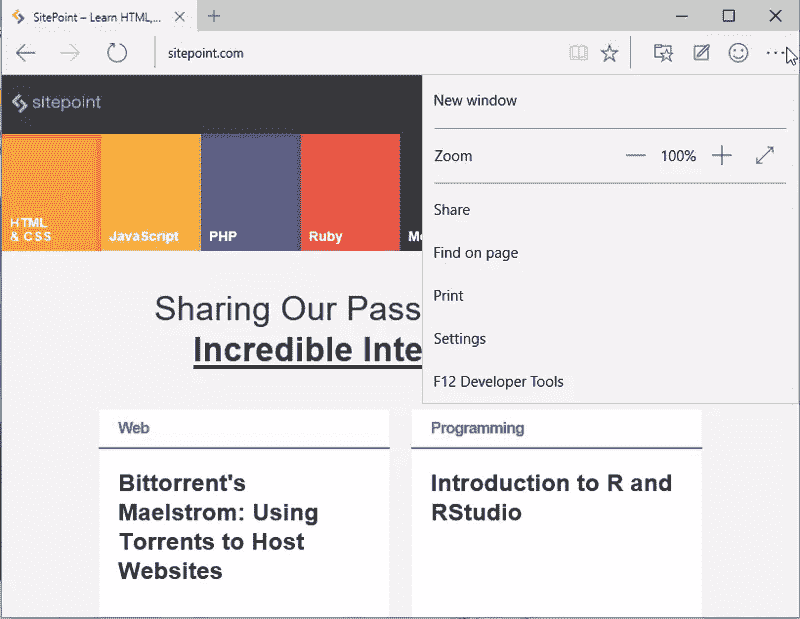

## 阅读视图

点击一个看起来像一本打开的书的图标激活阅读视图，网页上的所有广告、无关图像和样式都被剥离。剩下的是一个干净的、可读性更好的网页版本，有大量的文字，没有干扰。

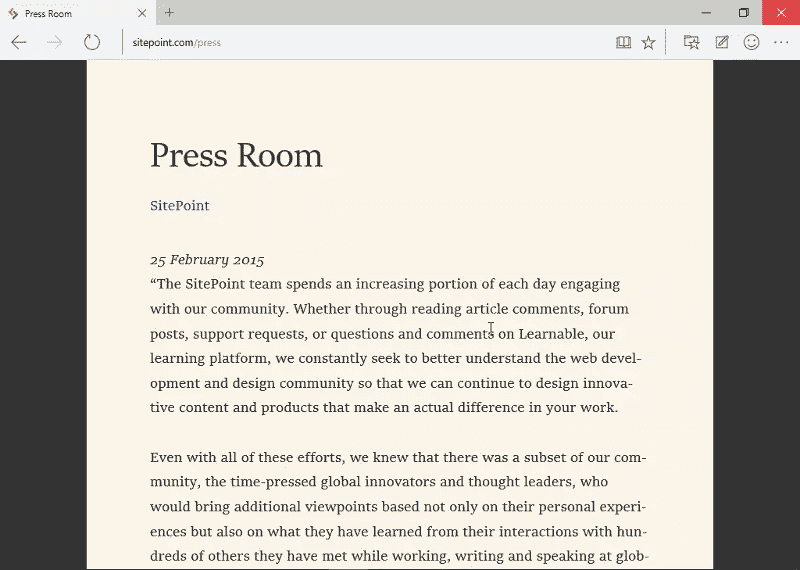

阅读视图可以根据您的喜好进行调整。可以更改文本大小，并提供多种查看样式。

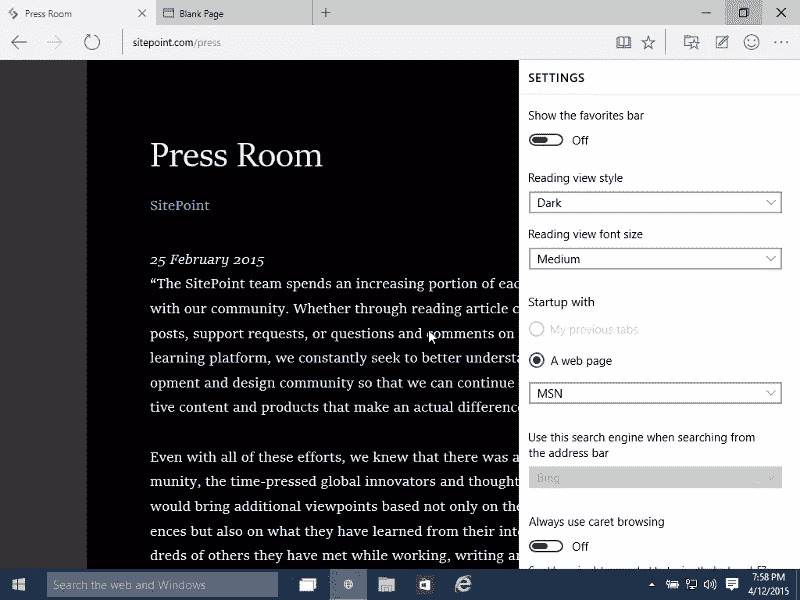

我不确定这是一个 bug 还是一个特性，但是我访问的所有页面都没有阅读视图。也许微软 Edge 可以将只是链接集合的网页与文章或博客文章的网页区分开来。例如，在 SitePoint 的主页上，阅读视图图标被禁用，尽管它在 SitePoint 的新闻发布室页面上可以工作。

## Cortana 集成

微软 Edge 与微软的个人助理 Cortana 完全集成，其行为很像 Google Now 或苹果的 Siri。调用 Cortana 非常简单，只需选择网页上的文本，右键单击，然后选择**询问 Cortana** 。会出现一个幻灯片，显示与所选内容相关的信息。在我看来，这是微软 Edge 最突出的特点；要求 Cortana 查找一个术语的定义比打开一个新标签和使用搜索引擎要快得多。

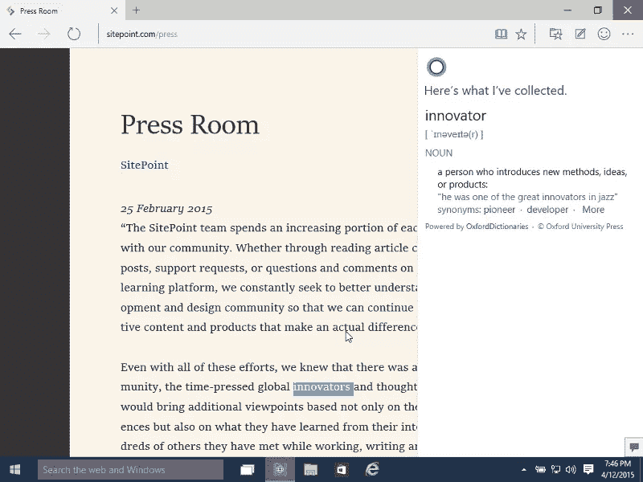

## 收藏夹和阅读列表

当您将网页加入书签时，您可以将它添加到收藏夹或阅读列表中。如果这是一个你会反复访问的页面，你可以把它添加到你的收藏夹。如果你做书签只是因为你想以后阅读它，最好把它加入你的阅读清单。

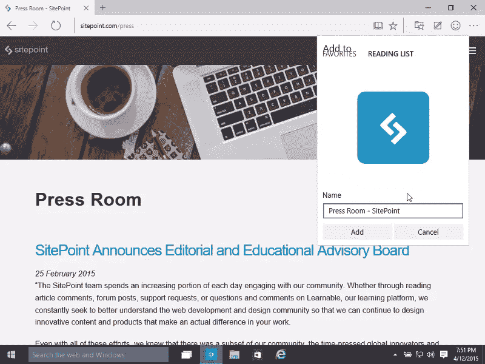

## 涂鸦和分享

激活 Spartan 的**制作网页笔记**功能可以让你把你当前所在的网页当成一本真正的书。如果你有一个手写板或触摸屏显示器(鼠标可能感觉太笨拙)，你可以在网页上涂鸦，突出特定的项目，甚至创建片段。完成后，您可以使用 OneNote 轻松共享它，或者将其添加到您的阅读列表中。

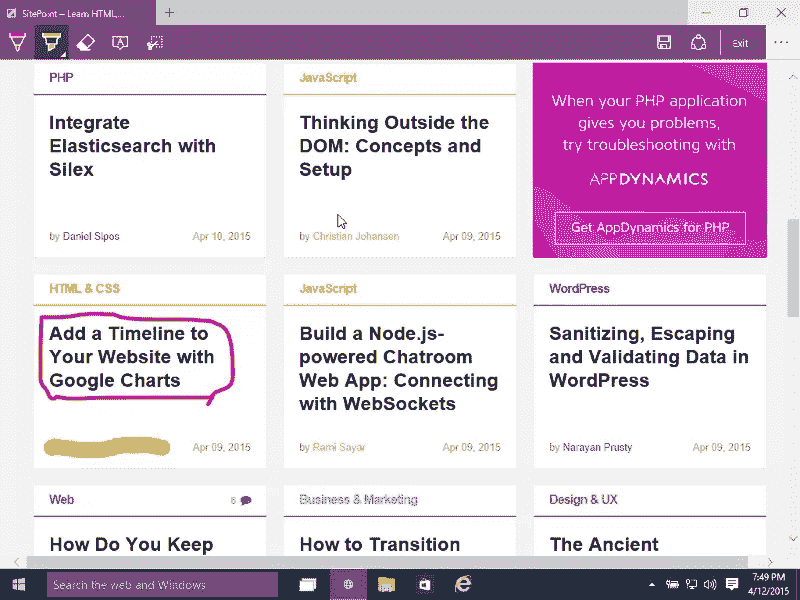

如果你只是想分享一个链接，或者一个网页的截图，你也可以这样做。

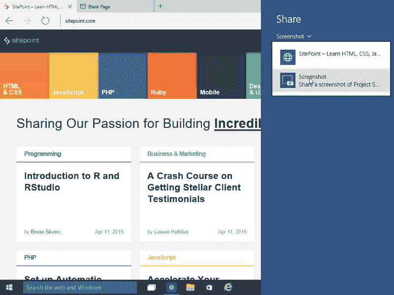

## HTML5 支持

为了确定微软 Edge 的用户代理，我走访了[httpbin.org](http://httpbin.org/user-agent)。我没想到它看起来这么像 Chrome 的用户代理:

```
Mozilla/5.0 (Windows NT 10.0) AppleWebKit/537.36 (KHTML, like Gecko) Chrome/39.0.2171.71 Safari/537.36 Edge/12.0 
```

这让我认为它的行为会非常接近 Chrome。然而，目前微软 Edge 似乎不像 Chrome 那样支持 HTML5。就 HTML5 支持测试而言，它的得分也低于 Mozilla Firefox。这些分数可能会在未来的版本中提高。目前，Spartan 设法击败的唯一浏览器是 IE 11。

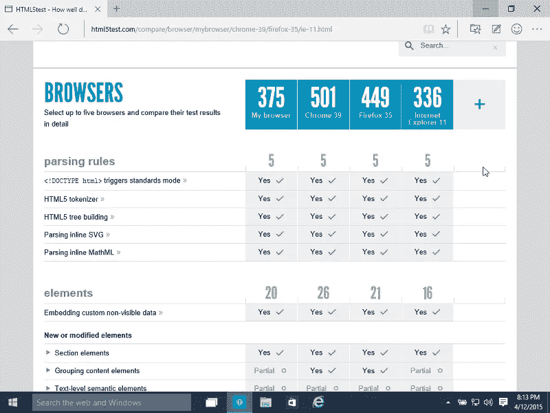

## JavaScript 性能

根据 SunSpider 1.0.2 基准测试结果，微软 Edge 比谷歌 Chrome 快 1.7 倍。

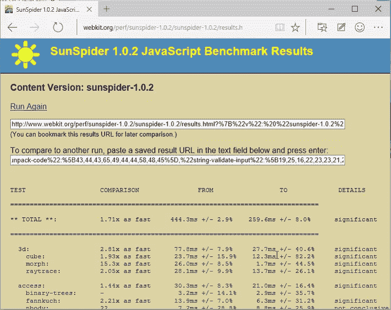

然而，Octane 和 V8 基准测试套件的结果都显示谷歌 Chrome 更快。在我的笔记本电脑上，经过几次运行，谷歌 Chrome 的平均成绩是 **13446** ，而微软 Edge 的平均成绩是 **11220** 。

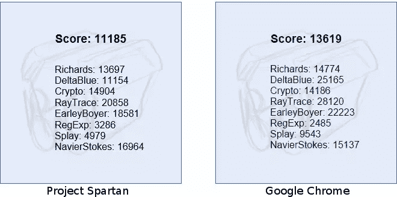

## 不完整的特征

### 没有浏览历史

Microsoft Edge 尚未显示您的浏览历史记录。当然，这个特性将会在未来的版本中添加。下载部分也是如此:现在，你没有办法看到你的下载历史或者下载进度。

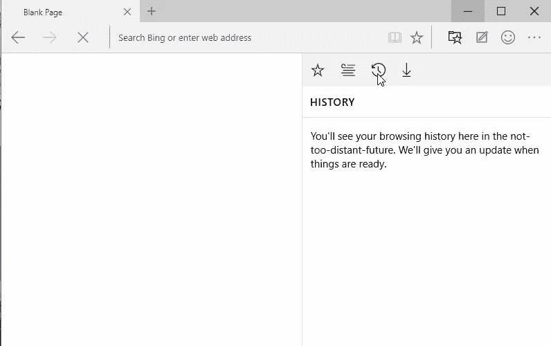

### 不支持自定义浏览器加载项

目前，Adobe Flash Player 是 Microsoft Edge 上唯一可用的插件。您还不能添加新的加载项。

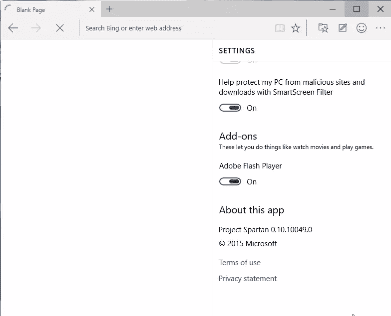

## 结论

虽然现在将它与 Chrome 或 Firefox 等流行浏览器相比较还为时过早，但微软 Edge 绝对是一款可以为用户增加价值的现代浏览器。它是轻量级的，可以即时渲染复杂的网页。它也非常稳定；我已经用了一个多星期了，没有一次看到它死机或崩溃。它与 Cortana 的集成极大地改善了浏览体验。然而，这还远远没有完成，而且很可能在未来几个月发生重大变化。最好等待更完整的版本，然后再决定将 Microsoft Edge 作为默认浏览器。

**注**:这是微软 Edge 版本 0.10.10049 的预览版。

## 分享这篇文章