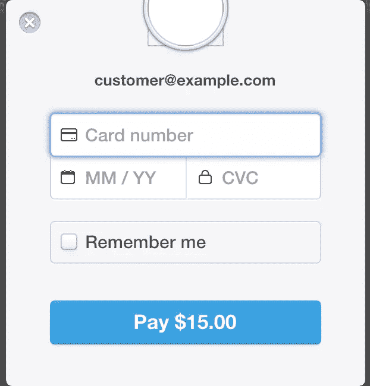
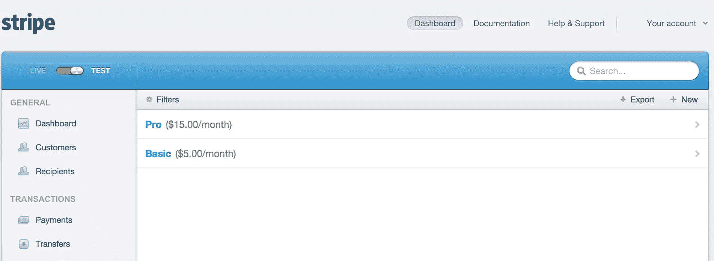
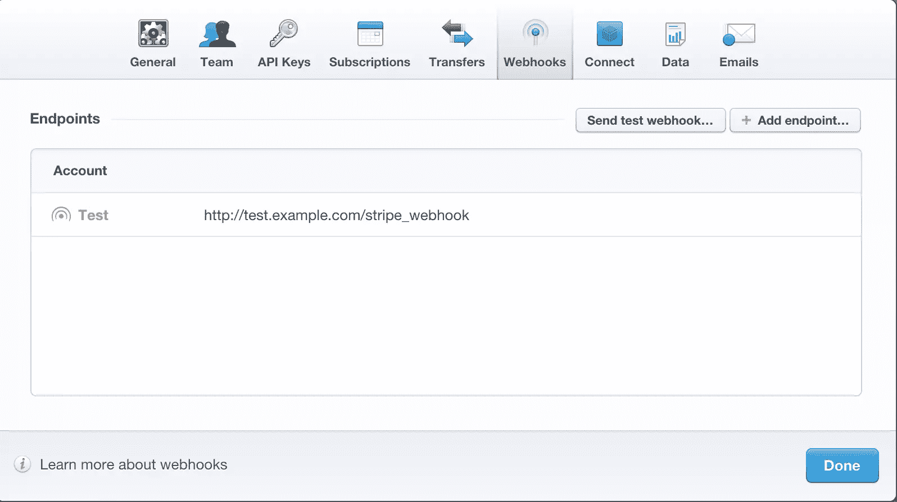

# Rails 中的条带订阅

> 原文：<https://www.sitepoint.com/stripe-subscriptions-rails/>


为你的应用程序选择合适的支付解决方案可能会很棘手，尤其是如果你在运营一个全球市场的话。在着手一个新项目时，我并不期待处理特定国家的法规。此外，有很多样板文件，你必须处理，使经常性计费工作。Stripe 似乎理解成千上万的开发人员每天面临的痛苦，并且解决得相当好。在本文中，我将演示如何将 Stripe 集成到 Rails 应用程序中。请继续阅读。

## 安装

在我们开始之前，您需要一个条带 API 密钥。您可以通过向 Stripe 注册并提供您的银行信息来获得一个。有两组不同的密钥，一组用于测试，另一组用于生产。

让我们从设置 Stripe 客户端开始。将此添加到您的**gem 文件**:

```
gem 'stripe', :git => 'https://github.com/stripe/stripe-ruby'
```

还有`bundle install`。

一旦完成了依赖项的安装，就需要设置 API 键。在生产中，您可以将这些键存储在一个环境变量中，并将其从代码库中取出。但是为了简洁起见，我将把它们放在一个初始化器中。请不要向我扔干草叉……:)

```
# config/initializers/stripe.rb
#todo remove the key info from this file and have env variable
#todo recreate new API keys when do that
if Rails.env == 'production'
  Rails.configuration.stripe = {
    :publishable_key => MY_PUBLISHABLE_KEY,
    :secret_key      => MY_SECRET_KEY
  }
else
  Rails.configuration.stripe = {
    :publishable_key => TEST_MY_PUBLISHABLE_KEY,
    :secret_key      => TEST_MY_SECRET_KEY
  }
end

Stripe.api_key = Rails.configuration.stripe[:secret_key]
```

这样一来，让我们来设置我们的支付页面。

### 创造你的第一次冲锋

构建支付表单复杂得离谱。有很多情况需要考虑，一个失误就可能让你破产。Stripe 针对这个问题有一个简单的解决方案。你所要做的就是将下面的代码片段复制到你的支付页面，Stripe 将会处理从获取用户的信用卡信息到支付的所有事情:

```
# views/stripe_checkout.haml
= form_tag('/stripe_checkout',{method: :post}) do
  %script{src: "https://checkout.stripe.com/checkout.js",
          class: "stripe-button",
          'data-key'=> "#{Rails.configuration.stripe[:publishable_key]}",
          'data-amount'=> 10.0,
          'data-email' => "customer@example.com",
          'data-currency' => 'USD'}
```

> 注意:您应该在开发模式下使用测试卡。你可以在这里找到更多细节[。](https://stripe.com/docs/testing)



在浏览器中打开这个视图，你会看到一个“用 Stripe 支付”按钮。点击后，它打开一个获取用户信用卡信息的模型，并对其进行授权。用户的卡还没有被充值，Stripe 只是对卡进行了授权，并表示卡是有效的。这发生在后台，一旦 Stripe 完成必要的检查，它将发送到我们在表单中指定的`/stripe_checkout`端点。

对控制器的条带回调:

```
def stripe_checkout
  @amount = 10
  #This will create a charge with stripe for $10
  #Save this charge in your DB for future reference
  charge = Stripe::Charge.create(
                  :amount => @amount * 100,
                  :currency => "usd",
                  :source => params[:stripeToken],
                  :description => "Test Charge"
  )
  flash[:notice] = "Successfully created a charge"
  redirect_to '/subscription'
end
```

和 routes.rb，

```
post 'stripe_checkout' => 'subscription#stripe_checkout'
```

当我们收到 Stripe 的回调时，它会发送一个`stripeToken`。这是对用户信用卡的散列引用，具有很短的生存期。我们可以使用`Stripe::Charge`模块在令牌过期前创建一个费用。Stripe 不会向我们发送卡号。这样我们就不用担心用户信用卡数据的安全性了。

恭喜你，你已经用不到 10 行代码创建了你的第一个电荷。

## 设置订阅

Stripe 使得将订阅整合到你的应用中变得非常简单。首先，您需要在仪表板中创建一系列计划。让我们构建一个简单的表单，它将与 Stripe 对话并为我们完成这项工作。

```
# views/index.html.haml
%h1 Create a new subscription
= form_tag('/subscription',{method: :post}) do
  .form-group
    %label Plan name
    %input{:type => 'text', :name => 'name'}
  .form-group
    %label Plan interval
    = select_tag 'interval', options_for_select(['month', 'year']), multiple: false, :include_blank => true,  class: "form-control"
  .form-group
    %label Plan Value
    %input{:type => 'text', :name => 'amount'}

  %button{:type => "submit"} Submit to Stripe
```

控制器:

```
# controllers/subscriptions_controller.rb
class SubscriptionController < ApplicationController
  require "stripe"

  def create
    subscription = Stripe::Plan.create(
      :amount => (params[:amount].to_i)*100,
      :interval => params[:interval],
      :name => params[:name],
      :currency => 'usd',
      :trial_plan => null
      :id => SecureRandom.uuid # This ensures that the plan is unique in stripe
    )
    #Save the response to your DB
    flash[:notice] = "Plan successfully created"
    redirect_to '/subscription'
  end
end
```

在这里，我们使用 Stripe 的客户端为我们创建一个计划。这些参数包括金额、时间间隔、货币和计划名称。Stripe 将以美分为单位保存金额，因此请确保将用户的输入乘以 100。如果您希望在实际向客户收费之前提供一个试用期，请发送一个`trial_plan`和请求。请记住，这些计划不能修改，因此如果您需要编辑金额或试用期，请创建一个新计划。



在条带中创建计划后，它将返回一个计划对象:

```
{
  interval: "month"
  name: "Pro"
  created: 1429342808
  amount: 1500
  currency: "usd"
  id: fb2488b5-5e83-49b5-9071-781ca04489c4
  object: "plan"
  livemode: false
  interval_count: 1
  trial_period_days: null
  metadata:
  statement_descriptor: null
}
```

理想情况下，您应该将它保存到数据库中，以避免不必要的条带往返。但是对于本文，我们将绕过它，直接获取计划。

## 构建定价页面

我们可以使用 Stripe 中的计划模块来检索所有计划:

```
#controllers/subscription_controller.rb
#......
def plans
  @stripe_list = Stripe::Plan.all
  @plans = @stripe_list[:data]
end
#......
```

在你看来:

```
.plan-container
  %ul
    - @plans.each do |plan|
      %li.plan
        .header
          =plan[:name]
        .price
          =(plan[:amount]/100)
        = form_tag('/subscription_checkout', {method: :post, plan: plan}) do
          %input{type: "hidden", name: "plan_id", value: plan[:id]}
          %script{src: "https://checkout.stripe.com/checkout.js",
                  class: "stripe-button",
                  'data-key'=> "#{Rails.configuration.stripe[:publishable_key]}",
                  'data-amount'=> (plan[:amount]),
                  'data-email' => "customer@example.com",
                  'data-currency' => plan[:currency],
                  'data-image' => '/assets/sitepoint.png'}
```

在路线中:

```
post 'subscription_checkout' => 'subscription#subscription_checkout'
```

正如我们之前所讨论的，Stripe 在这一点上不对卡收费。它将带有`stripeToken`的客户数据发送到我们的端点。

```
#controllers/subscription_controller.rb
#......
def plans
  @stripe_list = Stripe::Plan.all
  @plans = @stripe_list[:data]
end

# This is the callback from stripe
def subscription_checkout
  plan_id = params[:plan_id]
  plan = Stripe::Plan.retrieve(plan_id)
  #This should be created on signup.
  customer = Stripe::Customer.create(
          :description => "Customer for test@example.com",
          :source => params[:stripeToken],
          :email => "test@example.com"
        )
  # Save this in your DB and associate with the user;s email
  stripe_subscription = customer.subscriptions.create(:plan => plan.id)

  flash[:notice] = "Successfully created a charge"
  redirect_to '/plans'
end

#......
```

条带订阅通常与一个客户相关联，因此 it 可以对其递归收费。`Stripe::Customer`是我们的`User`模型的等价物。这是一种常规做法，尤其是如果您运行订阅服务，在注册时创建一个带有 Stripe 的客户，并将其与用户相关联。但是为了简洁起见，我们在订阅时创建一个客户。

### 网钩

虽然 Stripe 会自动处理账单，但它是同步发生的，我们的应用程序不会知道费用是否成功。在递归支付的情况下，Stripe 通过 webhooks 与我们的应用程序进行交互。让我们看看如何在我们的 Rails 应用程序中设置 web 挂钩。

首先，打开条带仪表板，并将此端点添加到 webhook 选项卡:



并将此添加到您的**路线中。rb** :

```
post 'webhooks' => 'subscriptions#webhooks'
```

并将它添加到控制器中:

```
# controllers/subscription_controller.rb
# Method responsbile for handling stripe webhooks
# reference https://stripe.com/docs/webhooks
def webhook
  begin
    event_json = JSON.parse(request.body.read)
    event_object = event_json['data']['object']
    #refer event types here https://stripe.com/docs/api#event_types
    case event_json['type']
      when 'invoice.payment_succeeded'
        handle_success_invoice event_object
      when 'invoice.payment_failed'
        handle_failure_invoice event_object
      when 'charge.failed'
        handle_failure_charge event_object
      when 'customer.subscription.deleted'
      when 'customer.subscription.updated'
    end
  rescue Exception => ex
    render :json => {:status => 422, :error => "Webhook call failed"}
    return
  end
  render :json => {:status => 200}
end
```

Stripe 现在可以向我们的 Rails 应用程序广播事件了。上面的代码接收 Stripe 事件，并将其编排到正确的方法中。你可以在这里看到每个具体的事件类型[。](https://stripe.com/docs/api#event_types)

> 注意:在生产中，你可能想用一个随机散列来掩盖这个端点，否则第三方可能很容易模仿 Stripe 的事件来获得对你的应用的未授权访问。

## 包扎

条纹是一个很好的工具。它节省了开发人员的时间，并帮助企业专注于他们的核心竞争力。欢迎在评论中添加我们的条纹体验。

本文中使用的所有代码片段都可以在 [Github](https://github.com/skmvasu/stripe_example) 上获得。

## 分享这篇文章