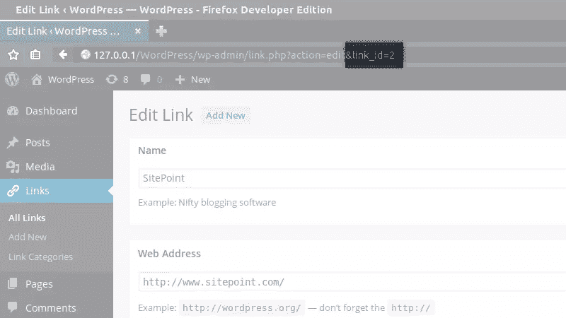

# 如何进一步掌握 WordPress 链接管理器 API

> 原文：<https://www.sitepoint.com/further-master-the-wordpress-links-manager-api/>

我们之前已经向你展示了[如何使用 WordPress 链接管理器](https://www.sitepoint.com/wordpress-links-manager/ "Mastering the WordPress Links Manager")来存储和管理链接列表，我们还介绍了[如何从链接管理器 API](https://www.sitepoint.com/mastering-wordpress-links-manager-api/ "Mastering the WordPress Links Manager API") 中使用`wp_list_bookmarks()`。

我们看到，我们可以用这个函数做很多事情，但它并不适合所有情况。在这篇文章中，我将向你展示如何使用 WordPress 链接管理器 API 中包含的其他功能。

与`wp_list_bookmarks()`相反，这些函数不显示链接:它们返回链接，由你决定是否要显示它们以及如何显示，这比使用`wp_list_bookmarks()`的选项要精确得多。

## 检索一个链接

在查看如何检索链接列表之前，我们将首先检索一个链接。事实上，只玩一个链接是理解我们将要使用的函数返回的对象是如何构建的更实际的方法。

### 检索关于链接的所有数据的函数

我们在这里要学习的第一个函数是`get_bookmark()`。它用于检索关于一个链接的所有数据，并且需要一个参数:想要的链接的 ID。例如，要检索这个 ID，您可以转到您的管理面板并编辑链接:这个 ID 可以在 URL 的`link_id`变量中看到。



#### 链接对象

为了检索我们想要的数据，在`get_bookmark()`中将这个 ID 表示为一个参数。

```
$link = get_bookmark(8);
```

`$link`变量是关于目标链接的所有数据的对象列表:对于创建链接时可以添加的每条信息，该对象都有一个相应的属性。这是，例如，我用前一行得到的对象的内容。

```
stdClass Object
(
    [link_id] => 8
    [link_url] => http://jeremyheleine.me
    [link_name] => Jérémy Heleine
    [link_image] => 
    [link_target] => 
    [link_description] => My personal webpage.
    [link_visible] => Y
    [link_owner] => 1
    [link_rating] => 7
    [link_updated] => 0000-00-00 00:00:00
    [link_rel] => me
    [link_notes] => 
    [link_rss] => 
    [link_category] => Array
        (
            [0] => 5
        )
)
```

这些属性中的大多数都很清楚，因为它们的名称与“添加链接”表单中的相应字段相同:`link_url`是链接的 URL，`link_name`是其名称，等等。请注意，您可以使用属性`link_id`获得链接的 ID:这似乎有点没用，因为您已经知道了这一点，但是稍后我将向您展示它可能是有用的。

```
echo '<a href="' . $link->link_url . '">' . $link->link_name . '</a>';
```

我现在将更详细地描述一些属性。比如`link_category`:为什么这个属性是数组？这是因为在“添加链接”表单中，您可以为您的链接选择几个类别:该属性在一个数组中列出所有选定的类别 id(即使您只选择了一个类别)。

属性为我们提供了添加链接的用户的 ID。如果您需要显示关于该用户的更多信息，您可以使用`get_user_by()`功能。

```
// Get the owner's name
$owner_name = get_user_by('id', $link->link_owner)->display_name;

// Echoes a string containing the owner's name and their link
echo 'Here is ' . $owner_name . '\'s link: <a href="' . $link->link_url . '">' . $link->link_name . '</a>';
```

`link_target`属性包含您在“添加链接”表单的“目标”部分指定的值。您可以在链接的`target`属性中直接显示它的值。

```
echo '<a href="' . $link->link_url . '" target="' . $link->link_target . '">' . $link->link_name . '</a>';
```

注意，如果你选择在同一个标签中打开链接，WordPress 会在`link_target`中存储一个空字符串，所以如果你不想显示`target`属性，你可以很容易地检测到它。

```
// Build the target attribute
$target = (empty($link->link_target)) ? '' : ' target="' . $link->link_target . '"';

// Echoes the link with its target attribute (if it needs one)
echo '<a href="' . $link->link_url . '"' . $target . '>' . $link->link_name . '</a>';
```

像`link_target`属性一样，`link_rel`属性包含了在`rel`属性中指示的值，所以在显示它之前你不需要做任何事情。

`link_image`和`link_rss`属性包含您在相应字段中指定的 URL。这意味着它们的值是 URL:特别是，如果你想显示一个图像，你必须生成你自己的`img`标签。这样做的好处是你可以对这张图片做任何你想做的事情，甚至可以显示为背景图片。在下面的例子中，我们不显示链接名称，只显示它的图像。

```
<a href="<?php echo $link->link_url; ?>">
	link_image; ?>" alt="<?php echo $link->link_name; ?>" />
</a>
```

注意，这个例子没有测试`link_image`属性是否为空。如果你构建的脚本不仅仅是为你而写的(例如，如果它是为一个插件或主题而写的)，你应该在生成一个`img`标签之前测试它。

最后，我们找到`link_visible`属性，以了解该链接是否是私有链接。遗憾的是，它的值不是一个布尔值，而是一个字符串:如果链接是可见的(即，如果它不是一个私有链接)，则`link_visible`被设置为`'Y'`，否则它被设置为`'N'`。下面我们将显示链接，只有当它是可见的。

```
if ($link->link_visible == 'Y')
	echo '<a href="' . $link->link_url . '">' . $link->link_name . '</a>';
```

#### 如果我想要一个数组呢？

我们描述了由`get_bookmark()`返回的对象的属性。然而，这个函数并不总是返回一个对象:这是默认的行为，但是如果您愿意或者没有选择的话，无论出于什么原因，您都可以选择检索一个数组。

要选择使用该函数获得的数据类型，可以使用第二个参数。它接受一个 PHP 常量作为值，默认设置为`OBJECT`。

要获得一个关联数组，可以将其设置为`ARRAY_A`。这个数组的键将是我们在上面的对象中看到的属性，所以你应该对此很熟悉。

```
$link = get_bookmark(8, ARRAY_A);
echo '<a href="' . $link['link_url'] . '">' . $link['link_name'] . '</a>';
```

你也可以选择用`ARRAY_N`得到一个编号数组。这样就很难获得特定的数据，但是数据的排序方式与它们在关联数组或对象中的排序方式相同:我们将在第一个条目中找到 ID，然后是 URL，然后是名称，依此类推。

#### 不是那么没用的过滤器

以`get_bookmark()`结束，您应该知道这个函数接受第三个参数:应用于检索数据的过滤器。

WordPress 不会给你数据库直接返回的数据。事实上，它应用了一些过滤器来确保你有正确格式的正确数据。比如链接 ID 不是一个包含 ID 的字符串而是一个实数，这些过滤器就是链接目标如果设置为`_none`为空的原因。

默认情况下，`get_bookmark()`的第三个参数被设置为`'raw'`, WordPress 在默认过滤后立即返回数据。大多数情况下，这已经足够了，但您也可以选择应用其他滤镜。

选择另一个过滤器而不是`raw`的主要原因是:您希望检索数据并显示在表单中，让用户编辑它们。举例来说，如果你想在你的主题中使用链接管理器，这是很有用的。

在这种情况下，您可以使用`edit`滤镜。然后，WordPress 会应用一些其他的修改，特别是对 HTML 字符进行转义，这样你就不用自己动手了。

```
$link = get_bookmark(2, OBJECT, 'edit');
echo '<textarea>' . $link->link_notes . '</textarea>';
```

### 检索特定信息的功能

现在我们已经看到了我们可以为一个链接检索什么信息，是时候看看一个新的函数:`get_bookmark_field()`。如果您希望检索一个链接的特定信息，而不检索其他信息，这个函数非常有用。

`get_bookmark_field()`函数需要两个参数:字段(即要检索的信息)和相关链接的 ID。该字段是一个字符串，对应于`get_bookmark()`返回的对象的属性(或关联数组的键)。例如，如果您想要检索一个链接的 URL，您将编写下面的行:

```
$url = get_bookmark_field('link_url', 8);
```

相当于这个:

```
$url = get_bookmark(8)->link_url;
```

## 检索几个链接

上面，我们看了如何检索一个链接，但是检索几个链接呢？好消息:这有一个函数:`get_bookmarks()`。

### 已知产量

您可以尝试不带任何参数的`get_bookmarks()`:它将返回一个数组，包含存储在链接管理器中的所有链接。

这个数组是有编号的，每个条目代表一个链接。这个对象和我们前面提到的是一样的。例如，我们可以列出所有的链接，而不考虑它们的类别。

```
$links = get_bookmarks();

echo '<ul>';

foreach ($links as $link)
	echo '<li><a href="' . $link->link_url . '">' . $link->link_name . '</a></li>';

echo '</ul>';
```

### 过滤

如果您不需要所有的链接，过滤`get_bookmarks()`的输出可能是一个好主意。这很容易实现，因为这个函数只接受参数。同样，您应该对此很熟悉，因为这个参数与我们在`wp_list_bookmarks()`中提到的参数相似。

事实上，这个参数是一个数组，列出了我们过滤输出所需的所有选项。我们在查看`wp_list_bookmarks()`时描述了这些选项中的大部分。以下是已知选项的列表:

*   `orderby`要对链接进行排序，
*   `order`要颠倒(或不颠倒)顺序，
*   为了只检索每个类别的有限数量的链接，
*   `category`选择要检索的类别，
*   `category_name`只选择一个类别进行检索(通过使用其名称)，
*   `hide_invisible`不要检索私有链接。

除了这些选项，我们还发现了三个新选项。首先，我们有`include`,它是一个字符串，您可以在其中指出想要检索的链接 id 列表。注意，如果你使用这个选项，WordPress 会忽略`category`、`category_name`和`exclude`中的值(下一个选项我们会讲到)。

下面的示例检索三个链接，并根据对这些链接的评级对输出进行排序。

```
$args = array(
		'orderby' => 'rating',
		'order' => 'DESC',
		'include' => '4,5,10'
	);
$links = get_bookmarks($args);
```

`exclude`选项允许我们使用它们的 id 来排除链接列表。您可以将该选项与其他过滤器(除了`include`)结合使用，例如，检索没有给定链接的类别。

```
$args = array(
		'category_name' =&gt; 'tools',
		'exclude' =&gt; '6'
	);
```

最后，我们找到选项`search`，它接受一个字符串来搜索链接、URL、名称和描述。下面的例子将得到所有在前面列出的字段中包含单词“sitepoint”的链接。

```
$args = array(
		'search' => 'sitepoint'
	);
```

请注意，您可以组合此选项，例如，仅在某些类别中搜索。搜索不区分大小写。

## 最后

用链接管理器管理链接列表很容易。默认情况下，CMS 为我们提供了一些有用的工具，但是现在，有了我们探索的 API，您可以创建自己的工具。

例如，您可以将一个旋转木马集成到您的主题中，每个链接有两个图像:一个在背景中，一个在前景中，由用户使用存储在链接注释中的参数来定位。你现在可以做任何你想做的事情，因为你现在知道如何创建你自己的表单。

## 分享这篇文章